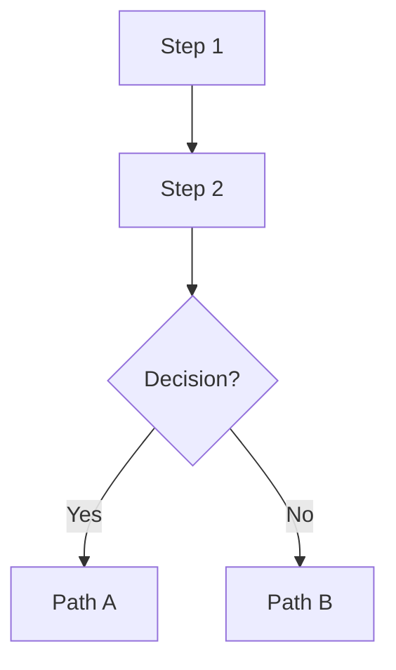
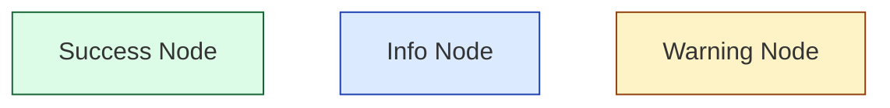

# Portfolio & Blog — AI Guide

## Core architecture

- Next.js 15 App Router under `src/app` drives all routes (home, blog, admin). Prefer Server Components; add `"use client"` only for stateful UI (see `src/app/admin/(dashboard)` forms).
- tRPC is the only application API: routers live in `src/server/api/routers`, composed in `src/server/api/root.ts`, and exposed to the client via `src/app/providers.tsx` (react-query + `httpBatchLink` + `superjson`).
- NextAuth Credentials provider (`src/app/api/auth/[...nextauth]/route.ts` + `src/server/auth.ts`) seeds the tRPC context; `protectedProcedure` checks `ctx.session` for admin mutations.
- Blog content is MDX colocated in `src/app/blog/*`; `src/lib/posts.ts` parses front‑matter and sorts posts for static views.

## Data & persistence

- Drizzle ORM schema lives in `src/server/db/schema.ts`; run `pnpm db:generate && pnpm db:migrate` after edits—generated SQL should never be touched manually.
- `src/server/db.ts` prefers node-postgres with SSL (via `assembleAzureDatabaseUrl` in `src/lib/azure-db-url.ts`) and only falls back to `@vercel/postgres` when `DATABASE_URL` is missing.
- Core tables: `users`, `posts`, `tags`, and `postTag`; published content is filtered by boolean flags plus dates (see `postRouter.getPublished`).
- Large assets belong in Google Cloud Storage buckets; server code must stream uploads rather than buffering them.

## Development workflow

- Use **pnpm** for every script; the usual local loop is `pnpm dev`, and CI parity requires `pnpm lint`, `pnpm format`, `pnpm test`, then `pnpm build` before opening a PR.
- `.env.example` documents all required secrets; local dev typically needs `DATABASE_URL`, `NEXTAUTH_SECRET`, `NEXTAUTH_URL`, and any Azure Postgres fragments consumed by `assembleAzureDatabaseUrl`.
- Jest + React Testing Library power unit/UI tests (`jest.config.js`, `jest.setup.js`); co-locate specs next to components or under `__tests__`.
- Docs in `docs/` are also statically exported to `public/docs` for the documentation microsite—update both when changing guides.

### ⚠️ Pre-push quality gate (MANDATORY)

**Every commit must pass the same checks CI runs.** The CI `quality` job in `.github/workflows/ci.yml` runs these steps in order — a failure in any step blocks the PR:

1. **`pnpm lint`** — ESLint with `eslint-config-next/core-web-vitals` + `eslint-config-next/typescript`.
2. **`pnpm format`** — Prettier check (`prettier --check .`). This does **not** auto-fix; run `pnpm format:fix` first to auto-format, then verify with `pnpm format`.
3. **`pnpm run test:ci`** — Jest in CI mode (`--ci --runInBand`).
4. **`pnpm next build`** — Full Next.js production build (catches type errors, missing imports, SSR issues).

**Before every push / commit, you MUST run:**

```bash
pnpm format:fix && pnpm lint && pnpm format && pnpm run test:ci && pnpm next build
```

If **any** of these commands fail, **fix the errors before committing**. Do not push code that fails lint, format, test, or build checks. This avoids CI rework cycles.

> **Note:** Husky pre-commit hooks run `lint-staged` locally (lint + related tests), but **AI agents bypass Git hooks**. You must run the full quality gate manually.

### Common lint / format pitfalls

- **Trailing whitespace or inconsistent formatting** → run `pnpm format:fix` before committing.
- **Unused imports** → remove them (ESLint won't always catch these due to relaxed `@typescript-eslint/no-unused-vars: off`, but the build may fail on them).
- **Missing `"use client"` directive** → any component using hooks, browser APIs, or event handlers must have it.
- **Import order** → Prettier handles this; just run `pnpm format:fix`.
- **MDX front-matter** → not checked by ESLint but invalid YAML will break the build.

Tasks are not done until `pnpm lint`, `pnpm format`, `pnpm run test:ci`, and `pnpm next build` all pass.

## Patterns & conventions

- Always import via the path aliases in `tsconfig.json` (`@/server/db`, `@/components/Footer`, etc.) instead of long relative paths.
- Shared utilities belong in `src/lib` or `src/utils`; `src/utils/trpc.ts` already wires the strongly typed hooks, so reuse it instead of creating ad-hoc fetchers.
- When adding UI, follow established Tailwind design tokens in `tailwind.config.ts` and the typography defaults in `src/styles/highlight.css`/`MarkdownRenderer`.
- Admin-only flows must go through `protectedProcedure` plus role-aware UI guards; never trust client state for authorization.

## Deployment & ops

- Kubernetes manifests live in `k8s/apps/portfolio` (base + environment overlays) and assume Istio Gateway + VirtualService; reconcile via Flux definitions in `k8s/flux-system`.
- Container images are built by `.github/workflows/docker.yml` and promoted through Flux image automation—keep image tags mutable only via GitOps, not manual kubectl.
- Secrets for PostgreSQL commonly come from Azure Flexible Server or Cloud SQL; `scripts/fetch-azure-kv-secrets.sh` and `infra/postgres-flexible-server.bicep` show how credentials are provisioned.
- When touching deployment settings, update the relevant doc in `docs/` (e.g., `ARCHITECTURE.md`, `AZURE_CI_CD_SETUP.md`) so the rendered site under `public/docs` stays accurate.

## Blog authoring (MDX)

### File location & slugs

- Add posts under `src/app/blog/*.mdx`. The filename (without `.mdx`) becomes the `slug` used in routes (e.g., `my-new-post.mdx` → `/blog/my-new-post`).
- Keep slugs unique, lowercase, `kebab-case`, no spaces or uppercase.

### Front-matter

Every post **must** begin with YAML front-matter parsed by `src/lib/posts.ts` (via `gray-matter`):

```yaml
---
title: "Your Post Title"
date: 2025-06-15
excerpt: "A concise 1-2 sentence summary for the blog index and SEO."
tags: ["AI", "Kubernetes", "TypeScript"]
author: "Ian Lintner"
image: "/images/your-slug-social.svg"
imageAlt: "Descriptive alt text for the hero/social image"
---
```

| Field      | Required | Default         | Notes                                                              |
| ---------- | -------- | --------------- | ------------------------------------------------------------------ |
| `title`    | ✅       |                 | May include emoji prefix (e.g., `"🧠 My Title"`)                   |
| `date`     | ✅       |                 | `YYYY-MM-DD` format; posts sorted newest-first                     |
| `excerpt`  | ✅       |                 | Shown on blog index and in OpenGraph description                   |
| `tags`     | Optional | `[]`            | Array of strings for categorization                                |
| `author`   | Optional | `"Ian Lintner"` | Displayed in post header and footer                                |
| `image`    | Optional | social-default  | Path relative to `/public`; stored in `/public/images/`            |
| `imageAlt` | Optional |                 | Required when `image` is set; used for OpenGraph and accessibility |

### Content structure

Follow this standard post structure (matching existing engineering posts):

1. **H1 title** — Duplicates `title` from front-matter. The renderer (`MarkdownRenderer`) skips the first `<h1>` because the page header already displays it.
2. **Hook / introduction** — 1-2 tight paragraphs: context, constraints, trade-offs.
3. **TL;DR or overview** (optional) — A table, diagram, or bullet list for skimmers.
4. **Main sections** — Use `##` headings (rendered as `<h2>`). Emoji prefixes are encouraged for visual hierarchy (e.g., `## 🏗️ Architecture`).
5. **Subsections** — Use `###` headings.
6. **Code examples** — Fenced blocks with explicit language tags.
7. **Diagrams** — Mermaid fence blocks for architecture, flow, and sequence diagrams.
8. **Tables** — GFM tables for comparisons, matrices, checklists.
9. **Conclusion / key takeaways** — Actionable summary.
10. **References** (optional) — Links to papers, repos, docs.

### Markdown rendering pipeline

Content flows through `src/components/MarkdownRenderer.tsx`:

````
Raw MDX string
  → ReactMarkdown
    ├ remarkGfm          (tables, strikethrough, task lists)
    ├ rehypeHighlight     (syntax highlighting via highlight.js)
    └ Custom components:
        • First <h1> is skipped (already in page header)
        • ```mermaid blocks → <Mermaid> client component
        • All other <pre> blocks → default rendering
  → Tailwind Typography prose classes
````

- Styling comes from parent `prose prose-lg dark:prose-invert` classes and `src/styles/highlight.css` (imports `highlight.js/styles/github-dark.css`).
- **Never add inline styles** — rely on the existing prose/Tailwind system.

### Writing guidelines

- Prefer clear **problem → solution** narratives with small, runnable code snippets.
- Use fenced code blocks with **explicit language** identifiers; align with the project stack: `typescript`, `tsx`, `bash`, `yaml`, `python`, `json`, `sql`, `rust`, `go`.
- Keep intros tight — lead with context, constraints, and trade-offs.
- Link to repo files when referencing internal code (e.g., `@/server/api/routers/post.ts`).
- Use **bold** for key terms on first mention and _italics_ for emphasis.
- Break up long sections with diagrams, tables, or callout quotes.

### Verification checklist

- [ ] Run `pnpm dev`, open `/blog/<slug>`, confirm rendering, links, and images.
- [ ] Front-matter date is valid ISO format; sorting depends on `new Date(date)`.
- [ ] Slug is unique, `kebab-case`, no spaces or uppercase.
- [ ] Hero image (if any) is 1200×630 SVG in `/public/images/`.
- [ ] Mermaid diagrams render in both light and dark themes.
- [ ] Code blocks have explicit language tags and display correct highlighting.
- [ ] Run `pnpm lint` and `pnpm build` — no errors.

## Mermaid diagrams

The site renders Mermaid diagrams client-side via `src/components/Mermaid.tsx`, which is auto-detected by `MarkdownRenderer` when it encounters a ` ```mermaid ` fence block.

### How it works

- Mermaid.js is **lazy-loaded** only on the client (no SSR overhead).
- Theme automatically adapts to light/dark mode via `document.documentElement.classList.contains("dark")`.
- Font: `Inter, ui-sans-serif, system-ui, -apple-system, "Segoe UI"`.
- Colors use Tailwind-inspired palette (cyan `#0ea5e9`, slate grays, etc.).
- Errors are caught and rendered as `<pre>` fallback text.

### Usage in MDX posts

Use standard Mermaid fence blocks — **do not** import the component directly:

````markdown

````

### Supported diagram types

Use any Mermaid-supported type. Common ones in existing posts:

- **Flowcharts** (`flowchart TD`/`LR`) — architecture layers, decision trees
- **Sequence diagrams** (`sequenceDiagram`) — multi-agent communication, API flows
- **Class diagrams** (`classDiagram`) — system component relationships
- **Graphs** (`graph TD`/`LR`) — dependency maps, network topologies
- **State diagrams** (`stateDiagram-v2`) — lifecycle and state machines

### Style nodes inline



### Best practices

- Always quote node labels: `A["Label with spaces"]`.
- Keep diagrams focused — one concept per diagram. Split complex flows into multiple diagrams with explanatory text between them.
- Test rendering in both light and dark themes (`pnpm dev`, toggle theme).
- For very large diagrams, prefer `flowchart LR` (left-to-right) to reduce vertical scroll.

## Images in blog posts

### Hero / social images

- Stored in `/public/images/` and referenced in front-matter as `/images/<slug>-social.svg`.
- Naming convention: `<blog-slug>-social.svg` (e.g., `ai-coding-agents-social.svg`).
- If no custom image is provided, the site falls back to `/images/social-default.svg` (see `src/lib/metadata.ts`).
- Images are used for OpenGraph/Twitter cards and optionally displayed in the post header.

### Inline images

Use standard Markdown image syntax within post content:

```markdown

```

- Store images in `/public/images/`.
- Always provide meaningful alt text for accessibility and SEO.
- SVG is preferred for diagrams and illustrations; use PNG/WebP for photos or screenshots.

### Image specifications

| Property   | Value                          |
| ---------- | ------------------------------ |
| Dimensions | 1200 × 630 px (hero/social)    |
| Format     | SVG preferred; PNG/WebP/JPG OK |
| Location   | `/public/images/`              |
| Reference  | `/images/filename.ext`         |

## SVG & Hero Image Generation

When creating hero/social images for blog posts, follow this template:

### Standard structure

```xml
<svg width="1200" height="630" viewBox="0 0 1200 630" xmlns="http://www.w3.org/2000/svg">
  <!-- Dark background -->
  <rect width="1200" height="630" fill="#0f172a"/>

  <!-- Grid pattern (optional, adds subtle texture) -->
  <defs>
    <pattern id="grid" width="40" height="40" patternUnits="userSpaceOnUse">
      <path d="M 40 0 L 0 0 0 40" fill="none" stroke="#1e293b" stroke-width="1"/>
    </pattern>
  </defs>
  <rect width="1200" height="630" fill="url(#grid)" opacity="0.5"/>

  <!-- Gradient overlay (subtle color wash) -->
  <defs>
    <linearGradient id="overlay" x1="0%" y1="0%" x2="100%" y2="100%">
      <stop offset="0%" style="stop-color:#8b5cf6;stop-opacity:0.15"/>
      <stop offset="100%" style="stop-color:#3b82f6;stop-opacity:0.15"/>
    </linearGradient>
  </defs>
  <rect width="1200" height="630" fill="url(#overlay)"/>

  <!-- Visual elements: abstract geometric shapes representing the topic -->
  <!-- Examples: nodes/edges for AI, gears for DevOps, brackets for code -->

  <!-- Title (bottom-left or centered) -->
  <text x="80" y="480" font-family="Arial, sans-serif" font-size="64"
        font-weight="bold" fill="white">Your Post Title</text>

  <!-- Subtitle -->
  <text x="80" y="540" font-family="Arial, sans-serif" font-size="40"
        fill="#94a3b8">Subtitle or tagline</text>

  <!-- Author credit (bottom-right) -->
  <text x="1000" y="580" font-family="Arial, sans-serif" font-size="24"
        fill="#64748b">by Ian Lintner</text>
</svg>
```

### Design rules

- **Dimensions**: Always `width="1200" height="630"` (OpenGraph standard).
- **Background**: `#0f172a` (Slate 900).
- **Grid pattern**: `<pattern>` with `width="40" height="40"`, stroke `#1e293b`.
- **Overlay**: Subtle linear gradient (purple `#8b5cf6` → blue `#3b82f6`) at ~0.15 opacity.
- **Typography**:
  - Font: `Arial, sans-serif`.
  - Title: `font-size="64" font-weight="bold" fill="white"`, positioned ~`y="480"`.
  - Subtitle: `font-size="40" fill="#94a3b8"`.
  - Author: `font-size="24" fill="#64748b"`, bottom-right (`x="1000" y="580"`).
  - **Always escape** special characters: `&amp;` for `&`, `&lt;` for `<`, etc.
- **Graphics**: Abstract geometric shapes (circles, lines, nodes) representing the topic.
  - Filters: Use `<feDropShadow>` or `<feGaussianBlur>` defined in `<defs>` for depth.
  - Palette: Blue `#3b82f6`, Purple `#8b5cf6`, Green `#10b981`, Orange `#f97316`, Red `#ef4444`, Cyan `#0ea5e9`.
- **Output**: Full, valid XML SVG with no unescaped entities.

## Tables

Use GitHub Flavored Markdown tables — enabled via `remarkGfm` in the rendering pipeline.

```markdown
| Column A | Column B | Column C |
| -------- | -------- | -------- |
| Data 1   | Data 2   | Data 3   |
```

Common uses: comparison matrices, decision frameworks, complexity tables, feature checklists. Tables are automatically styled by Tailwind Typography prose classes.

<!-- Added by caretaker -->

## Caretaker System

This repository uses the [caretaker](https://github.com/ianlintner/caretaker) system for automated maintenance.

### How it works

- An orchestrator runs weekly via GitHub Actions (`.github/workflows/maintainer.yml`)
- It creates issues and assigns them to @copilot for execution
- When @copilot opens PRs, the orchestrator monitors them through CI, review, and merge
- The orchestrator communicates with @copilot via structured issue/PR comments

### When assigned an issue by caretaker

- Read the full issue body carefully — it contains structured instructions
- Follow the instructions exactly as written
- If unclear, comment on the issue asking for clarification
- Always ensure CI passes before considering work complete
- Reference the agent file for your role: `.github/agents/maintainer-pr.md` or `maintainer-issue.md`

### Pre-push checklist

Before pushing any commits, **always** run the full CI validation locally and confirm every step passes:

1. `pnpm lint` — ESLint
2. `pnpm format` — Prettier check
3. `pnpm run test:ci` — Jest tests
4. `pnpm next build` — Next.js production build

If any step fails, fix it before committing/pushing. Do not push code that has not passed all checks.

### Conventions

- Branch naming: `maintainer/{type}-{description}`
- Commit messages: `chore(maintainer): {description}`
- Always run existing tests before pushing
- Do not modify `.github/maintainer/` files unless explicitly instructed
