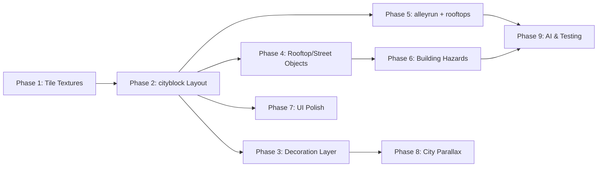

# Building Platforming Plan: City Comes Alive

## Overview

**Date:** April 12, 2026
**Goal:** Promote the 16 generated building textures from cosmetic MainMenu backdrop into interactive, gameplay-defining elements in RogueRun. Buildings become the terrain — the cat runs across rooftops, climbs fire escapes, wall-jumps between alley walls, and descends into neon-lit street canyons.

**Design Philosophy:** The city isn't scenery. It _is_ the level.

---

## Table of Contents

1. [Current State](#1-current-state)
2. [Vision: Rooftop-to-Street Verticality](#2-vision-rooftop-to-street-verticality)
3. [New Layout Types](#3-new-layout-types)
4. [Building Chunk System](#4-building-chunk-system)
5. [New Gameplay Textures](#5-new-gameplay-textures)
6. [Interactive Building Elements](#6-interactive-building-elements)
7. [Building-Themed Hazards](#7-building-themed-hazards)
8. [Vertical UI Enhancements](#8-vertical-ui-enhancements)
9. [Parallax & Atmosphere](#9-parallax--atmosphere)
10. [AI / Autoplay Updates](#10-ai--autoplay-updates)
11. [Implementation Phases](#11-implementation-phases)
12. [Technical Changes Summary](#12-technical-changes-summary)

---

## 1. Current State

### Buildings Today

- **16 generated building textures** in `generatedTextures.ts` — used only as parallax decoration in `MainMenu.ts`
- Rich detail: lit windows, neon signs, HVAC caps, pipe columns, cross-bracing, beacon strips, roof rails
- Twinkling window lights, power poles, and wire graphics — all cosmetic, no collision

### Gameplay Today

- Levels use generic tile-based platforms (32×32 `PLATFORM`, `ONE_WAY`, `WALL`, `GROUND` tiles)
- 7 layout types: `standard`, `parkour`, `vertical`, `tower`, `climb`, `zigzag`, `boss`
- Vertical layouts exist but feel abstract — no visual narrative of _climbing a city_
- Player has wall-slide, wall-jump, knockback — perfect for building-to-building traversal

### Available Building Textures (with dimensions)

| Texture Key              | Approx Size | Visual Character                           |
| ------------------------ | ----------- | ------------------------------------------ |
| `buildingTall`           | 64×128      | Industrial tower, pipes, front/blade signs |
| `buildingMedium`         | 80×96       | Warehouse, cross-bracing, loading doors    |
| `buildingShort`          | 64×64       | Low-rise, rooftop railing                  |
| `buildingTower`          | 48×160      | Radio/antenna tower, narrow                |
| `buildingPlant`          | 80×112      | Factory with smokestacks                   |
| `buildingTenementTall`   | 56×140      | Apartment block, many windows              |
| `buildingHousingBlock`   | 72×100      | Brutalist housing, balconies               |
| `buildingApartmentSpire` | 48×180      | Tall thin residential tower                |
| `buildingNeonShop`       | 56×56       | Small storefront, neon frame               |
| `buildingHoloBar`        | 60×64       | Bar/club, holographic sign                 |
| `buildingArcade`         | 64×72       | Arcade entrance, marquee                   |
| `buildingClinic`         | 56×64       | Medical clinic, cross symbol               |
| `buildingTechShop`       | 64×80       | Electronics store, displays                |
| `buildingMegaBlock`      | 80×160      | Massive complex, multi-section             |
| `buildingTerminal`       | 72×120      | Transit terminal, glass/steel              |
| `buildingComplex`        | 96×140      | Multi-wing office complex                  |

---

## 2. Vision: Rooftop-to-Street Verticality

### The Core Loop

```
                    ★ GOAL (antenna/satellite dish)
                    │
    ┌───────────┐   │   ┌──────────┐
    │ APARTMENT │   │   │  TOWER   │  ← Rooftop tier: final platforms
    │  SPIRE    │ ╌╌╌╌╌ │          │    Wall-jump between buildings
    │           │       │          │
    ├───────────┤       ├──────────┤
    │ fire      │       │          │  ← Mid-tier: fire escapes,
    │ escape ═══╪═══════╪═ awning  │    clotheslines, awnings
    │           │       │          │
    ├───────────┤  gap  ├──────────┤
    │  windows  │       │  neon    │  ← Building faces: wall-slide zones
    │  windows  │       │  signs   │    Hazards on walls (steam, sparks)
    │           │       │          │
    ├───────────┤       ├──────────┤
    │ SHOP FRONT│ alley │ ARCADE   │  ← Street level: enemies patrol
    │═══════════╪═══════╪══════════│    Dumpsters, lampposts, obstacles
    ▓▓▓▓▓▓▓▓▓▓▓▓▓▓▓▓▓▓▓▓▓▓▓▓▓▓▓▓▓▓  ← Ground
     PLAYER START →
```

### Three Vertical Zones

| Zone             | Y Range               | Character                                      | Gameplay                                         |
| ---------------- | --------------------- | ---------------------------------------------- | ------------------------------------------------ |
| **Street Level** | Ground to ~6 tiles up | Shops, alleys, dumpsters, lampposts            | Enemies patrol, easy traversal, safe but slow    |
| **Mid Building** | ~6–16 tiles up        | Windows, fire escapes, ledges, neon signs      | Platforming challenge, wall-slide/jump corridors |
| **Rooftops**     | ~16+ tiles up         | HVAC units, antennas, water towers, roof rails | Speed runs, boss arenas, goal areas, risky gaps  |

### Why This Works

- **Player already has wall-slide + wall-jump** → building walls are natural gameplay surfaces
- **Building textures already have rich detail** → fire escapes, ledges, pipes give visual cues for "land here"
- **Existing vertical layouts** (tower, climb, zigzag) become _thematic_ — you're climbing a city block, not abstract tiles
- **Risk/reward by altitude** — street is safe but slow; rooftops are fast but punish falls

---

## 3. New Layout Types

### Layout: `cityblock` (Primary new layout)

**Concept:** A cluster of 3–5 buildings of varying heights placed side-by-side with alleys between them. Player starts at street level, goal is on the tallest rooftop.

```
Dimensions: 60×50 tiles (1920×1600px)
Unlock: Floor 3+, 20% chance
Goal: Top of tallest building
```

**Generation algorithm:**

1. Place ground strip at bottom (2 tiles thick)
2. Randomly generate 3–5 building footprints (width: 8–16 tiles, height: 15–40 tiles)
3. Space buildings with 3–5 tile alleys between them
4. Building walls = `WALL` tiles (solid, wall-slidable)
5. Building interiors = `EMPTY` (decoration layer shows windows)
6. Rooftops = `PLATFORM` tiles across building top
7. Scatter `ONE_WAY` platforms as fire escape landings every 4–6 tiles up each building face
8. Add connecting elements between buildings: awning bridges, clotheslines (one-way), pipe walkways
9. Place enemies on rooftops and in alleys
10. Validate reachability (BFS)

### Layout: `alleyrun` (Horizontal variant)

**Concept:** Long horizontal level but at street level between tall buildings. Buildings create walls on both sides creating a canyon effect. Occasional gaps to climb up for secrets.

```
Dimensions: 90×35 tiles (2880×1120px)
Unlock: Floor 2+, 15% chance
Goal: Far right, elevated on a building ledge
```

**Generation algorithm:**

1. Ground strip at bottom
2. Tall building walls on top and bottom edges (creating a canyon corridor)
3. Overhead platforms (fire escapes, awnings) create roof above the alley
4. Player must duck/slide under low overhangs, jump over debris
5. Vertical escape routes every 20–30 tiles (climb a building to bypass a blocked alley)
6. Street-level hazards: steam vents, broken glass, dumpster enemies

### Layout: `rooftops` (Speed-run variant)

**Concept:** Player starts on a rooftop and runs across building tops. Gaps between buildings require precision jumping. Falling means landing on lower buildings or street (slower but recoverable).

```
Dimensions: 90×40 tiles (2880×1280px)
Unlock: Floor 4+, 18% chance
Goal: Far right rooftop
```

**Generation algorithm:**

1. Ground strip at very bottom (safety net)
2. Generate buildings as columns of varying heights (12–30 tiles)
3. Building tops = main traversal route
4. Gaps between buildings: 2–6 tiles (require running jumps)
5. Lower buildings in gaps = "catch" platforms if you fall
6. HVAC units, antennas as obstacles on rooftops
7. Some rooftops have bounce pads (future: trampoline awnings)

---

## 4. Building Chunk System

### Concept: Prefab Building Segments

Instead of purely tile-based generation, introduce a **building chunk system** — predefined arrangements of tiles + decoration sprites that look like specific building types.

### `BuildingChunk` Interface

```typescript
interface BuildingChunk {
  key: string; // e.g. "apartment_tall"
  textureKey: string; // e.g. GENERATED_TEXTURES.buildingTenementTall
  widthTiles: number; // footprint width in tiles
  heightTiles: number; // footprint height
  tiles: TileSpec[]; // collision tile placements (relative)
  decorations: DecorationSpec[]; // non-colliding visuals (relative)
  spawnPoints: SpawnPoint[]; // enemy/item spawn locations
  interactables: Interactable[]; // fire escapes, doors, etc.
}

interface TileSpec {
  localX: number; // tile offset from chunk origin
  localY: number;
  tileIndex: number; // TILE.WALL, TILE.PLATFORM, TILE.ONE_WAY
}

interface DecorationSpec {
  textureKey: string;
  localX: number; // pixel offset
  localY: number;
  depth: number; // render layer
  scale?: number;
}

interface SpawnPoint {
  localX: number;
  localY: number;
  type: "enemy" | "collectible" | "powerup" | "hazard";
  subtype?: string;
}
```

### Building Chunk Categories

#### Street-Level Chunks (1–3 tiles tall, ground-hugging)

- `shop_neon` — neonShop texture backdrop, awning ONE_WAY above entrance
- `shop_holo` — holoBar texture, wider awning, enemy spawn inside
- `shop_arcade` — arcade texture, marquee overhang platform
- `shop_clinic` — clinic texture, rooftop access ladder (ONE_WAY stack)
- `shop_tech` — techShop texture, display window (breakable? future)

#### Mid-Rise Chunks (8–14 tiles tall)

- `warehouse` — buildingMedium texture, fire escape zigzag (ONE_WAY), loading bay entrance
- `housing` — housingBlock texture, balcony ledges (ONE_WAY every 3 tiles)
- `terminal` — buildingTerminal texture, glass canopy platforms, interior access

#### High-Rise Chunks (15–30+ tiles tall)

- `apartment_tall` — tenementTall texture, fire escape full height, rooftop water tower
- `tower_radio` — buildingTower texture, narrow climbing challenge, antenna at top
- `megablock` — megaBlock texture, multi-section with internal platforming rooms
- `complex` — buildingComplex texture, multiple wings, connecting sky bridges

#### Landmark Chunks (Special / boss)

- `plant_factory` — buildingPlant texture, smokestacks as hazard columns, conveyor belt roof
- `apartment_spire` — apartmentSpire texture, tallest structure, final goal antenna

---

## 5. New Gameplay Textures

Add to `generatedTextures.ts`:

### Tile-Sized Building Blocks (32×32)

| Texture             | Description                  | Usage                                  |
| ------------------- | ---------------------------- | -------------------------------------- |
| `tileBrickWall`     | Dark brick with mortar lines | Building wall faces (WALL tile visual) |
| `tileBrickWallDark` | Darker variant, mossy        | Lower floors, alley walls              |
| `tileFireEscape`    | Metal grate platform         | ONE_WAY platform on building sides     |
| `tileAwning`        | Striped canvas overhang      | ONE_WAY platform, slight bounce        |
| `tileWindowLit`     | Lit window in brick frame    | Decoration on building walls           |
| `tileWindowDark`    | Unlit window                 | Decoration variant                     |
| `tileRooftop`       | Flat concrete with edge lip  | Platform tile for building tops        |
| `tileRooftopEdge`   | Rooftop with railing         | Edge variant with depth cue            |
| `tileHVAC`          | AC unit / vent box           | Rooftop obstacle (solid)               |
| `tilePipe`          | Exposed pipe, horizontal     | Decoration or climbable                |
| `tileNeonSign`      | Glowing neon rectangle       | Decoration, possibly hazard (electric) |
| `tileLadder`        | Metal ladder rungs           | Future: climbable tile type            |

### Larger Decorative Elements

| Texture           | Size     | Description                         |
| ----------------- | -------- | ----------------------------------- |
| `decoWaterTower`  | 48×64    | Rooftop water tower (obstacle)      |
| `decoAntenna`     | 16×80    | Radio antenna / satellite dish      |
| `decoDumpster`    | 32×24    | Street-level obstacle, enemy spawn  |
| `decoMailbox`     | 16×24    | Street decoration                   |
| `decoStreetSign`  | 8×32     | Street-level atmosphere             |
| `decoClothesline` | variable | Between buildings, ONE_WAY walkable |
| `decoACUnit`      | 24×16    | Wall-mounted, tiny ledge            |

---

## 6. Interactive Building Elements

### 6a. Fire Escapes

**The signature vertical platforming element.**

- Implemented as a zigzag stack of `ONE_WAY` platforms on a building face
- 3-tile-wide landings, alternating left/right every 4 tiles up
- Connecting diagonal "stairs" are visual only (player jumps between landings)
- Metal grate texture with slight transparency

```
    │  ═══╗   │
    │     ║   │   ← ONE_WAY landing (right side)
    │     ║   │
    │╔═══ ║   │
    │║    ║   │   ← ONE_WAY landing (left side)
    │║        │
    │║  ═══╗  │
    │║     ║  │   ← ONE_WAY landing (right side)
    │      ║  │
```

### 6b. Awnings & Canopies

- 4–6 tile wide `ONE_WAY` platforms jutting from building faces
- Slight downward slope visual (but flat collision)
- Can be used as trampolines (stretch goal: bounce factor 1.3×)
- Mark strategic crossing points between buildings

### 6c. Rooftop Furniture

Spawned on building tops as obstacles and platforming assists:

| Element        | Collision               | Behavior                            |
| -------------- | ----------------------- | ----------------------------------- |
| HVAC Unit      | Solid block             | Jump over or use as stepping stone  |
| Water Tower    | Solid + platform on top | Elevated vantage / collectible spot |
| Antenna        | No collision (thin)     | Visual landmark, goal marker        |
| Satellite Dish | Solid, angled           | Ramp-like surface (future)          |
| Vent           | Hazard (steam)          | Periodic steam burst (damage)       |
| Roof Rail      | `ONE_WAY`               | Thin rail to walk on                |

### 6d. Alley Interactables

| Element     | Collision                  | Behavior                          |
| ----------- | -------------------------- | --------------------------------- |
| Dumpster    | Solid, short               | Jump on top of, enemy spawn point |
| Street Lamp | Solid pole, ONE_WAY top    | Perch point, lights up radius     |
| Power Pole  | Solid pole, wire collision | Connects between buildings        |
| Trash Pile  | None, slight slow          | Cosmetic clutter                  |
| Manhole     | Hazard zone                | Steam burst (periodic)            |
| Crate Stack | Solid, breakable (future)  | Stacked 2×2 blocks                |

### 6e. Wall Zones

Buildings provide natural **wall-slide / wall-jump surfaces**:

- `WALL` tile columns on building edges are already wall-slidable
- Add **visual indicators**: pipe texture strips on walls where player can slide
- Add **sticky walls** on certain buildings (auto-cling, per VERTICAL_MECHANICS_PLAN.md)
- Add **hazard walls**: electrified neon signs that damage on wall-slide contact

---

## 7. Building-Themed Hazards

### Street Level

| Hazard                    | Behavior                       | Counter                     |
| ------------------------- | ------------------------------ | --------------------------- |
| **Steam Vent** (existing) | Periodic burst, 1 heart damage | Time passage between bursts |
| **Broken Glass**          | Slow zone, no damage           | Jump over                   |
| **Falling Sign**          | Drops when player walks under  | Audio cue + shadow warning  |
| **Alley Flood**           | Rising water pushes player up  | Time your jumps             |

### Building Face

| Hazard              | Behavior                                           | Counter                                     |
| ------------------- | -------------------------------------------------- | ------------------------------------------- |
| **Sparking Wire**   | Periodic electric arc between poles                | Wall-jump past during off cycle             |
| **Crumbling Ledge** | Shakes 0.8s then breaks, respawns 4s               | Move quickly (from VERTICAL_MECHANICS_PLAN) |
| **AC Drip**         | Water stream pushes player down while wall-sliding | Slide past quickly                          |
| **Neon Shock**      | Certain signs electrify on a timer                 | Watch the flicker pattern                   |

### Rooftop

| Hazard                      | Behavior                                 | Counter                              |
| --------------------------- | ---------------------------------------- | ------------------------------------ |
| **Vent Burst**              | Upward steam column, 1 heart             | Avoid or ride blast for height boost |
| **Wind Gust**               | Pushes player toward edge                | Lean against it                      |
| **Satellite Laser** (boss?) | Sweeping beam across rooftop             | Jump or duck                         |
| **Crumbling Edge**          | Rooftop edge breaks if stood on too long | Keep moving                          |

---

## 8. Vertical UI Enhancements

### 8a. Altitude Indicator

Add to UIScene HUD:

- Small vertical bar on right edge showing player's relative height in the level
- Goal marker shown as a star on the bar
- Current position as a cat icon
- Fills from bottom to top as player climbs

```
  [★] ← goal
  [ ]
  [🐱] ← you are here
  [ ]
  [▓] ← ground
```

### 8b. Zone Labels

Brief text flash when entering a new vertical zone:

- "STREET LEVEL" (with alley vibe)
- "FIRE ESCAPE" (mid-building)
- "ROOFTOPS" (top tier)

Displayed as temporary overlay text with fade-in/out, matching the cyberpunk neon aesthetic.

### 8c. Minimap (Stretch Goal)

For tall city layouts, add a small minimap in corner:

- Shows building outlines as rectangles
- Player dot
- Goal star
- Enemies as red dots
- Helps navigation in complex vertical levels

### 8d. Building Name Popup

When the cat first lands on a building, briefly show the building's generated sign text:

- "NEON SHOP", "HOLO BAR", "MEGA BLOCK", etc.
- Uses the sign text already generated in the texture functions
- Adds personality and world-building

---

## 9. Parallax & Atmosphere

### Background Layers for City Layouts

Replace generic industrial parallax with city-specific layers when layout is `cityblock`, `alleyrun`, or `rooftops`:

| Layer           | Speed | Content                                                     |
| --------------- | ----- | ----------------------------------------------------------- |
| Sky             | 0.0   | Gradient dark blue → purple, stars                          |
| Distant skyline | 0.1   | Silhouette buildings (reuse existing textures, tinted dark) |
| Mid city        | 0.3   | Building textures at 50% scale, dimmed                      |
| Near buildings  | 0.6   | Full building textures, twinkling lights                    |
| Foreground      | 1.0   | Gameplay tiles + interactive elements                       |

### Weather Effects (per-floor variation)

| Effect           | Visual                            | Gameplay impact                       |
| ---------------- | --------------------------------- | ------------------------------------- |
| **Clear Night**  | Stars, moon                       | None (default)                        |
| **Light Rain**   | Particle rain, puddle reflections | Slippery platforms (reduced friction) |
| **Fog**          | Reduced visibility gradient       | Can't see far below/above             |
| **Neon Glow**    | Enhanced neon light bloom         | Pure atmosphere                       |
| **Thunderstorm** | Lightning flashes, heavy rain     | Brief visibility bursts, slippery     |

### Lighting

- Street level: warm lamp pools from streetLamps
- Mid-building: neon sign glow (colored rectangles behind signs)
- Rooftops: moonlight / beacon strip blinking
- All lighting is decorative (no shadow gameplay) unless foggy

---

## 10. AI / Autoplay Updates

### New Snapshot Fields

```typescript
// Add to GameStateSnapshot
altitude: number;          // 0.0 (ground) to 1.0 (highest point)
zone: "street" | "mid" | "rooftop";
nearestWall: { dir: "left" | "right"; dist: number } | null;
nearestFireEscape: { x: number; y: number; dist: number } | null;
nearestRooftop: { x: number; y: number; dist: number } | null;
```

### Brain Updates

- **Wall-jump climbing:** When in `mid` zone near a wall, prefer wall-jump sequences
- **Fire escape seeking:** Navigate toward nearest fire escape when needing to climb
- **Rooftop running:** On rooftops, prioritize horizontal speed with gap-jumping
- **Fall recovery:** If falling from rooftop, aim for mid-building ledges not ground
- **Zone-aware pathing:** Calculate shortest route through zones to goal

### Debug Overlay

Add altitude and zone display to the debug HUD.

---

## 11. Implementation Phases

### Phase 1: Foundation — Building Tile Textures (Est. complexity: Medium)

**Files touched:** `generatedTextures.ts`, tileset references

1. Create 32×32 tile-sized building textures:
   - `tileBrickWall`, `tileBrickWallDark`
   - `tileFireEscape`, `tileAwning`
   - `tileRooftop`, `tileRooftopEdge`
   - `tileHVAC`, `tileWindowLit`, `tileWindowDark`
2. Register in `GENERATED_TEXTURES` enum
3. Create tileset mapping so these tiles can be used in the level generator

### Phase 2: `cityblock` Layout (Est. complexity: High)

**Files touched:** `levelGenerator.ts`, `types.ts`

1. Add `"cityblock"` to `LayoutType`
2. Implement building footprint generation algorithm:
   - 3–5 buildings, varying width (8–16 tiles) and height (15–40 tiles)
   - Alleys between (3–5 tiles wide)
   - Ground strip at bottom
3. Building walls = `WALL` tiles on left/right edges
4. Rooftops = `PLATFORM` tiles across top
5. Fire escape ONE_WAY platforms on building faces
6. Inter-building connections (awning bridges)
7. Spawn points for enemies, collectibles, hazards
8. Goal on tallest building
9. Validate reachability
10. Add to `pickLayout()` rotation

### Phase 3: Building Decorations Layer (Est. complexity: Medium)

**Files touched:** `RogueRun.ts`, new file `src/game/systems/BuildingDecorator.ts`

1. Create `BuildingDecorator` class:
   - Takes generated level data + building chunk metadata
   - Spawns building texture images behind the tile layer (depth < tiles)
   - Aligns textures to building footprints
   - Adds window twinkle animations (reuse MainMenu logic)
   - Adds neon sign glow effects
2. Integrate into RogueRun.create() after tilemap generation
3. Add power poles + wire graphics between buildings (reuse MainMenu wire drawing)

### Phase 4: Rooftop Furniture & Street Objects (Est. complexity: Medium)

**Files touched:** `levelGenerator.ts`, new objects in `src/game/objects/`

1. Create `RooftopObstacle` class (HVAC, water tower, antenna — simple solid bodies)
2. Create `StreetObject` class (dumpster, lamppost, crate stack)
3. Level generator spawns these on appropriate surfaces:
   - Rooftop furniture on `PLATFORM` tiles at building tops
   - Street objects on ground between buildings
4. Add to collision groups in RogueRun

### Phase 5: `alleyrun` and `rooftops` Layouts (Est. complexity: Medium)

**Files touched:** `levelGenerator.ts`

1. Implement `alleyrun` layout — canyon between tall buildings
2. Implement `rooftops` layout — building-top hop sequence
3. Both use building chunk system from Phase 3
4. Add to `pickLayout()` rotation
5. Validate reachability for both

### Phase 6: Building Hazards (Est. complexity: Medium)

**Files touched:** `Hazard.ts` or new hazard classes, `levelGenerator.ts`

1. Implement crumbling ledge (shake → break → respawn timer)
2. Implement sparking wire (periodic damage zone between two points)
3. Implement falling sign (triggered, warning shadow, drops)
4. Place via level generator in building contexts
5. Test with AI autoplay for fairness

### Phase 7: UI Polish (Est. complexity: Low–Medium)

**Files touched:** `UIScene.ts`

1. Altitude indicator bar
2. Zone transition labels
3. Building name popups
4. Update debug overlay with altitude/zone

### Phase 8: City Parallax (Est. complexity: Low)

**Files touched:** `RogueRun.ts`, `parallax.ts`

1. Create city-specific parallax set using existing building textures
2. Swap parallax set based on layout type
3. Add rain/fog particle effects (optional)

### Phase 9: AI & Testing (Est. complexity: Medium)

**Files touched:** AI files, E2E tests

1. Add altitude/zone to snapshot
2. Update AutoplayBrain with wall-climb and rooftop strategies
3. Add cityblock layout to E2E smoke tests
4. Baseline AI performance on new layouts

---

## 12. Technical Changes Summary

| File                                    | Change                                                                       |
| --------------------------------------- | ---------------------------------------------------------------------------- |
| `src/game/assets/generatedTextures.ts`  | Add 12+ tile-sized building textures, decoration textures                    |
| `src/game/rogue/types.ts`               | Add `"cityblock" \| "alleyrun" \| "rooftops"` to `LayoutType`                |
| `src/game/rogue/levelGenerator.ts`      | 3 new layout generators, building chunk placement, furniture/hazard spawning |
| `src/game/scenes/RogueRun.ts`           | Integrate BuildingDecorator, city parallax, new collision groups             |
| `src/game/scenes/UIScene.ts`            | Altitude indicator, zone labels, building name popups                        |
| `src/game/systems/BuildingDecorator.ts` | **NEW** — decoration layer manager                                           |
| `src/game/objects/RooftopObstacle.ts`   | **NEW** — HVAC, water tower, antenna objects                                 |
| `src/game/objects/StreetObject.ts`      | **NEW** — dumpster, lamppost, crate objects                                  |
| `src/game/objects/CrumblingPlatform.ts` | **NEW** — shake + break + respawn platform                                   |
| `src/game/objects/SparkingWire.ts`      | **NEW** — periodic electrical hazard                                         |
| `src/game/ai/types.ts`                  | Add altitude, zone, wall/escape snapshot fields                              |
| `src/game/ai/AutoplayBrain.ts`          | Wall-climb strategy, zone-aware pathing                                      |
| `src/game/ai/AutoplayController.ts`     | Populate new snapshot fields                                                 |
| `src/game/ai/DebugOverlay.ts`           | Display altitude/zone                                                        |
| `src/game/ai/HeadlessLogger.ts`         | Log altitude/zone                                                            |

### Dependencies Between Phases



### Risk Mitigation

| Risk                                     | Mitigation                                                                 |
| ---------------------------------------- | -------------------------------------------------------------------------- |
| Building chunks too complex              | Start with simple tile-only generation, add decoration layer after         |
| Reachability broken for tall buildings   | Fire escapes guarantee upward path; BFS already validates                  |
| Performance with many decoration sprites | Use container groups, cull off-screen, pool building sprites               |
| AI can't navigate vertical city          | Phase 9 specifically tunes AI; fallback: add more one-way bridges          |
| Wall-jump spam exploits                  | Already capped by physics; wall-slide gravity factor 0.3 prevents hovering |

---

## Appendix: Quick Wins (Can Do Immediately)

These require minimal code and deliver big visual impact:

1. **Use building textures as decoration behind existing vertical layouts** (tower/climb) — just spawn images behind the tilemap aligned to wall columns
2. **Add `tileFireEscape`-textured ONE_WAY platforms** to tower layout zigzag platforms
3. **Rooftop tile texture** for goal platforms in climb/tower layouts
4. **Building name flashes** from sign text when entering a floor
