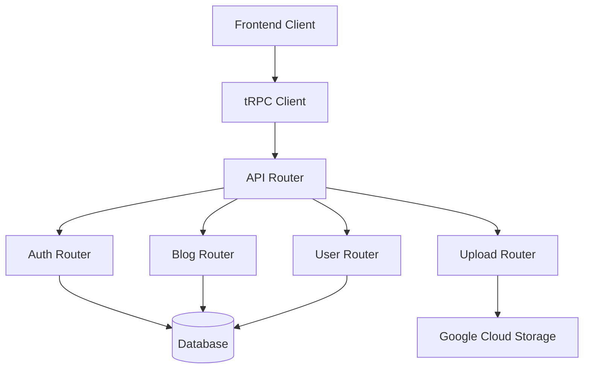

# API Documentation

This section documents the tRPC API layer that powers the Portfolio application.

## Overview

The Portfolio application uses [tRPC](https://trpc.io/) for type-safe API communication between the frontend and backend. tRPC provides end-to-end type safety without code generation, excellent developer experience, and automatic TypeScript inference.

## API Architecture



## Router Structure

### Root Router (`src/server/api/root.ts`)

The main router that combines all feature-specific routers:

```typescript
export const appRouter = createTRPCRouter({
  auth: authRouter,
  blog: blogRouter,
  user: userRouter,
  component: componentRouter,
  upload: uploadRouter,
});

export type AppRouter = typeof appRouter;
```

### Authentication Router (`src/server/api/routers/auth.ts`)

Handles user authentication and session management:

```typescript
export const authRouter = createTRPCRouter({
  getSession: publicProcedure.query(({ ctx }) => {
    return ctx.session;
  }),

  getSecretMessage: protectedProcedure.query(() => {
    return "you can now see this secret message!";
  }),
});
```

### Blog Router (`src/server/api/routers/blog.ts`)

Manages blog posts and content:

```typescript
export const blogRouter = createTRPCRouter({
  getAll: publicProcedure
    .input(z.object({
      limit: z.number().min(1).max(100).default(10),
      cursor: z.string().optional(),
    }))
    .query(async ({ input, ctx }) => {
      const posts = await ctx.db.blogPost.findMany({
        take: input.limit + 1,
        cursor: input.cursor ? { id: input.cursor } : undefined,
        orderBy: { createdAt: 'desc' },
        include: { author: true, tags: true },
      });
      
      let nextCursor: typeof input.cursor | undefined = undefined;
      if (posts.length > input.limit) {
        const nextItem = posts.pop();
        nextCursor = nextItem!.id;
      }
      
      return { posts, nextCursor };
    }),

  getBySlug: publicProcedure
    .input(z.object({ slug: z.string() }))
    .query(async ({ input, ctx }) => {
      return ctx.db.blogPost.findUnique({
        where: { slug: input.slug },
        include: { author: true, tags: true },
      });
    }),

  create: protectedProcedure
    .input(z.object({
      title: z.string().min(1),
      content: z.string().min(1),
      slug: z.string().min(1),
      published: z.boolean().default(false),
    }))
    .mutation(async ({ input, ctx }) => {
      return ctx.db.blogPost.create({
        data: {
          ...input,
          authorId: ctx.session.user.id,
        },
      });
    }),

  update: protectedProcedure
    .input(z.object({
      id: z.string(),
      title: z.string().optional(),
      content: z.string().optional(),
      published: z.boolean().optional(),
    }))
    .mutation(async ({ input, ctx }) => {
      const { id, ...data } = input;
      return ctx.db.blogPost.update({
        where: { id },
        data,
      });
    }),

  delete: protectedProcedure
    .input(z.object({ id: z.string() }))
    .mutation(async ({ input, ctx }) => {
      return ctx.db.blogPost.delete({
        where: { id: input.id },
      });
    }),
});
```

## Input Validation

All API inputs are validated using Zod schemas:

```typescript
// Example validation schemas
const createPostSchema = z.object({
  title: z.string().min(1, "Title is required").max(200, "Title too long"),
  content: z.string().min(1, "Content is required"),
  slug: z.string().min(1).regex(/^[a-z0-9-]+$/, "Invalid slug format"),
  published: z.boolean().default(false),
  tags: z.array(z.string()).optional(),
});
```

## Error Handling

tRPC provides structured error handling:

```typescript
import { TRPCError } from '@trpc/server';

// In your procedure
if (!user) {
  throw new TRPCError({
    code: 'NOT_FOUND',
    message: 'User not found',
  });
}

if (!ctx.session) {
  throw new TRPCError({
    code: 'UNAUTHORIZED',
    message: 'You must be logged in',
  });
}
```

### Error Codes

- `BAD_REQUEST`: Invalid input or request
- `UNAUTHORIZED`: Authentication required
- `FORBIDDEN`: Insufficient permissions
- `NOT_FOUND`: Resource not found
- `INTERNAL_SERVER_ERROR`: Server error
- `CONFLICT`: Resource conflict

## Client Usage

### Setting up the tRPC Client

```typescript
// src/utils/api.ts
import { createTRPCNext } from '@trpc/next';
import { type AppRouter } from '~/server/api/root';

export const api = createTRPCNext<AppRouter>({
  config() {
    return {
      url: '/api/trpc',
    };
  },
  ssr: false,
});
```

### Using the API in Components

```typescript
import { api } from '~/utils/api';

export function BlogList() {
  const { data: posts, isLoading } = api.blog.getAll.useQuery();
  
  if (isLoading) return <div>Loading...</div>;
  
  return (
    <div>
      {posts?.posts.map((post) => (
        <div key={post.id}>
          <h2>{post.title}</h2>
          <p>{post.content}</p>
        </div>
      ))}
    </div>
  );
}
```

### Mutations

```typescript
export function CreatePostForm() {
  const createPost = api.blog.create.useMutation();
  
  const handleSubmit = async (data: CreatePostInput) => {
    try {
      await createPost.mutateAsync(data);
      // Handle success
    } catch (error) {
      // Handle error
    }
  };
  
  return (
    <form onSubmit={handleSubmit}>
      {/* Form fields */}
    </form>
  );
}
```

## Authentication Middleware

Protected procedures require authentication:

```typescript
const protectedProcedure = publicProcedure.use(({ ctx, next }) => {
  if (!ctx.session || !ctx.session.user) {
    throw new TRPCError({ code: 'UNAUTHORIZED' });
  }
  return next({
    ctx: {
      session: { ...ctx.session, user: ctx.session.user },
    },
  });
});
```

## Testing APIs

### Unit Testing

```typescript
import { createTRPCContext } from '~/server/api/trpc';
import { appRouter } from '~/server/api/root';

describe('Blog Router', () => {
  it('creates a blog post', async () => {
    const ctx = await createTRPCContext({
      session: mockSession,
      req: mockRequest,
      res: mockResponse,
    });
    
    const caller = appRouter.createCaller(ctx);
    
    const result = await caller.blog.create({
      title: 'Test Post',
      content: 'Test content',
      slug: 'test-post',
    });
    
    expect(result.title).toBe('Test Post');
  });
});
```

### Integration Testing

```typescript
import request from 'supertest';
import { createServer } from '~/server';

describe('/api/trpc', () => {
  it('returns blog posts', async () => {
    const response = await request(app)
      .get('/api/trpc/blog.getAll')
      .expect(200);
      
    expect(response.body.result.data.posts).toBeDefined();
  });
});
```

## Performance Considerations

### Pagination

```typescript
// Cursor-based pagination for better performance
const posts = api.blog.getAll.useInfiniteQuery(
  { limit: 10 },
  {
    getNextPageParam: (lastPage) => lastPage.nextCursor,
  }
);
```

### Caching

```typescript
// Enable React Query caching
const posts = api.blog.getAll.useQuery(
  {},
  {
    staleTime: 5 * 60 * 1000, // 5 minutes
    cacheTime: 10 * 60 * 1000, // 10 minutes
  }
);
```

## API Reference

For complete API reference, see the [API Reference](../reference/api.md) section.

## Best Practices

1. **Input Validation**: Always validate inputs with Zod
2. **Error Handling**: Use appropriate error codes and messages  
3. **Type Safety**: Leverage TypeScript for type safety
4. **Testing**: Write comprehensive tests for all procedures
5. **Performance**: Use pagination and caching appropriately
6. **Security**: Implement proper authentication and authorization