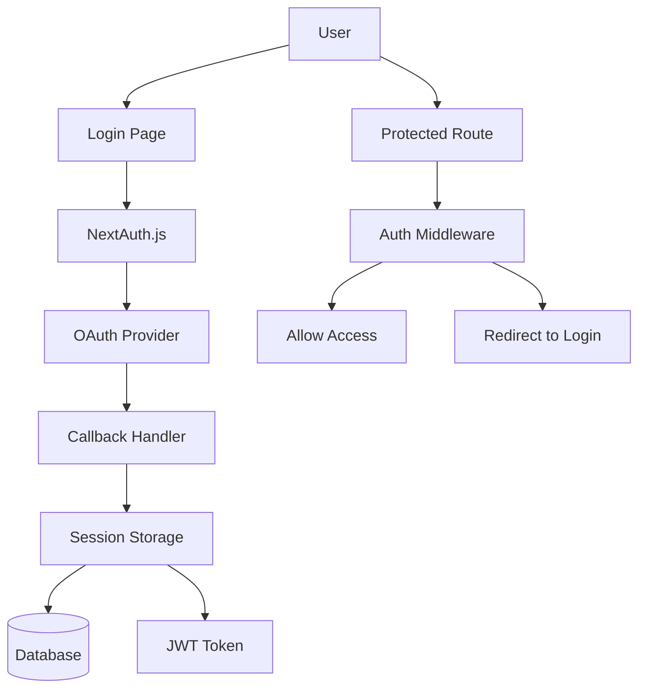

# Authentication

Comprehensive guide to the authentication system in the Portfolio application using NextAuth.js.

## Overview

The Portfolio application uses **NextAuth.js v4** for authentication, providing secure user authentication with multiple providers and session management.

### Features

- **Multiple OAuth Providers**: Google, GitHub, Discord
- **Session Management**: Secure JWT and database sessions
- **Role-Based Access**: Admin and user roles
- **CSRF Protection**: Built-in security measures
- **Type Safety**: Full TypeScript integration

## Architecture



## Configuration

### NextAuth Configuration

```typescript
// src/server/auth.ts
import { NextAuthOptions } from 'next-auth';
import GoogleProvider from 'next-auth/providers/google';
import GitHubProvider from 'next-auth/providers/github';
import DiscordProvider from 'next-auth/providers/discord';
import { PrismaAdapter } from '@next-auth/prisma-adapter';
import { db } from './db';

export const authOptions: NextAuthOptions = {
  adapter: PrismaAdapter(db),
  providers: [
    GoogleProvider({
      clientId: process.env.GOOGLE_CLIENT_ID!,
      clientSecret: process.env.GOOGLE_CLIENT_SECRET!,
    }),
    GitHubProvider({
      clientId: process.env.GITHUB_CLIENT_ID!,
      clientSecret: process.env.GITHUB_CLIENT_SECRET!,
    }),
    DiscordProvider({
      clientId: process.env.DISCORD_CLIENT_ID!,
      clientSecret: process.env.DISCORD_CLIENT_SECRET!,
    }),
  ],
  session: {
    strategy: 'database',
    maxAge: 30 * 24 * 60 * 60, // 30 days
  },
  pages: {
    signIn: '/auth/signin',
    signOut: '/auth/signout',
    error: '/auth/error',
  },
  callbacks: {
    session: async ({ session, user }) => {
      return {
        ...session,
        user: {
          ...session.user,
          id: user.id,
        },
      };
    },
  },
  debug: process.env.NODE_ENV === 'development',
};
```

### API Route Handler

```typescript
// src/app/api/auth/[...nextauth]/route.ts
import NextAuth from 'next-auth';
import { authOptions } from '~/server/auth';

const handler = NextAuth(authOptions);

export { handler as GET, handler as POST };
```

### Environment Variables

```bash
# NextAuth Configuration
NEXTAUTH_SECRET="your-super-secret-key"
NEXTAUTH_URL="http://localhost:3000"

# OAuth Providers
GOOGLE_CLIENT_ID="your-google-client-id"
GOOGLE_CLIENT_SECRET="your-google-client-secret"

GITHUB_CLIENT_ID="your-github-client-id"
GITHUB_CLIENT_SECRET="your-github-client-secret"

DISCORD_CLIENT_ID="your-discord-client-id"
DISCORD_CLIENT_SECRET="your-discord-client-secret"
```

## Database Schema

### NextAuth Tables

```prisma
// prisma/schema.prisma
model Account {
  id                String  @id @default(cuid())
  userId            String
  type              String
  provider          String
  providerAccountId String
  refresh_token     String? @db.Text
  access_token      String? @db.Text
  expires_at        Int?
  token_type        String?
  scope             String?
  id_token          String? @db.Text
  session_state     String?

  user User @relation(fields: [userId], references: [id], onDelete: Cascade)

  @@unique([provider, providerAccountId])
}

model Session {
  id           String   @id @default(cuid())
  sessionToken String   @unique
  userId       String
  expires      DateTime
  user         User     @relation(fields: [userId], references: [id], onDelete: Cascade)
}

model User {
  id            String    @id @default(cuid())
  name          String?
  email         String    @unique
  emailVerified DateTime?
  image         String?
  role          String    @default("USER")
  accounts      Account[]
  sessions      Session[]
  blogPosts     BlogPost[]
  createdAt     DateTime  @default(now())
  updatedAt     DateTime  @updatedAt
}

model VerificationToken {
  identifier String
  token      String   @unique
  expires    DateTime

  @@unique([identifier, token])
}
```

## Authentication Hooks

### useSession Hook

```typescript
// Usage in components
import { useSession, signIn, signOut } from 'next-auth/react';

export function UserProfile() {
  const { data: session, status } = useSession();

  if (status === 'loading') return <p>Loading...</p>;

  if (status === 'unauthenticated') {
    return (
      <div>
        <p>Not signed in</p>
        <button onClick={() => signIn()}>Sign in</button>
      </div>
    );
  }

  return (
    <div>
      <p>Signed in as {session.user.email}</p>
      
      <button onClick={() => signOut()}>Sign out</button>
    </div>
  );
}
```

### Server-Side Session

```typescript
// src/server/auth.ts
import { getServerSession } from 'next-auth/next';
import { authOptions } from './auth';

export const getServerAuthSession = () => {
  return getServerSession(authOptions);
};

// Usage in API routes or server components
export async function getCurrentUser() {
  const session = await getServerAuthSession();
  return session?.user;
}
```

## Authentication Components

### Sign In Page

```tsx
// src/app/auth/signin/page.tsx
import { getProviders, signIn, getSession } from 'next-auth/react';
import { GetServerSideProps } from 'next';

interface Props {
  providers: Record<string, any>;
}

export default function SignIn({ providers }: Props) {
  return (
    <div className="min-h-screen flex items-center justify-center">
      <div className="max-w-md w-full space-y-8">
        <div>
          <h2 className="text-center text-3xl font-extrabold text-gray-900">
            Sign in to your account
          </h2>
        </div>
        <div className="space-y-4">
          {Object.values(providers).map((provider) => (
            <div key={provider.name}>
              <button
                onClick={() => signIn(provider.id, { callbackUrl: '/' })}
                className="group relative w-full flex justify-center py-2 px-4 border border-transparent text-sm font-medium rounded-md text-white bg-indigo-600 hover:bg-indigo-700"
              >
                Sign in with {provider.name}
              </button>
            </div>
          ))}
        </div>
      </div>
    </div>
  );
}

export const getServerSideProps: GetServerSideProps = async (context) => {
  const session = await getSession(context);

  if (session) {
    return {
      redirect: {
        destination: '/',
        permanent: false,
      },
    };
  }

  const providers = await getProviders();

  return {
    props: {
      providers: providers ?? {},
    },
  };
};
```

### Protected Route Component

```tsx
// src/components/auth/ProtectedRoute.tsx
import { useSession } from 'next-auth/react';
import { useRouter } from 'next/router';
import { ReactNode, useEffect } from 'react';

interface Props {
  children: ReactNode;
  requiredRole?: string;
}

export function ProtectedRoute({ children, requiredRole = 'USER' }: Props) {
  const { data: session, status } = useSession();
  const router = useRouter();

  useEffect(() => {
    if (status === 'loading') return; // Still loading

    if (!session) {
      router.push('/auth/signin');
      return;
    }

    if (requiredRole === 'ADMIN' && session.user.role !== 'ADMIN') {
      router.push('/unauthorized');
      return;
    }
  }, [session, status, router, requiredRole]);

  if (status === 'loading') {
    return <div>Loading...</div>;
  }

  if (!session) {
    return null;
  }

  if (requiredRole === 'ADMIN' && session.user.role !== 'ADMIN') {
    return null;
  }

  return <>{children}</>;
}
```

### User Menu Component

```tsx
// src/components/layout/UserMenu.tsx
import { useSession, signOut } from 'next-auth/react';
import { Menu } from '@headlessui/react';
import Link from 'next/link';

export function UserMenu() {
  const { data: session } = useSession();

  if (!session) return null;

  return (
    <Menu as="div" className="relative inline-block text-left">
      <Menu.Button className="flex items-center space-x-2">
        
        <span>{session.user.name}</span>
      </Menu.Button>

      <Menu.Items className="absolute right-0 mt-2 w-56 origin-top-right bg-white divide-y divide-gray-100 rounded-md shadow-lg">
        <div className="px-1 py-1">
          <Menu.Item>
            {({ active }) => (
              <Link
                href="/profile"
                className={`${
                  active ? 'bg-gray-100' : ''
                } group flex rounded-md items-center w-full px-2 py-2 text-sm`}
              >
                Profile
              </Link>
            )}
          </Menu.Item>
          
          {session.user.role === 'ADMIN' && (
            <Menu.Item>
              {({ active }) => (
                <Link
                  href="/admin"
                  className={`${
                    active ? 'bg-gray-100' : ''
                  } group flex rounded-md items-center w-full px-2 py-2 text-sm`}
                >
                  Admin Panel
                </Link>
              )}
            </Menu.Item>
          )}
        </div>
        
        <div className="px-1 py-1">
          <Menu.Item>
            {({ active }) => (
              <button
                onClick={() => signOut()}
                className={`${
                  active ? 'bg-gray-100' : ''
                } group flex rounded-md items-center w-full px-2 py-2 text-sm text-red-600`}
              >
                Sign Out
              </button>
            )}
          </Menu.Item>
        </div>
      </Menu.Items>
    </Menu>
  );
}
```

## Middleware Protection

### Authentication Middleware

```typescript
// middleware.ts
import { withAuth } from 'next-auth/middleware';

export default withAuth(
  function middleware(req) {
    // Additional middleware logic here
  },
  {
    callbacks: {
      authorized: ({ token, req }) => {
        // Check if user is authenticated
        if (!token) return false;

        // Check admin routes
        if (req.nextUrl.pathname.startsWith('/admin')) {
          return token.role === 'ADMIN';
        }

        // Check protected routes
        if (req.nextUrl.pathname.startsWith('/dashboard')) {
          return !!token;
        }

        return true;
      },
    },
  }
);

export const config = {
  matcher: ['/admin/:path*', '/dashboard/:path*', '/profile/:path*'],
};
```

## tRPC Authentication

### Protected Procedures

```typescript
// src/server/api/trpc.ts
import { TRPCError, initTRPC } from '@trpc/server';
import { getServerAuthSession } from '~/server/auth';

const t = initTRPC.context<typeof createTRPCContext>().create();

export const publicProcedure = t.procedure;

export const protectedProcedure = t.procedure.use(({ ctx, next }) => {
  if (!ctx.session || !ctx.session.user) {
    throw new TRPCError({ code: 'UNAUTHORIZED' });
  }
  return next({
    ctx: {
      session: { ...ctx.session, user: ctx.session.user },
    },
  });
});

export const adminProcedure = protectedProcedure.use(({ ctx, next }) => {
  if (ctx.session.user.role !== 'ADMIN') {
    throw new TRPCError({ code: 'FORBIDDEN' });
  }
  return next({ ctx });
});
```

### Context Creation

```typescript
// src/server/api/trpc.ts
import { type CreateNextContextOptions } from '@trpc/server/adapters/next';
import { getServerAuthSession } from '~/server/auth';
import { db } from '~/server/db';

export const createTRPCContext = async (opts: CreateNextContextOptions) => {
  const { req, res } = opts;
  const session = await getServerAuthSession({ req, res });

  return {
    session,
    db,
  };
};
```

## Role-Based Access Control

### Role Management

```typescript
// src/server/api/routers/user.ts
export const userRouter = createTRPCRouter({
  updateRole: adminProcedure
    .input(z.object({
      userId: z.string(),
      role: z.enum(['USER', 'ADMIN']),
    }))
    .mutation(async ({ input, ctx }) => {
      return ctx.db.user.update({
        where: { id: input.userId },
        data: { role: input.role },
      });
    }),

  getUsers: adminProcedure
    .query(async ({ ctx }) => {
      return ctx.db.user.findMany({
        select: {
          id: true,
          name: true,
          email: true,
          role: true,
          createdAt: true,
        },
      });
    }),
});
```

### Role-Based Components

```tsx
// src/components/auth/RoleGuard.tsx
import { useSession } from 'next-auth/react';
import { ReactNode } from 'react';

interface Props {
  children: ReactNode;
  allowedRoles: string[];
  fallback?: ReactNode;
}

export function RoleGuard({ children, allowedRoles, fallback = null }: Props) {
  const { data: session } = useSession();

  if (!session?.user) return fallback;
  
  if (!allowedRoles.includes(session.user.role)) {
    return fallback;
  }

  return <>{children}</>;
}

// Usage
<RoleGuard allowedRoles={['ADMIN']} fallback={<div>Access denied</div>}>
  <AdminPanel />
</RoleGuard>
```

## Session Management

### Session Provider Setup

```tsx
// src/app/layout.tsx
import { SessionProvider } from 'next-auth/react';

export default function RootLayout({
  children,
  pageProps: { session, ...pageProps },
}: AppProps) {
  return (
    <SessionProvider session={session}>
      {children}
    </SessionProvider>
  );
}
```

### Custom Session Hooks

```typescript
// src/hooks/useAuth.ts
import { useSession } from 'next-auth/react';
import { useRouter } from 'next/router';

export function useAuth(requiredRole?: string) {
  const { data: session, status } = useSession();
  const router = useRouter();

  const isLoading = status === 'loading';
  const isAuthenticated = !!session;
  const isAdmin = session?.user?.role === 'ADMIN';

  const requireAuth = () => {
    if (!isAuthenticated) {
      router.push('/auth/signin');
      return false;
    }
    return true;
  };

  const requireRole = (role: string) => {
    if (!requireAuth()) return false;
    
    if (session?.user?.role !== role) {
      router.push('/unauthorized');
      return false;
    }
    
    return true;
  };

  return {
    session,
    user: session?.user,
    isLoading,
    isAuthenticated,
    isAdmin,
    requireAuth,
    requireRole,
  };
}
```

## Testing Authentication

### Mock Authentication

```typescript
// tests/mocks/auth.ts
import { Session } from 'next-auth';

export const mockSession: Session = {
  user: {
    id: 'test-user-id',
    name: 'Test User',
    email: 'test@example.com',
    role: 'USER',
  },
  expires: '2024-01-01',
};

export const mockAdminSession: Session = {
  user: {
    id: 'admin-user-id',
    name: 'Admin User',
    email: 'admin@example.com',
    role: 'ADMIN',
  },
  expires: '2024-01-01',
};
```

### Testing Protected Components

```tsx
// components/__tests__/ProtectedComponent.test.tsx
import { render, screen } from '@testing-library/react';
import { useSession } from 'next-auth/react';
import { ProtectedComponent } from '../ProtectedComponent';

jest.mock('next-auth/react');

const mockUseSession = useSession as jest.MockedFunction<typeof useSession>;

describe('ProtectedComponent', () => {
  it('renders for authenticated user', () => {
    mockUseSession.mockReturnValue({
      data: mockSession,
      status: 'authenticated',
    });

    render(<ProtectedComponent />);
    expect(screen.getByText('Protected content')).toBeInTheDocument();
  });

  it('shows login prompt for unauthenticated user', () => {
    mockUseSession.mockReturnValue({
      data: null,
      status: 'unauthenticated',
    });

    render(<ProtectedComponent />);
    expect(screen.getByText('Please sign in')).toBeInTheDocument();
  });
});
```

## Security Considerations

### Best Practices

1. **Secure Secrets**: Use strong, random NEXTAUTH_SECRET
2. **HTTPS Only**: Always use HTTPS in production
3. **Session Timeout**: Configure appropriate session timeouts
4. **CSRF Protection**: Enabled by default in NextAuth.js
5. **Input Validation**: Validate all user inputs
6. **Role Validation**: Always validate roles server-side

### Security Headers

```typescript
// next.config.js
const securityHeaders = [
  {
    key: 'X-Frame-Options',
    value: 'DENY',
  },
  {
    key: 'X-Content-Type-Options',
    value: 'nosniff',
  },
  {
    key: 'Referrer-Policy',
    value: 'origin-when-cross-origin',
  },
];

module.exports = {
  async headers() {
    return [
      {
        source: '/(.*)',
        headers: securityHeaders,
      },
    ];
  },
};
```

## Troubleshooting

### Common Issues

1. **OAuth Redirect Mismatch**: Verify callback URLs in provider settings
2. **Session Not Persisting**: Check database connection and schema
3. **CSRF Errors**: Ensure NEXTAUTH_URL matches your domain
4. **Role Access Issues**: Verify role assignment and middleware configuration

### Debug Mode

```typescript
// Enable debug logging
export const authOptions: NextAuthOptions = {
  // ... other options
  debug: process.env.NODE_ENV === 'development',
  logger: {
    error(code, metadata) {
      console.error(code, metadata);
    },
    warn(code) {
      console.warn(code);
    },
    debug(code, metadata) {
      console.debug(code, metadata);
    },
  },
};
```

For more authentication examples and advanced configurations, see the [Authentication Examples](../reference/auth-examples.md) in the reference section.