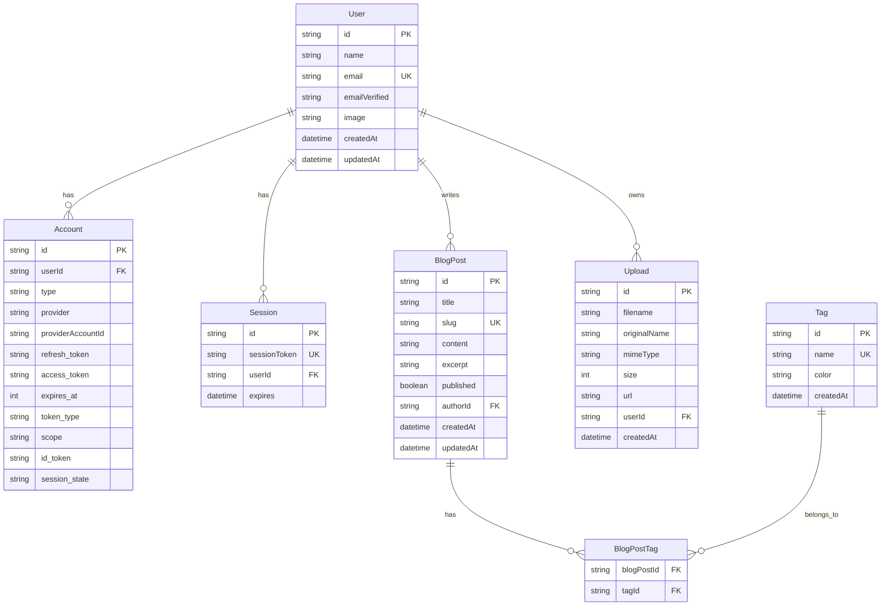

# Database

This document covers the database architecture, schema design, and Prisma ORM integration for the Portfolio application.

## Overview

The Portfolio application uses **PostgreSQL** as the primary database with **Prisma** as the ORM for type-safe database operations.

### Technology Stack

- **Database**: PostgreSQL 15+
- **ORM**: Prisma 5+
- **Query Builder**: Prisma Client
- **Migrations**: Prisma Migrate
- **Schema Management**: Prisma Schema Language

## Database Architecture



## Prisma Schema

The complete schema is defined in `prisma/schema.prisma`:

```prisma
// Prisma schema file
// This is your Prisma schema file,
// learn more about it in the docs: https://pris.ly/d/prisma-schema

generator client {
  provider = "prisma-client-js"
}

datasource db {
  provider = "postgresql"
  url      = env("DATABASE_URL")
}

// NextAuth.js Tables
model Account {
  id                String  @id @default(cuid())
  userId            String
  type              String
  provider          String
  providerAccountId String
  refresh_token     String? @db.Text
  access_token      String? @db.Text
  expires_at        Int?
  token_type        String?
  scope             String?
  id_token          String? @db.Text
  session_state     String?

  user User @relation(fields: [userId], references: [id], onDelete: Cascade)

  @@unique([provider, providerAccountId])
}

model Session {
  id           String   @id @default(cuid())
  sessionToken String   @unique
  userId       String
  expires      DateTime
  user         User     @relation(fields: [userId], references: [id], onDelete: Cascade)
}

model User {
  id            String    @id @default(cuid())
  name          String?
  email         String    @unique
  emailVerified DateTime?
  image         String?
  accounts      Account[]
  sessions      Session[]
  blogPosts     BlogPost[]
  uploads       Upload[]
  createdAt     DateTime  @default(now())
  updatedAt     DateTime  @updatedAt
}

model VerificationToken {
  identifier String
  token      String   @unique
  expires    DateTime

  @@unique([identifier, token])
}

// Application Tables
model BlogPost {
  id        String   @id @default(cuid())
  title     String
  slug      String   @unique
  content   String   @db.Text
  excerpt   String?
  published Boolean  @default(false)
  authorId  String
  author    User     @relation(fields: [authorId], references: [id], onDelete: Cascade)
  tags      BlogPostTag[]
  createdAt DateTime @default(now())
  updatedAt DateTime @updatedAt
  
  @@index([published, createdAt])
  @@index([authorId])
}

model Tag {
  id        String   @id @default(cuid())
  name      String   @unique
  color     String?
  blogPosts BlogPostTag[]
  createdAt DateTime @default(now())
}

model BlogPostTag {
  blogPostId String
  tagId      String
  blogPost   BlogPost @relation(fields: [blogPostId], references: [id], onDelete: Cascade)
  tag        Tag      @relation(fields: [tagId], references: [id], onDelete: Cascade)

  @@id([blogPostId, tagId])
}

model Upload {
  id           String   @id @default(cuid())
  filename     String
  originalName String
  mimeType     String
  size         Int
  url          String
  userId       String
  user         User     @relation(fields: [userId], references: [id], onDelete: Cascade)
  createdAt    DateTime @default(now())
  
  @@index([userId])
  @@index([createdAt])
}

model Component {
  id          String   @id @default(cuid())
  name        String   @unique
  category    String
  description String?
  code        String   @db.Text
  props       Json?
  published   Boolean  @default(false)
  createdAt   DateTime @default(now())
  updatedAt   DateTime @updatedAt
  
  @@index([category, published])
}
```

## Database Operations

### Prisma Client Setup

```typescript
// src/server/db.ts
import { PrismaClient } from '@prisma/client';

declare global {
  var __db__: PrismaClient | undefined;
}

export const db =
  globalThis.__db__ ??
  new PrismaClient({
    log:
      process.env.NODE_ENV === 'development'
        ? ['query', 'error', 'warn']
        : ['error'],
  });

if (process.env.NODE_ENV !== 'production') {
  globalThis.__db__ = db;
}
```

### Common Queries

#### Blog Posts

```typescript
// Get all published blog posts
const publishedPosts = await db.blogPost.findMany({
  where: { published: true },
  include: {
    author: {
      select: { name: true, image: true },
    },
    tags: {
      include: { tag: true },
    },
  },
  orderBy: { createdAt: 'desc' },
});

// Get blog post by slug
const post = await db.blogPost.findUnique({
  where: { slug: 'my-post-slug' },
  include: {
    author: true,
    tags: { include: { tag: true } },
  },
});

// Create new blog post
const newPost = await db.blogPost.create({
  data: {
    title: 'New Post',
    slug: 'new-post',
    content: 'Post content...',
    authorId: userId,
    tags: {
      create: [
        { tag: { connect: { id: tagId } } }
      ],
    },
  },
});
```

#### Users

```typescript
// Get user with posts
const userWithPosts = await db.user.findUnique({
  where: { email: 'user@example.com' },
  include: {
    blogPosts: {
      where: { published: true },
      orderBy: { createdAt: 'desc' },
    },
  },
});

// Update user profile
const updatedUser = await db.user.update({
  where: { id: userId },
  data: {
    name: 'New Name',
    image: 'new-image-url',
  },
});
```

#### File Uploads

```typescript
// Save file upload record
const upload = await db.upload.create({
  data: {
    filename: 'file.jpg',
    originalName: 'original-file.jpg',
    mimeType: 'image/jpeg',
    size: 1024000,
    url: 'https://storage.googleapis.com/bucket/file.jpg',
    userId: userId,
  },
});

// Get user uploads
const userUploads = await db.upload.findMany({
  where: { userId },
  orderBy: { createdAt: 'desc' },
});
```

## Database Migrations

### Creating Migrations

```bash
# Create a new migration
pnpm db:migrate

# Push schema changes without migration (development only)
pnpm db:push

# Reset database (development only)
pnpm prisma migrate reset
```

### Migration Best Practices

1. **Review Generated SQL**: Always review migration files before applying
2. **Backup Production**: Create backups before running migrations in production
3. **Test Migrations**: Test migrations in staging environment first
4. **Rollback Plan**: Have a rollback strategy for production migrations

### Example Migration

```sql
-- CreateTable
CREATE TABLE "BlogPost" (
    "id" TEXT NOT NULL,
    "title" TEXT NOT NULL,
    "slug" TEXT NOT NULL,
    "content" TEXT NOT NULL,
    "published" BOOLEAN NOT NULL DEFAULT false,
    "authorId" TEXT NOT NULL,
    "createdAt" TIMESTAMP(3) NOT NULL DEFAULT CURRENT_TIMESTAMP,
    "updatedAt" TIMESTAMP(3) NOT NULL,

    CONSTRAINT "BlogPost_pkey" PRIMARY KEY ("id")
);

-- CreateIndex
CREATE UNIQUE INDEX "BlogPost_slug_key" ON "BlogPost"("slug");

-- CreateIndex
CREATE INDEX "BlogPost_published_createdAt_idx" ON "BlogPost"("published", "createdAt");

-- AddForeignKey
ALTER TABLE "BlogPost" ADD CONSTRAINT "BlogPost_authorId_fkey" 
    FOREIGN KEY ("authorId") REFERENCES "User"("id") ON DELETE CASCADE ON UPDATE CASCADE;
```

## Database Seeding

The `prisma/seed.ts` file populates the database with initial data:

```typescript
// prisma/seed.ts
import { PrismaClient } from '@prisma/client';
import bcrypt from 'bcryptjs';

const prisma = new PrismaClient();

async function main() {
  // Create admin user
  const hashedPassword = await bcrypt.hash('admin123', 12);
  
  const adminUser = await prisma.user.upsert({
    where: { email: 'admin@example.com' },
    update: {},
    create: {
      email: 'admin@example.com',
      name: 'Admin User',
      // Additional user data...
    },
  });

  // Create sample blog posts
  const samplePost = await prisma.blogPost.upsert({
    where: { slug: 'welcome-post' },
    update: {},
    create: {
      title: 'Welcome to My Portfolio',
      slug: 'welcome-post',
      content: 'This is a sample blog post...',
      published: true,
      authorId: adminUser.id,
    },
  });

  // Create tags
  const tags = await Promise.all([
    prisma.tag.upsert({
      where: { name: 'TypeScript' },
      update: {},
      create: { name: 'TypeScript', color: '#3178c6' },
    }),
    prisma.tag.upsert({
      where: { name: 'React' },
      update: {},
      create: { name: 'React', color: '#61dafb' },
    }),
  ]);

  console.log('Database seeded successfully');
}

main()
  .catch((e) => {
    console.error(e);
    process.exit(1);
  })
  .finally(async () => {
    await prisma.$disconnect();
  });
```

### Running Seed

```bash
# Seed the database
pnpm db:seed
```

## Performance Optimization

### Indexing Strategy

```prisma
model BlogPost {
  // Composite index for common queries
  @@index([published, createdAt])
  
  // Single column indexes
  @@index([authorId])
  @@index([slug])
}

model Upload {
  // Index for user queries
  @@index([userId])
  
  // Index for date-based queries
  @@index([createdAt])
}
```

### Query Optimization

```typescript
// Use select to fetch only needed fields
const posts = await db.blogPost.findMany({
  select: {
    id: true,
    title: true,
    slug: true,
    createdAt: true,
    author: {
      select: { name: true },
    },
  },
});

// Use pagination for large datasets
const posts = await db.blogPost.findMany({
  take: 10,
  skip: (page - 1) * 10,
  orderBy: { createdAt: 'desc' },
});

// Use cursor-based pagination for better performance
const posts = await db.blogPost.findMany({
  take: 10,
  cursor: lastPostId ? { id: lastPostId } : undefined,
  skip: lastPostId ? 1 : 0,
  orderBy: { createdAt: 'desc' },
});
```

### Connection Pooling

```typescript
// Configure connection pool
const db = new PrismaClient({
  datasources: {
    db: {
      url: process.env.DATABASE_URL,
    },
  },
  // Connection pool configuration
});
```

## Database Monitoring

### Prisma Studio

```bash
# Open Prisma Studio for database inspection
pnpm db:studio
```

### Query Logging

```typescript
const db = new PrismaClient({
  log: [
    {
      emit: 'event',
      level: 'query',
    },
    {
      emit: 'stdout',
      level: 'error',
    },
    {
      emit: 'stdout',
      level: 'info',
    },
    {
      emit: 'stdout',
      level: 'warn',
    },
  ],
});

db.$on('query', (e) => {
  console.log('Query: ' + e.query);
  console.log('Params: ' + e.params);
  console.log('Duration: ' + e.duration + 'ms');
});
```

## Testing

### Database Testing Setup

```typescript
// tests/helpers/database.ts
import { PrismaClient } from '@prisma/client';

const testDb = new PrismaClient({
  datasources: {
    db: {
      url: process.env.TEST_DATABASE_URL,
    },
  },
});

export async function cleanDatabase() {
  const tablenames = await testDb.$queryRaw<
    Array<{ tablename: string }>
  >`SELECT tablename FROM pg_tables WHERE schemaname='public'`;

  const tables = tablenames
    .map(({ tablename }) => tablename)
    .filter((name) => name !== '_prisma_migrations')
    .map((name) => `"public"."${name}"`)
    .join(', ');

  try {
    await testDb.$executeRawUnsafe(`TRUNCATE TABLE ${tables} CASCADE;`);
  } catch (error) {
    console.log({ error });
  }
}

export { testDb };
```

### Test Example

```typescript
// tests/database/blogPost.test.ts
import { testDb, cleanDatabase } from '../helpers/database';

describe('BlogPost Model', () => {
  beforeEach(async () => {
    await cleanDatabase();
  });

  afterAll(async () => {
    await testDb.$disconnect();
  });

  it('should create a blog post', async () => {
    const user = await testDb.user.create({
      data: {
        email: 'test@example.com',
        name: 'Test User',
      },
    });

    const post = await testDb.blogPost.create({
      data: {
        title: 'Test Post',
        slug: 'test-post',
        content: 'Test content',
        authorId: user.id,
      },
    });

    expect(post.title).toBe('Test Post');
    expect(post.published).toBe(false);
  });
});
```

## Backup and Recovery

### Automated Backups

```bash
# Create database backup
pg_dump $DATABASE_URL > backup-$(date +%Y%m%d_%H%M%S).sql

# Restore from backup
psql $DATABASE_URL < backup-20231201_120000.sql
```

### Cloud SQL Backups (Google Cloud)

```bash
# Create backup
gcloud sql backups create --instance=portfolio-db

# List backups
gcloud sql backups list --instance=portfolio-db

# Restore from backup
gcloud sql backups restore BACKUP_ID --restore-instance=portfolio-db
```

## Best Practices

1. **Always Use Transactions**: For multi-step operations
2. **Index Strategically**: Index columns used in WHERE, ORDER BY, and JOIN clauses
3. **Validate Data**: Use Prisma schemas and Zod for validation
4. **Handle Errors**: Implement proper error handling for database operations
5. **Monitor Performance**: Use query logging and monitoring tools
6. **Regular Backups**: Implement automated backup strategies
7. **Test Migrations**: Always test migrations in staging before production

## Troubleshooting

### Common Issues

1. **Connection Errors**: Check DATABASE_URL and network connectivity
2. **Migration Failures**: Review migration files and resolve conflicts
3. **Performance Issues**: Add appropriate indexes and optimize queries
4. **Data Consistency**: Use transactions for related operations

For more information, see the [Database Schema Reference](../reference/database-schema.md).