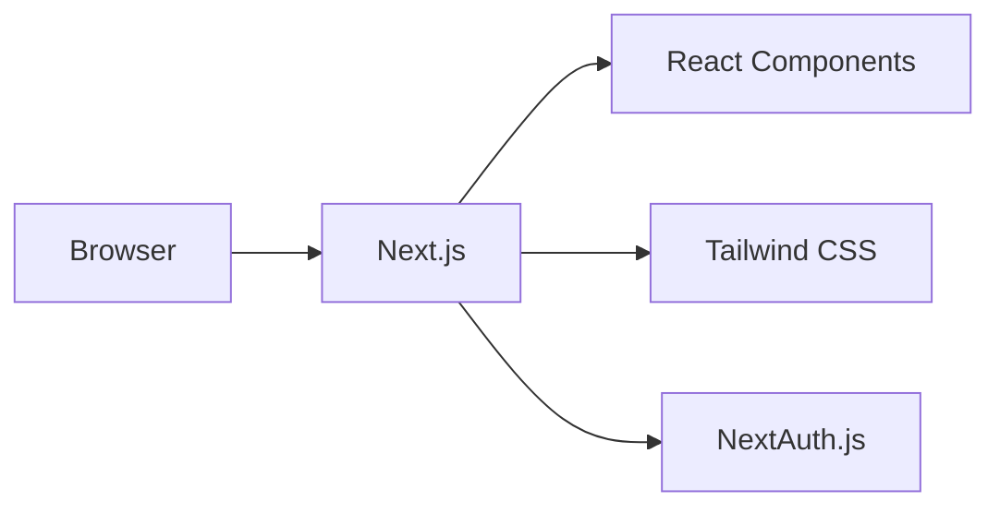
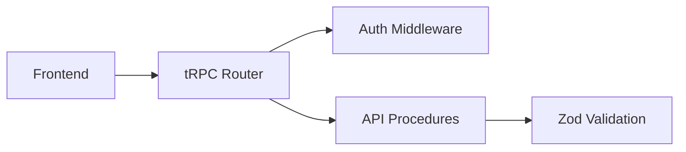
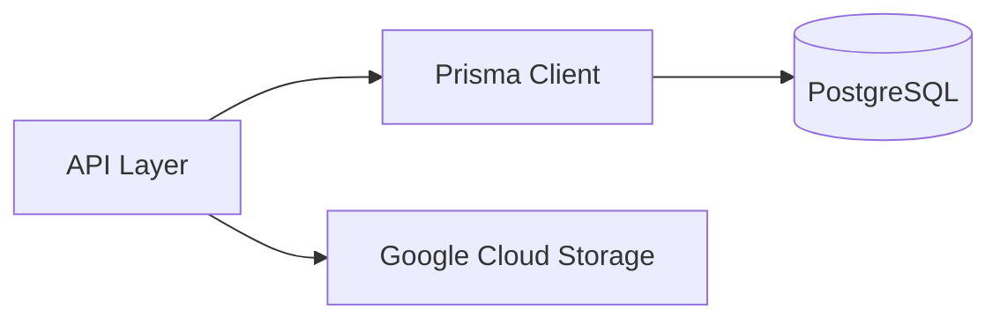
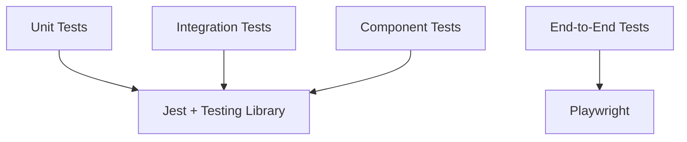

# Project Overview

This document provides a high-level overview of the Portfolio application architecture, technologies, and design decisions.

## Application Purpose

The Portfolio application serves as a modern, full-stack showcase for a developer's work, featuring:

- **Personal Portfolio**: Showcase projects, skills, and experience
- **Blog Platform**: Write and publish technical articles with rich content
- **Admin Interface**: Manage content through a secure admin panel
- **Component Library**: Demonstrate reusable UI components
- **API Showcase**: Demonstrate modern API design with tRPC

## Architecture Principles

### Type Safety First
The application prioritizes type safety across the entire stack:

- **TypeScript**: Strict typing throughout the codebase
- **tRPC**: End-to-end type safety for API calls
- **Prisma**: Type-safe database operations
- **Zod**: Runtime validation with TypeScript inference

### Modern Development Practices
Following industry best practices for maintainability and developer experience:

- **App Router**: Next.js 13+ App Router for modern React patterns
- **Server Components**: Optimal performance with React Server Components
- **Streaming**: Progressive loading for better user experience
- **Edge Runtime**: Deploy close to users for optimal performance

### Security Focused
Built with security as a foundational requirement:

- **Authentication**: Secure session management with NextAuth.js
- **Authorization**: Role-based access control
- **CSRF Protection**: Built-in protection against cross-site request forgery
- **Input Validation**: Comprehensive validation with Zod schemas

### Cloud Native
Designed for modern cloud deployment:

- **Containerized**: Docker-first development and deployment
- **Kubernetes Ready**: Complete K8s manifests for production deployment
- **Stateless**: Horizontally scalable application design
- **12-Factor**: Follows 12-factor app methodology

## Technical Stack Overview

### Frontend Layer


- **Next.js 15**: React framework with App Router
- **React 18**: Modern React with Concurrent Features
- **Tailwind CSS**: Utility-first CSS framework
- **TypeScript**: Static type checking
- **NextAuth.js**: Authentication library

### API Layer


- **tRPC**: Type-safe API layer
- **Zod**: Schema validation and inference
- **Middleware**: Authentication and error handling
- **Procedures**: Type-safe API endpoints

### Data Layer


- **Prisma**: Type-safe ORM and query builder
- **PostgreSQL**: Primary relational database
- **Google Cloud Storage**: File storage for uploads

### Testing Strategy


- **Unit Tests**: Jest with Testing Library
- **Integration Tests**: API and database testing
- **End-to-End Tests**: Playwright for user workflows
- **Component Tests**: React component testing

## Project Structure

```
portfolio/
├── src/                     # Source code
│   ├── app/                # Next.js App Router pages
│   ├── components/         # Reusable React components
│   ├── server/            # Backend code (tRPC, database)
│   ├── types/             # Shared TypeScript types
│   └── utils/             # Utility functions
├── prisma/                # Database schema and migrations
├── k8s/                   # Kubernetes manifests
├── docs/                  # Documentation (MkDocs)
├── public/                # Static assets
└── tests/                 # Test files
```

## Key Design Decisions

### Why Next.js App Router?
- **Performance**: React Server Components for optimal loading
- **SEO**: Built-in SSR and SSG capabilities
- **Developer Experience**: File-based routing with layouts
- **Future-Proof**: Latest React patterns and features

### Why tRPC?
- **Type Safety**: End-to-end type safety without code generation
- **Developer Experience**: Excellent IDE support and autocomplete
- **Performance**: Minimal runtime overhead
- **Flexibility**: Works with any React framework

### Why Prisma?
- **Type Safety**: Generated types from database schema
- **Developer Experience**: Intuitive query API
- **Migrations**: Version-controlled database changes
- **Performance**: Optimized query generation

### Why Kubernetes?
- **Scalability**: Horizontal scaling for high traffic
- **Reliability**: Self-healing and rolling deployments
- **Portability**: Run anywhere Kubernetes is supported
- **DevOps**: GitOps workflow with Flux CD

## Performance Considerations

### Frontend Optimization
- **Server Components**: Reduced JavaScript bundle size
- **Streaming**: Progressive page loading
- **Image Optimization**: Next.js Image component
- **CSS Optimization**: Tailwind CSS purging

### Backend Optimization
- **Connection Pooling**: Prisma connection management
- **Query Optimization**: Efficient database queries
- **Caching**: Strategic caching with Redis (when needed)
- **Edge Deployment**: Deploy close to users

### Database Optimization
- **Indexing**: Proper database indexes
- **Query Optimization**: Efficient Prisma queries
- **Connection Pooling**: Optimized connection management
- **Monitoring**: Query performance tracking

## Development Workflow

1. **Local Development**: Docker Compose for complete local environment
2. **Testing**: Comprehensive test suite before commits
3. **Code Review**: Pull request workflow with automated checks
4. **Deployment**: GitOps with Flux CD for automated deployments
5. **Monitoring**: Observability and health checks in production

## Next Steps

- Continue to [Prerequisites](prerequisites.md) to set up your development environment
- Review the [Installation Guide](installation.md) for step-by-step setup
- Explore the [Project Structure](../development/project-structure.md) for detailed code organization