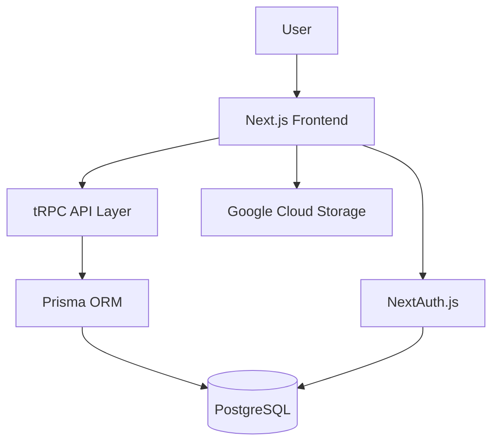

# Portfolio Developer Documentation

Welcome to the comprehensive developer documentation for the Next.js Portfolio application. This documentation provides everything you need to understand, develop, and deploy this modern full-stack application.

## 🚀 What is this Project?

This is a modern portfolio application built with cutting-edge technologies:

- **Frontend**: Next.js 15 with App Router, TypeScript, and Tailwind CSS
- **Backend**: tRPC API layer with type-safe API calls
- **Database**: PostgreSQL with Prisma ORM
- **Authentication**: NextAuth.js with secure session management
- **Deployment**: Docker + Kubernetes with GitOps workflow
- **Testing**: Comprehensive testing with Jest and Playwright
- **Documentation**: MkDocs with Material theme

## 📋 Quick Start

1. **[Prerequisites](getting-started/prerequisites.md)** - System requirements and tools
2. **[Installation](getting-started/installation.md)** - Set up your development environment
3. **[Configuration](getting-started/configuration.md)** - Configure environment variables and services

## 🏗️ Architecture Overview

## 📚 Documentation Sections

### 🚀 Getting Started
Learn how to set up your development environment and get the application running locally.

### 💻 Development
Deep dive into the codebase, architecture, and development workflows.

### 🚀 Deployment
Deploy the application using Docker and Kubernetes with proper CI/CD pipelines.

### 🤝 Contributing
Guidelines for contributing to the project, including code style and pull request process.

### 📖 Reference
API documentation, database schema, and environment variable references.

## 🔧 Key Features

- **Type Safety**: End-to-end type safety with TypeScript and tRPC
- **Modern UI**: Responsive design with Tailwind CSS and Lucide icons
- **Rich Content**: Blog posts with rich text editing using TipTap
- **Authentication**: Secure user management with NextAuth.js
- **File Upload**: Cloud storage integration with Google Cloud Storage
- **Testing**: Comprehensive test coverage with unit and E2E tests
- **Monitoring**: Health checks and observability
- **DevOps**: Complete Docker and Kubernetes deployment setup

## 🛠️ Tech Stack

| Category | Technology | Purpose |
|----------|------------|---------|
| **Frontend** | Next.js 15, React 18, TypeScript | Modern React framework with App Router |
| **Styling** | Tailwind CSS, Lucide Icons | Utility-first CSS and beautiful icons |
| **Backend** | tRPC, Zod | Type-safe API with validation |
| **Database** | PostgreSQL, Prisma | Relational database with type-safe ORM |
| **Auth** | NextAuth.js | Authentication and session management |
| **Storage** | Google Cloud Storage | File upload and storage |
| **Testing** | Jest, Playwright, Testing Library | Unit, integration, and E2E testing |
| **DevOps** | Docker, Kubernetes, Flux CD | Containerization and deployment |
| **Monitoring** | Health checks, Logging | Application observability |

## 📞 Getting Help

- **Issues**: Report bugs or request features on [GitHub Issues](https://github.com/ianlintner/portfolio/issues)
- **Discussions**: Join conversations on [GitHub Discussions](https://github.com/ianlintner/portfolio/discussions)
- **Documentation**: Browse this documentation for detailed guides

## 📄 License

This project is licensed under the MIT License. See the [LICENSE](https://github.com/ianlintner/portfolio/blob/main/LICENSE) file for details.

---

!!! tip "First Time Here?"
    Start with the [Overview](getting-started/overview.md) to understand the project structure and then follow the [Installation Guide](getting-started/installation.md) to get up and running!