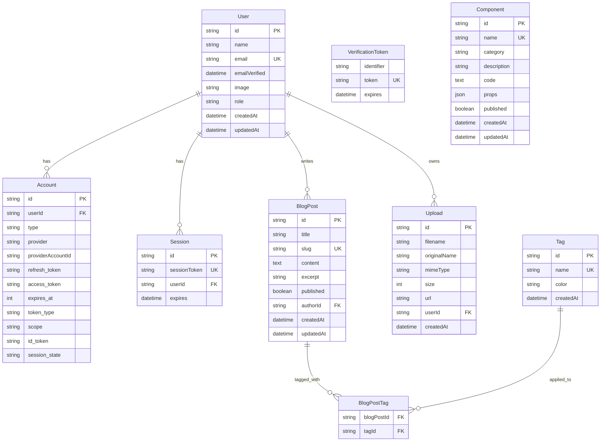

# Database Schema Reference

Complete reference for the Portfolio application's database schema built with Prisma and PostgreSQL.

## Overview

The database schema is designed to support a modern blog/portfolio application with user authentication, content management, and file uploads.

### Key Features
- **User Management**: Authentication with NextAuth.js
- **Blog System**: Posts, tags, and categories
- **Component Showcase**: Reusable UI components
- **File Management**: Upload tracking and storage
- **Role-Based Access**: User and admin roles

## Schema Diagram



## Models

### User

Represents application users with authentication and authorization.

```prisma
model User {
  id            String    @id @default(cuid())
  name          String?
  email         String    @unique
  emailVerified DateTime?
  image         String?
  role          String    @default("USER")
  accounts      Account[]
  sessions      Session[]
  blogPosts     BlogPost[]
  uploads       Upload[]
  createdAt     DateTime  @default(now())
  updatedAt     DateTime  @updatedAt
}
```

**Fields:**
- `id`: Unique identifier (CUID)
- `name`: Display name (optional)
- `email`: Email address (unique, required)
- `emailVerified`: Email verification timestamp
- `image`: Profile image URL
- `role`: User role (`USER` or `ADMIN`)
- `createdAt`: Account creation timestamp
- `updatedAt`: Last update timestamp

**Relationships:**
- One-to-many with `Account` (OAuth accounts)
- One-to-many with `Session` (active sessions)
- One-to-many with `BlogPost` (authored posts)
- One-to-many with `Upload` (uploaded files)

**Indexes:**
```sql
CREATE UNIQUE INDEX "User_email_key" ON "User"("email");
```

### Account

OAuth account information for NextAuth.js integration.

```prisma
model Account {
  id                String  @id @default(cuid())
  userId            String
  type              String
  provider          String
  providerAccountId String
  refresh_token     String? @db.Text
  access_token      String? @db.Text
  expires_at        Int?
  token_type        String?
  scope             String?
  id_token          String? @db.Text
  session_state     String?
  user              User    @relation(fields: [userId], references: [id], onDelete: Cascade)

  @@unique([provider, providerAccountId])
}
```

**Fields:**
- `id`: Unique identifier
- `userId`: Reference to User
- `type`: Account type (oauth, email, etc.)
- `provider`: OAuth provider (google, github, etc.)
- `providerAccountId`: Provider's user ID
- `refresh_token`: OAuth refresh token
- `access_token`: OAuth access token
- `expires_at`: Token expiration timestamp
- `token_type`: Token type (Bearer, etc.)
- `scope`: OAuth permissions scope
- `id_token`: OpenID Connect ID token
- `session_state`: OAuth session state

**Constraints:**
- Unique combination of provider and providerAccountId
- Cascade delete when user is deleted

### Session

User session information for NextAuth.js.

```prisma
model Session {
  id           String   @id @default(cuid())
  sessionToken String   @unique
  userId       String
  expires      DateTime
  user         User     @relation(fields: [userId], references: [id], onDelete: Cascade)
}
```

**Fields:**
- `id`: Unique identifier
- `sessionToken`: Unique session token
- `userId`: Reference to User
- `expires`: Session expiration time

**Indexes:**
```sql
CREATE UNIQUE INDEX "Session_sessionToken_key" ON "Session"("sessionToken");
```

### VerificationToken

Email verification tokens for NextAuth.js.

```prisma
model VerificationToken {
  identifier String
  token      String   @unique
  expires    DateTime

  @@unique([identifier, token])
}
```

**Fields:**
- `identifier`: Email or phone number
- `token`: Verification token
- `expires`: Token expiration time

**Constraints:**
- Unique combination of identifier and token

### BlogPost

Blog posts and articles.

```prisma
model BlogPost {
  id        String   @id @default(cuid())
  title     String
  slug      String   @unique
  content   String   @db.Text
  excerpt   String?
  published Boolean  @default(false)
  authorId  String
  author    User     @relation(fields: [authorId], references: [id], onDelete: Cascade)
  tags      BlogPostTag[]
  createdAt DateTime @default(now())
  updatedAt DateTime @updatedAt
  
  @@index([published, createdAt])
  @@index([authorId])
  @@index([slug])
}
```

**Fields:**
- `id`: Unique identifier
- `title`: Post title
- `slug`: URL-friendly identifier (unique)
- `content`: Full post content (text)
- `excerpt`: Optional post summary
- `published`: Publication status
- `authorId`: Reference to author (User)
- `createdAt`: Creation timestamp
- `updatedAt`: Last update timestamp

**Relationships:**
- Many-to-one with `User` (author)
- One-to-many with `BlogPostTag` (tags)

**Indexes:**
```sql
CREATE INDEX "BlogPost_published_createdAt_idx" ON "BlogPost"("published", "createdAt");
CREATE INDEX "BlogPost_authorId_idx" ON "BlogPost"("authorId");
CREATE UNIQUE INDEX "BlogPost_slug_key" ON "BlogPost"("slug");
```

### Tag

Content tags for categorization.

```prisma
model Tag {
  id        String   @id @default(cuid())
  name      String   @unique
  color     String?
  blogPosts BlogPostTag[]
  createdAt DateTime @default(now())
}
```

**Fields:**
- `id`: Unique identifier
- `name`: Tag name (unique)
- `color`: Optional hex color code
- `createdAt`: Creation timestamp

**Relationships:**
- One-to-many with `BlogPostTag` (tagged posts)

**Indexes:**
```sql
CREATE UNIQUE INDEX "Tag_name_key" ON "Tag"("name");
```

### BlogPostTag

Junction table for many-to-many relationship between BlogPost and Tag.

```prisma
model BlogPostTag {
  blogPostId String
  tagId      String
  blogPost   BlogPost @relation(fields: [blogPostId], references: [id], onDelete: Cascade)
  tag        Tag      @relation(fields: [tagId], references: [id], onDelete: Cascade)

  @@id([blogPostId, tagId])
}
```

**Fields:**
- `blogPostId`: Reference to BlogPost
- `tagId`: Reference to Tag

**Constraints:**
- Composite primary key on blogPostId and tagId
- Cascade delete when blog post or tag is deleted

### Upload

File upload tracking and metadata.

```prisma
model Upload {
  id           String   @id @default(cuid())
  filename     String
  originalName String
  mimeType     String
  size         Int
  url          String
  userId       String
  user         User     @relation(fields: [userId], references: [id], onDelete: Cascade)
  createdAt    DateTime @default(now())
  
  @@index([userId])
  @@index([createdAt])
  @@index([mimeType])
}
```

**Fields:**
- `id`: Unique identifier
- `filename`: Stored filename
- `originalName`: Original filename
- `mimeType`: File MIME type
- `size`: File size in bytes
- `url`: Public file URL
- `userId`: Reference to uploader (User)
- `createdAt`: Upload timestamp

**Relationships:**
- Many-to-one with `User` (uploader)

**Indexes:**
```sql
CREATE INDEX "Upload_userId_idx" ON "Upload"("userId");
CREATE INDEX "Upload_createdAt_idx" ON "Upload"("createdAt");
CREATE INDEX "Upload_mimeType_idx" ON "Upload"("mimeType");
```

### Component

UI component showcase and documentation.

```prisma
model Component {
  id          String   @id @default(cuid())
  name        String   @unique
  category    String
  description String?
  code        String   @db.Text
  props       Json?
  published   Boolean  @default(false)
  createdAt   DateTime @default(now())
  updatedAt   DateTime @updatedAt
  
  @@index([category, published])
  @@index([published])
}
```

**Fields:**
- `id`: Unique identifier
- `name`: Component name (unique)
- `category`: Component category
- `description`: Optional description
- `code`: Component source code
- `props`: JSON schema for component props
- `published`: Publication status
- `createdAt`: Creation timestamp
- `updatedAt`: Last update timestamp

**Indexes:**
```sql
CREATE INDEX "Component_category_published_idx" ON "Component"("category", "published");
CREATE INDEX "Component_published_idx" ON "Component"("published");
CREATE UNIQUE INDEX "Component_name_key" ON "Component"("name");
```

## Database Operations

### Common Queries

#### User Operations

```typescript
// Get user with posts
const userWithPosts = await db.user.findUnique({
  where: { id: userId },
  include: {
    blogPosts: {
      where: { published: true },
      orderBy: { createdAt: 'desc' },
      take: 10,
    },
    _count: {
      select: {
        blogPosts: { where: { published: true } },
        uploads: true,
      },
    },
  },
});

// Update user profile
const updatedUser = await db.user.update({
  where: { id: userId },
  data: {
    name: 'New Name',
    image: 'new-image-url',
  },
});
```

#### Blog Operations

```typescript
// Get published posts with tags
const publishedPosts = await db.blogPost.findMany({
  where: { published: true },
  include: {
    author: {
      select: { name: true, image: true },
    },
    tags: {
      include: { tag: true },
    },
  },
  orderBy: { createdAt: 'desc' },
  take: 10,
});

// Create post with tags
const newPost = await db.blogPost.create({
  data: {
    title: 'New Post',
    slug: 'new-post',
    content: 'Post content...',
    authorId: userId,
    tags: {
      create: tagIds.map(tagId => ({
        tag: { connect: { id: tagId } }
      })),
    },
  },
  include: {
    tags: { include: { tag: true } },
  },
});

// Get post by slug with author and tags
const post = await db.blogPost.findUnique({
  where: { slug: 'post-slug' },
  include: {
    author: true,
    tags: { include: { tag: true } },
  },
});
```

#### Upload Operations

```typescript
// Create upload record
const upload = await db.upload.create({
  data: {
    filename: 'stored-filename.jpg',
    originalName: 'original-name.jpg',
    mimeType: 'image/jpeg',
    size: 1024000,
    url: 'https://storage.googleapis.com/bucket/file.jpg',
    userId: userId,
  },
});

// Get user uploads
const userUploads = await db.upload.findMany({
  where: { userId },
  orderBy: { createdAt: 'desc' },
});

// Get uploads by type
const imageUploads = await db.upload.findMany({
  where: {
    mimeType: { startsWith: 'image/' },
  },
  orderBy: { createdAt: 'desc' },
});
```

#### Component Operations

```typescript
// Get published components by category
const components = await db.component.findMany({
  where: {
    category: 'buttons',
    published: true,
  },
  orderBy: { name: 'asc' },
});

// Create component
const component = await db.component.create({
  data: {
    name: 'PrimaryButton',
    category: 'buttons',
    description: 'Primary action button',
    code: 'export function PrimaryButton({ children }) { ... }',
    props: {
      children: { type: 'string', required: true },
      onClick: { type: 'function', required: false },
    },
    published: true,
  },
});
```

## Performance Considerations

### Indexing Strategy

```sql
-- Composite indexes for common query patterns
CREATE INDEX "BlogPost_published_createdAt_idx" ON "BlogPost"("published", "createdAt");
CREATE INDEX "Component_category_published_idx" ON "Component"("category", "published");

-- Single column indexes for foreign keys
CREATE INDEX "BlogPost_authorId_idx" ON "BlogPost"("authorId");
CREATE INDEX "Upload_userId_idx" ON "Upload"("userId");

-- Indexes for search and filtering
CREATE INDEX "Upload_mimeType_idx" ON "Upload"("mimeType");
CREATE INDEX "Upload_createdAt_idx" ON "Upload"("createdAt");
```

### Query Optimization

```typescript
// Use select to limit returned data
const posts = await db.blogPost.findMany({
  select: {
    id: true,
    title: true,
    slug: true,
    excerpt: true,
    createdAt: true,
    author: {
      select: { name: true, image: true },
    },
  },
  where: { published: true },
  orderBy: { createdAt: 'desc' },
});

// Use cursor-based pagination for better performance
const posts = await db.blogPost.findMany({
  take: 10,
  cursor: lastPostId ? { id: lastPostId } : undefined,
  skip: lastPostId ? 1 : 0,
  orderBy: { createdAt: 'desc' },
});

// Batch operations with transactions
await db.$transaction([
  db.blogPost.create({ data: postData }),
  db.upload.create({ data: uploadData }),
]);
```

## Data Types and Constraints

### Field Types

| Prisma Type | PostgreSQL Type | Description |
|-------------|-----------------|-------------|
| `String` | `TEXT` | Variable length text |
| `String @db.Text` | `TEXT` | Explicit text type for large content |
| `Int` | `INTEGER` | 32-bit integer |
| `Boolean` | `BOOLEAN` | True/false value |
| `DateTime` | `TIMESTAMP(3)` | Timestamp with milliseconds |
| `Json` | `JSONB` | JSON binary format |

### Constraints and Validation

```prisma
model BlogPost {
  // String length constraints
  title String @db.VarChar(200)
  
  // Unique constraints
  slug String @unique
  
  // Default values
  published Boolean @default(false)
  createdAt DateTime @default(now())
  
  // Foreign key constraints with cascade
  author User @relation(fields: [authorId], references: [id], onDelete: Cascade)
}
```

## Migrations

### Migration Commands

```bash
# Generate migration
pnpm prisma migrate dev --name add_component_table

# Apply migrations
pnpm prisma migrate deploy

# Reset database (development only)
pnpm prisma migrate reset

# Push schema changes without migration
pnpm prisma db push
```

### Example Migration

```sql
-- CreateTable
CREATE TABLE "Component" (
    "id" TEXT NOT NULL,
    "name" TEXT NOT NULL,
    "category" TEXT NOT NULL,
    "description" TEXT,
    "code" TEXT NOT NULL,
    "props" JSONB,
    "published" BOOLEAN NOT NULL DEFAULT false,
    "createdAt" TIMESTAMP(3) NOT NULL DEFAULT CURRENT_TIMESTAMP,
    "updatedAt" TIMESTAMP(3) NOT NULL,

    CONSTRAINT "Component_pkey" PRIMARY KEY ("id")
);

-- CreateIndex
CREATE UNIQUE INDEX "Component_name_key" ON "Component"("name");

-- CreateIndex
CREATE INDEX "Component_category_published_idx" ON "Component"("category", "published");
```

## Backup and Recovery

### Database Backup

```bash
# Create backup
pg_dump $DATABASE_URL > backup-$(date +%Y%m%d_%H%M%S).sql

# Restore from backup
psql $DATABASE_URL < backup-20231201_120000.sql

# Backup specific tables
pg_dump $DATABASE_URL -t users -t blog_posts > user_content_backup.sql
```

### Data Export

```typescript
// Export user data
const userData = await db.user.findUnique({
  where: { id: userId },
  include: {
    blogPosts: true,
    uploads: true,
  },
});

// Export blog data
const blogData = await db.blogPost.findMany({
  include: {
    author: true,
    tags: { include: { tag: true } },
  },
});
```

## Monitoring and Analytics

### Query Performance

```typescript
// Enable query logging
const db = new PrismaClient({
  log: [
    {
      emit: 'event',
      level: 'query',
    },
  ],
});

db.$on('query', (e) => {
  console.log('Query: ' + e.query);
  console.log('Duration: ' + e.duration + 'ms');
});
```

### Database Statistics

```sql
-- Table sizes
SELECT 
  schemaname,
  tablename,
  attname,
  n_distinct,
  correlation
FROM pg_stats
WHERE schemaname = 'public';

-- Index usage
SELECT 
  indexrelname,
  idx_tup_read,
  idx_tup_fetch
FROM pg_stat_user_indexes;
```

For detailed database operations and examples, see the [Database Development Guide](../development/database.md).