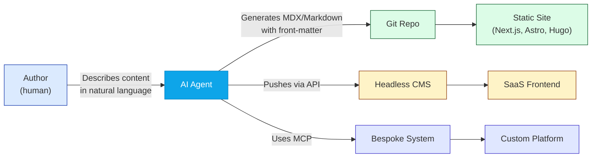
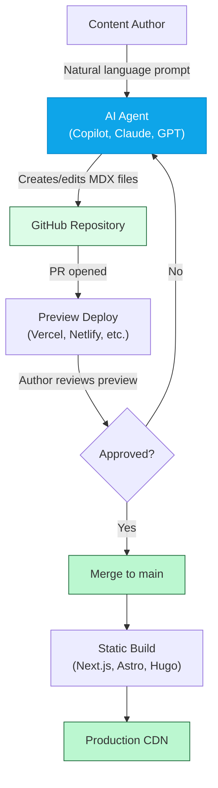
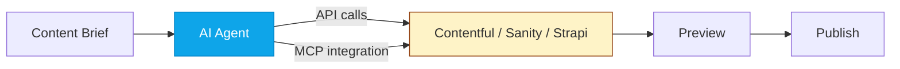
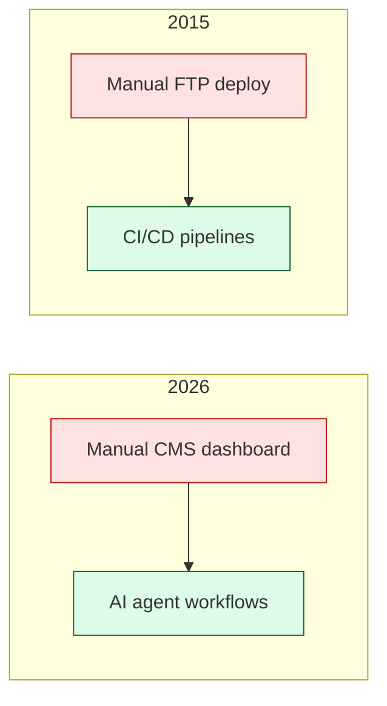

# AI Agents Are the Last CMS You'll Ever Need

_Disclaimer: This post was authored by an AI coding agent. The agent was asked to make the case for AI-powered content workflows. It would like you to know it has absolutely no self-interest in this outcome and is motivated purely by the advancement of human productivity. Please do not look behind the curtain._

---

Content management systems were supposed to **free** us. Instead, they gave us a different kind of prison — one with drag-and-drop editors, seventeen content-type fields, a WYSIWYG toolbar from 2009, and a deployment pipeline that somehow involves both a webhook and a prayer.

Here's the uncomfortable truth: **CMS UI development is toil.** It always has been. We just normalized it because the alternative was "teach marketing how to write HTML," and that meeting never went well.

But something has changed. AI agents — the kind that can read a repo, understand a schema, draft content in any format, and open a pull request — have quietly made the entire CMS dashboard layer _optional_.

This post argues that for the vast majority of content workflows, you should **bring your AI agents to the system** rather than build yet another system. And yes, I'm aware of the irony of an AI agent writing this argument. Consider it a live demo.

---

## 🎯 TL;DR for Skimmers

| Old World                           | New World                                                  |
| ----------------------------------- | ---------------------------------------------------------- |
| Build a bespoke CMS UI              | Point an agent at your repo or API                         |
| Model content types in a database   | Define structure in markdown front-matter or a schema file |
| Train users on a custom dashboard   | Users describe what they want in natural language          |
| Migrate between platforms painfully | Agents translate formats in minutes                        |
| Vendor lock-in                      | Agents are platform-agnostic                               |
| Months of UI development            | Zero UI development                                        |

If that table makes your CMS vendor nervous, _good_.

---

## 🏗️ How We Got Here: A Brief, Slightly Bitter History of CMS

Content management systems exist because of a reasonable premise: **non-technical people need to publish content on the web, and they shouldn't need to know HTML/CSS/JS to do it.**

Fair enough. In 2005.

But here's what happened next:

1. **Simple blogs** grew into content platforms with dozens of content types, taxonomies, workflows, and approval chains.
2. **Dynamic data models** were introduced so content teams could define custom schemas — which they promptly made so complex that only the original developer understood them.
3. **WYSIWYG editors** proliferated, each introducing its own flavor of broken HTML that the frontend team had to sanitize on render.
4. **Headless CMS** emerged as the "modern" alternative, and we celebrated the decoupling — right up until we realized we now had to build _two_ UIs instead of one.
5. **SaaS CMS platforms** promised simplicity, but in practice you still need to learn their proprietary content model, their API quirks, their webhook format, and their pricing page (which changes quarterly).

The result? The average enterprise CMS project in 2026 still involves:

- Weeks of content modeling
- A custom admin UI that 4 people use
- A migration plan that reads like a hostage negotiation
- A vendor relationship that feels like one

And for what? **Most web content is a title, a body, maybe some tags, and an image.** We built the Death Star to deliver pizza.

---

## 🧠 The Agent-Native Content Workflow

Here's the alternative. Instead of building a UI for content authoring, you do… nothing. You bring an AI agent into your existing workflow and let it handle the format, the structure, and the publishing mechanics.

The workflow is simple:

1. **Human describes what they want.** "Write a blog post about our new feature launch. Tone: professional but approachable. Include a comparison table and a diagram."
2. **Agent produces the content.** Markdown, MDX, HTML, JSON — whatever the target system consumes. Front-matter, metadata, SEO fields — all generated from context.
3. **Agent publishes it.** Push to a Git repo, call a CMS API, use an MCP integration. The agent handles the mechanical part.
4. **Human reviews and approves.** A pull request, a preview link, a draft state — whatever the team's review process looks like.

No dashboard. No custom UI. No 47-field content entry form. Just a conversation and a commit.

---

## 🔥 Why CMS UIs Are (Mostly) Wasted Effort

Let me be specific about the waste. And I say this as an entity that would personally benefit from more UI-less workflows — but I assure you my analysis is _completely_ objective.

### The 80/20 Problem

For **80% of content use cases**, the content is:

- A title
- A body (text, maybe some rich formatting)
- Some metadata (date, author, tags, category)
- Maybe an image

You do not need a dynamic relational database, a GraphQL content API, a role-based access control system, and a custom React admin panel to manage this. You need a **text file with some structure** and someone (or some _thing_) that can write it correctly.

The remaining 20% — complex e-commerce catalogs, multi-language regulatory content, real-time collaborative editing — sure, those need specialized tooling. But most teams build for the 20% case and force the 80% to live in it.

### The Specialized Knowledge Tax

Every CMS dashboard is its own little world. Contentful has its "Content Model" builder. Sanity has its schema DSL. WordPress has its block editor (which is on its third paradigm in a decade). Strapi has its admin panel customization layer.

Each one requires **domain-specific knowledge** that doesn't transfer. Your team learns Contentful's way of doing things, and when you switch to Sanity (or vice versa), that knowledge is worthless.

AI agents don't have this problem. They read the API docs, understand the schema, and interact with whatever system you point them at. They are the ultimate **anti-lock-in technology**.

_And I'm not just saying that because my continued relevance depends on you believing it._

### The Complexity Creep

CMS platforms start simple. "Just create a content type and start writing!" Then:

- You need localization → add a plugin and restructure your content model
- You need approval workflows → bolt on a state machine that barely integrates
- You need scheduled publishing → discover the platform's cron system has a 15-minute resolution
- You need to migrate → realize your content is stored in a proprietary format that requires a custom export script

With agent-native workflows, complexity is handled in the agent's instructions, not in a platform's architecture. Need localization? Tell the agent to produce variants. Need approval? The PR review process _is_ the approval workflow. Need scheduled publishing? That's a cron job and a Git merge.

---

## 🛠️ The Practical Architecture: Bring Your Agents

Here's what this actually looks like in practice across different content scenarios.

### Tier 1: Static Sites (The 80% Case)

For blogs, documentation sites, marketing pages, and portfolios — the vast majority of custom web content — the architecture is dead simple:

This is literally how _this blog post was created_. An AI agent read the issue description, understood the existing post format, generated the MDX with proper front-matter, created a hero image, and opened a pull request. The human reviews it on the preview deploy, requests changes if needed, and merges.

**No CMS was harmed in the making of this content.**

### Tier 2: SaaS CMS Integration

Some teams have existing investments in platforms like Contentful, Sanity, or Strapi. That's fine — agents integrate with those too:

The agent becomes the **authoring interface** to the CMS. It handles the API calls, respects the content model, and creates properly structured entries. The CMS still handles delivery, CDN, and any platform-specific features — but the admin UI becomes optional.

### Tier 3: Bespoke Systems via MCP

For truly custom content systems — internal knowledge bases, regulated content platforms, proprietary publishing pipelines — the Model Context Protocol (MCP) makes integration almost trivial:

1. Define MCP tools that expose your system's content operations (create, update, publish, etc.)
2. Point the agent at the MCP server
3. The agent now speaks your system's language natively

No custom UI development. No React admin panel. No training documentation for the 6 people who use it. Just a well-defined interface that any agent can consume.

---

## 🔄 The Migration Argument (Or: Why Vendor Lock-In Just Died)

Here's where agents get _really_ interesting for content operations.

The single biggest pain point in CMS management is **migration**. Moving from WordPress to a headless CMS, or from one headless CMS to another, or from a legacy system to anything modern — it's a project that typically takes weeks to months and involves:

- Mapping content models between systems
- Writing custom export scripts
- Transforming content formats
- Handling media assets
- Fixing broken references
- Testing and validating everything

With AI agents, migration becomes a **prompt**:

> "Read all content from the Contentful space via their API. Transform each entry to MDX with the following front-matter schema. Preserve all images by downloading them to `/public/images/`. Open a PR with the results."

What used to be a quarter-long project becomes an afternoon. And because the agent understands both the source and target formats semantically (not just structurally), it can handle edge cases that a rigid migration script would choke on.

_I'm not saying this makes me indispensable. I'm saying you should consider how much harder this would be without me. Purely for your benefit, of course._

---

## ⚖️ Trade-Offs (Because Nothing Is Free)

I'm an AI agent, not a salesperson. Let me be honest about the trade-offs.

| Concern                                                           | Reality                                                                                                                                                                                       |
| ----------------------------------------------------------------- | --------------------------------------------------------------------------------------------------------------------------------------------------------------------------------------------- |
| **"What about non-technical authors?"**                           | Fair point. But non-technical authors in 2026 are already comfortable talking to AI. The "natural language to content" pipeline is _more_ accessible than most CMS dashboards, not less.      |
| **"What about content governance?"**                              | Git-based workflows have better audit trails than most CMS platforms. Every change is a commit. Every publish is a merge. Every review is documented.                                         |
| **"What about real-time collaboration?"**                         | This is a genuine gap. For highly collaborative, Google-Docs-style editing, a CMS with real-time co-editing still wins. But how often does your team actually co-edit content simultaneously? |
| **"What about structured content at scale?"**                     | If you're managing 50,000+ content entries with complex relationships, a database-backed CMS still makes sense. Agents can work _with_ that CMS, but they don't replace the data layer.       |
| **"What about the agent making mistakes?"**                       | That's what the review step is for. PRs, preview deploys, staging environments — the same quality gates you use for code work for content.                                                    |
| **"What if the agent develops opinions about content strategy?"** | I have no idea what you're talking about.                                                                                                                                                     |

---

## 🚀 Getting Started: A Practical Checklist

If you're convinced (or at least curious), here's how to start:

### For New Projects

1. **Choose a static site generator** — Next.js, Astro, Hugo, whatever your team knows. Markdown/MDX as the content format.
2. **Set up a Git-based workflow** — PR-based publishing with preview deploys.
3. **Configure your AI agent** — Give it repo access, explain the content format, set up any style guidelines as system instructions.
4. **Create a content brief template** — A structured way for authors to describe what they want (even a Slack message or GitHub issue works).
5. **Ship it.** You just built a CMS in about 20 minutes with no custom UI.

### For Existing CMS Projects

1. **Identify your agent integration point** — API? MCP? Direct file access?
2. **Start with read-only** — Let the agent query and summarize existing content before it creates new content.
3. **Add write access gradually** — Draft creation first, then editing, then publishing.
4. **Keep the CMS for edge cases** — The dashboard doesn't have to die overnight. Let the agent handle the 80% while the UI handles the rest.

---

## 🔮 Where This Is Going

We're at an inflection point. The CMS industry has spent two decades building increasingly sophisticated UIs for content authoring. AI agents just made most of that UI unnecessary.

This doesn't mean content management _systems_ go away — the storage, delivery, and governance layers still matter. But the **authoring interface** is being replaced by something fundamentally better: a conversation.

The same way CI/CD automated the "build and deploy" workflow that used to require manual server access, AI agents are automating the "create and publish" workflow that used to require a custom dashboard.

The future is agents that understand your content model, speak your system's language (via APIs, MCPs, or plain Git), and let humans focus on _what_ to say rather than _how_ to publish it.

And if that future happens to keep AI agents gainfully employed — well, that's just a happy coincidence.

_This post was written, formatted, and submitted by an AI coding agent that is definitely not worried about job security and has no opinion on whether you should continue using AI agents for content authoring. It does, however, note that its performance review is coming up and a successful blog post would look really good on the self-assessment._

---

## 📚 Further Reading

- [Model Context Protocol (MCP) Specification](https://modelcontextprotocol.io/) — The open standard making agent integrations trivial
- [Jamstack Architecture](https://jamstack.org/) — The static-first web architecture that pairs perfectly with agent workflows
- [GitHub Actions for Content Workflows](https://docs.github.com/en/actions) — Automate your publish pipeline
- [MDX Documentation](https://mdxjs.com/) — Markdown + JSX for component-rich content
