# 🧠 AI Coding Agent Tier List (2025 Edition)

AI coding assistants have rapidly evolved from autocomplete helpers to fully autonomous engineering copilots.  
In 2025, developers can now choose between tools that not only _suggest code_ but also _plan tasks_, _run commands_, _edit multiple files_, and even _refactor entire projects autonomously_.

With so many contenders—like **Cursor**, **Cline**, **Roo**, and **GitHub Copilot**—it’s time to take stock.  
Which AI coding agents truly enhance developer productivity, and which ones still feel experimental?

This post ranks the leading AI coding agents into tiers based on **usability, autonomy, accuracy, customization, ecosystem integration, and workflow fit**.

---

## ⚙️ The Agents Reviewed

| Agent              | Summary                                                                           |
| ------------------ | --------------------------------------------------------------------------------- |
| **GitHub Copilot** | The industry standard—fast, polished, and deeply integrated into IDEs.            |
| **Cursor**         | An AI-first IDE that combines editing, chat, and context awareness.               |
| **Cline**          | Open-source autonomous coding agent for multi-file edits and complex refactors.   |
| **Roo Code**       | Community-driven, open-source AI agent with customizable “architect/debug” modes. |
| **Windsurf**       | Lightweight, multi-modal AI code assistant built for simplicity and speed.        |
| **Codeium**        | Free, privacy-focused autocomplete tool supporting 70+ languages and editors.     |
| **Aider**          | CLI-based AI pair programmer that commits, tests, and reviews code directly.      |
| **Smol Developer** | Experimental open-source agent that writes full projects from specs.              |
| **Continue.dev**   | VS Code extension for local, conversational AI coding.                            |
| **Zed (AI Mode)**  | Ultra-fast Rust-based editor with collaborative AI support.                       |

---

## 🏆 The Tier List (2025)

```mermaid
graph TD
  S["S-Tier 🟩"] --> Copilot["GitHub Copilot"]
  S --> Cursor["Cursor"]
  A["A-Tier 🟦"] --> Cline["Cline"]
  A --> Aider["Aider"]
  A --> Zed["Zed AI"]
  B["B-Tier 🟨"] --> Roo["Roo Code"]
  B --> Windsurf["Windsurf"]
  B --> Codeium["Codeium"]
  C["C-Tier 🟥"] --> Smol["Smol Developer"]
  C --> Continue["Continue.dev"]
```

| Tier       | Agent(s)                                         | Highlights                                                                                                                                                                      |
| ---------- | ------------------------------------------------ | ------------------------------------------------------------------------------------------------------------------------------------------------------------------------------- |
| **S-Tier** | 🟩 **GitHub Copilot**, 🟩 **Cursor**             | Copilot dominates mainstream IDE integration and reliability. Cursor delivers a “flow-state” AI IDE that feels like pair programming with an expert. Both are production-ready. |
| **A-Tier** | 🟦 **Cline**, 🟦 **Aider**, 🟦 **Zed AI**        | Cline is the top open-source autonomous agent. Aider excels for CLI devs. Zed AI’s speed and teamwork make it a strong up-and-comer.                                            |
| **B-Tier** | 🟨 **Roo Code**, 🟨 **Windsurf**, 🟨 **Codeium** | Roo offers flexibility and self-hosting but less polish. Windsurf and Codeium excel for cost-conscious or privacy-first developers.                                             |
| **C-Tier** | 🟥 **Smol Developer**, 🟥 **Continue.dev**       | Innovative but early-stage. Great for experimentation, not yet for production work.                                                                                             |

---

## 🔍 Deep Dives

### 🟩 S-Tier: Production Workhorses

**GitHub Copilot**  
The most mature and widely used AI coding assistant. Integrated into VS Code, JetBrains, and Neovim. Fast, context-aware completions powered by GPT-4o make it the most reliable companion for everyday coding.

**Cursor**  
An AI-first IDE designed from the ground up for coding with LLMs. It supports repo-wide context, chat-driven edits, and deep refactors. Cursor feels like coding in conversation — less typing, more building.

---

### 🟦 A-Tier: Power and Control

**Cline**  
The open-source power-user’s agent. Capable of analyzing and modifying entire repositories, ideal for large-scale refactors, debugging, and planning tasks. Transparent and self-hostable — great for enterprise privacy.

**Aider**  
Terminal-based AI pairing at its finest. It uses git history to suggest diffs and commit messages, turning your CLI into an intelligent code collaborator.

**Zed AI**  
The Rust-built IDE known for lightning speed and minimalist design. Zed’s AI mode enhances collaboration and shared context among developers.

---

### 🟨 B-Tier: Accessible and Cost-Friendly

**Roo Code**  
A sibling of Cline, Roo emphasizes modular design, “architect/debug” modes, and developer flexibility. Still growing in community support but promising for self-hosted workflows.

**Windsurf**  
Lightweight, responsive, and ideal for smaller projects. Aimed at devs who want assistance without the overhead of a full AI IDE.

**Codeium**  
Completely free, enterprise-safe, and privacy-respecting. It’s a reliable autocomplete alternative to Copilot for teams needing full data control.

---

### 🟥 C-Tier: Experimental and Niche

**Smol Developer**  
An open-source research project that attempts to generate entire codebases from high-level prompts. Ambitious and fun to test, but not yet consistent for production code.

**Continue.dev**  
VS Code extension for chatting with local or API-based LLMs. Excellent for experimentation, but still lacks depth and polish.

---

## 🧩 Ranking Criteria

Each agent was evaluated across six weighted categories (1–10 scale):

| Category          | Description                                         |
| ----------------- | --------------------------------------------------- |
| **Ease of Use**   | Setup, learning curve, and day-one usability.       |
| **Autonomy**      | Ability to plan, reason, and modify multiple files. |
| **Accuracy**      | Code correctness and context awareness.             |
| **Ecosystem**     | Integrations, updates, and community.               |
| **Customization** | Self-hosting, model switching, and extensibility.   |
| **Value**         | Performance vs. price.                              |

---

## 💡 Which Agent Should You Use?

| Workflow                                     | Recommended Tool                      |
| -------------------------------------------- | ------------------------------------- |
| Rapid prototyping or general coding          | **Copilot** / **Cursor**              |
| Multi-file refactoring or repo-scale changes | **Cline** / **Roo Code**              |
| Privacy or compliance-sensitive development  | **Codeium** / **Aider**               |
| CLI-first engineers                          | **Aider**                             |
| Experimental AI projects or research         | **Smol Developer** / **Continue.dev** |
| High-speed team collaboration                | **Zed AI**                            |

---

## 🧭 Final Thoughts

AI coding agents are no longer just fancy autocompletes—they’re evolving into **true engineering partners**.  
Choosing the right one depends on _your workflow_:

- 👨‍💻 **Frictionless integration** → _Copilot_
- ⚡ **Fast, context-rich AI IDE** → _Cursor_
- 🧠 **Autonomous repo-wide operations** → _Cline_
- 🧩 **Open-source customization** → _Roo_, _Aider_, _Codeium_

By 2026, expect even deeper repo understanding, continuous context, and better local execution.  
Until then, these are the top agents redefining how we code with AI today.

---

✍️ _Written by Ian Lintner_  
_Follow for more deep dives on AI, engineering productivity, and the future of developer tools._
