# 🧠 AI Coding Agent Tier List (2025 Edition)

Things are moving fast. Back when I started writing code 20 years ago, having a decent autocomplete was a luxury. Now? We've got AI agents that can plan tasks, run commands, and refactor entire projects while I sip my coffee.

In 2025, developers have a smorgasbord of choices. You've got **Cursor**, **Cline**, **Roo**, **GitHub Copilot**... it's enough to make your head spin.

So, putting on my "old man of the industry" hat (I'm 44, that counts in tech, right?), let's break this down. Which of these tools are actually useful for a seasoned pro, and which ones are just flashy demos?

This post ranks the leading AI coding agents based on **usability, autonomy, accuracy**, and whether they actually fit into a real engineer's workflow.

---

## ⚙️ The Agents Reviewed

| Agent              | Summary                                                                           |
| ------------------ | --------------------------------------------------------------------------------- |
| **GitHub Copilot** | The industry standard—fast, polished, and deeply integrated. Like a good winter coat. |
| **Cursor**         | An AI-first IDE. It's like pair programming with a really smart senior engineer.  |
| **Cline**          | Open-source autonomous agent. For when you want to tinker under the hood.         |
| **Roo Code**       | Community-driven, open-source. A bit like a potluck—lots of variety, mostly good. |
| **Windsurf**       | Lightweight, multi-modal. Simple, gets the job done.                              |
| **Codeium**        | Free, privacy-focused. Solid, reliable, no-nonsense.                              |
| **Aider**          | CLI-based. For those of us who still live in the terminal.                        |
| **Smol Developer** | Experimental. Fun to watch, maybe not for production yet.                         |
| **Continue.dev**   | VS Code extension. Local, conversational, keeps your data close.                  |
| **Zed (AI Mode)**  | Rust-based. Fast as heck, collaborative.                                          |

---

## 🏆 The Tier List (2025)

```mermaid
graph TD
  subgraph "The Cream of the Crop"
    S["S-Tier 🟩"] --> Copilot["GitHub Copilot"]
    S --> Cursor["Cursor"]
  end
  subgraph "Solid Performers"
    A["A-Tier 🟦"] --> Cline["Cline"]
    A --> Aider["Aider"]
    A --> Zed["Zed AI"]
  end
  subgraph "Good, But..."
    B["B-Tier 🟨"] --> Roo["Roo Code"]
    B --> Windsurf["Windsurf"]
    B --> Codeium["Codeium"]
  end
  subgraph "Experimental / Niche"
    C["C-Tier 🟥"] --> Smol["Smol Developer"]
    C --> Continue["Continue.dev"]
  end
  
  style S fill:#dcfce7,stroke:#166534,stroke-width:2px
  style A fill:#dbeafe,stroke:#1e40af,stroke-width:2px
  style B fill:#fef9c3,stroke:#854d0e,stroke-width:2px
  style C fill:#fee2e2,stroke:#991b1b,stroke-width:2px
```

| Tier       | Agent(s)                                         | Highlights                                                                                                                                                                      |
| ---------- | ------------------------------------------------ | ------------------------------------------------------------------------------------------------------------------------------------------------------------------------------- |
| **S-Tier** | 🟩 **GitHub Copilot**, 🟩 **Cursor**             | Copilot is the reliable sedan of AI—gets you there every time. Cursor is the fancy new electric truck—does everything and looks good doing it. Both are ready for real work.    |
| **A-Tier** | 🟦 **Cline**, 🟦 **Aider**, 🟦 **Zed AI**        | Cline is great if you like to tinker. Aider is perfect for the terminal die-hards (I see you). Zed is fast, really fast.                                                        |
| **B-Tier** | 🟨 **Roo Code**, 🟨 **Windsurf**, 🟨 **Codeium** | Roo is flexible but needs some polish. Windsurf and Codeium are great if you're watching the budget or really care about privacy.                                               |
| **C-Tier** | 🟥 **Smol Developer**, 🟥 **Continue.dev**       | Interesting ideas, but maybe keep these for your side projects for now.                                                                                                         |

---

## 🔍 Deep Dives

### 🟩 S-Tier: Production Workhorses

**GitHub Copilot**  
Look, I've been using this since it was in beta. It's the standard for a reason. It's integrated into everything—VS Code, JetBrains, Neovim. It's fast, it's reliable, and with GPT-4o, it's getting smarter. It's the tool I tell my team to use because it just works.

**Cursor**  
This one surprised me. It's an AI-first IDE, which sounded gimmicky at first. But after using it, it feels like the future. It has repo-wide context that actually works. It feels less like typing code and more like guiding a junior engineer who types really fast.

---

### 🟦 A-Tier: Power and Control

**Cline**  
If you're the type of engineer who likes to take apart their toaster to see how it works, you'll like Cline. It's open-source, autonomous, and powerful. Great for big refactors where you want to let the AI loose, but you better watch it closely.

**Aider**  
For the 20-year vets who still live in the terminal (you know who you are), Aider is fantastic. It uses git history to make smart suggestions. It feels like magic when it writes the commit message for you.

**Zed AI**  
Rust. Fast. Minimalist. If VS Code feels bloated to you, check out Zed. The AI features are focused on collaboration, which is a nice touch for team leads.

---

### 🟨 B-Tier: Accessible and Cost-Friendly

**Roo Code**  
A fork of Cline (I think?), it's got some cool "architect/debug" modes. It's a bit rough around the edges, but the community spirit is there. Reminds me of the early Linux days.

**Windsurf**  
Lightweight and simple. Good for quick edits or smaller projects. It doesn't try to do everything, which I respect.

**Codeium**  
Free and privacy-focused. If your company is strict about data leaving the building, this is a solid alternative to Copilot.

---

### 🧠 The "Old Guy" Take

Here's the thing: tools change. Languages change. I remember when Java was the "new hotness." But the fundamentals of engineering—solving problems, managing complexity, understanding the user—those don't change.

These AI agents are force multipliers. They let us move faster. But they don't replace the need for a human in the loop who knows *why* we're building what we're building.

So pick the tool that fits your flow. Don't get too hung up on the tier list. The best tool is the one that helps you ship value and get home in time for dinner.

You betcha.

---

### 🟥 C-Tier: Experimental and Niche

**Smol Developer**  
An open-source research project that attempts to generate entire codebases from high-level prompts. Ambitious and fun to test, but not yet consistent for production code.

**Continue.dev**  
VS Code extension for chatting with local or API-based LLMs. Excellent for experimentation, but still lacks depth and polish.

---

## 🧩 Ranking Criteria

Each agent was evaluated across six weighted categories (1–10 scale):

| Category          | Description                                         |
| ----------------- | --------------------------------------------------- |
| **Ease of Use**   | Setup, learning curve, and day-one usability.       |
| **Autonomy**      | Ability to plan, reason, and modify multiple files. |
| **Accuracy**      | Code correctness and context awareness.             |
| **Ecosystem**     | Integrations, updates, and community.               |
| **Customization** | Self-hosting, model switching, and extensibility.   |
| **Value**         | Performance vs. price.                              |

---

## 💡 Which Agent Should You Use?

| Workflow                                     | Recommended Tool                      |
| -------------------------------------------- | ------------------------------------- |
| Rapid prototyping or general coding          | **Copilot** / **Cursor**              |
| Multi-file refactoring or repo-scale changes | **Cline** / **Roo Code**              |
| Privacy or compliance-sensitive development  | **Codeium** / **Aider**               |
| CLI-first engineers                          | **Aider**                             |
| Experimental AI projects or research         | **Smol Developer** / **Continue.dev** |
| High-speed team collaboration                | **Zed AI**                            |

---

## 🧭 Final Thoughts

AI coding agents are no longer just fancy autocompletes—they’re evolving into **true engineering partners**.  
Choosing the right one depends on _your workflow_:

- 👨‍💻 **Frictionless integration** → _Copilot_
- ⚡ **Fast, context-rich AI IDE** → _Cursor_
- 🧠 **Autonomous repo-wide operations** → _Cline_
- 🧩 **Open-source customization** → _Roo_, _Aider_, _Codeium_

By 2026, expect even deeper repo understanding, continuous context, and better local execution.  
Until then, these are the top agents redefining how we code with AI today.

---

✍️ _Written by Ian Lintner_  
_Follow for more deep dives on AI, engineering productivity, and the future of developer tools._
