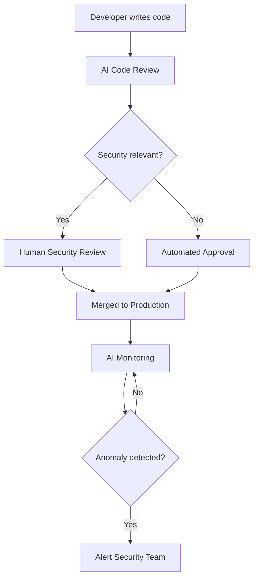

# AI-Driven Authentication: Best Practices Every Time

Authentication is the front door of every web application. Get it wrong, and you've handed the keys to attackers. Get it right, and you've built a foundation of trust with your users.

But here's the challenge: even experienced engineers can accidentally skip a step. Password hashing, secure session management, CSRF protection, OAuth flows—each comes with dozens of edge cases and potential pitfalls.

**What if AI could ensure best practices are implemented every time?**

---

## The Authentication Showcase

To demonstrate this concept, the [Authentication Showcase](https://auth-demo.cat-herding.net/) implements all major authentication methods used by modern web applications:

- **Email/Password Authentication** with proper hashing and session management
- **OAuth 2.0 / OpenID Connect** integration
- **Magic Link / Passwordless** authentication
- **Multi-Factor Authentication (MFA)**
- **Session Management** with secure token handling

Check out the [repository on GitHub](https://github.com/ianlintner/authentication-showc) to see the implementation.

---

## Why AI for Authentication?

Engineers often work under pressure. Deadlines loom, features pile up, and security can become an afterthought—not out of negligence, but out of repetition fatigue. The 100th time you implement password hashing, you might forget to configure the work factor. The 50th OAuth integration might miss a state parameter check.

AI coding agents change this dynamic in three key ways:

### 1. Build with Best Practices by Default

AI agents like GitHub Copilot, Cline, or Claude can generate authentication code that follows current security standards. They don't get tired. They don't skip steps because they've "done this before."

When you prompt an AI to implement password authentication, it will:

- Use industry-standard hashing algorithms (bcrypt, argon2)
- Configure appropriate work factors
- Implement timing-safe comparison functions
- Set secure cookie attributes (HttpOnly, Secure, SameSite)

**The baseline is always secure.**

### 2. Validate with Security-First Reviews

AI doesn't just generate code—it can review it too. Security-focused code review becomes a continuous process:

- **Pre-commit checks**: AI validates that new authentication code follows organizational standards
- **Pull request reviews**: AI identifies missing CSRF tokens, insecure session handling, or weak password policies
- **Continuous monitoring**: AI scans for configuration drift and newly discovered vulnerabilities

Human security engineers remain in the loop, but their focus shifts from catching every mistake to reviewing the decisions that matter most.

### 3. Monitor and Alert in Production

The security lifecycle doesn't end at deployment. AI-powered observability tools can:

- Detect anomalous authentication patterns
- Alert on brute force attempts or credential stuffing
- Identify session hijacking or token misuse
- Recommend mitigations based on real-time analysis

---

## Paved Paths for Teams

The ultimate goal is **efficient applications with standard paved-path best practices**.

Organizations spend enormous resources on security and platform teams to onboard new applications correctly. Every new project requires:

- Security architecture reviews
- AuthN/AuthZ pattern approval
- Compliance validation
- Ongoing maintenance

With AI-assisted development, teams can:

1. **Reduce onboarding friction**: New applications start with correct authentication patterns built-in
2. **Scale security expertise**: AI extends the reach of security engineers across all teams
3. **Maintain consistency**: Every project follows the same validated patterns
4. **Accelerate development**: Engineers focus on features while AI handles security foundations

---

## The Human-AI Partnership

This isn't about replacing security engineers—it's about amplifying them.

In this model:

- **AI handles the repetitive**: Ensuring every password is hashed correctly, every session is secured
- **Humans handle the strategic**: Threat modeling, architecture decisions, incident response
- **Both collaborate on the nuanced**: Complex authorization logic, unusual edge cases

---

## Getting Started

Ready to explore AI-driven authentication best practices?

1. **Check out the demo**: [auth-demo.cat-herding.net](https://auth-demo.cat-herding.net/)
2. **Review the code**: [github.com/ianlintner/authentication-showc](https://github.com/ianlintner/authentication-showc)
3. **Try it yourself**: Use AI coding agents to implement authentication in your next project

The future of secure development isn't about choosing between AI and human expertise—it's about combining them to build applications that are secure by default, validated continuously, and monitored in production.

---

## Conclusion

Authentication is too important to leave to chance. By leveraging AI to:

- **Build** with best practices from day one
- **Validate** with automated security reviews
- **Monitor** with intelligent observability

We can create a world where secure authentication isn't a burden—it's a given.

The Authentication Showcase demonstrates these principles in action. Whether you're building a new application or modernizing an existing one, the patterns and practices shown here provide a foundation for secure, AI-augmented development.

---

✍️ _Written by Ian Lintner_  
_Follow for more insights on AI-driven development, platform architecture, and building secure systems at scale._
