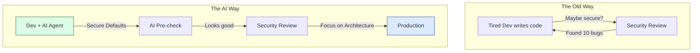
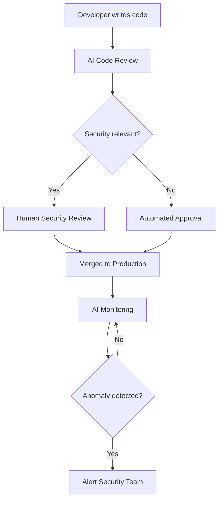

# AI-Driven Authentication: Best Practices Every Time

Authentication is like the deadbolt on your front door. If it's cheap, it doesn't matter how nice the house is.

I've seen too many engineers try to roll their own auth, and let me tell you, it usually ends in tears (and a pager going off at 3 AM). Even the best of us can slip up. You miss one config on a password hash or forget a state parameter in OAuth, and suddenly you're having a very bad week.

**What if AI could ensure we don't mess this up?**

---

## The Authentication Showcase

To show I'm not just blowing smoke, I built the [Authentication Showcase](https://auth-demo.cat-herding.net/). It implements all the major auth methods we use today:

- **Email/Password** (done right, with hashing that actually works)
- **OAuth 2.0 / OpenID Connect** (because who wants to manage passwords?)
- **Magic Link / Passwordless** (fancy, right?)
- **Multi-Factor Authentication (MFA)**
- **Session Management** (keeping the keys safe)

Check out the [repository on GitHub](https://github.com/ianlintner/authentication-showc) if you want to see the code.

---

## Why AI for Authentication?

Look, engineers are busy. We've got deadlines, product managers asking for features, and a backlog that never ends. Security often gets the short end of the stick—not because we don't care, but because we're human.

AI coding agents change the game here.

### 1. Build with Best Practices by Default

AI agents like GitHub Copilot or Cline don't get tired. They don't have "repetition fatigue." When you ask them to implement password hashing, they (usually) pull the standard, secure way to do it.

- Industry-standard hashing (bcrypt, argon2)
- Secure cookie attributes (HttpOnly, Secure, SameSite)
- Timing-safe comparisons

**The baseline is always secure.** (Or at least, a heck of a lot better than a tired engineer at 5 PM on a Friday).

### 2. Validate with Security-First Reviews

AI isn't just for writing code; it's for checking your homework.

- **Pre-commit checks**: "Hey, you forgot the CSRF token."
- **Pull request reviews**: "This session handling looks a bit sketchy."
- **Continuous monitoring**: "Someone is trying to brute force your login."

It keeps the human security engineers in the loop but lets them focus on the big picture instead of nitpicking syntax.

### 3. Monitor and Alert in Production

The job isn't done when you deploy. AI tools can watch your logs like a hawk.

- Detect weird login patterns.
- Alert on credential stuffing.
- Spot session hijacking.

---

## Paved Paths for Teams

The goal here is **efficient applications with standard paved-path best practices**.

In my 20 years, I've seen companies spend a fortune on security teams just to clean up messes that shouldn't have happened. With AI, we can:

1. **Reduce friction**: Start new apps with the right auth already built-in.
2. **Scale expertise**: Make every dev a security champion (sort of).
3. **Maintain consistency**: Everyone uses the same, safe patterns.

---

## The Human-AI Partnership

This isn't about replacing security engineers. It's about giving them a force multiplier.

We're building a partnership here. The AI handles the grunt work, and we handle the strategy. That's how you ship secure software without losing your mind.

You betcha.

In this model:

- **AI handles the repetitive**: Ensuring every password is hashed correctly, every session is secured
- **Humans handle the strategic**: Threat modeling, architecture decisions, incident response
- **Both collaborate on the nuanced**: Complex authorization logic, unusual edge cases

---

## Getting Started

Ready to explore AI-driven authentication best practices?

1. **Check out the demo**: [auth-demo.cat-herding.net](https://auth-demo.cat-herding.net/)
2. **Review the code**: [github.com/ianlintner/authentication-showc](https://github.com/ianlintner/authentication-showc)
3. **Try it yourself**: Use AI coding agents to implement authentication in your next project

The future of secure development isn't about choosing between AI and human expertise—it's about combining them to build applications that are secure by default, validated continuously, and monitored in production.

---

## Conclusion

Authentication is too important to leave to chance. By leveraging AI to:

- **Build** with best practices from day one
- **Validate** with automated security reviews
- **Monitor** with intelligent observability

We can create a world where secure authentication isn't a burden—it's a given.

The Authentication Showcase demonstrates these principles in action. Whether you're building a new application or modernizing an existing one, the patterns and practices shown here provide a foundation for secure, AI-augmented development.

---

✍️ _Written by Ian Lintner_  
_Follow for more insights on AI-driven development, platform architecture, and building secure systems at scale._
