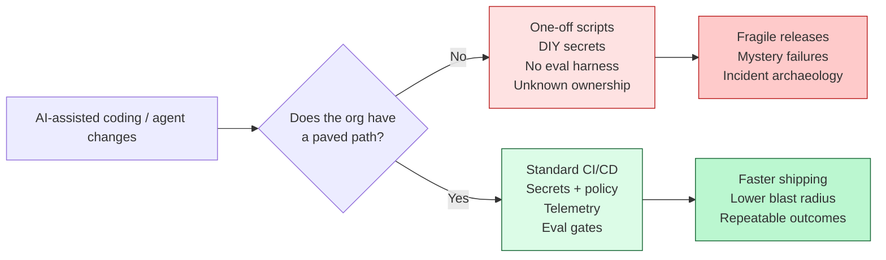
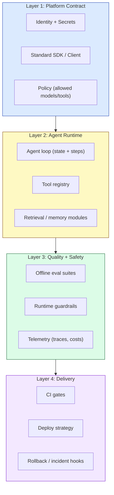

# Composable Paved Paths for AI Agent Development

There’s a weird paradox happening in engineering right now:

- It’s never been easier to **produce code**.
- It’s never been harder to **produce reliable, governed, shippable systems**.

That second part is the punchline. As soon as you add agents (tool use, multi-step reasoning, non-deterministic outputs), your org’s “rough edges” show up fast: secret handling, CI rigor, eval discipline, observability, incident response, and the dreaded “who owns this thing?” question.

The way out is not “better prompts.” It’s **better paths**.

This post lays out a practical model for **composable paved paths**: opinionated, supported workflows that make the correct way the easy way — while still letting teams build wildly different AI products on top.

---

## 🎯 TL;DR for Busy Engineers

If you’re building AI agents in a real organization (multiple teams, multiple repos, production constraints), you want:

1. **A platform contract** (how agents authenticate, call tools, log, and ship)
2. **Composable building blocks** (tool wrappers, memory/retrieval modules, safety filters)
3. **An eval + observability loop** (so “it works on my prompt” doesn’t become your on-call nightmare)

Paved paths reduce cognitive load and context switching by bundling the right defaults into the workflow.[^ms-paved]

---

## 🚀 The New Bottleneck Isn’t Writing Code

AI can absolutely increase individual productivity — especially for boilerplate and pattern-heavy work.[^copilot]

But organizations don’t win because someone wrote code faster. They win because they:

- ship changes safely,
- maintain stability under churn,
- and can explain what happened when something goes sideways.

The DORA research on AI adoption is a useful gut-check: it highlights that AI can create tradeoffs, and that delivery fundamentals still matter.[^dora]

So if the agent can generate 10× the changes, your **delivery system** must be able to absorb them.



---

## 🛣️ What We Mean by “Paved Path” (and Why “Composable” Matters)

In platform engineering terms, a _paved path_ (or _golden path_) is an opinionated, well-supported route to production. It’s not a mandate; it’s a default that’s so good teams voluntarily choose it.[^ms-paved][^octopus-golden][^redhat-golden]

For AI agents, “composable” is the key word:

- You don’t want one blessed chatbot framework that everyone must use.
- You want **small, reusable building blocks** that can be assembled into multiple agent shapes (support bot, code-review agent, internal tooling agent, incident triage agent).

Composition is the difference between:

- “Here’s the one agent you’re allowed to build.”
- “Here are the rails and guardrails you should build on.”

---

## 🧠 Agents Magnify Cognitive Load (Unless You Design It Out)

Platform engineering exists because cognitive load is real. When developers have to remember a dozen hidden rules (how to deploy, how to log, which model is approved, how to store prompts, where evals live), velocity dies.

That’s why Team Topologies puts cognitive load front and center: if teams have to carry too much context, flow slows down.[^teamtopologies]

Agents amplify this because they create _new_ categories of failure:

- nondeterministic behavior (“it answered differently this time”)
- tool misuse (“it called the right tool with the wrong args”)
- retrieval weirdness (“it fetched stale docs and confidently lied”)
- prompt injection and output safety issues
- silent regressions (quality drops, but nothing throws)

Without paved paths, teams learn these lessons by bleeding.

---

## 🧱 A Reference Architecture: The Composable AI Paved Path

Here’s a simple mental model that works well in practice. Think in layers.



### Layer 1: Platform contract (make “the right thing” the easiest thing)

This is where platform teams earn their keep.

The goal is that every agent team can answer these questions without a meeting:

- How do we authenticate to models and tools?
- Where do prompts live and how are they versioned?
- How do we emit traces/logs/costs?
- What is the policy for allowed tools/models?

In practice, this usually becomes a thin internal SDK and a couple of strong defaults.

```ts
// Example: a minimal contract that every agent uses.
// The magic is not the interface — it's the platform implementation behind it.
export interface AgentPlatform {
  model: {
    generate(input: {
      system: string;
      messages: Array<{ role: "user" | "assistant"; content: string }>;
      tools?: Array<{ name: string; description: string }>;
      tags?: string[];
    }): Promise<{ text: string; toolCalls?: unknown[] }>;
  };

  tools: {
    call<TArgs, TResult>(name: string, args: TArgs): Promise<TResult>;
  };

  telemetry: {
    trace<T>(name: string, fn: () => Promise<T>): Promise<T>;
    event(name: string, props?: Record<string, unknown>): void;
  };
}
```

### Layer 2: Agent runtime (composition happens here)

This is your “agent toolkit” layer:

- tool registry and tool wrappers
- retrieval and memory modules
- task orchestration patterns (planner-worker, evaluator-optimizer)

If you’ve read the common agent workflow patterns, you’ll recognize these building blocks immediately.[^anthropic-agents]

The paved path value here is **standard interfaces**:

- “Every tool call is traced.”
- “Every retrieval operation emits which docs were used.”
- “Every agent step has a stable schema we can audit.”

### Layer 3: Quality + safety (your future self will thank you)

Agents don’t fail like normal code. You need quality signals that survive nondeterminism.

At minimum:

- an **offline eval suite** (golden prompts + expected behavior)
- **runtime guardrails** (schema validation, input filtering, tool allowlists)
- **telemetry** that captures outcomes, not just latency

This is also where you decide what “done” means for an agent.

### Layer 4: Delivery (agents are software; treat them like software)

This should look boring:

- CI runs tests and evals.
- CD deploys via a standard strategy.
- Rollback is defined.
- Ownership is explicit.

If AI increases change velocity, your platform needs stronger steering and brakes — not less.

---

## 🧪 Rollout Plan (Without Boiling the Ocean)

If you’re trying to introduce this in a real org, here’s a sequence that tends to work:

1. **Pick one high-value agent use case** (support deflection, internal docs Q&A, PR summarizer).
2. **Define the platform contract** (how it auths, logs, traces, deploys).
3. **Ship 3–5 reusable building blocks** (retrieval module, tool wrapper, safety filter, eval harness).
4. **Make it the default** (templates, starter repos, CI presets).
5. **Measure and iterate** (see next section).

This is exactly the same product mindset that successful platform engineering efforts emphasize.[^ms-paved]

---

## 📏 How You Know It’s Working

If the paved path is real (not just a Confluence page), you should see:

- **Lead time drops** for new agent features.
- **Change failure rate drops** for agent releases.
- **Incidents get simpler** (“the trace shows tool X returned Y”).
- **Developer satisfaction increases** (less yak-shaving, fewer meetings).

On the AI side specifically:

- eval pass rate stays stable over time
- cost per successful task stays bounded
- you can answer “what changed?” when quality shifts

## 🏁 Closing Thought

Agents are going to keep getting more capable.

But if your org doesn’t have paved paths, capability turns into chaos. You’ll ship faster — right up until you ship something you can’t explain, can’t govern, and can’t fix.

---

## 🧾 References

[^ms-paved]: Microsoft Engineering. "Building Paved Paths: The Journey to Platform Engineering." https://devblogs.microsoft.com/engineering-at-microsoft/building-paved-paths-the-journey-to-platform-engineering/

[^dora]: Google Cloud Blog. "Announcing the 2024 DORA report." https://cloud.google.com/blog/products/devops-sre/announcing-the-2024-dora-report

[^copilot]: GitHub. "Research: quantifying GitHub Copilot’s impact on developer productivity and happiness." https://github.blog/ai-and-ml/github-copilot/research-quantifying-github-copilots-impact-on-developer-productivity-and-happiness/

[^octopus-golden]: Octopus Deploy. "Paved Versus Golden Paths In Platform Engineering." https://octopus.com/blog/paved-versus-golden-paths-in-platform-engineering

[^redhat-golden]: Red Hat. "What is a golden path for software development?" https://www.redhat.com/en/topics/devops/what-is-a-golden-path

[^teamtopologies]: Team Topologies. "Cognitive load" (key concept). https://teamtopologies.com/key-concepts/cognitive-load

[^anthropic-agents]: Anthropic. "Building Effective AI Agents." https://www.anthropic.com/research/building-effective-agents
