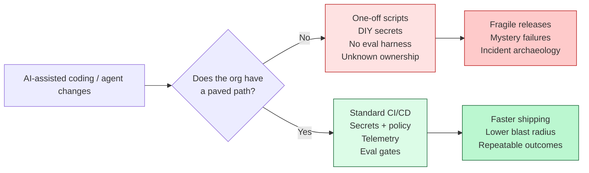
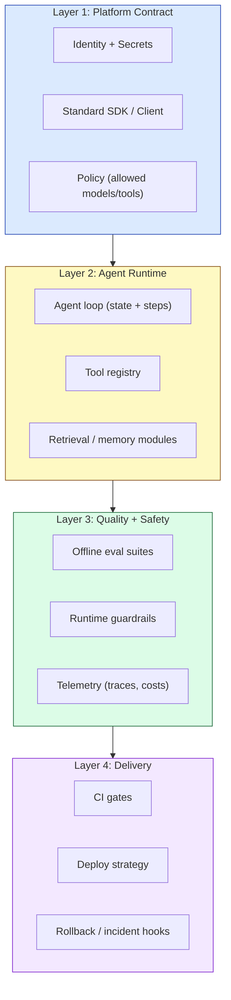

# Composable Paved Paths for AI Agent Development

There’s a weird paradox happening in engineering right now:

- It’s never been easier to **produce code**.
- It’s never been harder to **produce reliable, governed, shippable systems**.

That second part is the punchline. As soon as you add agents (tool use, multi-step reasoning, non-deterministic outputs), your org’s “rough edges” show up fast: secret handling, CI rigor, eval discipline, observability, incident response, and the dreaded “who owns this thing?” question.

The way out is not “better prompts.” It’s **better paths**.

This post lays out a practical model for **composable paved paths**: opinionated, supported workflows that make the correct way the easy way — while still letting teams build wildly different AI products on top.

---

## 🎯 TL;DR for Busy Engineers

If you’re building AI agents in a real organization (multiple teams, multiple repos, production constraints), you want:

1. **A platform contract** (how agents authenticate, call tools, log, and ship)
2. **Composable building blocks** (tool wrappers, memory/retrieval modules, safety filters)
3. **An eval + observability loop** (so “it works on my prompt” doesn’t become your on-call nightmare)

Paved paths reduce cognitive load and context switching by bundling the right defaults into the workflow.[^ms-paved]

---

## 🚀 The New Bottleneck Isn’t Writing Code

AI can absolutely increase individual productivity — especially for boilerplate and pattern-heavy work.[^copilot]

But organizations don’t win because someone wrote code faster. They win because they:

- ship changes safely,
- maintain stability under churn,
- and can explain what happened when something goes sideways.

The DORA research on AI adoption is a useful gut-check: it highlights that AI can create tradeoffs, and that delivery fundamentals still matter.[^dora]

So if the agent can generate 10× the changes, your **delivery system** must be able to absorb them.



---

## 🛣️ What We Mean by “Paved Path” (and Why “Composable” Matters)

In platform engineering terms, a _paved path_ (or _golden path_) is an opinionated, well-supported route to production. It’s not a mandate; it’s a default that’s so good teams voluntarily choose it.[^ms-paved][^octopus-golden][^redhat-golden]

For AI agents, “composable” is the key word:

- You don’t want one blessed chatbot framework that everyone must use.
- You want **small, reusable building blocks** that can be assembled into multiple agent shapes (support bot, code-review agent, internal tooling agent, incident triage agent).

Composition is the difference between:

- “Here’s the one agent you’re allowed to build.”
- “Here are the rails and guardrails you should build on.”

---

## 🧠 Agents Magnify Cognitive Load (Unless You Design It Out)

Platform engineering exists because cognitive load is real. When developers have to remember a dozen hidden rules (how to deploy, how to log, which model is approved, how to store prompts, where evals live), velocity dies.

That’s why Team Topologies puts cognitive load front and center: if teams have to carry too much context, flow slows down.[^teamtopologies]

Agents amplify this because they create _new_ categories of failure:

- nondeterministic behavior (“it answered differently this time”)
- tool misuse (“it called the right tool with the wrong args”)
- retrieval weirdness (“it fetched stale docs and confidently lied”)
- prompt injection and output safety issues
- silent regressions (quality drops, but nothing throws)

Without paved paths, teams learn these lessons by bleeding.

---

## 🧱 A Reference Architecture: The Composable AI Paved Path

Here’s a simple mental model that works well in practice. Think in layers.



### Layer 1: Platform contract (make “the right thing” the easiest thing)

This is where platform teams earn their keep.

The goal is that every agent team can answer these questions without a meeting:

- How do we authenticate to models and tools?
- Where do prompts live and how are they versioned?
- How do we emit traces/logs/costs?
- What is the policy for allowed tools/models?

In practice, this usually becomes a thin internal SDK and a couple of strong defaults.

```ts
// Example: a minimal contract that every agent uses.
// The magic is not the interface — it's the platform implementation behind it.
export interface AgentPlatform {
  model: {
    generate(input: {
      system: string;
      messages: Array<{ role: "user" | "assistant"; content: string }>;
      tools?: Array<{ name: string; description: string }>;
      tags?: string[];
    }): Promise<{ text: string; toolCalls?: unknown[] }>;
  };

  tools: {
    call<TArgs, TResult>(name: string, args: TArgs): Promise<TResult>;
  };

  telemetry: {
    trace<T>(name: string, fn: () => Promise<T>): Promise<T>;
    event(name: string, props?: Record<string, unknown>): void;
  };
}
```

### Layer 2: Agent runtime (composition happens here)

This is your “agent toolkit” layer:

- tool registry and tool wrappers
- retrieval and memory modules
- task orchestration patterns (planner-worker, evaluator-optimizer)

If you’ve read the common agent workflow patterns, you’ll recognize these building blocks immediately.[^anthropic-agents]

The paved path value here is **standard interfaces**:

- “Every tool call is traced.”
- “Every retrieval operation emits which docs were used.”
- “Every agent step has a stable schema we can audit.”

### Layer 3: Quality + safety (your future self will thank you)

Agents don’t fail like normal code. You need quality signals that survive nondeterminism.

At minimum:

- an **offline eval suite** (golden prompts + expected behavior)
- **runtime guardrails** (schema validation, input filtering, tool allowlists)
- **telemetry** that captures outcomes, not just latency

This is also where you decide what “done” means for an agent.

### Layer 4: Delivery (agents are software; treat them like software)

This should look boring:

- CI runs tests and evals.
- CD deploys via a standard strategy.
- Rollback is defined.
- Ownership is explicit.

If AI increases change velocity, your platform needs stronger steering and brakes — not less.

---

## 🧪 Rollout Plan (Without Boiling the Ocean)

If you’re trying to introduce this in a real org, here’s a sequence that tends to work:

1. **Pick one high-value agent use case** (support deflection, internal docs Q&A, PR summarizer).
2. **Define the platform contract** (how it auths, logs, traces, deploys).
3. **Ship 3–5 reusable building blocks** (retrieval module, tool wrapper, safety filter, eval harness).
4. **Make it the default** (templates, starter repos, CI presets).
5. **Measure and iterate** (see next section).

This is exactly the same product mindset that successful platform engineering efforts emphasize.[^ms-paved]

---

## 📏 How You Know It’s Working

If the paved path is real (not just a Confluence page), you should see:

- **Lead time drops** for new agent features.
- **Change failure rate drops** for agent releases.
- **Incidents get simpler** (“the trace shows tool X returned Y”).
- **Developer satisfaction increases** (less yak-shaving, fewer meetings).

On the AI side specifically:

- eval pass rate stays stable over time
- cost per successful task stays bounded
- you can answer “what changed?” when quality shifts

## 🏁 Closing Thought

Agents are going to keep getting more capable.

But if your org doesn’t have paved paths, capability turns into chaos. You’ll ship faster — right up until you ship something you can’t explain, can’t govern, and can’t fix.

---

## 🧾 References

[^ms-paved]: Microsoft Engineering. "Building Paved Paths: The Journey to Platform Engineering." https://devblogs.microsoft.com/engineering-at-microsoft/building-paved-paths-the-journey-to-platform-engineering/

[^dora]: Google Cloud Blog. "Announcing the 2024 DORA report." https://cloud.google.com/blog/products/devops-sre/announcing-the-2024-dora-report

[^copilot]: GitHub. "Research: quantifying GitHub Copilot’s impact on developer productivity and happiness." https://github.blog/ai-and-ml/github-copilot/research-quantifying-github-copilots-impact-on-developer-productivity-and-happiness/

[^octopus-golden]: Octopus Deploy. "Paved Versus Golden Paths In Platform Engineering." https://octopus.com/blog/paved-versus-golden-paths-in-platform-engineering

[^redhat-golden]: Red Hat. "What is a golden path for software development?" https://www.redhat.com/en/topics/devops/what-is-a-golden-path

[^teamtopologies]: Team Topologies. "Cognitive load" (key concept). https://teamtopologies.com/key-concepts/cognitive-load

[^anthropic-agents]: Anthropic. "Building Effective AI Agents." https://www.anthropic.com/research/building-effective-agents

{/\* Legacy draft content (pre-rewrite) below; kept for reference but not rendered.

Artificial intelligence is reshaping how software is built and delivered, prompting a fundamental shift in software development processes. Instead of hand-coding every feature, developers increasingly assemble systems from powerful AI components—such as large language models (LLMs), specialized APIs, and automated coding assistants—through a process of composition rather than traditional code authoring【33†L23-L31】【25†L43-L48】. This transition has been described as moving from “Software 1.0” (human-written code) to “Software 3.0,” where natural language prompts and pre‑trained models become the new source of software logic【33†L47-L55】【33†L59-L67】. In practical terms, an English prompt guiding an LLM can now function like a high‑level program, leveraging the model’s pretrained knowledge to perform complex tasks【33†L49-L57】【33†L63-L69】. This new paradigm is transforming the software development lifecycle (SDLC) and demanding fresh perspectives on how teams design, build, and maintain AI‑driven systems【25†L31-L39】【25†L41-L48】.

Amid this evolution, industry leaders and researchers are converging on a key insight: composable building blocks and “paved paths” are essential for scalable, efficient AI‑driven development. Paved paths (often called golden paths or internal developer platforms) refer to opinionated, well‑supported workflows and tools that guide engineers along the easiest—and organization‑approved—route to delivering software【21†L246-L254】. The concept, popularized by companies like Netflix and Microsoft, is that providing a “paved road” of integrated, secure‑by‑default components lets developers focus on innovation rather than reinventing plumbing or navigating needless complexity【32†L79-L88】【21†L248-L256】. When done right, these paved paths significantly reduce cognitive load and bureaucratic hurdles for teams【21†L248-L256】, while ensuring best practices (for security, compliance, reliability, etc.) are automatically ingrained in the development process【32†L83-L92】. As Netflix’s engineering team found, adopting paved road solutions for infrastructure and security (e.g. a standardized CI/CD platform, centralized authentication and secrets management) eliminated entire classes of errors and vulnerabilities by making the secure, efficient path the default choice【32†L79-L88】【32†L89-L92】. In the context of AI, paved paths might include reusable pipelines for model training and deployment, prompt engineering guidelines, and pre‑integrated tools for monitoring and evaluating AI behavior.

This paper explores why composability and paved paths are becoming critical in AI‑centric software development. We draw on industry best practices from GitHub, OpenAI, Google, Microsoft, and others, as well as relevant academic research (cognitive load theory, DevOps performance metrics, platform engineering principles). We will argue that leveraging composable building blocks—such as modular AI services, orchestration frameworks, and standardized “AI SDLC” workflows—constitutes a form of cognitive infrastructure that enables teams to manage complexity and scale their AI‑driven applications efficiently. By shifting developer effort from low‑level authoring to high‑level composition, organizations can achieve faster iteration, improved reliability, and greater developer productivity, all while maintaining control and safety in AI system behavior. We examine concrete examples including the use of frameworks like LangChain for chaining LLM prompts, the integration of GitHub Copilot into development workflows, and internal platform tooling that companies are building to support AI features. We also discuss organizational and performance implications: how roles and team structures evolve when “AI‑native” development practices take hold, and what impacts on productivity and software delivery metrics have been observed.

Composable building blocks and paved paths have deep roots in software engineering practice. The notion of assembling software from reusable components dates back to the earliest high‑level programming libraries and the rise of structured and object‑oriented programming. More recently, the microservices architecture movement further championed the idea of breaking systems into modular services that can be independently developed and reused across applications. In all cases, the goal has been to improve scalability and maintainability by separating concerns and enabling composition of simpler pieces into more complex functionality. Academic research has long suggested that software reuse and modular design can increase developer productivity by reducing duplicated effort and cognitive burden, though achieving effective reuse in practice requires careful design of interfaces and common abstractions.

The concept of a “paved path” or “golden path” emerged from industry as a way to codify best practices and streamline developer experience. Netflix famously introduced the idea of a “paved road” in its internal tooling – a set of supported technologies and workflows that are well‑integrated and secure by default【32†L79-L88】. Rather than mandating strict rules, Netflix’s paved road provided an attractive default: engineers had the freedom to deviate, but those who chose the paved path would get a high degree of support and automation, thereby eliminating much of the toil in infrastructure setup, deployment, and security compliance【32†L83-L92】. This approach has influenced many organizations’ platform engineering strategies. A golden path in platform engineering refers to an opinionated, well‑defined, and supported way of building and deploying software that covers the common needs of teams【1†L9-L17】【21†L246-L254】. For example, a platform team might offer a CI/CD pipeline template, cloud environment provisioning scripts, and monitoring integrations as part of a golden path for web services; teams adopting it can get to production faster with fewer errors【5†L282-L290】【5†L289-L297】. Importantly, golden paths are designed to reduce cognitive load on developers by standardizing solutions to recurring problems【5†L289-L297】【5†L309-L313】. Steve Fenton describes that a well‑executed internal developer platform “may feel like a paved path to the developers, but it should reduce the overall cognitive load,” achieved through consolidation and standardization of tools【5†L289-L297】. In fact, the difference between a mere paved path and a true golden path is that the latter proactively optimizes for developer experience at a system level, not just ease‑of‑use in one area【5†L271-L280】【5†L309-L313】. Done right, both developers and the organization benefit: developers get quick self‑service with fewer pain points, while the organization sees more consistency, security, and velocity【5†L279-L287】【32†L83-L92】.

Formal research has reinforced the value of these concepts. Cognitive Load Theory, originally developed by psychologist John Sweller, posits that working memory is limited in how many pieces of information it can hold and process at once【13†L55-L63】. In a complex task like software development, extraneous cognitive load (e.g., from unclear tools or unnecessary context‑switching) can severely hinder problem‑solving and learning【13†L73-L80】【13†L84-L90】. Modern DevOps and team‑organization approaches have embraced this idea: the Team Topologies framework by Skelton and Pais explicitly centers on managing team cognitive load as a design criterion for software architecture and team responsibilities【10†L302-L309】【10†L310-L319】. They argue that teams should be structured so that their cognitive load stays within reasonable bounds, often by offloading certain complexities to platform teams or enabling teams. In a Team Topologies context, a platform team provides an internal product (the platform) that stream‑aligned product teams can use easily, thereby reducing what each product team needs to mentally juggle【13†L103-L111】【13†L131-L139】. Studies show that organizations which manage and reduce developers’ cognitive load see substantial gains in performance: for example, one industry analysis found that high cognitive overload can decrease developer productivity by 25–40%, whereas optimizing cognitive load correlated with ~30% improvement in software delivery performance【10†L339-L347】【12†L25-L32】. These improvements are often measured via the well‑known DevOps DORA metrics (Deployment Frequency, Lead Time for changes, Change Failure Rate, Mean Time to Restore)【10†L339-L347】. Indeed, the 2024 Accelerate State of DevOps Report (by Google’s DORA research group) highlights platform engineering and developer experience as pivotal for achieving elite performance【4†L121-L129】【4†L193-L202】. Internal developer platforms were found to effectively increase developer productivity, especially in larger organizations, and teams with strong developer experience (DevEx) practices report lower burnout and higher satisfaction【4†L202-L211】【4†L223-L231】. However, the DORA research also cautions that adopting a platform engineering initiative can introduce a temporary dip in performance as teams adjust, before yielding improvements as the platform matures【4†L209-L218】. This underscores that simply introducing new tools is not a silver bullet—organizations must thoughtfully implement and encourage the use of these platforms (in other words, pave the paths and gently guide teams onto them).

In parallel, the rise of AI in software development has been swift and transformative. By late 2023, an estimated 75% of developers were relying on AI for at least one daily task in their workflow, such as code writing, code review, or summarizing information【4†L139-L147】. Tools like GitHub Copilot (an AI pair‑programmer that suggests code) have seen rapid adoption and have been studied for their impact on productivity. GitHub’s own research reports that developers using Copilot were able to complete coding tasks 55% faster on average in a controlled experiment【8†L636-L644】, with a higher success rate in completing the task at all. Beyond speed, Copilot users often report higher satisfaction: in surveys, 73% said the tool helped them stay in flow and 87% said it preserved mental energy on repetitive tasks【7†L556-L564】【7†L558-L566】. Qualitatively, developers describe the experience as letting them “focus on the fun stuff” while the AI handles boilerplate; one senior engineer noted, “(With Copilot) I have to think less, and when I have to think it’s the fun stuff… it makes coding more fun and more efficient.”【31†L1-L4】. Researchers concluded that offloading repetitive work to the AI “reduced cognitive load,” freeing developers to tackle the more complex, creative aspects of their work【7†L603-L609】. These findings echo a theme: AI assistance, when properly integrated, can act as a force multiplier for developer productivity and happiness, but it needs to be harnessed within a supportive process to avoid potential downsides.

Prompt engineering has emerged as a new skill set in this AI‑driven development era. Rather than writing explicit algorithms, developers craft prompts—natural language instructions or examples—to elicit desired behavior from a model. There’s a growing body of literature on prompt engineering techniques and their role in software development. For instance, OpenAI’s introduction of function calling in 2023 allowed developers to define how an LLM could invoke external functions (APIs), enabling more reliable multi‑step agents without writing glue code for every step【28†L160-L168】. Similarly, frameworks like LangChain gained popularity for providing out‑of‑the‑box composable modules (prompt templates, chains, memory, tool integrations) to build LLM‑powered applications. LangChain essentially offers a library of building blocks and “pre‑built agent architectures” so that developers can “build agents in minutes with templates for common use cases”【20†L47-L55】. By swapping in different models or tools through unified interfaces, developers avoid rewriting their entire application for each change; LangChain’s 1000+ integrations exemplify the flexibility of a composable approach, allowing teams to “swap models, tools, and databases without rewriting [the] application,” thereby future‑proofing the stack against rapid AI advancements【20†L52-L60】【20†L79-L87】. We see similar composability in other AI orchestration libraries (like Microsoft’s Semantic Kernel or the open‑source LMQL and LlamaIndex projects) and in cloud provider offerings (such as Google’s Vertex AI pipelines or Azure’s ML Ops tools). These frameworks serve as the AI‑specific analogs of a paved path: they encode best practices (e.g., how to do retrieval‑augmented generation, or how to chain a summarization after a database query) into reusable components that developers can easily plug together, rather than starting from scratch for each project.

In summary, prior work in both industry and academia sets the stage for our thesis. The combination of modular design, internal platforms, cognitive load management, and AI‑augmented development is coalescing into a powerful approach for the next generation of software engineering. We now turn to the specifics of the AI Software Development Lifecycle (AI SDLC) and how it emphasizes composition over authoring.

AI SDLC and the Shift from Authoring to Composition

The traditional SDLC—from requirements to design, coding, testing, and deployment—assumes that writing code (authorship) is the central activity for implementing new functionality. Developers translate specifications into source code line by line, function by function. In the age of AI, however, this model is being upended. We are witnessing a shift from authoring to composition: software developers increasingly assemble solutions by leveraging AI models and services as building blocks, rather than authoring all logic imperatively.

One aspect of this shift is highlighted by the progression from Software 1.0 to Software 2.0 and beyond【33†L49-L57】【33†L59-L67】. In Software 2.0, coined by Andrej Karpathy around 2017, developers no longer hard‑code rules but instead curate data and train neural networks that embody the logic in their learned weights. Now, in what Karpathy calls Software 3.0, even the training phase can be bypassed for many applications: developers simply provide natural language instructions (prompts) to powerful pretrained models, effectively writing programs in English that the AI then executes【33†L23-L31】【33†L63-L69】. For example, instead of coding a text‑summarization algorithm, a developer can call an LLM with a prompt like “Summarize the following report in one paragraph.” The intellectual effort shifts from crafting algorithms to crafting prompts and workflows that guide the model. The prompt becomes the program【33†L51-L59】【33†L63-L69】. This democratizes certain aspects of development—“the hottest new programming language is English,” as Karpathy quips【33†L85-L93】—allowing a broader range of people to specify software behavior at a high level. But it also introduces new challenges: prompts and AI outputs are often nondeterministic, hard to debug, and require systematic evaluation, which means the SDLC around them must evolve【25†L43-L48】【25†L50-L58】.

Researchers and practitioners have started to formalize what the AI SDLC looks like. Erin LeDell provides a practical framework, noting that while there’s overlap with traditional and ML‑centric lifecycles, “GenAI development introduces a new paradigm centered on prompt engineering and model fine‑tuning, managing non‑deterministic outputs, evaluating contextual understanding and response quality, and balancing cost with performance.”【25†L41-L48】 In this view, classic SDLC stages are adapted:
• Design/Explore: The problem is defined and data assessed, but in AI projects this stage may involve deciding whether to fine‑tune a model or use it zero‑shot. Teams often rapidly prototype with pre‑trained foundation models and use prompt playgrounds to explore capabilities【25†L85-L94】【25†L99-L107】. A key decision is choosing the right existing model or service to compose into the solution, rather than designing algorithms from scratch.
• Deploy: Deploying AI systems involves new concerns compared to traditional software. One must manage model versions (or prompt versions) and perhaps host model inference endpoints or incorporate third‑party AI services. Non‑determinism means that even if a prompt worked yesterday, model updates or subtle context differences could produce different results tomorrow. So the deployment stage puts emphasis on monitoring and guarding the AI behavior in production. Continuous evaluation frameworks are often employed: e.g., logging model outputs and scoring them for quality, detecting drifts in input distributions or model performance【25†L129-L137】【25†L139-L147】. Additionally, deploying AI often means composing multiple services – a common pattern is an AI service plus a vector database for retrieval‑augmented generation, plus tool APIs. Ensuring these pieces interoperate reliably is part of the deployment challenge, analogous to integration testing but for AI pipelines. There is currently a gap in specialized deployment tools for AI, as LeDell notes【25†L129-L137】, leading teams to rely on existing testing frameworks and custom checks. Companies like OpenAI are addressing some of these needs through new APIs: for instance, OpenAI’s “Responses API” (released in late 2025) provides an agentic loop interface that keeps an AI model’s reasoning state across calls and natively handles tool usage, making the deployment of multi‑step reasoning agents easier and more structured【28†L173-L181】【28†L189-L193】. This kind of platform support essentially bakes a paved path for AI agents directly into the API, so developers don’t have to hand‑craft the entire loop logic.
• Observe/Maintain: After deployment, the system must be monitored and maintained. AI systems require monitoring not only for traditional metrics (latency, errors) but also for output quality, biases, and drift. Observability tools are evolving: many teams now use feedback loops where user ratings or downstream metrics feed back into model improvement. Prompt management becomes an ongoing task—tweaking prompts or fine‑tuning models as new use cases emerge or as the model’s knowledge becomes outdated. The LangSmith tool (by LangChain) and other LLMOps platforms have appeared to assist with monitoring and evaluating LLM interactions in production. Furthermore, cost monitoring is crucial: because many AI services are paid per API call or token, optimizing prompts for brevity or caching frequent results becomes part of maintenance【25†L147-L155】. This stage often uncovers needs for additional composition: e.g., adding a safeguard component if the model starts returning an unexpected type of error, or routing queries differently if performance issues arise (like using a cheaper model for simple queries and a more expensive one for complex queries【18†L153-L161】【18†L155-L164】). All these adjustments reflect a dynamic, composition‑centric view of software: the “code” isn’t static logic, but a configuration of model, data, and prompts that can be continually tuned.

Across these phases, the role of the developer transforms. Developers become more like architects and curators of intelligent components. They must understand not only how to write code, but how to leverage AI capabilities effectively: which model to call, how to constrain its output (via prompts or function‑calling schemas), how to chain tasks, and how to evaluate results. An analogy can be drawn to a conductor of an orchestra: the composer (developer) writes a score (prompt/workflow) for various instruments (models/tools) to follow, rather than playing all instruments themselves. This approach requires a broader systems thinking and a willingness to iterate and experiment, since the “components” (like an LLM) do not behave as deterministically as a standard library function.

It’s worth noting that this composition mindset aligns closely with DevOps and continuous delivery practices. The rapid prototyping with AI is akin to agile experimentation, and the need for continuous monitoring dovetails with SRE (Site Reliability Engineering) principles. We also see the infiltration of AI into the development tools themselves: the build pipeline can include automated code generation (via Copilot or ChatGPT plugins), automated testing suggestions, and even AI assistance in code reviews. In effect, AI is both the object of development (what the team is building into the product) and a subject assisting the development process. This dual role further blurs the line between writing and assembling, because the AI might write some of the code under the developer’s supervision.

Composition as Cognitive Infrastructure

One of the less obvious but profound benefits of composable development is the way it serves as cognitive infrastructure for engineers. By cognitive infrastructure, we mean the scaffolding of tools, abstractions, and processes that support the developer’s cognitive work, much as physical infrastructure (roads, bridges) supports transportation or logistics. Just as a well‑designed road system lets drivers travel efficiently without constantly worrying about the underlying engineering, a well‑designed cognitive infrastructure lets developers achieve their goals without being overwhelmed by incidental complexity.

A concrete illustration of composition reducing cognitive burden is the earlier example of GitHub Copilot’s impact. When Copilot handles a repetitive coding pattern or writes a chunk of boilerplate, the developer’s mind is freed from those minutiae and can focus on the higher‑level design or tricky logic that truly requires human insight. The GitHub study explicitly concluded that letting Copilot “shoulder the boring and repetitive work of development reduced cognitive load,” enabling developers to invest their mental energy in “complex, critical thinking and problem solving,” which in turn led to greater job satisfaction【7†L603-L609】. This is cognitive infrastructure in action: the AI coding assistant is like a cognitive prosthetic that takes on some mental labor. The result is not only efficiency but quality of thought. Developers are less fatigued by trivialities and better able to engage in deep work on challenging aspects of their tasks【7†L553-L561】【7†L559-L567】.

Another angle is how composition as a strategy can reduce context switching. Modern dev teams use a plethora of tools (16 on average per day, by one Microsoft study) and suffer from constant interruptions【21†L149-L157】【21†L151-L158】. Every context switch—say, from coding to configuring infrastructure, or from one programming language to another—incurs a cost (taking ~23 minutes on average to regain focus after a switch)【21†L151-L158】. By offering cohesive, integrated components, paved paths minimize these switches. For example, a developer using a platform’s CLI to deploy doesn’t leave their coding environment to log into a separate UI and click through forms. Or consider an AI agent that can perform a multi‑step task (like coding, testing, deploying a minor change) autonomously: it could save the human from having to manually transition between writing code, running tests, reviewing results, etc. Anthropic’s description of agentic patterns provides a relevant insight: they outline patterns like Orchestrator‑Worker LLMs and Evaluator‑Optimizer loops, which essentially encapsulate multi‑step cognitive workflows that would normally tax a human【18†L194-L202】【18†L214-L223】. In an Evaluator‑Optimizer pattern, for instance, one LLM generates a solution and another evaluates and gives feedback, iterating until criteria are met【18†L214-L223】【18†L228-L236】. If a developer had to do this alone, they would be mentally juggling generation and evaluation alternately. Offloading that iterative cognitive loop to an AI agent means the developer only needs to specify the high‑level goal and criteria, then monitor the outcome. The mental context remains at the goal level, not the step‑by‑step level.

Reducing cognitive load has measurable organizational benefits. Nicole Forsgren et al., in the book Accelerate, showed that improving developer experience and reducing friction correlates with better software delivery performance and even organizational performance (profitability, market share) in the long run【4†L97-L106】【4†L121-L129】. A Team Topologies newsletter in 2024 cited that organizations effectively managing team cognitive load saw about a 30% improvement in delivery performance (as reflected in faster lead times, higher deployment frequency, etc.)【10†L337-L345】【10†L339-L347】. This is backed by multiple studies and DORA’s research program. In practical terms, if developers are not constantly stuck on environment issues or re‑learning poorly documented internal systems, they deliver features faster and with fewer errors. One study mentioned in a DevOps Institute article noted that teams under high cognitive load can suffer 25–40% decreased productivity compared to optimized environments【12†L25-L32】 – essentially losing one‑third of their potential output. That is an enormous penalty, equivalent to having a much larger team but wasting a chunk of their time on unnecessary mental overhead. Composable paved paths aim to eliminate that waste.

It’s important to distinguish between moving cognitive load and reducing it. Often, when organizations introduce a platform team or standardized tooling, they shift some complexity from application teams to the platform team. The platform team then bears the burden of dealing with the intricacies (say, writing the Kubernetes YAML, or figuring out OAuth flows for all services) – which is fine, because that team is specialized and focused on it. But if done naively, one could end up just centralizing pain rather than alleviating it. The Octopus blog made this distinction clear: a “paved path” might simply move pain to the platform team, whereas a “golden path” reduces total cognitive load for everyone by truly eliminating pain points through good design【5†L309-L313】. In the AI context, an example might be: instead of each team figuring out prompt templates and guardrails for using GPT‑4, the platform team provides a Prompt Hub and a set of approved prompt patterns that application teams can use. The platform team does the hard work once (with input from experts, maybe even following research on prompt best practices), and downstream teams get a simpler mental model to work with. If the platform team just provided an API to GPT‑4 without guidance, they’d take on some complexity (integration) but leave the prompt engineering burden with every team (thus not much net cognitive load reduction across the org). The composition approach would be to supply higher‑level building blocks: e.g. a ready‑made Q&A chain component, a “data‑to‑text reporting” module, etc. Each such module encapsulates a lot of know‑how (prompts, fallback logic, formatting), so teams using it can focus on their particular business logic around it.

Paved Paths for AI‑Native Development

One key element is the availability of high‑level frameworks and templates for common AI tasks. The popularity of libraries like LangChain, Hugging Face’s Transformers and Pipelines, Google’s TFX (TensorFlow Extended) for ML pipelines, and others demonstrates the appetite for standard building blocks. For example, LangChain provides “templates for common use cases” and pre‑built agent patterns like the ReAct (Reason + Act) framework【20†L47-L55】. Instead of every team figuring out how to implement an LLM agent that tools and reasons, they can call create_agent with a desired toolset and get a proven architecture implementing the ReAct pattern out of the box【20†L47-L55】. This is akin to paving a path that most teams will find useful – be it a conversational chatbot pattern, a question‑answering over documents pattern, or a code assistant pattern. By shipping these as templates, the framework creators encode lessons learned from many implementations into a single reusable artefact. Microsoft has similarly integrated AI patterns into its developer tools; for instance, the Semantic Kernel SDK provides an approach to combine LLM prompts (skills) with traditional code such as functions or API calls, treating prompts as composable pieces of a larger application flow. These frameworks not only save time but also guide developers away from pitfalls (like forgetting to sanitize model inputs, or not handling token limits) by having those concerns addressed within the provided components.

Prompt engineering guidelines and tools form another aspect of the AI paved road. Many organizations have started creating internal prompt libraries or playbooks. OpenAI’s documentation, for example, offers best practices for prompt design (like giving clear instructions, providing examples, etc.), which can be seen as paving a path for users of their API to get good results. There are also emerging prompt management tools (some highlighted by Arize AI and others【17†L33-L40】) that help version‑control prompts, test them systematically, and share them across teams. A paved path approach might be an internal portal where any engineer can find “prompt patterns” vetted by the company’s AI experts—say, a recommended prompt structure for extracting structured data from text, or a chain for doing multi‑hop reasoning with fallback. By following these templates, even engineers who are not AI specialists can incorporate robust AI capabilities into their software. We might draw a parallel to how design systems work in UI/UX: just as a design system provides ready‑made UI components and style guidelines to ensure consistency and quality, a prompt/AI system provides ready‑made AI interaction components to ensure reliability and performance. In fact, some companies have established a role akin to “AI platform product manager” whose job is to identify common needs and create these reusable assets (the AI paved roads).

Another critical area for AI paved paths is data and model lifecycle management. AI development is iterative not just in code but in data: collecting data, labeling it, evaluating models on it, etc. Leading organizations like Google and Microsoft have invested in internal platforms for data versioning, model training pipelines, and deployment automation (often encapsulated in MLOps frameworks). For example, Google’s Vertex AI and Microsoft’s Azure Machine Learning offer integrated environments where data can be registered, experiments tracked, models trained at scale, and then those models deployed as services with one command. By having such platforms, they create a golden path for any team that wants to add an ML model to their application: use the provided pipeline templates, and you get logging, scalability, and CI/CD for models for “free.” If every team had to set up their own TensorFlow training environment or go through ad‑hoc steps to push a model to production, the inconsistency would be enormous and the cognitive load high. Instead, e.g., “one click to deploy model as REST API” becomes the norm on the paved path. Uber’s Michelangelo platform was an early example in this space, as is Facebook’s FBLearner Flow – both aimed to reduce the time and expertise needed to go from idea to deployed ML model by standardizing and automating the steps. In the context of LLMs, one might expect analogous internal platforms for prompt management or fine‑tuning; indeed, OpenAI’s new Responses API is essentially a step toward an integrated agent development platform, handling reasoning loops, tool use, and state persistence under the hood so developers can focus on the unique parts of their agent logic【28†L173-L181】【28†L189-L193】.

DevOps for AI (sometimes dubbed AIOps or MLOps) is inherently part of these paved paths. Continuous integration/deployment (CI/CD) for AI might involve automatically retraining models on fresh data or automatically evaluating the impact of a new model before routing traffic to it. Companies like Google and Meta have shared methodologies on shadow testing new models (running them in parallel on production traffic to compare outputs before fully deploying), which they incorporate into their pipelines. A golden path for an AI feature might dictate: when you want to update the model, use the pipeline to A/B test it against the current model for a week on X% of traffic, and the platform will give you metrics on quality difference. Such processes, once established, save individual teams from reinventing the validation step and crucially ensure that quality and safety checks are consistently applied. This helps with governance—e.g., ensuring that no model that fails certain bias tests or performance thresholds can go live without explicit approval.

We also see paved path thinking in how AI is integrated into existing developer workflows. GitHub Copilot’s integration into VS Code and other IDEs was a conscious effort to pave a path inside the editor, rather than requiring developers to use a separate tool. By doing so, it made AI help ambient and easily accessible, increasing adoption. GitHub then extended this idea to Copilot for Pull Requests (suggesting fixes or descriptions in code reviews) and Copilot CLI (helping with command‑line tasks), effectively embedding AI assistance throughout the development journey. Each of these can be viewed as a small paved path: e.g., instead of manually writing verbose code review comments, an engineer can accept a Copilot suggestion that automatically explains the changes, following a pattern that is standardized. The user is saved from having to think “how do I phrase this documentation comment” because the AI learned a good style from training on many examples. Over time, such AI assistance might become the default way certain tasks are done—the “happy path” for documentation could be: write code, let AI draft docs, you tweak if needed. A sign that this is being institutionalized is the emergence of AI‑assisted workflows in official guides. For instance, Microsoft’s dev blogs and documentation now often mention how to use Copilot or other Azure OpenAI services as part of accomplishing a task, rather than treating them as novelties. This normalization paves the way (pun intended) for new developers to automatically follow these AI‑in‑the‑loop processes.

An example of real‑world paved path for AI implementation is at GitHub itself. GitHub not only provides Copilot, but internally they use AI to optimize their engineering processes. In a GitHub blog, they discuss a vision of “near‑effortless engineering” where AI‑enabled tooling handles many non‑creative tasks continuously (they call this “Continuous Efficiency”)【8†L738-L745】. This concept suggests future paved paths where, for instance, an AI system continuously suggests code optimizations or flags potential issues as developers code – essentially an always‑on pair programmer that also might open pull requests autonomously for certain classes of improvements (e.g. dependency updates or security patches). Some of this is already reality with tools like Dependabot (automated dependency PRs) and CodeQL (automated security analysis); the next generation will likely use LLMs to make these suggestions smarter and more context‑aware. The paved path here is making the default state that such improvements are just happening regularly, rather than relying on humans to remember or bother to do them.

From an organizational perspective, adopting AI‑native paved paths often involves establishing dedicated AI platform teams or Centers of Excellence. For example, enterprises might have an “AI Enablement” team whose job is to build and maintain the core pieces: a prompt library, common model endpoints, data pipelines, monitoring dashboards for AI metrics, etc. These teams curate knowledge and tools from the wider industry (and academia) and adapt them to the company’s context. They might maintain relationships with vendors (like OpenAI or Hugging Face) and keep track of model updates, abstracting those changes away from product teams via stable internal APIs or SDKs. Essentially, this is platform engineering applied to AI: treating AI capabilities as products that internal teams consume. Google’s DORA 2024 report noted that platform engineering is often more prevalent in larger organizations, and it emphasized “user‑centered design, developer self‑service, and a product mindset” for platform teams【4†L203-L212】【4†L213-L218】. In AI terms, user‑centered design might mean the platform team actively works with application developers to understand what AI use cases they have, what pain points (like latency, cost, or lack of skills) are stopping them, and then building platform features to address those. For instance, if developers find prompt performance unpredictable, the platform team could introduce a prompt evaluation harness where you can test a prompt against a suite of scenarios before using it in production – thereby paving a path for robust prompt design. Or if many teams want to use vector search, the platform team might deploy a managed vector database service internally and provide easy libraries to use it, instead of each team spinning up their own.

Real‑world implementations of these ideas include things like:
• LangChain and similar frameworks: widely adopted by startups and even enterprises prototyping LLM apps (there are case studies of companies like BMW or Papa Johns using LangChain in their AI pilots, indicating a common path emerging in industry for certain application types).
• GitHub Copilot workflows: multiple companies have documented their experiments with pair programming using Copilot, some integrating it into their daily standups and code review processes. For example, the bank JPMorgan Chase reported on using Copilot to reduce the time for certain coding tasks, and they established internal best practices on when to trust AI‑generated code and how to review it (essentially guidelines that pave the path for safe Copilot use within a regulated environment).
• Platform engineering handbooks: Microsoft, as referenced earlier, published a Platform Engineering Guide for its own engineers and as guidance to others【21†L181-L189】. This includes topics on how to build internal platforms that accommodate AI workflows. Another example is OpenAI’s documentation for enterprises on how to set up a “Copilot‑like” environment for internal code (embedding and searching in a codebase with an LLM assistant) – they provide reference architectures, which are effectively golden paths for that use case. We also see community‑driven playbooks, such as Google’s published Responsible AI guidelines, which incorporate into platform tooling to enforce things like prompt input filtering or output moderation by default. Ensuring that every AI application automatically goes through certain responsible AI checks can be viewed as paving a compliance path that all teams benefit from without having to become experts in AI ethics themselves.

A salient point is that paved paths do not eliminate flexibility; they provide a supported default. Teams can and will deviate when necessary (maybe an application has such unique requirements that they need a custom prompt or a custom model). But even then, having the paved path as a reference accelerates the deviation too: they might extend the platform rather than start anew. For instance, if the provided LLM is not good enough for a specific task, a team might fine‑tune a new model—but they’ll likely use the provided training pipeline to do so, benefiting from existing scaffolding (data handling, evaluation, deployment hooks). Paved paths in AI thus create a common innovation layer: everyone stands on the same solid foundation and can innovate above it, sharing improvements back. This is especially important in a fast‑moving field like AI—no single team can keep up with all the new developments (new models, new techniques like chain‑of‑thought prompting, etc.), but an enablement team can curate those and update the path, so the rest of the org moves forward together more efficiently.

In summary, paving paths for AI‑native development means productizing AI capabilities internally and ensuring that the easiest way to build something is also the right (or at least a good) way. It emphasizes reusable artifacts (prompts, chains, models, datasets, eval harnesses) and integrates them into workflows such that following the path yields faster and safer outcomes than going off‑road. The experiences of industry leaders suggest that this approach is key to scaling AI development beyond a few expert teams to an entire organization of engineers and architects. But to implement it effectively, there are organizational and cultural implications to consider, which we explore next.

Organizational Implications

Adopting composable paved paths for AI development is not just a technical shift—it’s also an organizational one. Companies need to evolve their team structures, skill sets, and culture to fully leverage these approaches. Several implications have emerged from early adopters:

1. The Rise of Platform and Enablement Teams: As mentioned, many organizations are creating or expanding platform engineering teams to support developers. Gartner predicts that by 2026, 80% of large software engineering organizations will have established platform engineering teams【21†L172-L180】, a trend driven largely by the need to manage growing complexity (which AI is only amplifying). In an AI context, this might specifically include an AI platform team, responsible for maintaining internal ML/LLM services, data pipelines, and standard tools. These teams act as force multipliers: instead of every team hiring their own ML specialists, the platform team provides expertise as a service. This does require investment—skilled ML engineers, MLOps, tooling budget—but it pays off by avoiding duplicated efforts and preventing costly mistakes (like deploying an unvetted model that causes an outage or PR disaster). Organizationally, it can be a shift for traditional IT or DevOps teams to integrate AI; often, companies seed these teams with a mix of software engineers and data scientists. Team Topologies would classify platform teams as providing X‑as‑a‑Service to product teams【13†L147-L155】, and indeed that model fits AI: treat models and data pipelines as internal services.

2. Product Management for Internal Tools: A subtle but important implication is adopting a product mindset for internal platforms. Instead of a top‑down mandate (“everyone must use this pipeline”), successful organizations treat developer teams as customers. Microsoft’s platform engineering team, for example, speaks of bringing a “product mindset” to developer experiences and iterating based on feedback【21†L181-L189】【21†L223-L231】. For AI, this means the platform team actively solicits input: Which AI use cases are developers struggling with? What new model or dataset do they need? The platform then evolves to meet those needs. This customer‑centric approach increases adoption of the paved paths, because developers feel their needs are addressed, not forced. It also helps prioritize work—focusing on paving paths that yield the highest leverage (often those used by many teams or critical projects). Organizationally, this may lead to new roles: we see titles like “Developer Experience Lead” or “ML Platform Product Manager” in some companies, indicating dedicated people looking after the internal product that is the platform.

3. Upskilling and Changing Roles: As AI gets infused into development, the skill set required of developers broadens somewhat. Forward‑looking organizations invest in training developers in AI basics (prompt engineering, understanding model capabilities and limitations, etc.). Some have created internal certification programs or hackathons to encourage developers to learn how to use the new building blocks. There is also the emergence of roles like Prompt Engineer or AI Ethicist in teams. While not every org will have a full‑time prompt engineer, essentially some developers or product people will specialize in that, at least temporarily. Over time, as Karpathy’s vision suggests, some aspects of prompt engineering might become a standard part of programming (or even recede as models become smarter). But currently, many organizations find they need to designate champions or experts who can help others navigate AI integration. For example, an enterprise might have an “AI Guild” – a cross‑functional group of practitioners that share best practices and help review AI‑related changes (like reviewing prompts for potential problematic outputs). Organizationally, enabling this cross‑pollination is key; it prevents siloed trial‑and‑error and speeds up the collective learning.

4. Governance, Risk, and Compliance: AI introduces risks (e.g. hallucinated outputs, biased decisions, regulatory compliance issues for data). A paved path approach can actually strengthen governance because it funnels teams through approved tools and processes. For instance, if all API calls to an LLM go through a central service that logs them and checks for certain disallowed content, the organization can enforce policy uniformly. However, setting this up requires collaboration between technical teams and compliance/legal. We see some companies establishing AI governance committees or embedding compliance experts in platform teams to ensure the golden path is also the safe path. Netflix’s experience with security paved roads is illustrative: they found that promoting secure‑by‑default components (like an internal auth library, or an automated certificate management service) led to far more risk reduction than manual oversight could【32†L83-L92】【32†L89-L97】. Analogously, an organization might decide that all AI applications must use the company’s vetted prompt templates for any user‑facing generation to reduce legal risk (like accidentally revealing personal data or producing defamatory statements). The paved path would include these templates by default in the development toolkit, and any deviation would require a review. Culturally, this can be a shift: developers are often used to grabbing whatever open‑source tool or service is popular, but for AI, companies sometimes need to say “we use this approved model that we’ve vetted, not arbitrary models from the internet,” at least for production usage.

5. Impact on Team Topologies: According to Team Topologies, an organization might restructure to reduce cognitive load: a stream‑aligned team delivers features end‑to‑end for a business area, supported by platform teams and possibly enabling teams that help with specialized knowledge. AI development can benefit from this pattern. A stream‑aligned team building, say, an AI‑driven analytics feature, would rely on the AI platform team for the heavy lifting of model management, and might get temporary support from an enabling team if they need to do something novel (like a research team to prototype a custom model). The implication is that not every product team hires their own data scientist or ML researcher – instead, they lean on central resources. We do see variation: some companies embed ML engineers in every product team (which can work if the talent is available, but often it isn’t at scale). The platform approach centralizes scarce expertise. One emerging practice is the concept of AI Champions within product teams – a regular engineer who is passionate about AI and acts as a liaison to the AI platform team. This person ensures their team is adopting the paved path optimally and communicates needs back to the platform team. This echoes the old idea of a “DevOps champion” or “security champion” in teams to spread best practices.

6. Productivity and Measurement: On the management side, KPIs and metrics of success might need to adjust. Traditional metrics like lines of code written or even velocity (story points completed) might not capture the efficiency gained from composition and AI assistance. Managers may instead look at outcome‑focused metrics: lead time for new features, quality metrics, or customer satisfaction. If paved paths are working, one should see shorter cycle times for projects and fewer incidents caused by mistakes in infrastructure or AI usage. We mentioned earlier that 37% of organizations with strong platform engineering practices report being “very satisfied” with their delivery efficiency, compared to fewer in organizations without such practices【13†L125-L134】【13†L126-L134】. Executives are taking note of these correlations. We also see engineering leaders pay attention to developer satisfaction surveys (as an indirect measure of how well the internal tools are serving them). For example, GitHub’s CTO might track how developers feel about Copilot – if it’s making them happier and more productive, that’s a win for the investment in AI paved paths. Conversely, if a path is rolled out and nobody uses it (or people circumvent it), that’s a sign of an organizational issue: either the path isn’t solving the right problem or the culture doesn’t encourage its use. Indeed, culture is crucial – leaders need to create a culture that values “working smarter, not harder,” where using the platform or an AI tool isn’t seen as laziness but as efficiency. There is sometimes resistance: developers pride themselves on solving hard problems, and some might initially resist AI assistance or standardized tools in favor of custom crafting. Overcoming this requires demonstrating the benefits (e.g., through internal case studies or champions) and possibly even incentives (like recognizing teams that leveraged internal components to deliver faster).

7. Flattening and Collaboration: AI can also lead to interesting shifts in organizational hierarchy and roles. Some commentary (e.g. in Fortune or HBR) suggests AI might flatten hierarchies by automating some middle‑management reporting or by enabling junior employees to perform tasks that previously required senior expertise【23†L15-L18】【23†L33-L41】. In software teams, a junior developer with Copilot might produce code closer in quality to a mid‑level developer, potentially accelerating their growth or reducing the need for large teams. This doesn’t remove the need for seniors—if anything, it elevates senior developers to focus on higher‑level concerns (architecture, complex problem solving, mentoring). But it might mean team sizes or compositions change (maybe you can do the same work with fewer people when each is supercharged by AI). Managers need to adapt by focusing on higher‑value activities like design and mentoring, and less on low‑level supervision of coding output. Another aspect is cross‑team collaboration: when components are reusable, teams might share more. For example, if one team develops a great prompt for a tricky task, a culture that encourages them to contribute it to the central library benefits everyone. Organizations may formalize this via inner source models (open‑source style collaboration internally).

8. Workforce Planning: The introduction of AI and composition might change hiring priorities. Rather than hiring a lot of traditional programmers, a company might seek people with hybrid skill sets: software + ML, or domain + AI (e.g., a healthcare company might want some developers who also understand medical AI intricacies). Or they might hire more platform engineers to build the internal tooling, expecting that fewer developers can achieve more using those tools. There’s also the outsourcing question: if AI makes development more efficient, do teams become smaller or do they just take on more ambitious projects? In high‑performing organizations, typically the latter happens—people tackle things that were previously out of reach. For instance, a team that took 6 months to deliver a feature might now do it in 3 months with AI and platform help, so they can add more features in a year than before. This can translate to competitive advantage and potentially to needing more talent in certain areas (like data engineering for feeding the AI). In any case, leadership must plan how roles evolve and possibly reskill parts of their workforce (for example, some manual test engineers might be reskilled into writing automated tests and using AI tools to generate tests).

In conclusion, the organizational implications of embracing composable paved paths for AI development are significant but largely positive: structures become more supportive, roles become more focused on high‑value activities, and culture shifts to one of enablement and continuous improvement. As with any transformation, it requires executive sponsorship, clear communication, and demonstrating quick wins to build momentum. Many companies start with a pilot project (e.g., one product team uses the new AI platform approach) and then scale out lessons learned. When engineers see that a certain approach allowed their peers to deliver something in half the time or cope with complexity that would have otherwise been overwhelming, they are naturally inclined to adopt those practices.

Ultimately, the value of composable building blocks and paved paths must be measured in outcomes: Do they make software development faster? More reliable? More cost‑effective? The evidence so far, from both industry surveys and academic research, indicates a strong yes—when implemented correctly. Here we compile the key performance and productivity implications:

Accelerated Development Cycles: One clear impact is faster development and iteration. Several examples illustrate this. GitHub’s controlled experiment on Copilot showed a 55% reduction in time to complete a task for developers using the AI assistant【8†L636-L644】. This kind of speed‑up, even if it applies primarily to coding tasks, can compress development cycles considerably. If writing a certain module takes 1 day instead of 2, that accumulates over a project’s many modules. Moreover, composable components mean that entire features can be assembled rather than built from scratch. Consider a scenario: A team wants to add a “chat with our documentation” feature to their product. Without existing components, this might require weeks of R&D: find an NLP model, build a vector index for docs, write the retrieval logic, etc. With a paved path (say, an internal template or a library like LangChain), the same could be done in a day by plugging in the documentation and calling a high‑level chain. We’ve seen anecdotal reports of hackathon projects that deliver astonishing prototypes in hours using such building blocks—things that would have been multi‑month software projects a few years ago. These anecdotes are being systematically confirmed; e.g., a survey of companies with strong platform engineering found that 93% of respondents saw platform engineering as beneficial for their teams, and those with mature platform practices were far more likely to be satisfied with their delivery speed【13†L125-L134】【13†L126-L134】.

Higher Deployment Frequency and Shorter Lead Times: These are key DORA metrics. By removing bottlenecks and providing automation, paved paths typically increase deployment frequency and reduce lead time for changes. For instance, if your platform provides an automated CI/CD pipeline, teams can deploy code as soon as it’s ready, maybe multiple times a day, instead of bundling changes for a weekly release that required manual steps. AI assistance can further shorten the cycle by helping fix issues faster (e.g., generating unit tests, or suggesting code improvements proactively). Nicole Forsgren’s research found elite performers deploy orders of magnitude more frequently than low performers (multiple times per day vs. monthly or less) and have much shorter lead times (hours vs. months)【4†L97-L106】【10†L339-L347】. Platform engineering is a common attribute among those elite performers【4†L193-L202】【4†L202-L210】. Google Cloud’s 2024 DevOps report explicitly mentions that internal development platforms “effectively increase productivity for developers” and that a thoughtful platform approach can “maximize benefits” by focusing on developer needs【4†L202-L210】【4†L213-L218】. So, organizations implementing these paths can expect to move closer to “elite performance” in DevOps terms. They should monitor their own metrics: often after adopting a new platform or AI tool, there might be an initial dip as folks learn (as DORA noted【4†L209-L218】), but then improvements kick in. Seeing deployment frequency go up is usually one of the first wins.

Improved Reliability and Quality: Interestingly, the benefits are not just speed. In many cases, quality goes up too. Automated, standardized processes reduce human error. For example, if everyone uses the same deployment pipeline which includes running test suites and static analysis, you catch issues earlier and more consistently. Netflix’s paved road approach in security drastically reduced vulnerabilities because engineers didn’t have to remember security steps – the platform handled it【32†L83-L92】【32†L89-L97】. Similarly, in AI, using standardized prompt patterns might avoid certain classes of mistakes (like forgetting to handle when the model says “I don’t know,” or preventing prompt injections). There’s also the fact that AI code assistants, despite sometimes introducing errors, can also prevent errors by suggesting well‑formed code or reminding developers of edge cases. GitHub’s research found a slight increase in task completion success rate with Copilot (78% vs 70% in the experiment without Copilot)【8†L633-L641】【8†L636-L644】, implying that the AI help made it more likely developers wrote correct and complete solutions within the time given. Additionally, AI can help with testing (e.g., generating test cases developers might not think of), which improves overall quality. Companies that have integrated AI into code review and QA have reported catching more issues earlier. The caveat is that AI outputs need verification, but when used as an assistant rather than an authority, they seem to raise the floor of code quality.

Consistent Performance and Reduced Variability: A subtle effect of paved paths is more predictable performance across teams. When each team does its own thing, some might excel and some falter (due to differences in skill, tooling, etc.). With a common platform and toolset, the variance in outcomes often narrows. It’s like giving everyone a high‑quality car to race with, instead of some having sports cars and others bikes; the race times will be closer and generally faster. This is good for planning and risk management—leadership can be more confident in estimates and project feasibility. It also helps with bus factor (if a key engineer leaves, the platform ensures the knowledge isn’t lost because it’s codified in the tools and processes). One metric reflecting this could be change failure rate (how often deployments cause issues requiring rollback or hotfix). With guardrails and standard processes, change failure rates tend to drop. High‑performing organizations per DORA had change failure rates in the low single digits, and one reason is comprehensive automation and testing in pipelines【10†L339-L347】. A well‑paved path would include automated test and rollback mechanisms for AI deployments as well, thus protecting stability.

Developer Productivity and Satisfaction: We already talked about cognitive load and satisfaction, but to reiterate in terms of impact: when developers spend more time in flow and less in frustration, their throughput (features per quarter, etc.) increases and burnout decreases. Microsoft research showed developers who felt in flow and found their work engaging were significantly more productive (in their own assessment and in measured outcomes)【21†L197-L205】【21†L209-L217】. GitHub’s surveys with Copilot saw 60–75% of users reporting increased fulfillment and reduced frustration【7†L554-L562】【7†L556-L564】. These things matter for long‑term performance because happy developers stay longer at companies, share knowledge, and go the extra mile in problem solving. From an economic perspective, there’s an interesting stat in a Team Topologies newsletter: if each of 400 engineers is blocked for 1 hour per day due to inefficiencies, that’s a loss of €8 million annually in fully loaded cost【10†L347-L355】. Paved paths attack those blocking inefficiencies (like waiting for environments, or debugging something that the platform could automate), directly recouping that time. Many companies have done internal ROI calculations on tools like Copilot or platform features. For instance, one might measure that a build that used to take 30 minutes and fail often now takes 10 minutes with the new pipeline and rarely fails—multiplied by builds per day, that saves X engineer‑hours weekly, which is worth Y dollars. These micro improvements add up.

On the flip side, cost management: Efficiency isn’t just time, it’s also resource utilization. Standard platforms can optimize costs by centralizing resources (e.g., having one Kubernetes cluster for all teams rather than each team over‑provisioning their own). For AI, this is particularly relevant because large models and GPU resources are expensive. A platform might implement caching of LLM responses, or ensure that requests route to a smaller model when appropriate (multi‑model routing)【18†L153-L161】【18†L155-L164】, thus saving on API costs. Without a coordinated approach, teams might unknowingly spend a lot on redundant computations. So a paved path can significantly cut cloud bills. Some metrics like infrastructure cost per user or per deployment can improve with such consolidation.

Handling Complexity at Scale: As AI becomes more deeply integrated, systems become inherently more complex (you now have data pipelines, model behavior, training loops, etc., on top of traditional code). Without the approaches discussed, one might expect software delivery to slow down or become more failure‑prone due to that complexity. Composable and standardized practices act to counteract the complexity tax. We’ve seen historically that good DevOps practices allowed companies to embrace microservices (which are more complex than monoliths in architecture) yet maintain high velocity. Similarly, good AI engineering practices (AI ops) will allow companies to incorporate AI everywhere but still deliver reliably. The organizations that figure this out will outperform those that are ad‑hoc. One telling finding: the DORA 2024 survey observed that increased AI adoption had mixed effects, and to get positive effects you still needed to “adhere to the basics of successful software delivery”【4†L163-L171】. In other words, AI doesn’t automatically yield performance; it needs to be married with strong process (the paved path is that strong process). Those who do combine them likely achieve even better‑than‑expected performance: e.g., a team with great DevOps and AI assistance might double their productivity whereas AI alone might have given, say, 1.2× and DevOps alone 1.5×, but together maybe 1.8× or more because they amplify each other.

Innovation Capacity: A less direct but very important outcome is that by freeing time and energy, teams can put more effort into innovation. If 30% of a team’s time was previously spent on plumbing and that drops to 10%, they gain 20% time to invest in building new features or experimenting with new ideas. This can show up in metrics like number of new features delivered per quarter, or percentage of revenue from new products. It’s hard to measure, but leadership definitely notices when teams suddenly have bandwidth to tackle backlog items that were long postponed. Some firms have reported that after platform improvements, their teams can start two or three new initiatives a year that previously were impossible because people were swamped just maintaining status quo. Essentially, efficiency gains translate to opportunity gains.

Learning and Adaptability: With standardization, organizations can learn from data. If everyone uses the same pipeline, the organization can aggregate metrics and see, for instance, how long tests usually take, which steps fail often, etc. This allows continuous improvement of the process. If each team did things differently, that learning is siloed. With unified paths, improvements can be rapidly distributed to all projects. For example, if the AI platform team finds a way to reduce model inference cost by 10% through some caching, that benefits every application using the platform immediately. This kind of global optimization is a performance boost at the macro scale.

To ensure these positive implications, companies often set up monitoring and feedback specifically around the developer experience. Developer productivity engineering is even a field now: teams that instrument the dev process and find bottlenecks. They might measure how long it takes from code commit to deployment (the Value Stream metrics). If adopting a new pipeline, they’ll watch that number. Ideally, it drops (faster CI, etc.). If an AI code assistant is introduced, they might look at metrics like code review iteration counts (does code get approved with fewer revisions because initial quality is better?). Another metric is incident count or severity: the theory is that with better standardization and testing, incidents in production should decrease. If an initial bump in incidents happens (maybe someone mis‑used an AI tool), that gets corrected via adding a guardrail, and then incidents go down.

In summarizing the performance impact, it’s useful to cite a specific combined scenario: A case study by Team Topologies mentions 25% reduction in context switching and a consequent 20% increase in overall productivity after adopting their practices in some organizations【10†L335-L343】【10†L337-L345】. And an Agile/DevOps consultancy blog cited that 37% of organizations with strong platform engineering practices were very satisfied with their delivery performance versus far fewer without, suggesting a correlation between implementing these paved paths and positive outcomes【13†L45-L49】【13†L125-L134】. While correlation isn’t causation, we have strong theoretical and anecdotal reasons to believe in causation here: it aligns with decades of understanding from lean manufacturing (reduce waste → faster flow) and human factors (reduce cognitive load → better output).

It’s also worth noting that if something goes wrong, the platform approach can limit the blast radius. For example, if a flawed AI model is discovered, the platform team can patch or swap it out in one place, and all consuming services get the fix. This resilience is a performance aspect in terms of availability and time‑to‑recovery (MTTR). So platform‑based development can make organizations more robust and nimble in responding to issues.

In conclusion, the performance implications of composable paved paths in AI SDLC are overwhelmingly positive: faster feature delivery, improved software quality, better use of resources, and enhanced developer throughput and morale. These translate into tangible business benefits like faster time‑to‑market, higher customer satisfaction (since quality is better), and potentially cost savings. Companies like Google, Microsoft, and OpenAI are banking on these approaches internally (as evidenced by their reports and tooling releases), which is a strong endorsement. As we move forward, these benefits are likely to become even more pronounced, especially as we refine the integration of AI into every facet of development. That leads us to consider the future directions – how will this trend evolve, and what should organizations prepare for next?

Future Directions

2. Greater Integration of AI in the SDLC Stages: We can expect AI to be embedded in every stage of the SDLC as a co‑pilot. Some likely developments: AI‑assisted requirements gathering (e.g., using NLP to translate stakeholder conversations into user stories or test cases), AI‑driven design prototyping (tools that generate UI mockups or even architecture diagrams from high‑level descriptions), and AI‑augmented testing (auto‑generating tests and even automatically fixing simple bugs). Microsoft’s vision of “Continuous Efficiency” tools【8†L738-L745】 suggests AI will constantly work in the background to optimize code and systems. Imagine an AI that monitors a codebase and periodically refactors code for better performance or security following best practices – essentially an automated legacy code janitor that keeps the paved path clean. Another area is AI in monitoring/operations: using AI to predict incidents or suggest remedies (some AIOps tools do anomaly detection to catch issues before they escalate). The paved path concept will extend to incident response: organizations may develop “AI playbooks” for common incidents (e.g., auto‑scale if load increases, or have an AI agent attempt to rollback a bad deployment if certain metrics spike). This means the operations paved path could include autonomous agents acting on monitoring alerts under human oversight – a further composition of agents into the DevOps toolchain.

3. Evolution of Platforms to AI‑First Platforms: Internal platforms themselves will increasingly leverage AI internally. For instance, an internal developer portal could have an AI chat interface where developers ask “How do I deploy a Python service with X database?” and the AI (fine‑tuned on the company’s docs) provides a step‑by‑step using the internal platform. This way, the easiest path is literally to ask the AI assistant, which then uses the platform’s APIs to do the work. GitHub has previewed something along these lines with Copilot for CLI and Copilot for Docs, where natural language can invoke actions. In a few years, we might see a scenario where a new hire, instead of reading tons of onboarding docs, simply converses with an internal AI agent that sets up their dev environment, checks out the right repositories, runs the first build, etc. Essentially, the platform’s interface becomes conversational. This democratizes the paved path even further – you don’t even need to know it exists; the assistant just leads you down it. Of course, this requires high confidence in the AI’s ability to call the right shots, so likely it will be a combination of AI + rule‑based system initially (with the AI retrieving from documentation and the platform executing known commands).

4. Continuous Learning Organizations: In the future, the organizations that thrive will be those that constantly learn and update their paths. With AI involved, models and best practices change quickly (what works today might be obsolete next year due to a new model). We can expect platform teams to adopt continuous improvement loops, even possibly automated improvement. For instance, the platform might monitor itself: which parts of the pipeline are slow or causing friction? Then use AI to suggest improvements (like “developers often search for how to do X, maybe we should build a tool for X”). The role of platform product manager might be augmented by analytics and AI to identify needs. At an extreme, perhaps a platform could self‑optimize: noticing many teams creating similar prompts, it could proactively offer a new shared prompt template. While fully autonomous platform evolution is fanciful, a semi‑autonomous approach where data drives platform backlog is quite plausible.

5. Human‑AI Collaboration Patterns: As Karpathy noted, the practical path forward is human + AI collaboration rather than fully autonomous agents running wild【33†L33-L40】. We’ll likely refine patterns for this interaction. Paved paths for human oversight might become a thing – ensuring that at critical junctures a human is looped in. For example, if an AI agent is drafting code that will touch security‑critical part, the paved path might automatically request a security engineer’s review before merging (with AI perhaps providing a summary of the change and potential risks to that reviewer). Essentially, the workflows will become AI‑native but with human guardrails at key points – and establishing those key points will be an evolving art. Some patterns like Human‑in‑the‑Loop checkpoints will be standardized: e.g., any autonomous agent running more than N steps must get human confirmation, or must escalate if uncertain about a decision. The Anthropic principles, such as “pausing for human feedback at blockers,” could be built into frameworks【18†L238-L247】【18†L255-L263】. We can envision a future platform configuration file where you declaratively specify the autonomy level allowed for each agent and the conditions for human intervention.

6. Expanded Scope of “Developers”: Natural language as interface means more people can “develop.” The paved paths might extend to non‑developers creating software via AI. For instance, a product manager or power user could use a guided natural language workflow to create a simple app or data analysis without writing code – essentially doing composition at a high level. This is the citizen developer idea, which AI could turbocharge. Platforms will thus need to cater to different user personas: one path for professional devs (with full control and customization) and one for citizen devs (constrained, template‑driven, but very easy to use). Balancing these is an interesting challenge: how to empower non‑engineers without risking chaos? Likely through even stricter guardrails and sandboxing. But if done, it could massively increase the innovation capacity – more brains contributing solutions. Microsoft’s Power Platform is already exploring AI to assist building low‑code apps (with GitHub Copilot integration and Power Fx language). This democratization means the composition and paved path approach might transcend engineering departments and become an organization‑wide concept (analogous to how Excel allowed people in all departments to do computing tasks without software teams). This will raise governance and quality questions, but platform teams might handle that by providing central oversight (e.g., all “apps” built through the system go through a security scan automatically).

In essence, the future of composable paved paths for AI agent development is one of rising abstraction levels, deeper AI integration, and broader accessibility – all underpinned by a conscious effort to manage complexity and ensure reliability. Organizations that invest in these directions will be positioned to harness AI not as a one‑off capability, but as an inherent and continuously improving aspect of their software delivery machinery.

Conclusion

Software development is undergoing a paradigm shift under the influence of AI, and organizations must evolve their practices to keep pace. In this paper, we have argued that composable paved paths – the combination of modular AI building blocks with opinionated, well‑supported development workflows – are the key to scaling and industrializing AI‑driven software development. By examining industry best practices and academic insights, we built a case that composition is not only a technical convenience but a strategic approach to tame complexity and boost productivity.

We addressed how these concepts specifically transform the AI Software Development Lifecycle. AI development introduces uncertainty and requires iterative approaches for prompts and models【25†L41-L48】, but by shifting to a composition mindset, teams can iterate faster and manage AI’s quirks in a controlled fashion. We highlighted how companies are building evaluation and monitoring right into their AI pipelines to keep quality and delivery on track, often through centralized tools【25†L129-L137】【25†L139-L147】. This reflects a broader pattern: bringing the proven practices of DevOps (automation, continuous feedback, platform thinking) into the realm of AI. The synergy of AI with DevOps is evident in Google’s findings that AI boosts individual productivity but needs to be paired with solid delivery fundamentals to positively impact overall performance【4†L163-L171】. Thus, the “paved path” for AI is as much about process and culture (e.g., guidelines for AI usage【4†L181-L189】, human‑in‑the‑loop checkpoints) as it is about technical components.

From an organizational perspective, adopting composable paved paths for AI requires leadership and a willingness to restructure roles and teams. We discussed the emergence of platform engineering teams as central players in enabling AI‑at‑scale【21†L172-L180】【4†L202-L210】. These teams turn AI capabilities into internal products, ensuring that AI development is not an ad‑hoc craft but a repeatable, improvable process across the company. With that comes the need for cross‑functional collaboration (developers, data scientists, DevOps, UX, compliance all working together to design the golden paths) and continuous upskilling. The payoff is visible in metrics and business outcomes: faster delivery times, higher quality, reduced failure rates, and happier developers【8†L636-L644】【10†L339-L347】. As one data point, high‑performing organizations that implement these practices have been seen to deploy multiple times a day with low failure rates, outpacing competitors still slogging through slower cycles【10†L339-L347】【4†L193-L202】.
The future promises even deeper integration of these ideas. We foresee development environments where an AI assistant is effectively the first point of contact for any engineering task – a knowledgeable guide that knows the company’s paved paths intimately and can execute them on behalf of the developer. Composability will extend to meta‑levels: organizations composing entire business processes out of AI agents, each built from standard patterns. Platform engineering for AI will become increasingly about managing AI’s role in a socio‑technical system: balancing autonomy with oversight, ensuring compliance and ethics by default, and leveraging data from across the org to continually refine the development process. Those companies that excel will be the ones who turn AI development into a reliable assembly line of innovation – where ideas go from concept to deployed AI‑powered features rapidly and safely, much as modern software assembly lines (CI/CD pipelines, etc.) revolutionized web service delivery in the past decade.

In conclusion, composable paved paths offer a roadmap to AI‑native software development that is scalable, efficient, and aligned with human cognitive strengths. They marry the flexibility and power of AI components with the rigor and consistency of well‑engineered processes. For engineers, architects, and tech leaders, the message is clear: investing in modular architectures, internal platforms, and developer experience is not optional in the AI era – it’s the differentiator between organizations that merely use AI in piecemeal ways and those that wield it as a core competitive advantage. As we implement these approaches, we should continue to draw on both industry lessons and academic research to refine our methods. By doing so, we can navigate the complexities of AI together, laying down an ever‑improving “paved road” into the future of software engineering – a future where humans and AI work side by side to deliver value faster and better than ever before.

References: (embedded inline as footnotes throughout text)

Citations

catalaize.substack.com
Andrej Karpathy: Software Is Changing (Again)

- AI is driving a fundamental shift in how software is built and used. Natural-language prompts can now effectively program computers via large language models (LLMs), a paradigm Andrej Karpathy calls “Software 3.0”. This new approach is poised to eat the existing codebase, requiring rewrites of vast amounts of software.

Distributional | The AI Software Development Lifecycle: A practical framework for modern AI systems
and deterministic outcomes. Machine learning development shifts the focus to data collection and pre-processing, model training and validation with clear performance metrics, and model versioning. GenAI development introduces a new paradigm centered on prompt engineering and model fine-tuning, managing non- deterministic outputs, evaluating contextual understanding and response quality, and balancing cost with performance.

catalaize.substack.com
Andrej Karpathy: Software Is Changing (Again)

- Software 1.0: Human engineers write traditional code (C++, Python, etc.) with explicit logic and algorithms.

catalaize.substack.com
catalaize.substack.com
logic is encoded in model weights learned from examples (a concept Karpathy introduced in 2017).

distributional.com
Distributional | The AI Software Development Lifecycle: A practical framework for modern AI systems
debating whether traditional ML development practices could transfer to GenAI applications. The conversation highlighted a crucial point: while there’s significant overlap between traditional ML and GenAI development lifecycles, the unique characteristics of GenAI systems demand a fresh perspective on how we build, deploy, and maintain these applications.

distributional.com
Distributional | The AI Software Development Lifecycle: A practical framework for modern AI systems
expectations both during production and throughout its lifecycle. Traditional software development follows a predictable, linear path with clear requirements and deterministic outcomes. Machine learning development shifts the focus to data collection and pre-processing, model training and validation with clear performance metrics, and model versioning. GenAI development introduces a new paradigm centered on prompt engineering and model fine-tuning, managing non- deterministic outputs, evaluating contextual understanding and response quality, and balancing cost with performance.
devblogs.microsoft.com
Building Paved Paths: The Journey to Platform Engineering - Engineering@Microsoft
Paved Paths

netflixtechblog.medium.com
Scaling Appsec at Netflix. By Astha Singhal | by Netflix Technology Blog | Medium
The goal of the Appsec automation squad is to provide consistent, actionable, self-service security guidance to developers. We aim to have a single view for developers for all actions needed to keep their applications healthy from a security standpoint. Netflix engineering invests in the concept of an Infrastructure and Security Paved Road. This provides well-integrated, secure by default central platforms to engineers at Netflix so they can focus on delivering their core business value. A great example of our infrastructure paved road is Spinnaker, our Continuous Delivery Platform. Spinnaker enables developers to release software with a high velocity without having to directly manage their cloud resources. Similarly,

devblogs.microsoft.com
Building Paved Paths: The Journey to Platform Engineering - Engineering@Microsoft
As part of an Internal Developer Platform, one defines a set of recommended and supported development “paths to production” and incrementally “paves” a way through them with an internal platform. Paved paths within an Internal Developer Platform are designed to guide developers through critical requirements and standards without sacrificing velocity. There may be more than one paved path in an organization, and some can be more well-established and well-worn than others. Whether you call them paved paths, or golden paths, or happy paths doesn’t matter—what does matter is that they reduce cognitive load and bureaucratic hurdles for both developers and operations. Adopting a product

netflixtechblog.medium.com
Scaling Appsec at Netflix. By Astha Singhal | by Netflix Technology Blog | Medium
Infrastructure and Security Paved Road. This provides well-integrated, secure by default central platforms to engineers at Netflix so they can focus on delivering their core business value. A great example of our infrastructure paved road is Spinnaker, our Continuous Delivery Platform. Spinnaker enables developers to release software with a high velocity without having to directly manage their cloud resources. Similarly, there are security paved road solutions for authentication, authorization, secret storage, and TLS certs. We believe that driving adoption of these security controls reduces more application risk in our ecosystem than vulnerability remediation does.

netflixtechblog.medium.com
Scaling Appsec at Netflix. By Astha Singhal | by Netflix Technology Blog | Medium
there are security paved road solutions for authentication, authorization, secret storage, and TLS certs. We believe that driving adoption of these security controls reduces more application risk in our ecosystem than vulnerability remediation does.

redhat.com
What is a Golden Path for software development? - Red Hat
What is a Golden Path for software development? - Red Hat A Golden Path refers to an opinionated, well-documented, and supported way of building and deploying software within an organization.

octopus.com
Paved Versus Golden Paths In Platform Engineering | Octopus blog
Golden paths provide a route toward alignment. Say you have 5 teams, all using different Continuous Integration tools. As a platform engineer, you’d work out the best way to build, test, and package all the software and provide this as a golden path. It needs to be better than what developers currently do and easy to adopt, as you can’t force it on a team. The teams that adopt the golden path have an easy life as far as their Continuous Integration activities are concerned. Nothing makes a platform more attractive than seeing happy users.

octopus.com
Paved Versus Golden Paths In Platform Engineering | Octopus blog
When done well, an internal development platform may feel like a paved path to the developers, but it should reduce the overall cognitive load. This often involves both consolidation and standardization.

octopus.com
Paved Versus Golden Paths In Platform Engineering | Octopus blog
These hard choices are the difference between a golden path and a paved path.

octopus.com
Paved Versus Golden Paths In Platform Engineering | Octopus blog
Golden paths are a system-level design technique. They’re informed by a deep understanding of the different purposes of the space.

octopus.com
Paved Versus Golden Paths In Platform Engineering | Octopus blog
removing pain points. It’s the optimal space between anything goes and forced standardization.

agileanalytics.cloud
Reducing Developer Cognitive Load in 2025: Strategies for Faster, Smarter Software Delivery
Cognitive psychologist John Sweller introduced the concept of cognitive load in 1988. He defined it as the mental effort needed to process information and complete tasks. Your working memory acts like a mental "scratchpad" where you temporarily store and manipulate information while solving problems. This represents your cognitive load.

agileanalytics.cloud
Reducing Developer Cognitive Load in 2025: Strategies for Faster, Smarter Software Delivery

- Extraneous load – Poor code organization, inadequate documentation, or distracting development environments create unnecessary mental burden. This cognitive effort doesn't help with learning or problem-solving.

agileanalytics.cloud
Reducing Developer Cognitive Load in 2025: Strategies for Faster, Smarter Software Delivery
Developer performance drops noticeably with cognitive overload. Research shows too much mental burden limits information processing, which causes major delays in task completion. It also leads to more errors and less-than-optimal solutions. The heightened mental strain raises stress levels, which could cause burnout and lower job satisfaction.

teamtopologies.com
Mastering Team Effectiveness: The Power of Managing Cognitive Load — Team Topologies - Organizing for fast flow of value
Cognitive load is a central tenet of Team Topologies principles and practices.that Matthew Skelton and Manuel Pais developed. As Martin Fowler explains, "Much of Team Topologies is based on the notion of Cognitive Load." While in previous issues of the newsletter we have focused on the relationship between cognitive load and platform groupings, we haven’t looked deeper into these concepts and how they are crucial to enable a fast flow of change in the organization.

teamtopologies.com
Mastering Team Effectiveness: The Power of Managing Cognitive Load — Team Topologies - Organizing for fast flow of value
Why You Should Tackle Team Cognitive Load

agileanalytics.cloud
Reducing Developer Cognitive Load in 2025: Strategies for Faster, Smarter Software Delivery
Platform engineering has become a powerful way to handle the mental strain developers experience every day. Platform engineering creates golden paths and strengthens developer self-service through Internal Developer Platforms (IDPs). These platforms reduce mental load strategically without hiding vital context.

agileanalytics.cloud
Reducing Developer Cognitive Load in 2025: Strategies for Faster, Smarter Software Delivery
All the same, mental load doesn't vanish—it changes location. The burden moves from development teams to platform teams who must manage many tools while handling compliance and governance concerns.

teamtopologies.com
Mastering Team Effectiveness: The Power of Managing Cognitive Load — Team Topologies - Organizing for fast flow of value

- Software Delivery Performance: Organizations that manage cognitive load effectively see a 30% improvement in software delivery performance. This is supported by research on DORA metrics (DevOps Research and Assessment), which highlight key performance indicators such as deployment frequency, lead time for changes, mean time to restore, and change failure rate (Waydev) (Pentalog) (Codacy).

softwareseni.com
Understanding Cognitive Load in Software Engineering Teams and ...
Understanding Cognitive Load in Software Engineering Teams and ... The research is stark: teams operating under high cognitive load show 25-40% decreased productivity compared to optimised environments.

cloud.google.com
Announcing the 2024 DORA report | Google Cloud Blog
Organizations across all industries are prioritizing the integration of AI into their applications and services. Developers are increasingly relying on AI to improve their productivity and fulfill their core responsibilities. This year's research reveals a complex landscape of benefits and tradeoffs for AI adoption.

cloud.google.com
Announcing the 2024 DORA report | Google Cloud Blog
Another emerging discipline our research focused this year is on platform engineering. Its focus is on building and operating internal development platforms to streamline processes and enhance efficiency

cloud.google.com
Announcing the 2024 DORA report | Google Cloud Blog
Our research identified 4 key findings regarding platform engineering:

cloud.google.com
Announcing the 2024 DORA report | Google Cloud Blog
Developer experience: The cornerstone of success

cloud.google.com
Announcing the 2024 DORA report | Google Cloud Blog
development environments.

cloud.google.com
Announcing the 2024 DORA report | Google Cloud Blog
Widespread AI adoption is reshaping software development practices. More than 75 percent of respondents said that they rely on AI for at least one daily professional responsibility. The most prevalent use cases include code writing, information summarization, and code explanation.

github.blog
Research: quantifying GitHub Copilot’s impact on developer productivity and happiness - The GitHub Blog

- The group that used GitHub Copilot had a higher rate of completing the task (78%, compared to 70% in the group without Copilot). \* The striking difference was that developers who used GitHub Copilot completed the task significantly faster–55% faster than the developers who didn’t use GitHub Copilot. Specifically, the developers using GitHub Copilot took on average 1 hour and 11 minutes to complete the task, while the developers who didn’t use GitHub Copilot took on average 2 hours and 41 minutes. These results are statistically significant (P=.0017) and the 95% confidence interval for the percentage speed gain is [21%, 89%].

github.blog
Research: quantifying GitHub Copilot’s impact on developer productivity and happiness - The GitHub Blog

- Improving developer satisfaction. Between 60–75% of users reported they feel more fulfilled with their job, feel less frustrated when coding, and are able to focus on more satisfying work when using GitHub Copilot. That’s a win for developers feeling good about what they do! \* Conserving mental energy. Developers reported that GitHub Copilot helped them stay in the flow (73%) and preserve mental effort during repetitive tasks (87%). That’s developer happiness right there, since we know from previous research that context switches and interruptions can ruin a developer’s day, and that certain types of work are draining [8, 9].

github.blog
Research: quantifying GitHub Copilot’s impact on developer productivity and happiness - The GitHub Blog
to focus on more satisfying work when using GitHub Copilot. That’s a win for developers feeling good about what they do! \* Conserving mental energy. Developers reported that GitHub Copilot helped them stay in the flow (73%) and preserve mental effort during repetitive tasks (87%). That’s developer happiness right there, since we know from previous research that context switches and interruptions can ruin a developer’s day, and that certain types of work are draining [8, 9].

github.blog
Research: quantifying GitHub Copilot’s impact on developer productivity and happiness - The GitHub Blog

> (With Copilot) I have to think less, and when I have to think it’s the fun stuff. It sets off a little spark that makes coding more fun and more efficient.

github.blog
Research: quantifying GitHub Copilot’s impact on developer productivity and happiness - The GitHub Blog

- Senior Software Engineer

developers.openai.com
Why we built the Responses API
context.

langchain.com
LangChain
Ship fast with proven agent patterns

langchain.com
LangChain
Open and neutral by design

langchain.com
LangChain
Open and neutral by design

catalaize.substack.com
Andrej Karpathy: Software Is Changing (Again)
2.0, where many tasks were solved by training neural networks (whose learned weights serve as the code). Now, we are entering what Karpathy dubs Software 3.0, a new era in which programs are expressed in natural language and executed by AI models. In practical terms, the “code” is an English prompt that guides an LLM to perform a task.

catalaize.substack.com
Andrej Karpathy: Software Is Changing (Again)
This new paradigm also changes who can create software. Natural language is a higher-level interface than code, enabling a broader population to “program.” Karpathy notes that “the hottest new programming language is English.” Non- programmers can now describe what they want in plain language and get working software. For example, users have built simple apps by chatting with AI assistants – a trend dubbed “vibe coding.” People (even children in educational demos) have created games and apps just by telling the AI their idea, something unimaginable in the 1.0 era. “People can now vibe code apps... at an adequate

distributional.com
Distributional | The AI Software Development Lifecycle: A practical framework for modern AI systems
While traditional software and ML applications rely on concrete metrics and testing, GenAI requires more flexible evaluation methods and continuous adaptation to model changes. The key distinction lies in how risk increases and certainty decreases as we move from traditional software (most certain) to ML (less certain) to GenAI (least certain), requiring increasingly adaptive development approaches.

distributional.com
Distributional | The AI Software Development Lifecycle: A practical framework for modern AI systems

# Explore

distributional.com
Distributional | The AI Software Development Lifecycle: A practical framework for modern AI systems

# Build

distributional.com
Distributional | The AI Software Development Lifecycle: A practical framework for modern AI systems
This stage focuses on rapid prototyping and offline evaluation to validate the solution feasibility. The build phase marks a significant divergence between ML and GenAI approaches. Traditional ML emphasizes model training with well-defined performance metrics, while GenAI development centers on iterative prompt engineering and semantic analysis of responses, often with less concrete success metrics.

distributional.com
Distributional | The AI Software Development Lifecycle: A practical framework for modern AI systems
and GenAI approaches. Traditional ML emphasizes model training with well-defined performance metrics, while GenAI development centers on iterative prompt engineering and semantic analysis of responses, often with less concrete success metrics.

distributional.com
Distributional | The AI Software Development Lifecycle: A practical framework for modern AI systems
Pre-production deployment involves ensuring application scalability, generalization capability, and stability. While both ML and GenAI systems face similar challenges with multi-component deployments, GenAI applications introduce additional complexity through their inherent non-determinism and potential dependency on third-party LLMs. This necessitates more rigorous consistency checking and validation procedures. Currently, there’s a noticeable gap in specialized deployment tools for AI systems, making testing frameworks crucial for bridging development and production environments.

distributional.com
Distributional | The AI Software Development Lifecycle: A practical framework for modern AI systems
AI applications are typically multi-component systems, so it is important at the Deploy phase to carefully test where the components fit together in a production-simulated environment. Unexpected outputs out of an LLM, for example, can easily cascade across the system and create instability within other components, potentially causing a system failure.

developers.openai.com
Why we built the Responses API
`/v1/responses` is an agentic loop

developers.openai.com
Why we built the Responses API
Responses can also emit multiple output items: not just what the model said, but what it did. You get receipts—tool calls, structured outputs, intermediate steps. It’s like getting both the finished essay and the scratchpad math. Useful for debugging, auditing, and building richer UIs.

distributional.com
Distributional | The AI Software Development Lifecycle: A practical framework for modern AI systems
The observation phase encompasses monitoring and maintenance of deployed AI systems. While ML and GenAI share common monitoring needs, GenAI presents unique challenges:

anthropic.com
Building Effective AI Agents \ Anthropic

- Directing different types of customer service queries (general questions, refund requests, technical support) into different downstream processes, prompts, and tools. \* Routing easy/common questions to smaller, cost-efficient models like Claude Haiku 4.5 and hard/unusual questions to more capable models like Claude Sonnet 4.5 to optimize for best performance.

anthropic.com
Building Effective AI Agents \ Anthropic
prompts, and tools. \* Routing easy/common questions to smaller, cost-efficient models like Claude Haiku 4.5 and hard/unusual questions to more capable models like Claude Sonnet 4.5 to optimize for best performance.

cloud.google.com
Announcing the 2024 DORA report | Google Cloud Blog
However, despite AI’s potential benefits, our research revealed a critical finding: AI adoption may negatively impact software delivery performance. As AI adoption increased, it was accompanied by an estimated decrease in delivery throughput by 1.5%, and an estimated reduction in delivery stability by 7.2%. Our data suggest that improving the development process does not automatically improve software delivery — at least not without proper adherence to the basics of successful software delivery, like small batch sizes and robust testing mechanisms. AI has positive impacts on many important individual and

cloud.google.com
Announcing the 2024 DORA report | Google Cloud Blog
finding: AI adoption may negatively impact software delivery performance. As AI adoption increased, it was accompanied by an estimated decrease in delivery throughput by 1.5%, and an estimated reduction in delivery stability by 7.2%. Our data suggest that improving the development process does not automatically improve software delivery — at least not without proper adherence to the basics of successful software delivery, like small batch sizes and robust testing mechanisms. AI has positive impacts on many important individual and organizational factors which foster the conditions for high software delivery performance. But, AI does not appear to be a panacea.

cloud.google.com
Announcing the 2024 DORA report | Google Cloud Blog
Our research also shows that despite the productivity gains, 39% of the respondents reported little to no trust in AI-generated code. This unexpected low level of trust indicates to us that there is a need to manage AI integration more thoughtfully. Teams must carefully evaluate AI’s role in their development workflow to mitigate the downsides.

cloud.google.com
Announcing the 2024 DORA report | Google Cloud Blog

1. Enable your employees and reduce toil by orienting your AI adoption strategies towards empowering employees and alleviating the burden of undesirable tasks.

agileanalytics.cloud
Reducing Developer Cognitive Load in 2025: Strategies for Faster, Smarter Software Delivery
Our brains have strict limits on information processing. Studies show your working memory can only handle about four to five items at once [3], not seven items as experts used to speculate. Software developers find these limitations challenging because they must juggle complex code structures.

agileanalytics.cloud
Reducing Developer Cognitive Load in 2025: Strategies for Faster, Smarter Software Delivery

- Self-service capabilities – Developers can create services, roll back deployments, and access databases on their own. This removes the need for tickets and questions while reducing friction points

agileanalytics.cloud
Reducing Developer Cognitive Load in 2025: Strategies for Faster, Smarter Software Delivery

- Centralized visibility – A clear map of services, APIs, and documentation shows ownership and dependencies clearly

github.blog
Research: quantifying GitHub Copilot’s impact on developer productivity and happiness - The GitHub Blog
Copilot see benefits in other areas beyond speeding up tasks. Here’s what stood out:

github.blog
Research: quantifying GitHub Copilot’s impact on developer productivity and happiness - The GitHub Blog
developers feeling good about what they do! \* Conserving mental energy. Developers reported that GitHub Copilot helped them stay in the flow (73%) and preserve mental effort during repetitive tasks (87%). That’s developer happiness right there, since we know from previous research that context switches and interruptions can ruin a developer’s day, and that certain types of work are draining [8, 9].

devblogs.microsoft.com
Building Paved Paths: The Journey to Platform Engineering - Engineering@Microsoft
The result is that developers are overwhelmed by complexity, face constant interruption, are expected to become experts in nearly everything, and continually have to context switch between tools, which impacts their cognitive load and ability to focus. We see that even on a good day, most developers only spend 84 minutes coding. Developers use an average of 16 tools per day and it takes 23 minutes to regain focus after context switching. All of this makes developers exhausted at the end of their day. What’s more, it is extremely inefficient for their organizations. And there is a tension there—organizations want their

devblogs.microsoft.com
Building Paved Paths: The Journey to Platform Engineering - Engineering@Microsoft
continually have to context switch between tools, which impacts their cognitive load and ability to focus. We see that even on a good day, most developers only spend 84 minutes coding. Developers use an average of 16 tools per day and it takes 23 minutes to regain focus after context switching. All of this makes developers exhausted at the end of their day. What’s more, it is extremely inefficient for their organizations. And there is a tension there—organizations want their developers to be able to execute fluidly, but they also need to ensure that the

anthropic.com
Building Effective AI Agents \ Anthropic
Workflow: Orchestrator-workers

anthropic.com
Building Effective AI Agents \ Anthropic
Workflow: Evaluator-optimizer

anthropic.com
Building Effective AI Agents \ Anthropic
Examples where evaluator-optimizer is useful:

cloud.google.com
Announcing the 2024 DORA report | Google Cloud Blog
organizations. DORA’s four key metrics, introduced in 2013, have become the industry standard for measuring software delivery performance.

teamtopologies.com
Mastering Team Effectiveness: The Power of Managing Cognitive Load — Team Topologies - Organizing for fast flow of value
Productivity Boost: 25% reduction in context switching and a subsequent 20% increase in overall productivity among teams adopting Team Topologies

devblogs.microsoft.com
Building Paved Paths: The Journey to Platform Engineering - Engineering@Microsoft
Developer experience focuses on the lived experience of developers and the points of friction they encounter in their everyday work. Our research has shown that developers who have significant amounts of time carved out for deep work feel 50-percent more productive, compared to those without dedicated time. What’s more, amongst that group, developers who find their work engaging are 30-percent more productive than those who don’t. While there are some subjective factors to whether a developer finds their work interesting, a few things that we’re able to anticipate and proactively solve for are the reduction of cognitive load, ensuring developers understand the code

devblogs.microsoft.com
Building Paved Paths: The Journey to Platform Engineering - Engineering@Microsoft
shown www.linkedin.com that developers who have significant amounts of time carved out for deep work feel 50-percent more productive, compared to those without dedicated time. What’s more, amongst that group, developers who find their work engaging are 30-percent more productive than those who don’t. While there are some subjective factors to whether a developer finds their work interesting, a few things that we’re able to anticipate and proactively solve for are the reduction of cognitive load, ensuring developers understand the code they’re working with, empowering fast code-review turnarounds, and fast response rates to developer questions, which can reduce technical-debt by

devblogs.microsoft.com
Building Paved Paths: The Journey to Platform Engineering - Engineering@Microsoft
At Microsoft, everything we do starts with the developer experience in mind. What we see is that when we focus on reducing cognitive load, increasing how quickly developers can get in flow, and improving how efficiently they’re able to build feedback loops into the system, we see significant improvements in product and process.

arize.com
Top 5 AI Prompt Management Tools of 2025 - Arize AI
Top 5 AI Prompt Management Tools of 2025 - Arize AI This blog explains what prompt management is, how it works, which tools lead the space, and how you can start using them to bring order to your ...

github.blog
Research: quantifying GitHub Copilot’s impact on developer productivity and happiness - The GitHub Blog
The future of AI-powered software optimization (and how it can help your team)

cloud.google.com
Announcing the 2024 DORA report | Google Cloud Blog

- Increased developer productivity: Internal development platforms effectively increase productivity for developers.

cloud.google.com
Announcing the 2024 DORA report | Google Cloud Blog
as the platform matures.

devblogs.microsoft.com
Building Paved Paths: The Journey to Platform Engineering - Engineering@Microsoft
inside and outside of Microsoft—we like to think of ourselves as customer zero. Over the past many months of leading Microsoft’s own Platform Engineering effort, bringing a focus on the end-to-end developer experience and a product mindset has the power to eliminate toil throughout the development lifecycle and simplify operations for our dev teams at scale. And as software companies grow larger than ever before—with a need to drive for consistency across their organization for better business agility and customer experience—we are making our learnings available to help orient others who may be interested in setting up a practice of their own, all of which we’ve 63 published and shared on our

devblogs.microsoft.com
Building Paved Paths: The Journey to Platform Engineering - Engineering@Microsoft
ingrained in tools and processes that much of it is embedded.

agileanalytics.cloud
Reducing Developer Cognitive Load in 2025: Strategies for Faster, Smarter Software Delivery
Organizations that succeed know that effective team design reduces cognitive load. Team Topologies research shows teams lose effectiveness when leaders pile on new responsibilities without removing old ones. Organizations should manage the mental effort of development teams through strategic approaches.

devblogs.microsoft.com
Building Paved Paths: The Journey to Platform Engineering - Engineering@Microsoft
Platform Engineering and Building a Paved Path

netflixtechblog.medium.com
Scaling Appsec at Netflix. By Astha Singhal | by Netflix Technology Blog | Medium
there are security paved road solutions for authentication, authorization, secret storage, and TLS certs. We believe that driving adoption of these security controls reduces more application risk in our ecosystem than vulnerability remediation does.

agileanalytics.cloud
Reducing Developer Cognitive Load in 2025: Strategies for Faster, Smarter Software Delivery
The results speak for themselves—37% of organizations with resilient platform- engineering practices say they're "very satisfied" with their product delivery efficiency [4]. On top of that, 93% of survey participants see platform engineering as beneficial for their teams.

fortune.com
AI is already changing the corporate org chart | Fortune
AI is already changing the corporate org chart | Fortune AI is quietly changing the traditional corporate hierarchy, flattening structures and reshaping job roles from the bottom up.

techclass.com
Organizational Change Management in the Age of AI and Automation
Organizational Change Management in the Age of AI and Automation Effective change management in AI boosts adoption, trust, and success by focusing on people, communication, training, and ethical practices.

agileanalytics.cloud
Reducing Developer Cognitive Load in 2025: Strategies for Faster, Smarter Software Delivery
The results speak for themselves—37% of organizations with resilient platform- engineering practices say they're "very satisfied" with their product delivery efficiency [4]. On top of that, 93% of survey participants see platform engineering as beneficial for their teams.

cloud.google.com
Announcing the 2024 DORA report | Google Cloud Blog
Our research identified 4 key findings regarding platform engineering:

github.blog
Research: quantifying GitHub Copilot’s impact on developer productivity and happiness - The GitHub Blog
In the experiment, we measured—on average—how successful each group was in completing the task and how long each group took to finish.

github.blog
Research: quantifying GitHub Copilot’s impact on developer productivity and happiness - The GitHub Blog
out:

teamtopologies.com
Mastering Team Effectiveness: The Power of Managing Cognitive Load — Team Topologies - Organizing for fast flow of value

- Financial Gains: If each of the 400 engineers is blocked one hour per day, with a full load cost of €160K and 260 working days per year, optimizing their workflow can save €8 million annually.

teamtopologies.com
Mastering Team Effectiveness: The Power of Managing Cognitive Load — Team Topologies - Organizing for fast flow of value
Reducing Team Cognitive Load by the Figures

agileanalytics.cloud
Reducing Developer Cognitive Load in 2025: Strategies for Faster, Smarter Software Delivery
In this piece, we'll dive into what cognitive loading means for software developers and show you ways to reduce it. You'll see how these methods can revolutionize your development cycles. Teams that understand and use these approaches can join the 37% of organizations with strong platform-engineering practices who say they're "very satisfied" with their delivery performance.
builder.aws.com
The Death of Prompt Engineering: Why LLM Specifications Are the ...
The Death of Prompt Engineering: Why LLM Specifications Are the ... The Death of Prompt Engineering: Why LLM Specifications Are the New Application Code ... The software development lifecycle reveals a ...

catalaize.substack.com
Andrej Karpathy: Software Is Changing (Again)
have rapidly spread to millions of consumers, far ahead of corporate uptake.

anthropic.com
Building Effective AI Agents \ Anthropic
Agents are emerging in production as LLMs mature in key capabilities—understanding complex inputs, engaging in reasoning and planning, using tools reliably, and recovering from errors. Agents begin their work with either a command from, or interactive discussion with, the human user. Once the task is clear, agents plan and operate independently, potentially returning to the human for further information or judgement. During execution, it's crucial for the agents to gain “ground truth” from the environment at each step (such as tool call results or code execution) to assess its progress. Agents can then pause for human feedback at checkpoints or when encountering blockers. The task often terminates upon completion, but it’s also common to include stopping

anthropic.com
Building Effective AI Agents \ Anthropic
ImageAutonomous agent

devblogs.microsoft.com
Building Paved Paths: The Journey to Platform Engineering - Engineering@Microsoft
Internal Developer Platform
