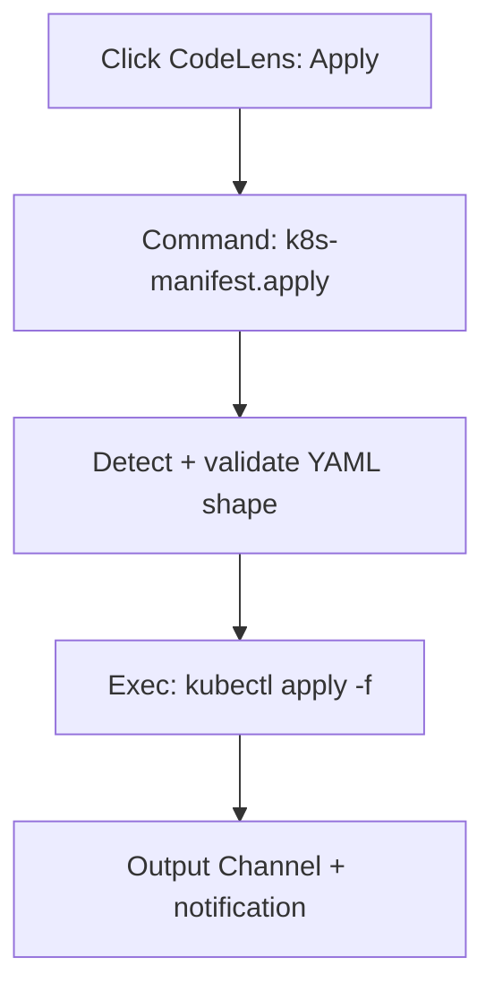

# Bespoke Editor Customization: Using Copilot to Build a VS Code Extension in Minutes

I spend an embarrassing amount of my life staring at Kubernetes YAML.

And if you do too, you know the pain pattern:

- open a manifest
- realize you need to _validate_ it
- pop to a terminal
- remember which kube context you’re in
- run a command
- copy/paste or re-run with flags
- go back to the file
- repeat until your coffee is cold

None of that is _hard_. It’s just… **a thousand tiny cuts**.

So I did the most reasonable thing a platform engineer can do: I made my editor
obey.

---

## 🎯 TL;DR for Busy Engineers

Instead of memorizing “the right” `kubectl` incantation and re-running it 30
times a day, I used Copilot to generate a small VS Code extension (TypeScript)
that:

- adds **CodeLens buttons** in YAML: **▶ Apply** and **✓ Validate**
- adds **right‑click menus** (editor + explorer) for apply/validate
- supports **Kustomize** (build/apply) when a `kustomization.yaml` is present
- pipes everything into a dedicated **Output Channel** (with notifications)
- is safe-ish by design: runs CLI via `execFile` (not a shell), and relies on
  your existing kubeconfig

Repo (code + CI + docs):

- https://github.com/ianlintner/kubernetes-apply-vscode

Docs site:

- https://ianlintner.github.io/kubernetes-apply-vscode/

---

## 🧠 The “bespoke editor” mindset

VS Code isn’t “just an editor” anymore. It’s a programmable workbench.

The trick is to stop asking:

> “Which extension does this?”

…and start asking:

> “What do I want _one click_ to mean in my workflow?”

If you can describe that in plain English, Copilot can usually help you
translate it into:

- commands (`contributes.commands`)
- menus (`contributes.menus`)
- configuration (`contributes.configuration`)
- a provider or two (in this case: CodeLens)

That’s the leap: **custom ergonomics**.

---

## 🔥 Why CodeLens + right‑click beats “just use the terminal”

There are two moments where I want zero friction:

1. **Validate** (dry run) before I apply
2. **Apply** right now, while I’m already looking at the diff

In this extension, “Validate” is literally just:

- `kubectl apply --dry-run=client -f <file>`

And “Apply” is:

- `kubectl apply -f <file>`

But the value isn’t the command. The value is removing the glue work:

- choosing the right file path
- remembering flags
- switching focus
- hunting down output

With CodeLens buttons, the manifest itself becomes the UI.

---

## 🧩 How it works (conceptually)

Here’s the flow when you click **▶ Apply**:



Under the hood, the extension is intentionally boring:

- parse YAML (including multi-document files)
- decide if it looks like Kubernetes (has `apiVersion`, `kind`, `metadata`)
- execute `kubectl` / `kustomize`
- log everything

Boring is good. Boring ships.

---

## 🧰 Configuration (aka: “make it behave the way _I_ like”)

This is the part I care about most: I can set defaults once, and then stop
thinking.

From the docs, the settings look like:

```json
{
  "k8s-manifest.enableCodeLens": true,
  "k8s-manifest.kubectlContext": "",
  "k8s-manifest.kubectlNamespace": "",
  "k8s-manifest.dryRun": false
}
```

A few examples that match how people actually work:

- **Always validate first**: set `k8s-manifest.dryRun: true` and keep clicking
  Apply (it stays safe).
- **Pin to a namespace** during an incident: set
  `k8s-manifest.kubectlNamespace: "prod"` so you stop fat‑finger deploying to
  `default`.
- **Pin to a context** for a repo: set `k8s-manifest.kubectlContext: "staging"`
  and treat it like a project-level default.

---

## 🧪 “But don’t we already have the Kubernetes extension?”

Yes—and it’s excellent.

This post isn’t “build your own because everything else is bad.” It’s the
opposite:

- big extensions tend to optimize for broad audiences
- **your** workflow is weird
- you are allowed to optimize for your own weirdness

I wanted a very specific loop for manifests:

- CodeLens in YAML
- right-click actions exactly where my muscle memory expects
- output in one predictable place

So I built the smallest thing that does exactly that.

---

## 🏗️ The Copilot workflow: from idea → extension

The fastest way I’ve found to build these is:

1. **Describe the UX** (not the implementation)
2. Let Copilot scaffold the “VS Code extension plumbing”
3. Iterate on behavior in small steps
4. Add guardrails (lint/tests)
5. Add docs + screenshots
6. Add a publish pipeline

A prompt that works well (roughly):

- “Generate a VS Code extension in TypeScript that adds CodeLens actions to YAML
  files when they look like Kubernetes manifests. Provide commands for
  apply/validate using kubectl, add right-click menus in editor and explorer,
  add settings for context/namespace/dry-run, and send output to an output
  channel.”

Then you keep it honest by asking for:

- small diffs
- explicit command IDs
- explicit `when` clauses for menus
- error handling paths (missing `kubectl`, failed command, bad YAML)

Copilot is great at turning “I want a button here” into the correct VS Code
contribution points.

---

## ✅ Shipping like you mean it: CI, docs, screenshots

The thing I’m happiest about isn’t the CodeLens.

It’s that the extension repo is set up like a real project:

- CI checks (compile/lint/tests)
- docs (MkDocs)
- docs deploy
- marketplace publishing workflow with guardrails

One detail I love: the publish workflow verifies that the git tag matches the
`package.json` version, and it can do a safe package-only dry run before it
publishes anything irreversible.

That’s the difference between:

- “a folder of scripts you’ll forget exists”
- and “a tool you can maintain without thinking too hard”

---

## 🧯 Practical notes (things that bite)

A few gotchas that are worth calling out:

- **CodeLens not showing?** VS Code has to recognize the file as YAML, and the
  file has to look like a Kubernetes resource (`apiVersion`, `kind`,
  `metadata`).
- **`kubectl` not found?** VS Code doesn’t always inherit your shell PATH exactly
  the way your terminal does.
- **No CRD schema validation (yet).** This is a CLI runner + light detection,
  not a full policy engine.

Still: the impact is outsized. You’re saving minutes constantly.

---

## ☕ The punchline

I generated this extension, published it, and shipped it with CI tooling, docs,
and screenshots to the VS Code Marketplace over my morning.

Final statement: I built it over morning coffee and it’s as good or better than many extensions.
