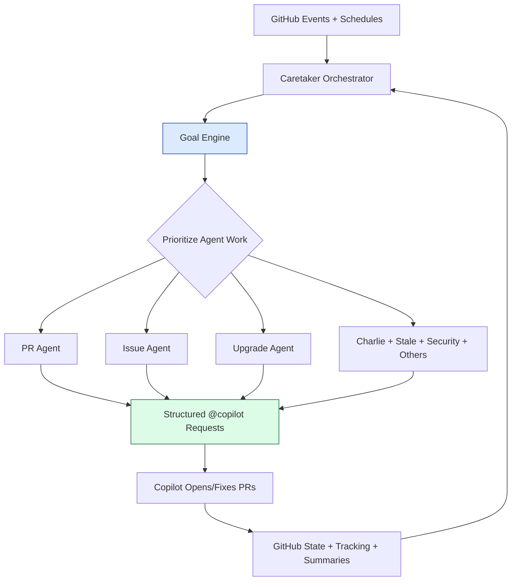

# 🧰 Caretaker: A Self-Managing Copilot Layer for Repo Operations

The bottleneck in modern software delivery is no longer code generation.

It's operational glue.

You can now generate implementation code at extreme speed, but the path from “code exists” to “safe in production” still includes a long chain of repetitive human coordination:

- triaging CI failures,
- nudging reviews,
- re-requesting small fixes,
- handling stale work,
- managing upgrade drift,
- and doing endless UI click-work to keep repo hygiene intact.

That mismatch is exactly why I built **[Caretaker](https://github.com/ianlintner/caretaker)**.

Caretaker is a **prototype/MVP for autonomous repository maintenance**. It treats GitHub as the system of record, Copilot as the execution engine, and an orchestrator as the decision layer.

If the future baseline is that an engineer will “own” dramatically more code than before, then we need a parallel upgrade in the maintenance layer. Caretaker is my attempt at that upgrade.

---

## 🚨 The real problem: SDLC toil now dominates

We used to think the expensive part was writing code.

Now the expensive part is **shepherding change**.

When agentic tooling multiplies throughput, teams hit a new constraint:

$$
\text{Delivery Throughput} \approx \min(\text{Code Generation},\, \text{Operational Coordination})
$$

Generation has exploded. Coordination hasn't.

So even though Copilot and agents can produce far more code, humans still spend disproportionate time on non-creative steps that are mostly deterministic and policy-driven.

Caretaker focuses exactly on that gap.

---

## 🧠 The core idea: separate deciding from doing

Caretaker follows a simple architecture principle:

> **The orchestrator decides. Copilot does. GitHub remembers.**

The orchestrator does _not_ write code. It reads repository state, evaluates what matters most, and dispatches work through structured issues/comments that Copilot can execute.

This lets the system scale operationally without turning the orchestrator into a giant code-writing monolith.

---

## 🐝 Why multi-agent instead of one mega-agent?

Because repository maintenance is not one job.

It's a portfolio of jobs with different risk profiles and feedback loops. Caretaker uses specialized agents (PR, Issue, Upgrade, DevOps, Self-heal, Security, Dependency, Docs, Charlie, Stale, Escalation) coordinated by one control loop.

| Agent      | Responsibility                                   | Why specialization matters                               |
| ---------- | ------------------------------------------------ | -------------------------------------------------------- |
| PR         | CI triage, retries, merge decisions              | Needs tight policy + state machine behavior              |
| Issue      | Classify and route incoming work                 | Needs language understanding + routing discipline        |
| Upgrade    | Track caretaker versions and open update work    | Needs release-awareness and pinning logic                |
| Charlie    | Clean duplicate/abandoned caretaker-managed work | Prevents automation-generated clutter from compounding   |
| Escalation | Summarize unresolved items for humans            | Keeps human attention focused on high-leverage decisions |

This is less “AI does everything” and more **clear boundaries + explicit handoffs**.

---

## 🎯 Goal-seeking is the difference between automation and autonomy

Most CI/CD automation is rule-triggered.

Caretaker adds a **goal layer** on top:

- score repository health dimensions,
- detect critical/diverging trends,
- reorder work by expected impact,
- persist goal history and run summaries.

In other words, it can ask: _what should we do first to improve repo health fastest?_ not just _what event fired first?_

That is a major shift from workflow choreography to operational intent.

---

## 🧩 Flexibility over paved paths

A big design goal was avoiding one rigid DevOps pattern.

Caretaker installs lightweight repo-native files (`.github/workflows/maintainer.yml`, `.github/maintainer/config.yml`, agent instruction files, version pinning) and then lets you shape behavior via config.

You can tune:

- auto-merge policy (Copilot/dependency/human),
- retry windows and escalation thresholds,
- issue assignment behavior,
- stale windows for generic vs caretaker-managed work,
- dependency/security conservatism,
- docs reconciliation, digests, and summary posture.

That makes it useful for different team topologies:

- solo maintainers,
- fast-moving OSS projects,
- stricter repos with conservative merge policy,
- teams that want stronger human checkpoints.

Same control plane, different policy.

---

## 🧱 The missing pieces around Copilot this tries to fill

Copilot is excellent at local task execution. But large-scale repository maintenance needs more than local code edits.

Caretaker addresses missing orchestration primitives:

1. **Persistent operational memory** across runs.
2. **Policy-aware retry and escalation loops**.
3. **Cross-surface reasoning** (issues, PRs, checks, workflows, stale queues).
4. **Identity-safe handoffs** for actions that need write-capable attribution.
5. **Human digesting**, not just raw event spam.

Think of it as adding an operations brain and feedback loops around the model.

---

## 🛠️ Why this matters now (and what gets interesting next)

The next baseline for engineering isn't just “write code faster.”
It's **maintain massively larger code surface area without burning out maintainers**.

Some areas I think are especially interesting from here:

### 1) Repo operations as a control system

We're moving toward closed-loop repository control where every run measures, acts, and learns.

### 2) Maintenance policy as product surface

`config.yml` becomes a programmable operating model for how your engineering system behaves under stress.

### 3) Human attention as the scarce resource

The goal of agentic maintenance shouldn't be full autonomy at all times. It should be **high-quality selective autonomy** that escalates only when human judgment is truly required.

### 4) Quality-toil ratio as a first-class metric

Teams should track not just lead time and change failure rate, but also:

$$
\text{Toil Ratio} = \frac{\text{Manual Repo Operations Time}}{\text{Total Delivery Time}}
$$

If that ratio isn't going down as AI output goes up, you're not actually compounding engineering leverage.

---

## 🧪 Caretaker today: prototype/MVP with real intent

Caretaker is still evolving quickly (with recent releases adding capabilities like improved orchestration and memory-related features), but the core thesis is stable:

- repo maintenance should be self-managing by default,
- policy should be explicit and configurable,
- Copilot should be orchestrated, not spammed,
- and humans should spend time on architecture and risk—not janitorial clicks.

If this direction resonates, the project is open source and very intentionally shaped in public:

- Repo: [github.com/ianlintner/caretaker](https://github.com/ianlintner/caretaker)
- Docs: [ianlintner.github.io/caretaker](https://ianlintner.github.io/caretaker/)

---

## ✅ Closing take

Agentic coding raised the ceiling on output.

Now we need agentic maintenance to raise the ceiling on ownership.

Caretaker is an MVP for that layer: a self-managing, goal-seeking, multi-agent repo operations system that reduces SDLC toil and lets engineers handle far more software responsibly.

And honestly, that's the only version of AI leverage that scales.
