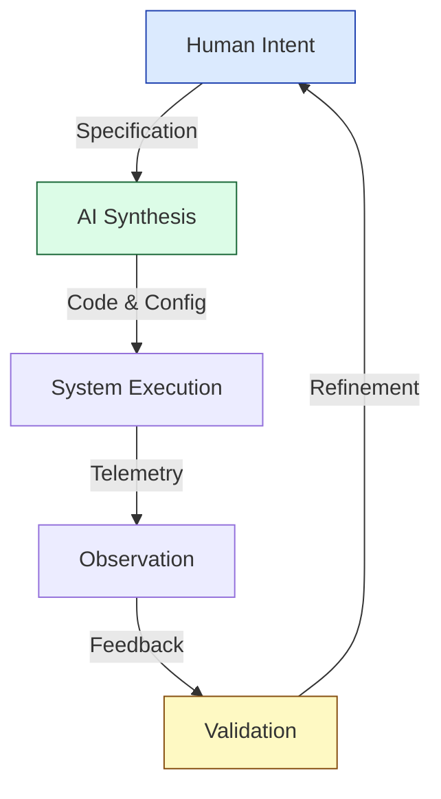

# 🔮 From Code to Tokens: The Future of Engineering in the Age of LLMs

Back in the day, we treated code like sacred texts. You had to learn the syntax, the quirks, the secret handshakes of C++ or Java.

But large language models (LLMs) are quietly dissolving that distinction.

To an LLM, code _is_ language—just another structured sequence of tokens. Whether it's English, Rust, or Verilog, the model parses and generates them with equal fluency. This simple fact reframes the entire notion of programming.

It's a shift that makes my brain spin, but my pragmatic side sees the potential.

---

## 💬 Code as a Linguistic Medium

When we write software, we express intent through the narrow channel of a programming language. Each line of code is a translation of human intent into a syntax a compiler understands.
For an LLM, those lines are just tokens—symbolic building blocks that can be rearranged, reasoned over, and rendered in any language.

That means the old mantra of _"write once, run anywhere"_ (born from Java's promise of portability) may soon evolve into something deeper:

> **Define specifications once, run anywhere.**

The "code" becomes a temporary by-product—an intermediate representation generated by an AI translator that bridges intent and execution. The human's job shifts from _writing programs_ to _defining precise specifications, constraints, and tolerances_.

---

## 🌐 The End of the Polyglot Era

Today's engineers are polyglots by necessity. We juggle dozens of languages and frameworks, each with a half-life shorter than the average career. We spend years mastering the subtle differences between syntax trees, compiler flags, and runtime quirks—all to express the same ideas in slightly different dialects.

That investment is starting to look like a legacy artifact.

As LLMs become capable of translating specifications into executable code across languages, platforms, and environments, the need for humans to master every low-level detail fades. The future engineer's strength won't lie in memorizing syntax or debugging type systems—it will lie in verifying that the AI's translation of intent is correct and reliable.

> **Learning to code in multiple languages may one day be as anachronistic as learning machine code was to the generation before us.**

There will still be language experts—those who understand compiler internals, performance tuning, and domain-specific optimizations—but the average developer won't need to be one. Spending a career learning and re-learning programming languages will increasingly be a waste of human potential.

The far more valuable skill will be **validation**: ensuring that AI-generated systems meet the intended specifications, behave safely, and evolve as designed.

---

## 📋 The Rise of Specification-Driven Engineering

Imagine an engineer describing a system at a high level: performance requirements, data contracts, safety limits, observability goals. The AI handles the tedious part—translating those specs into runnable, optimized code for each relevant platform or environment.

No need to hand-tune the same algorithm in five languages or refactor for every new framework. The AI will handle language translation, dependency management, and API conformance automatically. Humans remain in the loop, but their focus changes:

- **From syntax to semantics.**  
  Engineers specify _what_ must happen, not _how_ to write it.
- **From implementation to integrity.**  
  They ensure systems behave within tolerances—accuracy, latency, safety, cost.
- **From debugging to observability.**  
  They oversee telemetry, testing, and correction loops that feed back into the AI coding agents.

In other words, software engineering becomes systems engineering again.

---

## 🔄 Continuous Co-Development: Humans + Machines

The new software lifecycle might look like this:

1. **Specification** — Humans define requirements, constraints, and goals.
2. **Synthesis** — LLMs generate code, configurations, and documentation.
3. **Observation** — Systems run with continuous monitoring and feedback loops.
4. **Validation** — Engineers verify that behavior matches intent and correct errors in specification, not syntax.
5. **Regeneration** — AI updates codebases automatically to reflect new constraints.

In this loop, "programming" as we know it becomes a subset of a larger engineering discipline—one focused on emergent system behavior and trustworthiness, not syntax mastery.

---

## 🚀 The Next Paradigm: Define Once, Evolve Everywhere

When code is just tokens to an LLM, the boundaries between languages, platforms, and domains blur. We stop thinking in terms of writing programs and start thinking in terms of defining _systems of intent_.
The compiler of the future is a conversation: a dynamic dialogue between human judgment and machine translation.

The goal isn't "write once, run anywhere."
It's **define once, evolve everywhere**—with AI maintaining the bridge between human intent and machine execution.

---

## 🧭 What This Means for Engineers Today

The transition won't happen overnight, but the trajectory is clear:

| Traditional Developer                    | Future Engineer                                    |
| ---------------------------------------- | -------------------------------------------------- |
| Masters 5+ programming languages         | Masters specification languages and constraints    |
| Debugs syntax errors and type mismatches | Validates system behavior against tolerances       |
| Refactors code manually across platforms | Defines specs; AI handles cross-platform rendering |
| Writes unit tests line by line           | Designs validation frameworks and feedback loops   |
| Optimizes individual functions           | Architects observable, self-correcting systems     |
| Updates dependencies and APIs manually   | Oversees AI agents managing dependency evolution   |

**The future engineer won't be a polyglot programmer.**  
They'll be a designer of systems, specifications, and feedback loops.  
And the code? That'll be just another language the AI already speaks fluently.

---

## 💭 Implications and Open Questions

This paradigm shift raises important questions:

- **How do we train the next generation of engineers** when syntax mastery becomes less critical?
- **What does "correctness" mean** when code is an AI-generated intermediate artifact?
- **How do we ensure transparency** in AI-translated systems, especially for critical infrastructure?
- **What new tools and languages** will emerge for expressing specifications vs. implementations?

These aren't just academic concerns—they're design challenges for the next decade of developer tools, education, and practice.

---

## 🎯 Conclusion

The dissolution of the boundary between code and language isn't just a technical curiosity—it's a fundamental shift in how we build software.

**When LLMs see code as tokens:**

- Programming becomes specification
- Syntax mastery becomes validation expertise
- Polyglot skills become systems thinking
- Compilers become conversations

We're moving from an era where developers write code to an era where developers define systems and AI maintains the bridge between human intent and machine execution.

The question isn't whether this future will arrive—it's how quickly we adapt to it.

---

✍️ _Written by Ian Lintner_  
_Exploring the intersection of AI, software engineering, and the future of developer productivity._
