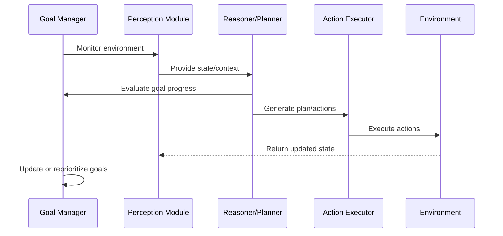
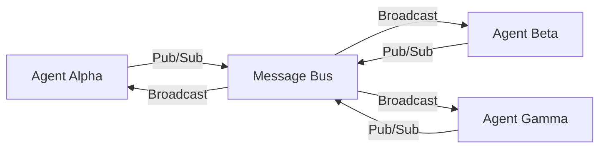
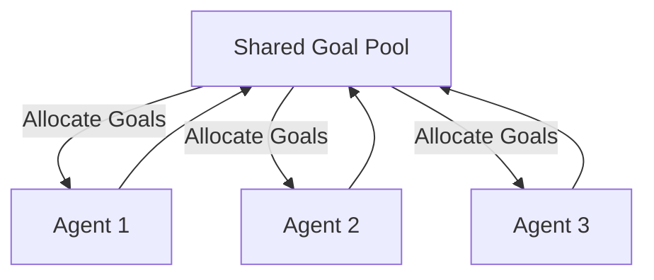

# 🧠 Goal-Seeking AI Architecture: How Multi-Agent Systems Collaborate Toward Shared Objectives

As engineering leaders (Staff Engineer, Principal Engineer, or Manager), you're increasingly asked to deliver **systems that don't just react**, but **proactively pursue business objectives**.  
To meet this challenge, AI must evolve from deterministic workflows into **goal-oriented, multi-agent ecosystems** capable of working together, reasoning, and aligning toward shared outcomes.

This blog explores how to architect **goal-seeking multi-agent systems (MAS)** and integrate them into existing interactive platforms.  
The focus is on **execution-ready engineering insights, operational risks, and leadership perspectives**, along with references to current research you can bring into your roadmap.

---

## 🧩 Core Architectural Layers

Here's a refined model you can use to structure your proposals and design docs:

```mermaid
flowchart TD
  A[Environment / Data ↵ (external APIs, user input, sensors)] --> B[Perception Layer]
  B --> C[Cognition Layer]
  C --> D[Coordination Layer]
  D --> E[Action Layer]
  E -->|Feedback| A
  D -->|Agent-to-Agent Messages| D2[Other Agents]
  D2 --> D
```

**Figure 1:** A high-level control flow: environment → perception → cognition → coordination → action → back to environment.

**What this means for leadership:**
- Break down your chunk of work into these architectural layers (rather than one big monolith).  
- Assign ownership of layers (e.g., perception, cognition, coordination) to teams or roles.  
- Ensure the coordination layer has explicit design reviews—this is where multi-agent complexity lives.

Studies of MAS underline this layered decomposition as foundational.  
Source: [Stone & Veloso, *Multiagent Systems: A Survey from a Machine Learning Perspective* (Carnegie Mellon University, 2000)](https://www.cs.cmu.edu/~mmv/papers/MASsurvey.pdf?utm_source=chatgpt.com)

---

## 🧠 Agent Internals: The Goal-Seeking Loop

Within each agent lives a feedback loop enabling it to pursue goals, evaluate progress, and adapt.  
Here's a sequence:



**Figure 2:** The internal loop of a goal-seeking agent.

**Leadership notes:**
- Each agent should expose metrics like *goal completion rate*, *sub-goal churn*, and *action latency*.  
- Ensure design includes a **Goal Manager** (setting and tracking goals) and a **Feedback Evaluator** (measuring progress).  
- When scaling to many agents, you'll need to instrument these loops for observability and drift detection.

Recent surveys of multi-agent reinforcement learning (MARL) highlight how communication and internal feedback loops are essential to avoid divergence or deadlock.  
Source: [Cui et al., *A Survey on Large-Population Systems and Scalable Multi-Agent Reinforcement Learning* (2022)](https://arxiv.org/abs/2209.03859?utm_source=chatgpt.com)

---

## 🔗 Communication & Coordination Mechanisms

Coordination is where the real engineering risk—and opportunity—resides.

### Message Bus Architecture



**Why this matters:**
- It decouples agents, enabling independent deployment and scaling.  
- Ensures asynchronous message flows (important when latency varies).  
- Makes it easier to add new agents or retire old ones without tight coupling.

### Consensus, Arbitration & Goal Allocation



**For leadership attention:**
- Define how goals are delegated (via scoring, bidding, leader election).  
- Develop policy for resource allocation across agents (compute, data access).  
- Build conflict-resolution pathways (who wins if two agents clash, escalation to human oversight, etc).

The latest research on "goal-oriented communication" addresses how to prioritize message value with respect to shared objectives under constraints.  
Source: [Charalambous et al., *Toward Goal-Oriented Communication in Multi-Agent Systems* (2025)](https://arxiv.org/abs/2508.07720?utm_source=chatgpt.com)

---

## 🧮 Example Use Case: Collaborative Agents in a Smart Factory

Here's how this plays out for a strategic system you might pitch or oversee.

### Scenario

- **Production Agent** – targets high throughput.  
- **Energy Agent** – targets reduced peak usage.  
- **Maintenance Agent** – targets minimal downtime.

### Shared Objective

> "Maximize output while staying within energy and maintenance constraints."

**Engineering considerations for leadership:**
- Build cross-functional KPIs (throughput, energy cost, equipment health) and ensure agents report on them.  
- Use the coordination layer to trade off between competing goals (e.g., push output vs. maintain equipment).  
- Set up dashboards for senior managers showing system health, agent specialization, and conflict resolution metrics.

Industrial MAS research confirms such architectures reduce latency to adapt and improve resilience.  
Source: [Maldonado et al., *Multi-Agent Systems: A Survey About Its Components, Framework and Workflow* (2025)](https://www.researchgate.net/publication/381151924_Multi-agent_Systems_A_survey_about_its_components_framework_and_workflow?utm_source=chatgpt.com)

---

## ⚙️ Engineering & Operational Leadership Considerations

As a senior engineer or manager, here are the questions you need to ensure are answered prior to full rollout:

| Concern | Why It's Important | Questions to Ask |
|---------|-------------------|------------------|
| **Latency & Real-Time Performance** | Delays can introduce stale decisions or agent conflicts | Are message queues timed? Is throughput measured end-to-end? |
| **State Consistency & Model Drift** | Divergent local models lead to misaligned decisions | How are state updates synchronized? Are stale models flagged? |
| **Security & Governance** | Multi-agent ecosystems increase attack surface | How is agent authentication handled? Are fail-safe mechanisms present? |
| **Scalability & Deployment** | Many agents increase complexity exponentially | Can we add/remove agents without architectural overhaul? |
| **Observability & Traceability** | Understanding decision chains is essential for audit | Is there a centralized log of goal assignment, decisions, and actions? |

Case studies and recent surveys emphasize observability, communication overhead, and human-agent coordination as top challenges.  
Source: [Guo et al., *Large Language Model Based Multi-Agents: A Survey of Progress* (IJCAI 2024)](https://www.ijcai.org/proceedings/2024/890?utm_source=chatgpt.com)

---

## 🧭 The Road to Collective Intelligence

From a leadership vantage point, you're steering toward a future where the organization's systems **don't just run tasks**, but **pursue missions**—and adapt when conditions change.

Things to monitor:
- **Emergent behavior:** Are agent interactions producing unexpected but beneficial outcomes—or undesirable ones?  
- **Human–agent alignment:** Are humans able to steer goals, intervene, and audit agent decisions?  
- **Evolution & learning:** Are agents improving collaboration, goal decomposition, or is growth stalled?

Recent research explores applying these architectures to LLM-based agents and goal-oriented systems across domains like edge intelligence, simulation, and real-time control.  
Source: [Anthropic, *How We Built Our Multi-Agent Research System* (2025)](https://www.anthropic.com/engineering/multi-agent-research-system?utm_source=chatgpt.com)

---

## 🪜 Conclusion

For staff and principal engineers and managers, building goal-seeking multi-agent systems means:

- Aligning architecture (perception → cognition → coordination → action) to your team structure and delivery model.  
- Ensuring robust coordination and communication frameworks are built, not retrofitted.  
- Addressing operational risks – latency, consistency, security, scalability, observability – upfront.  
- Monitoring for human alignment, emergent behavior, and evolution of agent capabilities.

When done well, you'll move from isolated features to **agentic systems working toward strategic outcomes**, enabling your organization to deliver intelligence at scale—not just automation.

---

## 🧾 Related Work & References

1. Stone, P. & Veloso, M. (2000). *Multiagent Systems: A Survey from a Machine Learning Perspective.* Autonomous Robotics, 8(3). [Link](https://www.cs.cmu.edu/~mmv/papers/MASsurvey.pdf?utm_source=chatgpt.com)  
2. Cui, K., Tahir, A., Ekinci, G., et al. (2022). *A Survey on Large‑Population Systems and Scalable Multi‑Agent Reinforcement Learning.* arXiv:2209.03859. [Link](https://arxiv.org/abs/2209.03859?utm_source=chatgpt.com)  
3. Charalambous, T., Pappas, N., Nomikos, N., & Wichman, R. (2025). *Toward Goal‑Oriented Communication in Multi‑Agent Systems: An Overview.* arXiv:2508.07720. [Link](https://arxiv.org/abs/2508.07720?utm_source=chatgpt.com)  
4. Guo, T., et al. (2024). *Large Language Model Based Multi‑Agents: A Survey of Progress.* IJCAI. [Link](https://www.ijcai.org/proceedings/2024/890?utm_source=chatgpt.com)  
5. Maldonado, D., et al. (2025). *Multi‑Agent Systems: A Survey About Its Components, Framework and Workflow.* ResearchGate. [Link](https://www.researchgate.net/publication/381151924_Multi-agent_Systems_A_survey_about_its_components_framework_and_workflow?utm_source=chatgpt.com)  
6. Anthropic. (2025). *How We Built Our Multi‑Agent Research System.* [Link](https://www.anthropic.com/engineering/multi-agent-research-system?utm_source=chatgpt.com)

---

✍️ _Written by Ian Lintner_  
_Exploring the intersection of AI, engineering leadership, and distributed systems._
