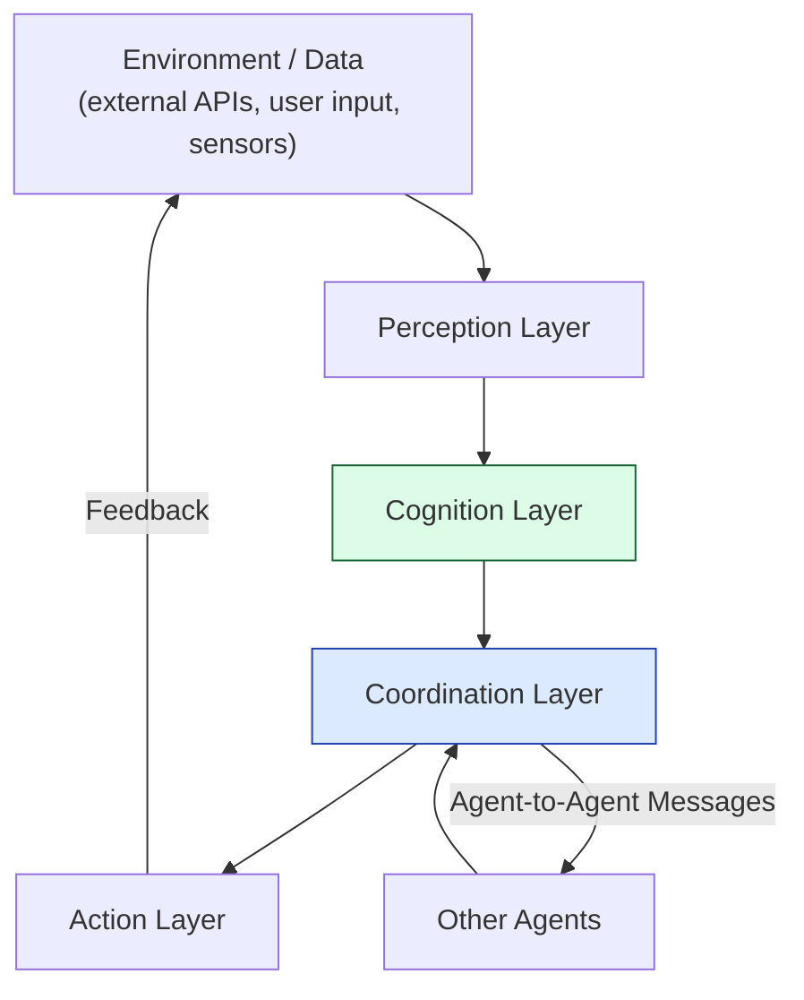

# 🧠 Goal-Seeking AI Architecture: How Multi-Agent Systems Collaborate Toward Shared Objectives

Back when I was an IC, we wrote code that did exactly what we told it to do. If it didn't, it was a bug. Simple.

Now? We're building systems that have _goals_. It's like managing a team of junior engineers—you give them a direction, not a script. And just like managing people, it's messy.

As engineering leaders (Staff Engineer, Principal Engineer, or Manager), you're increasingly asked to deliver **systems that don't just react**, but **proactively pursue business objectives**. To meet this challenge, AI must evolve from deterministic workflows into **goal-oriented, multi-agent ecosystems**.

This blog explores how to architect **goal-seeking multi-agent systems (MAS)**. I'll share some execution-ready engineering insights, operational risks, and leadership perspectives—stuff I wish I knew before I started tinkering with this.

---

## 🧩 Core Architectural Layers

Here's a refined model you can use to structure your proposals and design docs (and impress your boss):

**Figure 1:** A high-level control flow: environment → perception → cognition → coordination → action → back to environment.

**What this means for leadership:**

- **Don't build a monolith.** Break down your chunk of work into these architectural layers.
- **Assign ownership.** Give the "Perception" layer to one team and "Cognition" to another.
- **Watch the coordination layer.** This is where the complexity lives. It's the "meeting room" of your AI agents.

Studies of MAS underline this layered decomposition as foundational.  
Source: [Stone & Veloso, _Multiagent Systems: A Survey from a Machine Learning Perspective_ (Carnegie Mellon University, 2000)](https://www.cs.cmu.edu/~mmv/papers/MASsurvey.pdf?utm_source=chatgpt.com)

---

## 🧠 Agent Internals: The Goal-Seeking Loop

Within each agent lives a feedback loop enabling it to pursue goals, evaluate progress, and adapt.  
Here's a sequence:

**Figure 2:** The internal loop of a goal-seeking agent.

**Leadership notes:**

- **Metrics matter.** Each agent should expose metrics like _goal completion rate_, _sub-goal churn_, and _action latency_.
- **Design for failure.** Ensure design includes a **Goal Manager** (setting and tracking goals) and a **Feedback Evaluator** (measuring progress).
- **Observability is key.** When scaling to many agents, you'll need to instrument these loops for observability and drift detection.

Recent surveys of multi-agent reinforcement learning (MARL) highlight how communication and internal feedback loops are essential to avoid divergence or deadlock.  
Source: [Cui et al., _A Survey on Large-Population Systems and Scalable Multi-Agent Reinforcement Learning_ (2022)](https://arxiv.org/abs/2209.03859?utm_source=chatgpt.com)

---

## 🔗 Communication & Coordination Mechanisms

Coordination is where the real engineering risk—and opportunity—resides.

### Message Bus Architecture

**Why this matters:**

- It decouples agents, enabling independent deployment and scaling.
- Ensures asynchronous message flows (important when latency varies).
- Makes it easier to add new agents or retire old ones without tight coupling.

### Consensus, Arbitration & Goal Allocation

**For leadership attention:**

- Define how goals are delegated (via scoring, bidding, leader election).
- Develop policy for resource allocation across agents (compute, data access).
- Build conflict-resolution pathways (who wins if two agents clash, escalation to human oversight, etc).

The latest research on "goal-oriented communication" addresses how to prioritize message value with respect to shared objectives under constraints.  
Source: [Charalambous et al., _Toward Goal-Oriented Communication in Multi-Agent Systems_ (2025)](https://arxiv.org/abs/2508.07720?utm_source=chatgpt.com)

---

## 🧮 Example Use Case: Collaborative Agents in a Smart Factory

Here's how this plays out for a strategic system you might pitch or oversee.

### Scenario

- **Production Agent** – targets high throughput.
- **Energy Agent** – targets reduced peak usage.
- **Maintenance Agent** – targets minimal downtime.

### Shared Objective

> "Maximize output while staying within energy and maintenance constraints."

**Engineering considerations for leadership:**

- Build cross-functional KPIs (throughput, energy cost, equipment health) and ensure agents report on them.
- Use the coordination layer to trade off between competing goals (e.g., push output vs. maintain equipment).
- Set up dashboards for senior managers showing system health, agent specialization, and conflict resolution metrics.

Industrial MAS research confirms such architectures reduce latency to adapt and improve resilience.  
Source: [Maldonado et al., _Multi-Agent Systems: A Survey About Its Components, Framework and Workflow_ (2025)](https://www.researchgate.net/publication/381151924_Multi-agent_Systems_A_survey_about_its_components_framework_and_workflow?utm_source=chatgpt.com)

---

## ⚙️ Engineering & Operational Leadership Considerations

As a senior engineer or manager, here are the questions you need to ensure are answered prior to full rollout:

| Concern                             | Why It's Important                                      | Questions to Ask                                                       |
| ----------------------------------- | ------------------------------------------------------- | ---------------------------------------------------------------------- |
| **Latency & Real-Time Performance** | Delays can introduce stale decisions or agent conflicts | Are message queues timed? Is throughput measured end-to-end?           |
| **State Consistency & Model Drift** | Divergent local models lead to misaligned decisions     | How are state updates synchronized? Are stale models flagged?          |
| **Security & Governance**           | Multi-agent ecosystems increase attack surface          | How is agent authentication handled? Are fail-safe mechanisms present? |
| **Scalability & Deployment**        | Many agents increase complexity exponentially           | Can we add/remove agents without architectural overhaul?               |
| **Observability & Traceability**    | Understanding decision chains is essential for audit    | Is there a centralized log of goal assignment, decisions, and actions? |

Case studies and recent surveys emphasize observability, communication overhead, and human-agent coordination as top challenges.  
Source: [Guo et al., _Large Language Model Based Multi-Agents: A Survey of Progress_ (IJCAI 2024)](https://www.ijcai.org/proceedings/2024/890?utm_source=chatgpt.com)

---

## 🧭 The Road to Collective Intelligence

From a leadership vantage point, you're steering toward a future where the organization's systems **don't just run tasks**, but **pursue missions**—and adapt when conditions change.

Things to monitor:

- **Emergent behavior:** Are agent interactions producing unexpected but beneficial outcomes—or undesirable ones?
- **Human–agent alignment:** Are humans able to steer goals, intervene, and audit agent decisions?
- **Evolution & learning:** Are agents improving collaboration, goal decomposition, or is growth stalled?

Recent research explores applying these architectures to LLM-based agents and goal-oriented systems across domains like edge intelligence, simulation, and real-time control.  
Source: [Anthropic, _How We Built Our Multi-Agent Research System_ (2025)](https://www.anthropic.com/engineering/multi-agent-research-system?utm_source=chatgpt.com)

---

## 🪜 Conclusion

For staff and principal engineers and managers, building goal-seeking multi-agent systems means:

- Aligning architecture (perception → cognition → coordination → action) to your team structure and delivery model.
- Ensuring robust coordination and communication frameworks are built, not retrofitted.
- Addressing operational risks – latency, consistency, security, scalability, observability – upfront.
- Monitoring for human alignment, emergent behavior, and evolution of agent capabilities.

When done well, you'll move from isolated features to **agentic systems working toward strategic outcomes**, enabling your organization to deliver intelligence at scale—not just automation.

---

## 🧾 Related Work & References

1. Stone, P. & Veloso, M. (2000). _Multiagent Systems: A Survey from a Machine Learning Perspective._ Autonomous Robotics, 8(3). [Link](https://www.cs.cmu.edu/~mmv/papers/MASsurvey.pdf?utm_source=chatgpt.com)
2. Cui, K., Tahir, A., Ekinci, G., et al. (2022). _A Survey on Large-Population Systems and Scalable Multi-Agent Reinforcement Learning._ arXiv:2209.03859. [Link](https://arxiv.org/abs/2209.03859?utm_source=chatgpt.com)
3. Charalambous, T., Pappas, N., Nomikos, N., & Wichman, R. (2025). _Toward Goal-Oriented Communication in Multi-Agent Systems: An Overview._ arXiv:2508.07720. [Link](https://arxiv.org/abs/2508.07720?utm_source=chatgpt.com)
4. Guo, T., et al. (2024). _Large Language Model Based Multi-Agents: A Survey of Progress._ IJCAI. [Link](https://www.ijcai.org/proceedings/2024/890?utm_source=chatgpt.com)
5. Maldonado, D., et al. (2025). _Multi-Agent Systems: A Survey About Its Components, Framework and Workflow._ ResearchGate. [Link](https://www.researchgate.net/publication/381151924_Multi-agent_Systems_A_survey_about_its_components_framework_and_workflow?utm_source=chatgpt.com)
6. Anthropic. (2025). _How We Built Our Multi-Agent Research System._ [Link](https://www.anthropic.com/engineering/multi-agent-research-system?utm_source=chatgpt.com)

---

✍️ _Written by Ian Lintner_  
_Exploring the intersection of AI, engineering leadership, and distributed systems._
