# Kubernetes Manifest Management: Centralized Repo vs. App-Scoped k8s Directories

Uff da. Where do you put your K8s manifests?

It sounds like a boring question, but I've seen this decision tear teams apart faster than a Vikings playoff loss. It's the "tabs vs spaces" of the platform engineering world.

I've been around the block a few times—started as a sysadmin racking servers, now I'm managing teams and taking grad classes on organizational theory at night. And let me tell you, Conway's Law is real, and it hits hard here.

One of the most consequential decisions you'll make is **where to store your manifests**. It ripples through everything: developer velocity, security, and how much your on-call engineer swears at 3 AM.

There are two main camps:

1.  **Centralized Platform Repository:** One big repo to rule them all.
2.  **Distributed App-Scoped Directories:** Every app carries its own luggage.

Neither is perfect. But as we say in Minnesota, "It could be worse." Let's break it down.

---

## 🎯 TL;DR for Busy Engineers

| Factor                      | Centralized Repo                                      | App-Scoped (`k8s/` per app)                           |
| --------------------------- | ----------------------------------------------------- | ----------------------------------------------------- |
| **Best for**                | Platform teams, regulated industries, &lt;50 services | Product-focused teams, microservices, 10-200 services |
| **Ownership**               | Platform/SRE team                                     | Application developers                                |
| **Change velocity**         | Slower, controlled (Ope, let me check that PR)        | Faster, autonomous (You betcha)                       |
| **Blast radius visibility** | Excellent                                             | Limited                                               |
| **Developer experience**    | Context switching                                     | Unified workflow                                      |
| **Compliance**              | Easier auditing                                       | Distributed auditing                                  |

---

## 📐 The Two Patterns Visualized

```mermaid
graph TB
    subgraph "Pattern A: Centralized Platform Repo"
        direction TB
        PlatformRepo[("📁 platform-infra<br/>(single repo)")]

        subgraph "Repository Structure"
            K8sBase["k8s/"]
            AppsDir["├── apps/"]
            App1Dir["│   ├── app-1/"]
            App2Dir["│   ├── app-2/"]
            App3Dir["│   └── app-3/"]
            BaseDir["├── base/"]
            EnvsDir["└── environments/"]
            DevEnv["    ├── dev/"]
            StagingEnv["    ├── staging/"]
            ProdEnv["    └── prod/"]
        end

        PlatformRepo --> K8sBase
        K8sBase --> AppsDir
        AppsDir --> App1Dir
        AppsDir --> App2Dir
        AppsDir --> App3Dir
        K8sBase --> BaseDir
        K8sBase --> EnvsDir
        EnvsDir --> DevEnv
        EnvsDir --> StagingEnv
        EnvsDir --> ProdEnv
    end

    subgraph "Pattern B: Distributed App-Scoped"
        direction TB
        AppRepo1[("📁 app-1-repo")]
        AppRepo2[("📁 app-2-repo")]
        AppRepo3[("📁 app-3-repo")]

        subgraph "Each App Repo"
            SrcDir["src/"]
            TestsDir["tests/"]
            K8sLocal["k8s/"]
            LocalBase["├── base/"]
            LocalOverlays["└── overlays/"]
            LocalDev["    ├── dev/"]
            LocalProd["    └── prod/"]
        end

        AppRepo1 --> SrcDir
        AppRepo1 --> TestsDir
        AppRepo1 --> K8sLocal
        K8sLocal --> LocalBase
        K8sLocal --> LocalOverlays
        LocalOverlays --> LocalDev
        LocalOverlays --> LocalProd
    end
```

---

## 🏗️ Pattern A: The Centralized Platform Repository

In this pattern, all Kubernetes manifests live in a dedicated infrastructure repository. It's like the Mall of America—everything is under one roof.

### When Centralized Works Well

*   **Compliance & Audit:** If you have auditors breathing down your neck, pointing them to one repo is a heck of a lot easier than pointing them to 50.
*   **Platform Teams:** If you have a dedicated SRE team that treats infrastructure as a product, this gives them a nice sandbox.
*   **Cross-Cutting Concerns:** Changing a network policy for everyone? One PR. Done.

### Real-World Example: The "Big Bank" Approach

I worked with a fintech company once. They needed SOC 2 compliance yesterday. We went centralized.

Why? **Separation of Duties.** Developers wrote code, but they couldn't touch the production resource limits without a Platform Engineer approving the PR. It slowed things down a bit, but it kept the auditors happy.

### The "Ope" Moment (Disadvantages)

*   **Developer Friction:** "Ope, I forgot to update the infra repo." Context switching is real.
*   **Bottlenecks:** The Platform team becomes the gatekeeper. And nobody likes a gatekeeper when they're trying to ship a hotfix on a Friday.

---

## 🔧 Pattern B: Distributed App-Scoped Directories

Here, every app packs its own lunch. The manifests live right next to the source code in `k8s/` or `deploy/`.

### When Distributed Works Well

*   **Team Autonomy:** You want your product teams to move fast? Give them the keys.
*   **Microservices:** If you have 80 services, managing them in one repo is a nightmare.
*   **GitOps Maturity:** If you're using Flux or ArgoCD with image automation, this is the way to go.

### Real-World Example: The SaaS Startup

A mid-sized SaaS company I know (about 80 microservices) went this route.

1.  **Atomic Changes:** A developer could change the code AND the environment variable in the same PR.
2.  **Local Dev:** They used Skaffold to run the local `k8s/` directory. It was slick.

### The "Uff Da" Moment (Disadvantages)

*   **Inconsistency:** Team A uses Helm, Team B uses Kustomize, and Team C is copy-pasting raw YAML. It gets messy.
*   **Sprawl:** Updating a base image across 80 repos? You better have a script for that.

---

## ⚖️ Decision Framework: What Would a Minnesotan Do?

It comes down to your team structure. In my grad classes, we talk about "socio-technical systems." Basically, your architecture should match your org chart.

### Key Questions to Ask

1.  **Who owns deployments?**
    *   Platform team? -> **Centralized**.
    *   Product squads? -> **Distributed**.

2.  **How scary is your compliance officer?**
    *   Very scary? -> **Centralized**.
    *   Chill? -> **Distributed**.

3.  **How many services we talkin'?**
    *   < 20? -> **Centralized**. Keep it simple.
    *   > 50? -> **Distributed**. Don't create a monolith if you don't have to.

### The Hybrid Approach (The "Hotdish" of Architectures)

Many mature orgs do a mix. It's like a tater tot hotdish—a little bit of everything, baked together.

*   **Platform Repo:** Holds the cluster config, namespaces, RBAC, and "Golden Path" templates.
*   **App Repos:** Hold the specific Deployment and Service definitions.

This is usually where I steer people. It gives you control where you need it (security) and freedom where you want it (features).

---

## 🤖 The AI Agent Factor

Now, here's a new wrinkle. AI agents.

I've been playing with these "coding agents" lately. If you have a **Centralized Repo**, the agent can see the whole world. It knows that `Service A` talks to `Service B`.

If you have **Distributed Repos**, the agent is wearing blinders. It only sees the current app.

**My advice:** If you're going heavy on AI coding agents, **Centralized** is actually easier for them to reason about right now. But that might change as we get better multi-repo context tools (like MCP).

---

## 🎯 Conclusion: There's No One-Size-Fits-All

Look, there's no "correct" answer here. It's all about trade-offs.

**Start Centralized if:** You're small, or you're scared of auditors.
**Go Distributed if:** You want speed and your teams are mature enough to handle it.
**Go Hybrid if:** You're big and you like complexity (or you just want the best of both worlds).

Whatever you choose, just make sure you document it. And maybe bring donuts for the platform team. They're working hard.

You betcha.

---

## Footnotes

[^1]: Kubernetes Documentation. "Configuration Best Practices." [https://kubernetes.io/docs/concepts/configuration/overview/](https://kubernetes.io/docs/concepts/configuration/overview/)
[^2]: FluxCD. "Multi-Tenancy." [https://fluxcd.io/flux/installation/configuration/multitenancy/](https://fluxcd.io/flux/installation/configuration/multitenancy/)
