# Kubernetes Manifest Management: Centralized Repo vs. App-Scoped k8s Directories

Where do you put your K8s manifests?

It sounds like a boring question, but I've seen this decision tear teams apart. It's the "tabs vs spaces" of the platform engineering world. I've tried both ways, and I have *opinions*.

One of the most consequential—and often overlooked—architectural decisions in Kubernetes adoption is **where to store your manifests**. This choice ripples through your entire organization: affecting developer velocity, security posture, operational complexity, and your ability to reason about system state.

Across organizations of all sizes, two dominant approaches have emerged for managing Kubernetes manifests:

1. **Centralized Platform Repository**: A single "infrastructure" or "platform" repo containing all Kubernetes manifests for all applications.
2. **Distributed App-Scoped Directories**: Each application repository contains its own `k8s/` or `deploy/` directory with its manifests.

Neither is universally correct. The right choice depends on your organization's size, team structure, security requirements, and operational maturity. This guide will help you understand the trade-offs and make an informed decision.

---

## 🎯 TL;DR for Busy Engineers


| Factor                      | Centralized Repo                                      | App-Scoped (`k8s/` per app)                           |
| --------------------------- | ----------------------------------------------------- | ----------------------------------------------------- |
| **Best for**                | Platform teams, regulated industries, <50 services | Product-focused teams, microservices, 10-200 services |
| **Ownership**               | Platform/SRE team                                     | Application developers                                |
| **Change velocity**         | Slower, controlled                                    | Faster, autonomous                                    |
| **Blast radius visibility** | Excellent                                             | Limited                                               |
| **Developer experience**    | Context switching                                     | Unified workflow                                      |
| **Compliance**              | Easier auditing                                       | Distributed auditing                                  |

---

## 📐 The Two Patterns Visualized

```mermaid
graph TB
    subgraph "Pattern A: Centralized Platform Repo"
        direction TB
        PlatformRepo[("📁 platform-infra<br/>(single repo)")]

        subgraph "Repository Structure"
            K8sBase["k8s/"]
            AppsDir["├── apps/"]
            App1Dir["│   ├── app-1/"]
            App2Dir["│   ├── app-2/"]
            App3Dir["│   └── app-3/"]
            BaseDir["├── base/"]
            EnvsDir["└── environments/"]
            DevEnv["    ├── dev/"]
            StagingEnv["    ├── staging/"]
            ProdEnv["    └── prod/"]
        end

        PlatformRepo --> K8sBase
        K8sBase --> AppsDir
        AppsDir --> App1Dir
        AppsDir --> App2Dir
        AppsDir --> App3Dir
        K8sBase --> BaseDir
        K8sBase --> EnvsDir
        EnvsDir --> DevEnv
        EnvsDir --> StagingEnv
        EnvsDir --> ProdEnv
    end

    subgraph "Pattern B: Distributed App-Scoped"
        direction TB
        AppRepo1[("📁 app-1-repo")]
        AppRepo2[("📁 app-2-repo")]
        AppRepo3[("📁 app-3-repo")]

        subgraph "Each App Repo"
            SrcDir["src/"]
            TestsDir["tests/"]
            K8sLocal["k8s/"]
            LocalBase["├── base/"]
            LocalOverlays["└── overlays/"]
            LocalDev["    ├── dev/"]
            LocalProd["    └── prod/"]
        end

        AppRepo1 --> SrcDir
        AppRepo1 --> TestsDir
        AppRepo1 --> K8sLocal
        K8sLocal --> LocalBase
        K8sLocal --> LocalOverlays
        LocalOverlays --> LocalDev
        LocalOverlays --> LocalProd
    end
```



---

## 🏗️ Pattern A: The Centralized Platform Repository

In this pattern, all Kubernetes manifests live in a dedicated infrastructure repository, separate from application source code.

### Typical Structure

```
platform-infra/
├── README.md
├── k8s/
│   ├── apps/
│   │   ├── frontend/
│   │   │   ├── base/
│   │   │   │   ├── deployment.yaml
│   │   │   │   ├── service.yaml
│   │   │   │   ├── hpa.yaml
│   │   │   │   └── kustomization.yaml
│   │   │   └── overlays/
│   │   │       ├── dev/
│   │   │       ├── staging/
│   │   │       └── prod/
│   │   ├── api-gateway/
│   │   ├── user-service/
│   │   └── payment-service/
│   ├── base/
│   │   ├── namespaces/
│   │   ├── network-policies/
│   │   ├── resource-quotas/
│   │   └── rbac/
│   ├── infrastructure/
│   │   ├── cert-manager/
│   │   ├── ingress-nginx/
│   │   ├── prometheus/
│   │   └── fluxcd/
│   └── environments/
│       ├── dev/
│       │   └── kustomization.yaml
│       ├── staging/
│       │   └── kustomization.yaml
│       └── prod/
│           └── kustomization.yaml
├── terraform/
│   └── (cloud infrastructure)
└── scripts/
    └── (operational tooling)
```

### When Centralized Works Well


### Real-World Example: Enterprise Financial Services

Consider a fintech company that adopted centralized manifests for their 40-service platform. Their reasoning:

1. **SOC 2 Compliance**: Auditors needed a single repo to review all infrastructure changes
2. **Separation of Duties**: Developers couldn't modify production resource limits or network policies
3. **Blast Radius Control**: Platform team could review cross-service impacts before merging
4. **Standardization**: Consistent labeling, annotations, and resource patterns across all services

```yaml
# Example: Standardized base deployment template
# k8s/base/deployment-template/deployment.yaml
apiVersion: apps/v1
kind: Deployment
metadata:
  name: ${APP_NAME}
  labels:
    app.kubernetes.io/name: ${APP_NAME}
    app.kubernetes.io/component: ${COMPONENT}
    app.kubernetes.io/part-of: ${PRODUCT}
    app.kubernetes.io/managed-by: platform-team
    compliance.company.io/data-classification: ${DATA_CLASS}
spec:
  replicas: ${REPLICAS}
  selector:
    matchLabels:
      app.kubernetes.io/name: ${APP_NAME}
  template:
    metadata:
      labels:
        app.kubernetes.io/name: ${APP_NAME}
      annotations:
        prometheus.io/scrape: "true"
        prometheus.io/port: "8080"
    spec:
      securityContext:
        runAsNonRoot: true
        seccompProfile:
          type: RuntimeDefault
      containers:
        - name: ${APP_NAME}
          image: ${IMAGE}
          securityContext:
            allowPrivilegeEscalation: false
            capabilities:
              drop:
                - ALL
          resources:
            requests:
              cpu: ${CPU_REQUEST}
              memory: ${MEM_REQUEST}
            limits:
              cpu: ${CPU_LIMIT}
              memory: ${MEM_LIMIT}
```

### Advantages of Centralized

| Benefit                          | Details                                                    |
| -------------------------------- | ---------------------------------------------------------- |
| **Single Source of Truth**       | One place to understand entire cluster state               |
| **Atomic Multi-Service Changes** | Update network policies affecting 10 services in one PR    |
| **Consistent Standards**         | Enforce labeling, security contexts, resource limits       |
| **Simplified Auditing**          | One repo's history tells the complete infrastructure story |
| **Platform Team Efficiency**     | Experts focus on infrastructure without context-switching  |
| **Dependency Visibility**        | Easy to see which services share configurations            |

### Disadvantages of Centralized

| Challenge                | Mitigation                                            |
| ------------------------ | ----------------------------------------------------- |
| **Developer Friction**   | Devs must make PRs to separate repo for infra changes |
| **Coupling**             | App and infra changes can't be atomic                 |
| **Bottleneck Risk**      | Platform team becomes a gatekeeper                    |
| **Conway's Law Tension** | Separation may not match team structure               |
| **Scaling Issues**       | Single repo can become unwieldy at 100+ services      |
| **Context Switching**    | Developers lose context when jumping between repos    |

---

## 🔧 Pattern B: Distributed App-Scoped Directories

In this pattern, each application repository contains its own Kubernetes manifests, typically in a `k8s/`, `deploy/`, or `.kubernetes/` directory.

### Typical Structure

```
my-application/
├── README.md
├── src/
│   └── (application code)
├── tests/
│   └── (test files)
├── Dockerfile
├── k8s/
│   ├── base/
│   │   ├── deployment.yaml
│   │   ├── service.yaml
│   │   ├── configmap.yaml
│   │   └── kustomization.yaml
│   └── overlays/
│       ├── dev/
│       │   ├── kustomization.yaml
│       │   └── replica-patch.yaml
│       ├── staging/
│       │   ├── kustomization.yaml
│       │   └── resources.yaml
│       └── prod/
│           ├── kustomization.yaml
│           ├── hpa.yaml
│           └── pdb.yaml
├── .github/
│   └── workflows/
│       └── deploy.yaml
└── package.json / go.mod / requirements.txt
```

### When Distributed Works Well


### Real-World Example: SaaS Platform

A mid-sized SaaS company with 80 microservices adopted app-scoped manifests:

1. **Team Autonomy**: Each squad owned their service end-to-end, including deployment
2. **Atomic Changes**: Feature work + manifest changes in single PR
3. **Local Development**: Engineers could test Kubernetes configs with Skaffold/Tilt
4. **Reduced Bottleneck**: No waiting on platform team for simple changes

```yaml
# Example: App-scoped deployment with environment overlays
# my-service/k8s/base/deployment.yaml
apiVersion: apps/v1
kind: Deployment
metadata:
  name: my-service
spec:
  selector:
    matchLabels:
      app: my-service
  template:
    metadata:
      labels:
        app: my-service
    spec:
      containers:
        - name: my-service
          image: my-service:latest # Replaced by FluxCD image automation
          ports:
            - containerPort: 8080
          env:
            - name: LOG_LEVEL
              value: info
          livenessProbe:
            httpGet:
              path: /health
              port: 8080
            initialDelaySeconds: 10
          readinessProbe:
            httpGet:
              path: /ready
              port: 8080
            initialDelaySeconds: 5
```

```yaml
# my-service/k8s/overlays/prod/kustomization.yaml
apiVersion: kustomize.config.k8s.io/v1beta1
kind: Kustomization
namespace: production
resources:
  - ../../base
patches:
  - path: hpa.yaml
  - path: pdb.yaml
  - path: resources-patch.yaml
images:
  - name: my-service
    newName: acr.azurecr.io/my-service
    newTag: ${GIT_SHA} # Replaced by CI/CD
```

### Advantages of Distributed

| Benefit                  | Details                                               |
| ------------------------ | ----------------------------------------------------- |
| **Atomic Changes**       | App code + manifests in single commit/PR              |
| **Team Ownership**       | Full accountability, no handoffs                      |
| **Local Development**    | Test K8s configs with Skaffold, Tilt, or Telepresence |
| **Reduced Coordination** | No cross-team dependencies for deployments            |
| **Natural Boundaries**   | Manifests follow service boundaries                   |
| **Version Cohesion**     | App version and manifest version always match         |

### Disadvantages of Distributed

| Challenge                 | Mitigation                                      |
| ------------------------- | ----------------------------------------------- |
| **Inconsistency**         | Teams may diverge on patterns, labels, security |
| **Duplication**           | Similar configs repeated across repos           |
| **Cross-Cutting Pain**    | Network policies, RBAC updates require many PRs |
| **Visibility Gap**        | Hard to see full cluster state                  |
| **Sprawl**                | Many repos to maintain, template, update        |
| **Compliance Complexity** | Auditing requires scanning many repositories    |

---

## ⚖️ Decision Framework


### Organizational Factors


### Key Questions to Ask

1. **Who owns deployments?**
   - Platform team → Centralized
   - Product squads → Distributed

2. **How often do cross-cutting changes happen?**
   - Frequently → Centralized (easier atomic updates)
   - Rarely → Distributed (changes are isolated)

3. **What's your compliance posture?**
   - SOC 2, HIPAA, PCI → Centralized (simpler auditing)
   - Minimal regulation → Either works

4. **How mature is your GitOps tooling?**
   - New to GitOps → Centralized (simpler to start)
   - Experienced → Distributed (can handle complexity)

5. **What's your service count trajectory?**
   - Stable, <30 → Centralized
   - Growing rapidly, 50+ → Distributed or Hybrid

### The Hybrid Approach

Many mature organizations adopt a hybrid model that combines the best of both worlds:

```mermaid
graph TB
    subgraph "Platform Repo (Centralized)"
        InfraRepo[("📁 platform-infra")]
        ClusterConfig["Cluster Configuration<br/>• Namespaces<br/>• RBAC<br/>• Network Policies<br/>• Resource Quotas"]
        SharedInfra["Shared Infrastructure<br/>• Ingress Controllers<br/>• Service Mesh<br/>• Monitoring Stack<br/>• Cert Manager"]
        BaseTemplates["Base Templates<br/>• Deployment patterns<br/>• Security policies<br/>• Labeling standards"]

        InfraRepo --> ClusterConfig
        InfraRepo --> SharedInfra
        InfraRepo --> BaseTemplates
    end

    subgraph "App Repos (Distributed)"
        AppRepo1[("📁 app-1")]
        AppRepo2[("📁 app-2")]
        AppRepo3[("📁 app-3")]

        K8sDir1["k8s/<br/>• Deployment<br/>• Service<br/>• HPA"]
        K8sDir2["k8s/<br/>• Deployment<br/>• ConfigMap"]
        K8sDir3["k8s/<br/>• Deployment<br/>• CronJob"]

        AppRepo1 --> K8sDir1
        AppRepo2 --> K8sDir2
        AppRepo3 --> K8sDir3
    end

    subgraph "FluxCD / ArgoCD"
        GitOps["GitOps Controller"]

        GitOps -->|"Syncs cluster config"| InfraRepo
        GitOps -->|"Syncs app manifests"| AppRepo1
        GitOps -->|"Syncs app manifests"| AppRepo2
        GitOps -->|"Syncs app manifests"| AppRepo3
    end

    BaseTemplates -.->|"Teams extend"| K8sDir1
    BaseTemplates -.->|"Teams extend"| K8sDir2
    BaseTemplates -.->|"Teams extend"| K8sDir3
```



**Hybrid Responsibilities:**

| Centralized (Platform Repo)          | Distributed (App Repos)               |
| ------------------------------------ | ------------------------------------- |
| Namespace creation & policies        | Application-specific deployments      |
| Cluster-wide RBAC                    | Service accounts for the app          |
| Network policies (deny-all defaults) | Egress rules for app dependencies     |
| Resource quotas per namespace        | Resource requests/limits within quota |
| Ingress controller, service mesh     | VirtualServices, DestinationRules     |
| Monitoring infrastructure            | App-specific ServiceMonitors          |
| Base deployment templates            | Overlay customizations                |
| Security policies (OPA/Kyverno)      | Compliance with policies              |

---

## 🛣️ Sharing Paved Paths: Observability, Auth, & More

Regardless of where your manifests live, you need a strategy for "paved paths"—standardized ways to consume shared services like observability, logging, authentication, and databases.

### The "Service Binding" Problem

In a **Centralized** model, the platform team often hardcodes connections to shared infrastructure. In a **Distributed** model, app teams need a way to discover these resources without copy-pasting credentials.

#### 1. Observability & Logging

Instead of asking every team to configure a Prometheus sidecar or Fluentd config:

- **Centralized:** Deploy `ServiceMonitors` and `ClusterOutput` resources in the platform repo.
- **Distributed:** Provide a "base" Kustomize layer that includes standard labels and annotations.
  ```yaml
  # k8s/base/monitoring.yaml
  metadata:
    labels:
      monitoring.company.io/enabled: "true" # Operator picks this up
    annotations:
      logging.company.io/parser: "json"
  ```

#### 2. Authentication (AuthN/AuthZ)

Don't let teams implement their own OIDC logic.

- **Pattern:** Use an ingress-level authentication provider (like OAuth2 Proxy) managed centrally.
- **Implementation:** App teams just add an annotation to their Ingress resource.
  ```yaml
  apiVersion: networking.k8s.io/v1
  kind: Ingress
  metadata:
    annotations:
      nginx.ingress.kubernetes.io/auth-url: "https://auth.company.io/oauth2/auth"
      nginx.ingress.kubernetes.io/auth-signin: "https://auth.company.io/oauth2/start"
  ```

#### 3. Databases & Cloud Resources

How do apps get their `DATABASE_URL`?

- **Old Way:** Terraform outputs -> LastPass -> Kubernetes Secrets (Manual).
- **Paved Path:** Use **Crossplane** or **Azure Service Operator** to provision DBs via K8s manifests, then use **Service Binding** to inject secrets.
  ```yaml
  # App team requests a DB in their repo
  apiVersion: database.azure.com/v1beta1
  kind: PostgresServer
  metadata:
    name: my-app-db
  spec:
    sku: GP_Gen5_2
    # ...
  ---
  # Secret is automatically created and injected
  apiVersion: servicebinding.io/v1alpha3
  kind: ServiceBinding
  metadata:
    name: db-binding
  spec:
    service:
      apiVersion: database.azure.com/v1beta1
      kind: PostgresServer
      name: my-app-db
    workload:
      apiVersion: apps/v1
      kind: Deployment
      name: my-app
  ```

---

## 🛠️ Implementation Patterns

### Pattern: Centralized with Golden Paths

For centralized repos that want to reduce developer friction:

```yaml
# platform-infra/templates/golden-path/web-service/
# Developers copy this template to create new services

apiVersion: kustomize.config.k8s.io/v1beta1
kind: Kustomization

resources:
  - ../../base/web-service # Shared base with security, monitoring

configMapGenerator:
  - name: app-config
    literals:
      - APP_NAME=REPLACE_ME
      - ENVIRONMENT=dev

images:
  - name: app
    newName: REPLACE_WITH_ACR/REPLACE_ME
    newTag: latest

patches:
  - target:
      kind: Deployment
    patch: |-
      - op: replace
        path: /metadata/name
        value: REPLACE_ME
      - op: replace
        path: /spec/selector/matchLabels/app
        value: REPLACE_ME
```

### Pattern: Distributed with Policy Enforcement

For distributed repos that need consistency:

```yaml
# Kyverno ClusterPolicy to enforce standards
apiVersion: kyverno.io/v1
kind: ClusterPolicy
metadata:
  name: require-labels
spec:
  validationFailureAction: Enforce
  rules:
    - name: require-standard-labels
      match:
        any:
          - resources:
              kinds:
                - Deployment
                - StatefulSet
                - DaemonSet
      validate:
        message: "Required labels are missing. See https://wiki.company.io/k8s-labels"
        pattern:
          metadata:
            labels:
              app.kubernetes.io/name: "?*"
              app.kubernetes.io/component: "?*"
              app.kubernetes.io/part-of: "?*"
              team.company.io/owner: "?*"
```

```yaml
# OPA Gatekeeper constraint for resource limits
apiVersion: constraints.gatekeeper.sh/v1beta1
kind: K8sContainerLimits
metadata:
  name: container-must-have-limits
spec:
  match:
    kinds:
      - apiGroups: [""]
        kinds: ["Pod"]
    namespaces:
      - production
      - staging
  parameters:
    cpu: "2"
    memory: "4Gi"
```

### Pattern: Automated Sync with FluxCD

```yaml
# For distributed repos: FluxCD source per app
apiVersion: source.toolkit.fluxcd.io/v1
kind: GitRepository
metadata:
  name: my-service
  namespace: flux-system
spec:
  interval: 1m
  url: https://github.com/company/my-service
  ref:
    branch: main
---
apiVersion: kustomize.toolkit.fluxcd.io/v1
kind: Kustomization
metadata:
  name: my-service-prod
  namespace: flux-system
spec:
  interval: 5m
  sourceRef:
    kind: GitRepository
    name: my-service
  path: ./k8s/overlays/prod
  prune: true
  targetNamespace: production
```

---

## 📊 Comparison Matrix

| Dimension                 | Centralized    | Distributed               | Hybrid              |
| ------------------------- | -------------- | ------------------------- | ------------------- |
| **Setup Complexity**      | ⭐ Low         | ⭐⭐ Medium               | ⭐⭐⭐ High         |
| **Ongoing Maintenance**   | ⭐⭐ Medium    | ⭐⭐ Medium               | ⭐⭐⭐ High         |
| **Developer Experience**  | ⭐⭐ Medium    | ⭐⭐⭐ High               | ⭐⭐⭐ High         |
| **Platform Team Burden**  | ⭐⭐⭐ High    | ⭐ Low                    | ⭐⭐ Medium         |
| **Consistency**           | ⭐⭐⭐ High    | ⭐ Low (without policies) | ⭐⭐⭐ High         |
| **Audit Trail**           | ⭐⭐⭐ Easy    | ⭐ Distributed            | ⭐⭐ Medium         |
| **Cross-Cutting Changes** | ⭐⭐⭐ Easy    | ⭐ Hard                   | ⭐⭐ Medium         |
| **Service Independence**  | ⭐ Low         | ⭐⭐⭐ High               | ⭐⭐⭐ High         |
| Scaling (50+ services)    | ⭐ Challenging | ⭐⭐⭐ Natural            | ⭐⭐⭐ Designed for |

---

## 🤖 The AI Agent Factor: MCPs, Knowledge Bases, & Context

As we move toward AI-assisted engineering, your repo structure impacts how effectively AI agents (like GitHub Copilot, Cursor, or custom agents using the Model Context Protocol) can understand and modify your infrastructure.

### Context Window & Retrieval

AI agents thrive on context, but they have limits.

- **Centralized Repo:**
  - **Pros:** The agent can see the _entire_ system state in one place. It can easily spot that "changing this Service name will break that Ingress." It's easier to build a Knowledge Base (KB) from a single repo.
  - **Cons:** The repo can be massive. Agents might get confused by similar files across 50 different apps if file paths aren't distinct.
  - **Agent Strategy:** Use a **Model Context Protocol (MCP)** server that indexes the repo and allows the agent to query "all deployments with label X" rather than dumping 500 YAML files into the context window.

- **Distributed Repos:**
  - **Pros:** Context is naturally scoped. When an agent works on `app-1`, it only sees `app-1`'s manifests. Less noise, lower hallucination risk for app-specific tasks.
  - **Cons:** The agent is "blind" to the wider cluster. It doesn't know that `app-1` depends on a shared Redis in the `platform` repo.
  - **Agent Strategy:** You need a "meta-agent" or a multi-repo search tool. You might need to explicitly provide "interface definitions" (like a `shared-services.yaml` summary) in the app repo so the agent knows what external resources exist.

### Instructions & Paved Paths for Agents

Just as you write `CONTRIBUTING.md` for humans, you should write instructions for agents.

- **In a Centralized Repo:** Add a `.github/copilot-instructions.md` (or similar) at the root.
  > "When adding a new service, always check `k8s/base/ports-registry.yaml` to ensure the NodePort is unique."
- **In Distributed Repos:** You need to distribute these instructions.
  - **Tradeoff:** If you update the "standard deployment pattern," you have to update the instructions in 50 repos, or the agents in those repos will continue generating outdated manifests.
  - **Solution:** Use a shared "ruleset" or "instruction set" that is synced to all repos, or reference a central URL in your agent configuration.

**Verdict:** Currently, **Centralized Repos** are slightly easier for AI agents to reason about globally, while **Distributed Repos** are safer for focused, single-service code generation.

### 🏗️ Blueprint: Building a "Cluster-Aware" Copilot Agent

If you are building a custom agent (e.g., using GitHub Copilot Extensions or a custom MCP client) to manage your cluster, here is a reference architecture:

#### 1. The Resources (Tools & Context)

Don't just feed the agent text files. Give it tools to inspect the live cluster.

- **Kubernetes MCP Server:** Connect your agent to a read-only `ServiceAccount` in the cluster.
  - _Tool:_ `kubectl_get_resources` (allowed: Pods, Services, Ingress, Events)
  - _Tool:_ `kubectl_describe` (for debugging crash loops)
  - _Tool:_ `helm_list` (to see what's installed)
- **Documentation Index:** A vector database containing your internal platform docs ("How to expose a service", "Golden path for databases").

#### 2. The System Prompt (Instructions)

Your agent needs a persona and strict guardrails.

```markdown
# System Prompt

You are the Platform Engineering Agent.
Your goal is to help developers deploy services to the "Acme Corp" Kubernetes cluster.

## Constraints

1. NEVER generate a Service of type `LoadBalancer`. Always use `ClusterIP` with an `Ingress`.
2. ALWAYS add the label `cost-center: <team-id>` to every resource.
3. Before suggesting a fix for a crash, use the `kubectl_logs` tool to read the actual error.

## Knowledge Base

- If the user asks for a database, refer to the "CloudSQL Paved Path" documentation.
- If the user asks for a domain, check the `external-dns` annotations guide.
```

#### 3. The Workflow

1.  **User:** "My pod is crashing."
2.  **Agent:** Calls `kubectl_get_pods` -> sees `CrashLoopBackOff`.
3.  **Agent:** Calls `kubectl_logs` -> sees "Connection refused to DB".
4.  **Agent:** Checks repo manifests -> sees missing `DATABASE_URL` secret.
5.  **Agent:** Suggests: "It looks like your app can't reach the DB. You are missing the `db-binding` secret in your `deployment.yaml`."

---

## 🚀 Migration Strategies

### Moving from Centralized → Distributed

If your centralized repo is becoming a bottleneck:

1. **Start with new services**: New services get their own `k8s/` directory
2. **Extract ownership**: High-change services move to app repos first
3. **Maintain shared base**: Keep templates in platform repo, extend in app repos
4. **Add policy enforcement**: Kyverno/OPA ensures standards as you distribute

### Moving from Distributed → Centralized

If inconsistency is causing operational pain:

1. **Audit current state**: Document all variations across repos
2. **Define standards**: Create the target patterns in platform repo
3. **Migrate in waves**: Move services by team or criticality
4. **Automate extraction**: Scripts to pull manifests into centralized structure

---

## 📚 Further Reading & References

### Official Documentation

- [Kubernetes Configuration Best Practices](https://kubernetes.io/docs/concepts/configuration/overview/)[^1]
- [FluxCD Multi-Tenancy Guide](https://fluxcd.io/flux/installation/configuration/multitenancy/)[^2]
- [ArgoCD Application Sources](https://argo-cd.readthedocs.io/en/stable/user-guide/multiple_sources/)[^3]
- [Kustomize Best Practices](https://kubectl.docs.kubernetes.io/guides/introduction/kustomize/)[^4]

### Industry Perspectives

- [GitOps: What You Need to Know - Weaveworks](https://www.weave.works/technologies/gitops/)[^5]
- [Platform Engineering on Kubernetes - Humanitec](https://humanitec.com/blog/what-is-platform-engineering)[^6]
- [Monorepo vs Multi-Repo for GitOps - Codefresh](https://codefresh.io/blog/monorepo-vs-multi-repo-strategies-for-kubernetes/)[^7]

### Related Patterns

- **App of Apps**: ArgoCD pattern for managing multiple applications[^8]
- **Fleet Management**: Rancher Fleet for multi-cluster GitOps[^9]
- **Crossplane Compositions**: Abstracting infrastructure into reusable APIs[^10]

---

## 🎯 Conclusion: There's No One-Size-Fits-All

The choice between centralized and distributed manifest management isn't about finding the "correct" answer—it's about understanding your organization's needs and constraints.

**Start Centralized if:**

- You're new to Kubernetes and GitOps
- You have a dedicated platform team
- Compliance requires unified audit trails
- You have fewer than 30 services

**Go Distributed if:**

- Product teams own services end-to-end
- You're experiencing platform team bottlenecks
- Developers need fast, autonomous deployments
- You have mature GitOps tooling and practices

**Adopt Hybrid if:**

- You need platform standards with team autonomy
- You're scaling from 30 to 100+ services
- Different services have different ownership models
- You want the best of both worlds (and can afford the complexity)

Whatever you choose, invest in **clear documentation**, **automated policy enforcement**, and **golden paths** that make the right thing the easy thing. The best manifest management strategy is the one your teams can actually follow.

---

## Footnotes

[^1]: Kubernetes Documentation. "Configuration Best Practices." [https://kubernetes.io/docs/concepts/configuration/overview/](https://kubernetes.io/docs/concepts/configuration/overview/)

[^2]: FluxCD. "Multi-Tenancy." [https://fluxcd.io/flux/installation/configuration/multitenancy/](https://fluxcd.io/flux/installation/configuration/multitenancy/)

[^3]: Argo CD. "Multiple Sources for an Application." [https://argo-cd.readthedocs.io/en/stable/user-guide/multiple_sources/](https://argo-cd.readthedocs.io/en/stable/user-guide/multiple_sources/)

[^4]: Kustomize. "Introduction to Kustomize." [https://kubectl.docs.kubernetes.io/guides/introduction/kustomize/](https://kubectl.docs.kubernetes.io/guides/introduction/kustomize/)

[^5]: Weaveworks. "Guide to GitOps." [https://www.weave.works/technologies/gitops/](https://www.weave.works/technologies/gitops/)

[^6]: Humanitec. "What is Platform Engineering?" [https://humanitec.com/blog/what-is-platform-engineering](https://humanitec.com/blog/what-is-platform-engineering)

[^7]: Codefresh. "Monorepo vs Multi-Repo Strategies for Kubernetes." [https://codefresh.io/blog/monorepo-vs-multi-repo-strategies-for-kubernetes/](https://codefresh.io/blog/monorepo-vs-multi-repo-strategies-for-kubernetes/)

[^8]: Argo CD. "Cluster Bootstrapping - App of Apps." [https://argo-cd.readthedocs.io/en/stable/operator-manual/cluster-bootstrapping/](https://argo-cd.readthedocs.io/en/stable/operator-manual/cluster-bootstrapping/)

[^9]: Rancher. "Fleet - GitOps at Scale." [https://fleet.rancher.io/](https://fleet.rancher.io/)

[^10]: Crossplane. "Composite Resources." [https://docs.crossplane.io/latest/concepts/composite-resources/](https://docs.crossplane.io/latest/concepts/composite-resources/)
