# Mastering Gemini 2.5 Pro: A Comprehensive Engineer's Guide

Gemini 2.5 Pro represents Google's most advanced AI model to date, featuring unprecedented context windows, sophisticated multimodal capabilities, and state-of-the-art reasoning. For engineers building AI-powered applications, understanding its strengths, limitations, and optimal configurations is essential for success.

This guide provides a comprehensive deep dive into Gemini 2.5 Pro—from API setup to advanced use cases, including honest assessments of where it excels and where alternatives might serve you better.

---

## 🚀 Understanding the Gemini 2.5 Model Family

Gemini 2.5 isn't a single model—it's a family optimized for different use cases and budgets:

| Model                    | Context Window | Best For                                  | Cost/1M Tokens    |
| ------------------------ | -------------- | ----------------------------------------- | ----------------- |
| **gemini-2.5-pro**       | 1M             | Complex reasoning, long context, analysis | $1.25 / $10       |
| **gemini-2.5-pro** (>200K) | 1M           | Very long documents, codebases            | $2.50 / $15       |
| **gemini-2.5-flash**     | 1M             | Fast responses, lower cost                | $0.30 / $2.50     |
| **gemini-2.5-flash-lite**| 128K           | Simple tasks, high throughput             | $0.10 / $0.40     |

_Prices shown as Input/Output per million tokens_

### Key Differentiators from Competitors

- **Massive Context Window**: 1M tokens (expanding to 2M) vs. GPT-4's 128K or Claude's 200K
- **Native Multimodal**: Text, image, audio, and video inputs in a single model
- **"Thinking" Mode**: Built-in step-by-step reasoning without external prompting techniques

---

## 🔑 Authentication & Setup

### Getting Your API Key

1. Visit [Google AI Studio](https://ai.google.dev)
2. Sign in with your Google account
3. Navigate to the API key section
4. Generate and securely store your key

### Python SDK Setup (Recommended)

```bash
pip install google-generativeai
```

```python
import google.generativeai as genai

# Configure with your API key
genai.configure(api_key="YOUR_API_KEY")

# Basic text generation
response = genai.generate_content(
    model="gemini-2.5-pro",
    contents="Explain the benefits of microservices architecture."
)
print(response.text)
```

### JavaScript/Node.js Setup

While there's no official JavaScript SDK, you can use REST API or third-party wrappers:

```javascript
// Using OpenRouter for OpenAI-compatible interface
import { OpenRouter } from "@openrouter/sdk";

const client = new OpenRouter({ apiKey: process.env.OPENROUTER_API_KEY });

const response = await client.chat.send({
  model: "google/gemini-2.5-pro",
  messages: [
    { role: "user", content: "Explain the benefits of microservices." },
  ],
});
```

### Authentication Flow


---

## ⚙️ Core Configuration Parameters

### Temperature (0.0 - 2.0)

Controls randomness. Lower values = more deterministic.

**When to use:**

- **0.0 - 0.3**: Code generation, data extraction, factual Q&A
- **0.4 - 0.7**: General conversation, balanced responses
- **0.8 - 1.2**: Creative writing, brainstorming
- **1.3 - 2.0**: Experimental, highly creative tasks

```python
response = genai.generate_content(
    model="gemini-2.5-pro",
    contents="Generate a product description for a smart watch",
    config={
        "temperature": 0.7  # Balanced creativity
    }
)
```

### Top-P (Nucleus Sampling) (0.0 - 1.0)

Samples from tokens whose cumulative probability reaches P.

**Best practices:**

- Use **either** temperature **or** top_p, not both
- `top_p: 0.1` - Very deterministic
- `top_p: 0.5` - Balanced
- `top_p: 0.95` - More diverse

### Max Output Tokens

Gemini 2.5 Pro supports up to **64,000 output tokens**—significantly more than most competitors.

```python
response = genai.generate_content(
    model="gemini-2.5-pro",
    contents="Write a comprehensive analysis of...",
    config={
        "max_output_tokens": 8192  # Control response length
    }
)
```

---

## ✅ What Gemini 2.5 Pro Excels At

Understanding where Gemini shines helps you make the right technology choices.

### 1. Long-Context Understanding

With a **1 million token context window**, Gemini can process:

- Entire codebases (~30,000+ lines of code)
- Full books and research papers
- Complete documentation sets
- Multi-hour video transcripts


**Best for:**

- Analyzing entire repositories in one prompt
- Cross-referencing multiple documents
- Reducing need for RAG in many use cases

### 2. Complex Reasoning & Problem Solving

The "thinking" mode enables systematic step-by-step reasoning:

```python
response = genai.generate_content(
    model="gemini-2.5-pro",
    contents="""
    Analyze this business scenario and provide recommendations:
    [Complex multi-step problem description]
    """,
    config={"temperature": 0.3}  # Lower for analytical tasks
)
```

**Benchmark Performance:**

| Benchmark             | Gemini 2.5 Pro | GPT-4.5 | Claude 3.7 |
| --------------------- | -------------- | ------- | ---------- |
| AIME 2025 (Math)      | 86.7%          | N/A     | N/A        |
| Diamond GPQA          | 84.0%          | N/A     | N/A        |
| LiveCodeBench v5      | 70.4%          | -       | -          |
| Humanity's Last Exam  | 18.8%          | -       | -          |

### 3. Code Understanding & Generation

Excellent for large-scale code analysis:

```python
# Analyze an entire codebase
with open("entire_project.txt", "r") as f:
    codebase = f.read()

response = genai.generate_content(
    model="gemini-2.5-pro",
    contents=f"""
    Analyze this codebase and identify:
    1. Architectural patterns used
    2. Potential security vulnerabilities
    3. Performance optimization opportunities

    Codebase:
    {codebase}
    """,
    config={"temperature": 0.2}
)
```

| Code Benchmark        | Gemini 2.5 Pro | GPT-4.5 | Claude 3.7 |
| --------------------- | -------------- | ------- | ---------- |
| SWE-bench Verified    | 63.8%          | 38.0%   | 70.3%      |
| Aider Polyglot        | 74.0%          | 44.9%   | 64.9%      |
| MRCR (128k context)   | 91.5%          | 48.8%   | -          |

### 4. Multimodal Processing

Native support for multiple input types:

```python
import PIL.Image

image = PIL.Image.open("diagram.png")

response = genai.generate_content(
    model="gemini-2.5-pro",
    contents=[
        "Analyze this architecture diagram and explain the data flow:",
        image
    ]
)
```

**Supported inputs:**

- 📝 Text
- 🖼️ Images
- 🎵 Audio
- 🎬 Video

---

## ❌ Where Gemini 2.5 Pro Falls Short

Being honest about limitations helps you avoid costly mistakes.

### 1. Creative Writing & Literary Tasks

Gemini tends to produce **structured and formal** content that lacks emotional depth:


**Symptoms:**

- Responses feel restrained or mechanical
- Humor and wit require very specific prompting
- Poetry and fiction lack originality

**Recommendation:** For creative projects, consider Claude 3.7 Sonnet or GPT-4o.

### 2. Native Image Generation

Gemini **does not generate images natively**. It relies on external tools like Imagen 3:

```python
# This WON'T work with Gemini directly
# response = genai.generate_image("A sunset over mountains")  # ❌

# Instead, use Imagen 3 or external services
```

**Limitations:**

- No seamless image creation like GPT-4o/DALL-E
- External integration adds friction
- Mixed results with precise edits

**Recommendation:** For image generation, use GPT-4o + DALL-E or Midjourney.

### 3. Very Long Context Can Become Summarization

While Gemini handles 1M tokens, real-world usage shows:


**The Issue:**

- Tends toward summarization rather than detailed analysis
- May miss nuanced details in very large contexts
- "Reasoning" over millions of tokens still has limits

**Mitigation:**

- Break large documents into focused queries
- Use explicit instructions to avoid summarization
- Validate critical information extraction

### 4. Consistency in Long Sessions

Memory and context can drift in extended conversations:

- Task consistency degrades over time
- May "forget" earlier instructions
- Requires periodic re-anchoring

---

## 🎯 Model Selection Decision Tree

```mermaid
graph TD
    Start[Start: What's your use case?] --> Context{Large context needed?}
    Context -->|> 200K tokens| LongCtx{Budget priority?}
    LongCtx -->|Performance| Gemini[gemini-2.5-pro]
    LongCtx -->|Cost| Flash[gemini-2.5-flash]

    Context -->|≤ 200K tokens| Creative{Creative writing?}
    Creative -->|Yes| NotGemini[Consider Claude/GPT-4o]
    Creative -->|No| CodeTask{Code-focused?}

    CodeTask -->|Yes| Speed{Need speed?}
    Speed -->|Yes| Flash2[gemini-2.5-flash]
    Speed -->|No| Gemini2[gemini-2.5-pro]

    CodeTask -->|No| Simple{Simple task?}
    Simple -->|Yes| Lite[gemini-2.5-flash-lite]
    Simple -->|No| Gemini3[gemini-2.5-pro]

    style Gemini fill:#4285f4,color:#fff
    style Flash fill:#34a853,color:#fff
    style Lite fill:#90EE90
    style NotGemini fill:#ffcccc
```



---

## 🔄 Complete API Request Flow


---

## 🛠️ Advanced Configuration Strategies

### Streaming Responses

For real-time user experience:

```python
import google.generativeai as genai

genai.configure(api_key="YOUR_API_KEY")

response = genai.generate_content(
    model="gemini-2.5-pro",
    contents="Explain distributed systems",
    stream=True
)

for chunk in response:
    print(chunk.text, end="", flush=True)
```

**Benefits:**

- Lower perceived latency
- Better user experience
- Early error detection

### Function Calling / Tool Use

Enable structured outputs and external integrations:

```python
# Define tools for the model
tools = [
    {
        "name": "get_weather",
        "description": "Get current weather for a location",
        "parameters": {
            "type": "object",
            "properties": {
                "location": {"type": "string", "description": "City name"},
                "unit": {"type": "string", "enum": ["celsius", "fahrenheit"]}
            },
            "required": ["location"]
        }
    }
]

response = genai.generate_content(
    model="gemini-2.5-pro",
    contents="What's the weather in Tokyo?",
    tools=tools
)

# Handle function call in response
if response.candidates[0].content.parts[0].function_call:
    # Execute the function and return results
    pass
```

### System Instructions

Set consistent behavior across conversations:

```python
chat = genai.create_chat(
    model="gemini-2.5-pro",
    system_instruction="""You are a senior Python developer. 
    Always provide production-ready code with proper error handling.
    Include type hints and docstrings."""
)

response = chat.send_message("How do I implement a retry decorator?")
```

---

## 💰 Cost Optimization Strategies

### 1. Choose the Right Model Tier

```python
# For simple classification - use flash-lite
response = genai.generate_content(
    model="gemini-2.5-flash-lite",  # Cheapest: $0.10/$0.40 per 1M
    contents="Classify sentiment: I love this product!",
    config={"max_output_tokens": 10}
)

# For complex reasoning - use pro
response = genai.generate_content(
    model="gemini-2.5-pro",  # Premium: $1.25/$10 per 1M
    contents="Analyze this complex business scenario..."
)
```

### 2. Context Caching (Up to 90% Savings)

```python
# Cache frequently used system prompts
cached_content = genai.create_cached_content(
    model="gemini-2.5-pro",
    contents=large_static_document,
    ttl="3600s"  # 1 hour
)

# Use cached content for multiple queries
response = genai.generate_content(
    model="gemini-2.5-pro",
    contents=[cached_content, "What are the key findings?"]
)
```

### 3. Batch Processing (Up to 50% Off)

```python
# Use Batch API for non-time-sensitive tasks
batch_requests = [
    {"contents": "Analyze document 1..."},
    {"contents": "Analyze document 2..."},
    {"contents": "Analyze document 3..."},
]

# Submit as batch for significant cost savings
batch_response = genai.batch_generate_content(
    model="gemini-2.5-pro",
    requests=batch_requests
)
```

### Cost Comparison Table

| Strategy               | Savings   | Best For                          |
| ---------------------- | --------- | --------------------------------- |
| Flash-lite over Pro    | ~90%      | Simple classification, extraction |
| Context caching        | Up to 90% | Repeated system prompts           |
| Batch API              | ~50%      | Bulk processing, reports          |
| Short context (<200K)  | 50%       | Most interactive use cases        |

---

## 🚨 Error Handling & Retry Strategies


### Implementation Example

```python
import time
import google.generativeai as genai
from google.api_core.exceptions import ResourceExhausted, ServiceUnavailable

def call_gemini_with_retry(contents, max_retries=5):
    retries = 0
    backoff = 1.0  # Start with 1 second

    while retries < max_retries:
        try:
            response = genai.generate_content(
                model="gemini-2.5-pro",
                contents=contents
            )
            return response
        except ResourceExhausted:
            # Rate limit - exponential backoff
            retries += 1
            if retries >= max_retries:
                raise
            time.sleep(backoff)
            backoff *= 2
        except ServiceUnavailable:
            # Server overloaded - retry with backoff
            retries += 1
            if retries >= max_retries:
                raise
            time.sleep(backoff)
            backoff *= 2
        except ValueError as e:
            # Bad request - don't retry
            raise ValueError(f"Invalid request: {e}")

    return None
```

---

## 📊 Monitoring & Performance Tracking

```python
import time
from dataclasses import dataclass, field
from typing import List

@dataclass
class GeminiMetrics:
    total_requests: int = 0
    total_input_tokens: int = 0
    total_output_tokens: int = 0
    total_cost: float = 0.0
    error_count: int = 0
    latencies: List[float] = field(default_factory=list)

    def track_request(self, response, latency_ms: float, model: str):
        self.total_requests += 1
        self.latencies.append(latency_ms)

        # Extract token usage
        usage = response.usage_metadata
        self.total_input_tokens += usage.prompt_token_count
        self.total_output_tokens += usage.candidates_token_count

        # Calculate cost
        self.total_cost += self._calculate_cost(
            usage.prompt_token_count,
            usage.candidates_token_count,
            model
        )

    def _calculate_cost(self, input_tokens, output_tokens, model):
        rates = {
            "gemini-2.5-pro": {"input": 1.25, "output": 10.0},
            "gemini-2.5-flash": {"input": 0.30, "output": 2.50},
            "gemini-2.5-flash-lite": {"input": 0.10, "output": 0.40},
        }
        rate = rates.get(model, rates["gemini-2.5-pro"])
        return (
            (input_tokens * rate["input"] +
             output_tokens * rate["output"]) / 1_000_000
        )

    def get_stats(self):
        return {
            "total_requests": self.total_requests,
            "total_input_tokens": self.total_input_tokens,
            "total_output_tokens": self.total_output_tokens,
            "total_cost": f"${self.total_cost:.4f}",
            "error_rate": f"{(self.error_count / max(self.total_requests, 1)) * 100:.2f}%",
            "avg_latency_ms": f"{sum(self.latencies) / max(len(self.latencies), 1):.0f}",
        }


# Usage
metrics = GeminiMetrics()

start = time.time()
response = genai.generate_content(
    model="gemini-2.5-pro",
    contents="Explain quantum computing"
)
latency = (time.time() - start) * 1000

metrics.track_request(response, latency, "gemini-2.5-pro")
print(metrics.get_stats())
```

---

## 🎓 Best Practices Summary

### ✅ DO:

- **Start with gemini-2.5-flash** for testing, scale to pro for production
- **Leverage the massive context window** for full-codebase analysis
- **Use context caching** for repeated prompts (90% savings)
- **Implement exponential backoff** for rate limits
- **Stream responses** for better UX in interactive apps
- **Use system instructions** to set consistent behavior
- **Monitor costs** closely with the metrics class above
- **Batch non-urgent requests** for 50% savings

### ❌ DON'T:

- **Don't expect native image generation** - use DALL-E/Midjourney
- **Don't use for creative writing** if nuance matters - prefer Claude
- **Don't use both temperature and top_p** simultaneously
- **Don't trust very long context without validation** - it may summarize
- **Don't hardcode API keys** - use environment variables
- **Don't skip error handling** - Gemini can hit rate limits
- **Don't assume GPT/Claude patterns work identically** - test carefully

---

## 🚀 Production-Ready Example

```python
import os
import time
import google.generativeai as genai
from google.api_core.exceptions import ResourceExhausted, ServiceUnavailable

class GeminiService:
    def __init__(self, api_key: str = None, default_model: str = "gemini-2.5-pro"):
        self.api_key = api_key or os.environ.get("GEMINI_API_KEY")
        genai.configure(api_key=self.api_key)
        self.default_model = default_model
        self.metrics = GeminiMetrics()
        self.max_retries = 5

    def generate(
        self,
        prompt: str,
        model: str = None,
        temperature: float = 0.7,
        max_tokens: int = 4096,
        system_instruction: str = None,
        stream: bool = False
    ):
        model = model or self.default_model
        config = {
            "temperature": temperature,
            "max_output_tokens": max_tokens
        }

        start = time.time()

        try:
            if system_instruction:
                # Create chat with system instruction
                chat = genai.create_chat(
                    model=model,
                    system_instruction=system_instruction
                )
                response = chat.send_message(prompt)
            else:
                response = self._retry_request(
                    model=model,
                    contents=prompt,
                    config=config,
                    stream=stream
                )

            latency = (time.time() - start) * 1000
            self.metrics.track_request(response, latency, model)
            return response

        except Exception as e:
            self.metrics.error_count += 1
            raise

    def _retry_request(self, model, contents, config, stream=False):
        retries = 0
        backoff = 1.0

        while retries < self.max_retries:
            try:
                return genai.generate_content(
                    model=model,
                    contents=contents,
                    config=config,
                    stream=stream
                )
            except (ResourceExhausted, ServiceUnavailable):
                retries += 1
                if retries >= self.max_retries:
                    raise
                time.sleep(backoff)
                backoff *= 2

    def get_metrics(self):
        return self.metrics.get_stats()


# Usage
gemini = GeminiService()

response = gemini.generate(
    prompt="Explain microservices architecture",
    temperature=0.5,
    max_tokens=2000,
    system_instruction="You are a senior software architect."
)

print(response.text)
print("Metrics:", gemini.get_metrics())
```

---

## 🎯 Conclusion

Gemini 2.5 Pro is a powerful tool for engineers, but it's not a universal solution. Understanding its strengths and weaknesses is crucial for making the right technology choices.

**Key takeaways:**

1. **Unmatched context window** (1M tokens) - ideal for codebase analysis
2. **Strong reasoning capabilities** - excels at complex multi-step problems
3. **Excellent for technical tasks** - code generation, analysis, debugging
4. **Cost-effective options** - flash variants offer significant savings
5. **Not ideal for creative writing** - Claude/GPT-4o are better choices
6. **No native image generation** - requires external tools

By understanding these trade-offs and following the best practices outlined here, you'll be well-equipped to leverage Gemini 2.5 Pro effectively in your AI-powered applications.

---

## 📚 Additional Resources

- [Google AI Developer Docs](https://ai.google.dev)
- [Gemini API Cookbook](https://ai.google.dev/gemini-api/cookbook)
- [Gemini API Pricing](https://ai.google.dev/gemini-api/docs/pricing)
- [Model Card - Gemini 2.5 Pro](https://modelcards.withgoogle.com/assets/documents/gemini-2.5-pro.pdf)
- [Vertex AI Documentation](https://cloud.google.com/vertex-ai/docs)

---

_Have questions or want to share your Gemini experiences? Connect with me on [Twitter](https://twitter.com/ianlintner) or [LinkedIn](https://linkedin.com/in/ianlintner)._
