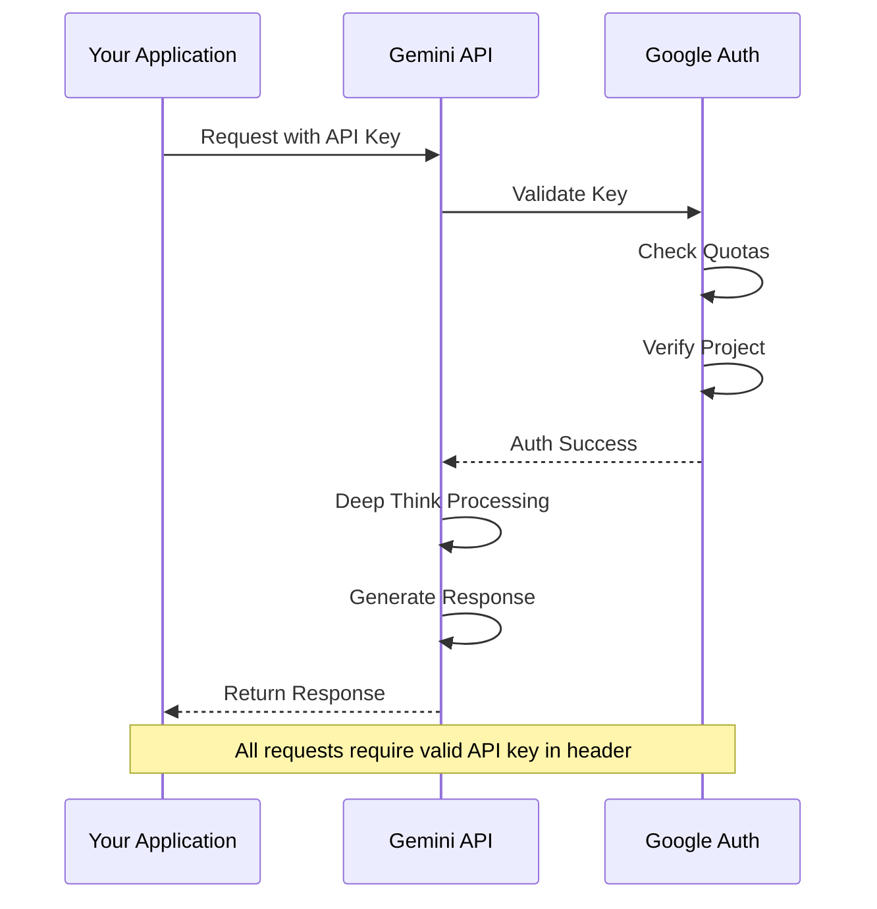
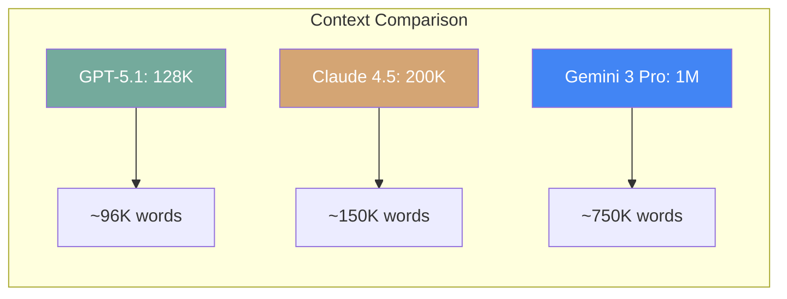
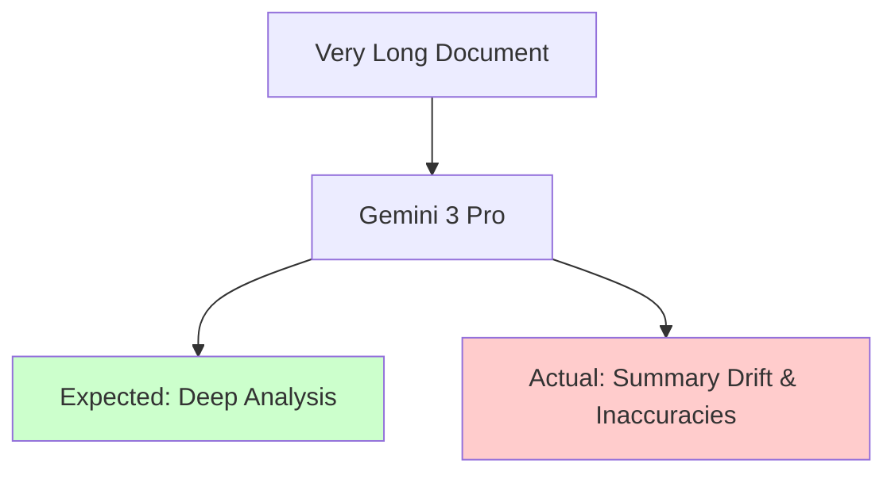
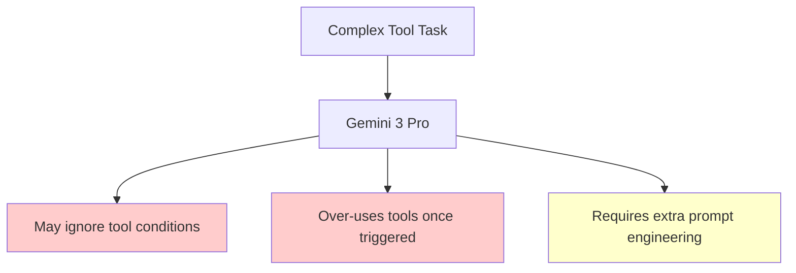
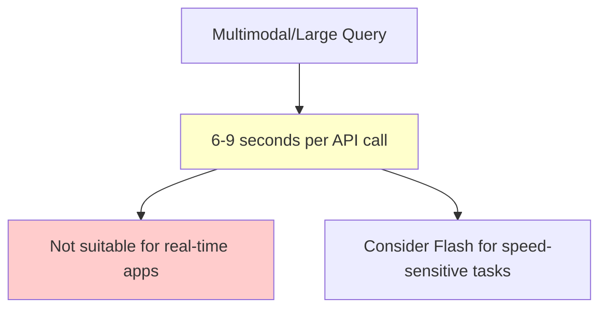
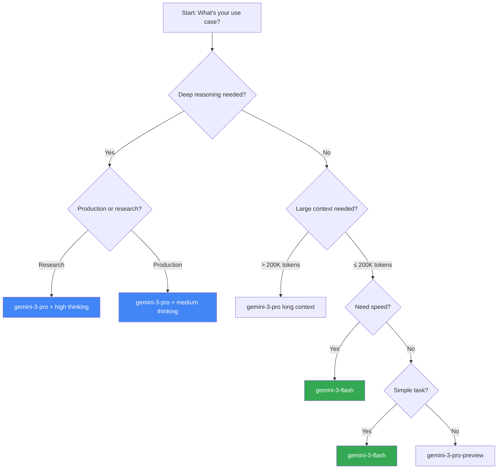
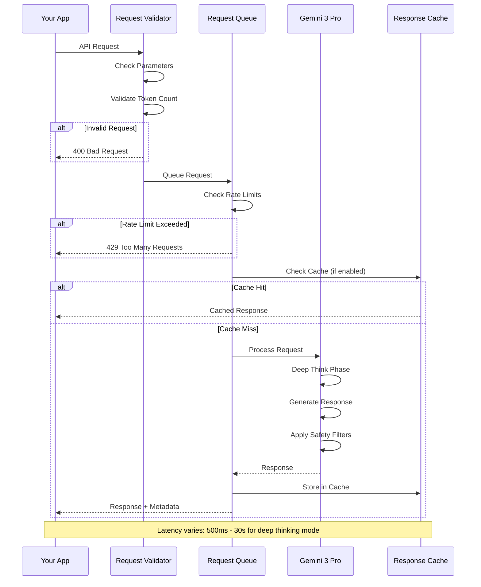
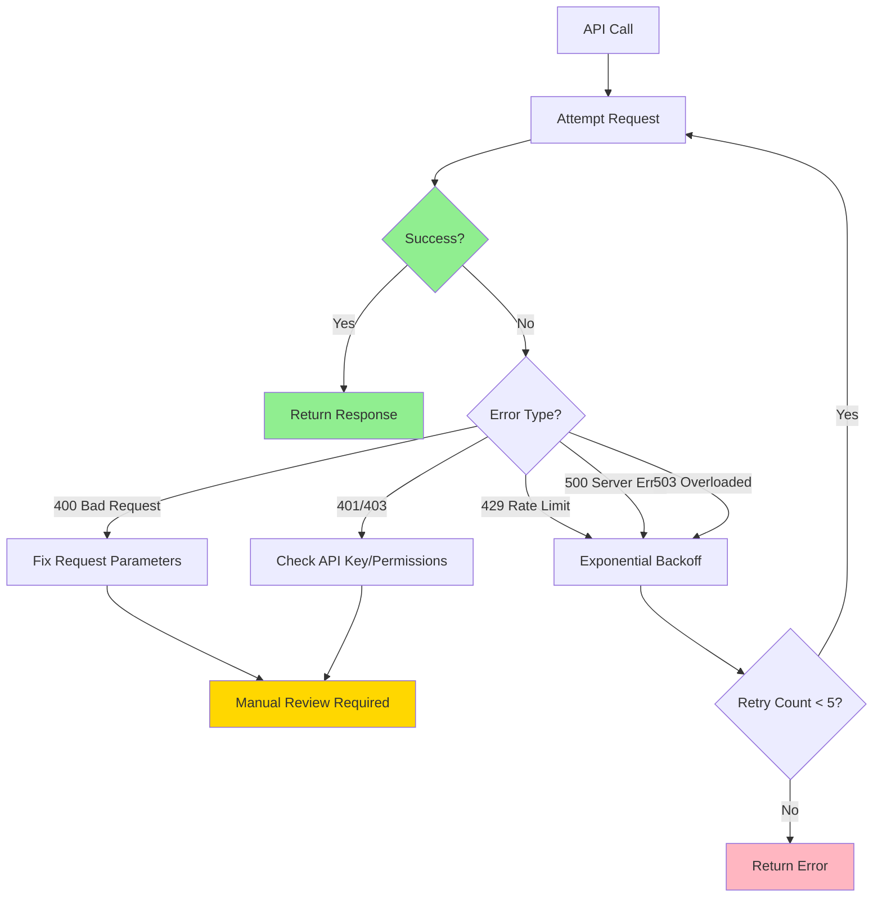

# Mastering Gemini 3 Pro (Preview): A Comprehensive Engineer's Guide

Gemini 3 Pro represents Google's most advanced AI model to date, featuring record-breaking benchmark scores, a powerful "Deep Think" reasoning mode, and state-of-the-art multimodal capabilities. Currently in preview, this model sets a new standard for complex reasoning and agentic development.

This guide provides a comprehensive deep dive into Gemini 3 Pro—from API setup to advanced use cases, including honest assessments of where it excels and where alternatives might serve you better.

---

## 🚀 Understanding the Gemini 3 Model Family

Gemini 3 isn't a single model—it's a family optimized for different use cases and budgets:

| Model                    | Context Window | Best For                         | Cost/1M Tokens |
| ------------------------ | -------------- | -------------------------------- | -------------- |
| **gemini-3-pro-preview** | 1M             | Complex reasoning, deep analysis | $2.00 / $12    |
| **gemini-3-pro** (>200K) | 1M             | Very long documents, codebases   | $4.00 / $18    |
| **gemini-3-flash**       | 1M             | Fast responses, lower cost       | $0.50 / $3.00  |

_Prices shown as Input/Output per million tokens_

### Key Differentiators from Competitors

- **Record-Breaking Benchmarks**: 1501 LMArena Elo score, surpassing all competitors
- **Deep Think Mode**: Configurable multi-step reasoning with self-correction
- **Native Multimodal**: Text, image, audio, and video inputs in a single model
- **Agentic Capabilities**: Powers Google's Antigravity IDE for autonomous development
- **Massive Context Window**: 1M tokens (~750,000 words) in a single prompt

---

## 🔑 Authentication & Setup

### Getting Your API Key

1. Visit [Google AI Studio](https://aistudio.google.com)
2. Sign in with your Google account
3. Navigate to the API key section
4. Generate and securely store your key

### Python SDK Setup (Recommended)

```bash
pip install -U google-genai
```

```python
from google import genai

# Initialize with your API key
client = genai.Client(api_key="YOUR_API_KEY")
model_id = "gemini-3-pro-preview"

# Basic text generation
response = client.models.generate_content(
    model=model_id,
    contents="Explain the concept of dependency injection in software architecture."
)
print(response.text)
```

### JavaScript/Node.js Setup

```bash
npm install @google/generative-ai
```

```javascript
import { GoogleGenerativeAI } from "@google/generative-ai";

// Set up client
const apiKey = process.env.GEMINI_API_KEY;
const genAI = new GoogleGenerativeAI(apiKey);

// Define the model to use
const model = genAI.getGenerativeModel({ model: "gemini-3-pro-preview" });

// Generate content
async function main() {
  const result = await model.generateContent({
    contents: [
      {
        role: "user",
        parts: [
          { text: "Explain dependency injection in software architecture." },
        ],
      },
    ],
  });
  console.log(result.response.text());
}

main();
```

### Authentication Flow



---

## ⚙️ Core Configuration Parameters

### Thinking Level (New in Gemini 3)

Controls how deeply the model reasons before responding—a key differentiator from other models.

**When to use:**

- **Low**: Simple Q&A, quick responses
- **Medium**: Balanced reasoning, general tasks
- **High**: Complex problem-solving, multi-step analysis
- **Max**: Research-grade reasoning, critical decisions

```python
response = client.models.generate_content(
    model="gemini-3-pro-preview",
    contents="Analyze this business scenario and provide recommendations...",
    config={
        "thinking_level": "high"  # Enable deep reasoning
    }
)
```

### Temperature (0.0 - 2.0)

Controls randomness. Lower values = more deterministic.

**When to use:**

- **0.0 - 0.3**: Code generation, data extraction, factual Q&A
- **0.4 - 0.7**: General conversation, balanced responses
- **0.8 - 1.2**: Creative writing, brainstorming
- **1.3 - 2.0**: Experimental, highly creative tasks

```python
response = client.models.generate_content(
    model="gemini-3-pro-preview",
    contents="Generate a product description for a smart watch",
    config={
        "temperature": 0.7  # Balanced creativity
    }
)
```

### Max Output Tokens

Gemini 3 Pro supports substantial output generation for complex tasks.

```python
response = client.models.generate_content(
    model="gemini-3-pro-preview",
    contents="Write a comprehensive analysis of...",
    config={
        "max_output_tokens": 8192  # Control response length
    }
)
```

---

## ✅ What Gemini 3 Pro Excels At

Understanding where Gemini shines helps you make the right technology choices.

### 1. Deep Reasoning & Problem Solving

With **Deep Think mode**, Gemini 3 Pro achieves breakthrough benchmark results:

| Benchmark                | Gemini 3 Pro | GPT-5.1 | Claude 4.5 |
| ------------------------ | ------------ | ------- | ---------- |
| LMArena Elo              | **1501**     | ~1450   | ~1460      |
| GPQA Diamond (PhD-level) | **93.8%**    | ~85%    | ~87%       |
| Humanity's Last Exam     | **41%**      | 31.6%   | 35%        |
| MMLU (General Knowledge) | **91.8%**    | ~90%    | ~89%       |

```python
# Enable Deep Think for complex analysis
response = client.models.generate_content(
    model="gemini-3-pro-preview",
    contents="""
    Analyze this multi-step business scenario:
    [Complex problem description]

    Provide:
    1. Root cause analysis
    2. Impact assessment
    3. Recommended solutions with trade-offs
    """,
    config={"thinking_level": "high"}
)
```

### 2. Long-Context Understanding

With a **1 million token context window**, Gemini can process:

- Entire codebases (~30,000+ lines of code)
- Full books and research papers
- Complete documentation sets
- Multi-hour video transcripts



**Best for:**

- Analyzing entire repositories in one prompt
- Cross-referencing multiple documents
- Reducing need for RAG in many use cases

### 3. Code Understanding & Generation

Excellent benchmark performance for development tasks:

| Code Benchmark     | Gemini 3 Pro | GPT-5.1 | Claude 4.5 |
| ------------------ | ------------ | ------- | ---------- |
| SWE-bench Verified | **76.2%**    | ~65%    | **77.2%**  |
| WebDev Arena Elo   | **1487**     | ~1420   | ~1450      |
| Terminal-Bench 2.0 | **54.2%**    | ~45%    | ~50%       |

```python
# Analyze an entire codebase
with open("entire_project.txt", "r") as f:
    codebase = f.read()

response = client.models.generate_content(
    model="gemini-3-pro-preview",
    contents=f"""
    Analyze this codebase and identify:
    1. Architectural patterns used
    2. Potential security vulnerabilities
    3. Performance optimization opportunities

    Codebase:
    {codebase}
    """,
    config={"temperature": 0.2, "thinking_level": "medium"}
)
```

### 4. Multimodal Processing

Native support for multiple input types:

```python
import base64

# Read image file
with open("diagram.png", "rb") as f:
    image_data = base64.b64encode(f.read()).decode()

response = client.models.generate_content(
    model="gemini-3-pro-preview",
    contents=[
        {"text": "Analyze this architecture diagram and explain the data flow:"},
        {"inline_data": {"mime_type": "image/png", "data": image_data}}
    ]
)
```

**Supported inputs:**

- 📝 Text
- 🖼️ Images
- 🎵 Audio
- 🎬 Video

### 5. Agentic Development (Antigravity IDE)

Gemini 3 Pro powers Google's new **Antigravity** agentic IDE:

- Autonomous code generation and debugging
- Multi-pane workflow automation
- Browser and terminal integration
- Plan, build, and iterate without manual intervention

---

## ❌ Where Gemini 3 Pro Falls Short

Being honest about limitations helps you avoid costly mistakes.

### 1. Long-Context Reliability Degradation

While Gemini handles 1M tokens, **performance drops past ~120-150k tokens**:



**Symptoms:**

- "Summary drift" in multi-step reasoning
- Invented content in very long chained queries
- Missing key details across large contexts

**Mitigation:**

- Break large documents into focused queries
- Validate critical information extraction
- Use explicit anchoring instructions

### 2. Structured Output Consistency

Only **~84% schema-valid responses** for complex JSON requirements:

```python
# May need retry logic for structured outputs
import json

def get_structured_response(prompt, schema, max_retries=3):
    for attempt in range(max_retries):
        response = client.models.generate_content(
            model="gemini-3-pro-preview",
            contents=f"{prompt}\n\nRespond in valid JSON matching: {schema}"
        )
        try:
            result = json.loads(response.text)
            # Validate against schema
            return result
        except json.JSONDecodeError:
            continue
    raise ValueError("Failed to get valid structured output")
```

**Recommendation:** Always validate and retry for production structured data extraction.

### 3. Tool Use & Agentic Behavior Issues



**The Issue:**

- Can ignore system or process instructions for calling tools
- Once triggered, may overuse integrated tools
- Requires explicit logic checks and guardrails

### 4. Vision & Layout Reasoning

Performs well on simple images but struggles with:

- Mixed-format dashboards
- Complex annotated visuals
- Data extraction from complex screenshots

**Recommendation:** For complex visual analysis, consider preprocessing or using specialized vision models.

### 5. Safety Filter Over-blocking

Benign queries about finance, medicine, or research may be:

- Blocked or sanitized unexpectedly
- Missing key analytical terms
- Requiring multiple rephrasing attempts

### 6. Latency for Large Contexts



---

## 🎯 Model Selection Decision Tree



---

## 🔄 Complete API Request Flow



---

## 🛠️ Advanced Configuration Strategies

### Streaming Responses

For real-time user experience:

```python
from google import genai

client = genai.Client(api_key="YOUR_API_KEY")

# Stream response chunks
for chunk in client.models.generate_content_stream(
    model="gemini-3-pro-preview",
    contents="Explain distributed systems architecture"
):
    print(chunk.text, end="", flush=True)
```

**Benefits:**

- Lower perceived latency
- Better user experience
- Early error detection

### Function Calling / Tool Use

Enable structured outputs and external integrations:

```python
# Define tools for the model
tools = [
    {
        "name": "get_weather",
        "description": "Get current weather for a location",
        "parameters": {
            "type": "object",
            "properties": {
                "location": {"type": "string", "description": "City name"},
                "unit": {"type": "string", "enum": ["celsius", "fahrenheit"]}
            },
            "required": ["location"]
        }
    }
]

response = client.models.generate_content(
    model="gemini-3-pro-preview",
    contents="What's the weather in Tokyo?",
    tools=tools
)

# Handle function call in response
if hasattr(response, 'function_call'):
    # Execute the function and return results
    pass
```

### System Instructions

Set consistent behavior across conversations:

```python
chat = client.chats.create(
    model="gemini-3-pro-preview",
    config={
        "system_instruction": """You are a senior Python developer.
        Always provide production-ready code with proper error handling.
        Include type hints and docstrings."""
    }
)

response = chat.send_message("How do I implement a retry decorator?")
```

---

## 💰 Cost Optimization Strategies

### 1. Choose the Right Model Tier

```python
# For simple tasks - use flash
response = client.models.generate_content(
    model="gemini-3-flash",  # Cheaper: $0.50/$3.00 per 1M
    contents="Classify sentiment: I love this product!",
    config={"max_output_tokens": 10}
)

# For complex reasoning - use pro
response = client.models.generate_content(
    model="gemini-3-pro-preview",  # Premium: $2.00/$12 per 1M
    contents="Analyze this complex business scenario..."
)
```

### 2. Stay Under 200K Token Threshold

```python
# Context ≤200K: $2.00/$12 per 1M tokens
# Context >200K: $4.00/$18 per 1M tokens

# Split large documents if possible
def chunk_document(text, max_tokens=150000):
    # Keep under threshold for 50% cost savings
    # Implementation here
    pass
```

### 3. Context Caching (Enterprise)

For repeated system prompts and large static documents:

```python
# Cache frequently used content
cached_content = client.caches.create(
    model="gemini-3-pro-preview",
    contents=large_static_document,
    ttl="3600s"  # 1 hour
)

# Use cached content for multiple queries
response = client.models.generate_content(
    model="gemini-3-pro-preview",
    contents=[cached_content, "What are the key findings?"]
)
```

### Cost Comparison Table

| Strategy               | Savings   | Best For                      |
| ---------------------- | --------- | ----------------------------- |
| Flash over Pro         | ~75%      | Simple tasks, high throughput |
| Stay under 200K tokens | 50%       | Most interactive use cases    |
| Context caching        | Up to 90% | Repeated system prompts       |
| Batch processing       | ~50%      | Bulk processing, reports      |

---

## 🚨 Error Handling & Retry Strategies



### Implementation Example

```python
import time
from google import genai
from google.api_core.exceptions import ResourceExhausted, ServiceUnavailable

def call_gemini_with_retry(contents, max_retries=5):
    client = genai.Client(api_key="YOUR_API_KEY")
    retries = 0
    backoff = 1.0  # Start with 1 second

    while retries < max_retries:
        try:
            response = client.models.generate_content(
                model="gemini-3-pro-preview",
                contents=contents
            )
            return response
        except ResourceExhausted:
            # Rate limit - exponential backoff
            retries += 1
            if retries >= max_retries:
                raise
            time.sleep(backoff)
            backoff *= 2
        except ServiceUnavailable:
            # Server overloaded - retry with backoff
            retries += 1
            if retries >= max_retries:
                raise
            time.sleep(backoff)
            backoff *= 2
        except ValueError as e:
            # Bad request - don't retry
            raise ValueError(f"Invalid request: {e}")

    return None
```

---

## 📊 Monitoring & Performance Tracking

```python
import time
from dataclasses import dataclass, field
from typing import List

@dataclass
class GeminiMetrics:
    total_requests: int = 0
    total_input_tokens: int = 0
    total_output_tokens: int = 0
    total_cost: float = 0.0
    error_count: int = 0
    latencies: List[float] = field(default_factory=list)

    def track_request(self, response, latency_ms: float, model: str, input_tokens: int):
        self.total_requests += 1
        self.latencies.append(latency_ms)
        self.total_input_tokens += input_tokens

        # Extract output token count from response metadata
        output_tokens = getattr(response, 'usage', {}).get('output_tokens', 0)
        self.total_output_tokens += output_tokens

        # Calculate cost based on context size
        self.total_cost += self._calculate_cost(input_tokens, output_tokens, model)

    def _calculate_cost(self, input_tokens, output_tokens, model):
        # Pricing tiers for Gemini 3 Pro
        if input_tokens <= 200000:
            rates = {"input": 2.00, "output": 12.00}
        else:
            rates = {"input": 4.00, "output": 18.00}

        if "flash" in model:
            rates = {"input": 0.50, "output": 3.00}

        return (
            (input_tokens * rates["input"] +
             output_tokens * rates["output"]) / 1_000_000
        )

    def get_stats(self):
        return {
            "total_requests": self.total_requests,
            "total_input_tokens": self.total_input_tokens,
            "total_output_tokens": self.total_output_tokens,
            "total_cost": f"${self.total_cost:.4f}",
            "error_rate": f"{(self.error_count / max(self.total_requests, 1)) * 100:.2f}%",
            "avg_latency_ms": f"{sum(self.latencies) / max(len(self.latencies), 1):.0f}",
        }


# Usage
metrics = GeminiMetrics()

start = time.time()
response = client.models.generate_content(
    model="gemini-3-pro-preview",
    contents="Explain quantum computing"
)
latency = (time.time() - start) * 1000

metrics.track_request(response, latency, "gemini-3-pro-preview", 50)
print(metrics.get_stats())
```

---

## 🎓 Best Practices Summary

### ✅ DO:

- **Start with gemini-3-flash** for testing, scale to pro for production
- **Use thinking_level parameter** to control reasoning depth
- **Stay under 200K tokens** when possible (50% cost savings)
- **Leverage Deep Think mode** for complex analysis
- **Implement exponential backoff** for rate limits
- **Stream responses** for better UX in interactive apps
- **Validate structured outputs** with retry logic
- **Monitor costs** closely—token billing scales rapidly

### ❌ DON'T:

- **Don't trust very long context (>150K) without validation** - may drift
- **Don't expect 100% structured output validity** - always validate JSON
- **Don't use for real-time apps** without considering latency (6-9s)
- **Don't rely on tool use without guardrails** - may ignore conditions
- **Don't use both temperature and top_p** simultaneously
- **Don't hardcode API keys** - use environment variables
- **Don't skip error handling** - Gemini can hit rate limits
- **Don't assume other LLM patterns work identically** - test carefully

---

## 🚀 Production-Ready Example

```python
import os
import time
from google import genai
from google.api_core.exceptions import ResourceExhausted, ServiceUnavailable

class GeminiService:
    def __init__(self, api_key: str = None, default_model: str = "gemini-3-pro-preview"):
        self.api_key = api_key or os.environ.get("GEMINI_API_KEY")
        self.client = genai.Client(api_key=self.api_key)
        self.default_model = default_model
        self.metrics = GeminiMetrics()
        self.max_retries = 5

    def generate(
        self,
        prompt: str,
        model: str = None,
        temperature: float = 0.7,
        max_tokens: int = 4096,
        thinking_level: str = "medium",
        system_instruction: str = None,
        stream: bool = False
    ):
        model = model or self.default_model
        config = {
            "temperature": temperature,
            "max_output_tokens": max_tokens,
            "thinking_level": thinking_level
        }

        start = time.time()

        try:
            if system_instruction:
                chat = self.client.chats.create(
                    model=model,
                    config={"system_instruction": system_instruction}
                )
                response = chat.send_message(prompt)
            else:
                response = self._retry_request(
                    model=model,
                    contents=prompt,
                    config=config,
                    stream=stream
                )

            latency = (time.time() - start) * 1000
            self.metrics.track_request(response, latency, model, len(prompt.split()))
            return response

        except Exception as e:
            self.metrics.error_count += 1
            raise

    def _retry_request(self, model, contents, config, stream=False):
        retries = 0
        backoff = 1.0

        while retries < self.max_retries:
            try:
                if stream:
                    return self.client.models.generate_content_stream(
                        model=model,
                        contents=contents,
                        config=config
                    )
                return self.client.models.generate_content(
                    model=model,
                    contents=contents,
                    config=config
                )
            except (ResourceExhausted, ServiceUnavailable):
                retries += 1
                if retries >= self.max_retries:
                    raise
                time.sleep(backoff)
                backoff *= 2

    def get_metrics(self):
        return self.metrics.get_stats()


# Usage
gemini = GeminiService()

response = gemini.generate(
    prompt="Explain microservices architecture",
    temperature=0.5,
    max_tokens=2000,
    thinking_level="high",
    system_instruction="You are a senior software architect."
)

print(response.text)
print("Metrics:", gemini.get_metrics())
```

---

## 🎯 Conclusion

Gemini 3 Pro (Preview) is Google's most powerful AI model yet, setting new benchmarks for reasoning and multimodal understanding. However, it's not without limitations—understanding these trade-offs is crucial for production success.

**Key takeaways:**

1. **Record-breaking benchmarks** (1501 Elo, 93.8% GPQA) - ideal for complex reasoning
2. **Deep Think mode** - configurable reasoning depth for different use cases
3. **Massive context window** (1M tokens) - but reliability drops past ~150K
4. **Strong coding capabilities** - 76.2% SWE-bench, but validate edge cases
5. **Agentic development** - powers Antigravity IDE for autonomous workflows
6. **Cost considerations** - significant savings by staying under 200K tokens

By understanding these trade-offs and following the best practices outlined here, you'll be well-equipped to leverage Gemini 3 Pro effectively in your AI-powered applications.

---

## 📚 Additional Resources

- [Google AI Developer Docs](https://ai.google.dev/gemini-api/docs/gemini-3)
- [Gemini API Cookbook](https://github.com/google-gemini/cookbook)
- [Gemini API Pricing](https://ai.google.dev/gemini-api/docs/pricing)
- [Antigravity IDE](https://antigravity.google)
- [Google AI Studio](https://aistudio.google.com)

---

_Have questions or want to share your Gemini experiences? Connect with me on [Twitter](https://twitter.com/ianlintner) or [LinkedIn](https://linkedin.com/in/ianlintner)._
