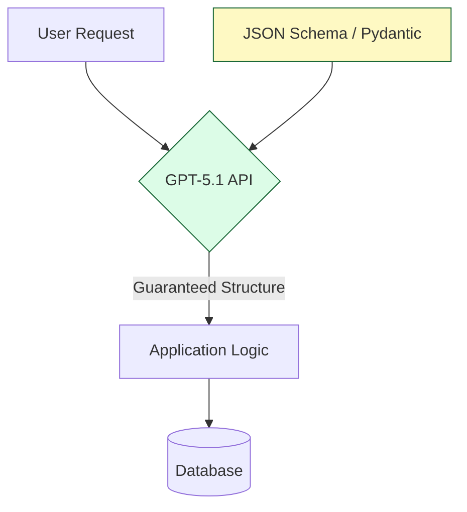

# Mastering the GPT-5.1 API: An Engineer's Guide to the New Frontier

The rumors were true. GPT-5.1 is here, and it's... well, it's a lot.

As someone who's been integrating LLMs since the GPT-3 beta days, I've seen the hype cycle spin faster and faster. But looking past the marketing fluff, there are some genuine engineering shifts in this release that we need to talk about.

It's not just "smarter." It's **more structured**. And for those of us building systems, structure is everything.

---

## 🏗️ Structured Outputs as a First-Class Citizen

Remember the days of begging the model to "please output valid JSON" and praying it didn't add a trailing comma?

GPT-5.1 treats **schema adherence** as a hard constraint, not a suggestion. You define a Pydantic model or a JSON schema, and the API guarantees the output matches.

This changes the game for reliability. We can finally stop writing regex parsers to clean up model vomit.

---

## ⚡ Latency and "Thinking" Time

One of the interesting trade-offs in 5.1 is the explicit control over "thinking" time. You can ask the model to spend more compute cycles reasoning before it emits a single token.

For a chat bot, you want low latency. But for a complex architectural review? I'll happily wait 30 seconds if it means the model actually checks its work.

**The Engineer's Take:**

- **User-facing UI:** Dial down the reasoning, optimize for TTFT (Time To First Token).
- **Background Jobs:** Crank up the reasoning. Let it think.

---

## 💰 The Cost Equation

It's expensive. No getting around that.

If you're using GPT-5.1 to summarize emails, you're burning money. This model is for **high-value, complex tasks**—code generation, legal analysis, medical diagnosis support.

For the simple stuff? Stick to GPT-4o-mini or Llama 3. The "smartest" model isn't always the right tool for the job. You don't use a sledgehammer to hang a picture frame.

---

## 🔒 Safety and Alignment

OpenAI has tightened the screws on safety. For enterprise use cases, this is mostly good—less liability. But for creative or edge-case testing, you might hit some "I'm sorry, Dave" moments.

**Pro Tip:** Use the `system` prompt to clearly define the persona and constraints. The model adheres to system instructions much more rigidly now.

---

## 🚀 Final Thoughts

GPT-5.1 is a powerful tool in the belt. But it's just that—a tool. It doesn't replace the need for good architecture, robust testing, and human oversight.

The best engineers won't be the ones who just "use AI." They'll be the ones who know **when** to use it, and more importantly, when **not** to.

Now, let's go build something cool.
