# Mastering GPT-5.1 API: A Comprehensive Engineer's Guide

GPT-5.1 represents a significant leap forward in large language model capabilities, offering engineers unprecedented power for building AI-driven applications. But with great power comes great complexity—understanding the myriad configuration options, model variants, and best practices is crucial for success.

This guide provides a comprehensive deep dive into GPT-5.1 API usage, from authentication to advanced configuration strategies.

---

## 🚀 Understanding the GPT-5.1 Model Family

GPT-5.1 isn't a single model—it's a family of models optimized for different use cases:

| Model             | Context Window | Best For                              | Cost/1M Tokens |
| ----------------- | -------------- | ------------------------------------- | -------------- |
| **gpt-5.1**       | 128K           | General purpose, balanced performance | $10 / $30      |
| **gpt-5.1-turbo** | 128K           | Fast responses, lower cost            | $5 / $15       |
| **gpt-5.1-mini**  | 32K            | Simple tasks, high throughput         | $1 / $3        |
| **gpt-5.1-ultra** | 256K           | Complex reasoning, long context       | $30 / $90      |
| **gpt-5.1-code**  | 128K           | Code generation and analysis          | $12 / $36      |

_Prices shown as Input/Output per million tokens_

---

## 🔑 Authentication & Setup

### Basic Authentication

```javascript
import OpenAI from "openai";

const client = new OpenAI({
  apiKey: process.env.OPENAI_API_KEY,
  organization: process.env.OPENAI_ORG_ID, // Optional
  project: process.env.OPENAI_PROJECT_ID, // Optional
});
```

### Authentication Flow


---

## ⚙️ Core Configuration Parameters

### Temperature (0.0 - 2.0)

Controls randomness in the output. Lower values make responses more deterministic.

**When to use:**

- **0.0 - 0.3**: Code generation, data extraction, factual Q&A
- **0.4 - 0.7**: General conversation, balanced creativity
- **0.8 - 1.2**: Creative writing, brainstorming
- **1.3 - 2.0**: Experimental, highly creative tasks

```javascript
const response = await client.chat.completions.create({
  model: "gpt-5.1",
  messages: [{ role: "user", content: "Generate a product description" }],
  temperature: 0.7, // Balanced creativity
});
```

### Top-P (Nucleus Sampling) (0.0 - 1.0)

Alternative to temperature. Samples from the top tokens whose probabilities sum to P.

**Best practices:**

- Use **either** temperature **or** top_p, not both
- `top_p: 0.1` - Very deterministic
- `top_p: 0.5` - Balanced
- `top_p: 0.95` - More diverse

```javascript
const response = await client.chat.completions.create({
  model: "gpt-5.1",
  messages: [{ role: "user", content: "Explain quantum computing" }],
  top_p: 0.9,
  // temperature: undefined, // Don't use both
});
```

### Max Tokens

Maximum number of tokens to generate in the response.

```javascript
const response = await client.chat.completions.create({
  model: "gpt-5.1-turbo",
  messages: [{ role: "user", content: "Summarize this article..." }],
  max_tokens: 500, // Limit response length
});
```

**Cost optimization tip:** Set appropriate max_tokens to avoid unnecessary charges.

### Presence Penalty (-2.0 to 2.0)

Penalizes tokens based on whether they appear in the text so far.

- **Positive values** (0.5 - 2.0): Encourage diversity, reduce repetition
- **Negative values** (-2.0 to -0.5): Allow repetition, useful for lists
- **Zero**: No penalty

### Frequency Penalty (-2.0 to 2.0)

Penalizes tokens based on how often they appear in the text so far.

- **Higher values**: More diverse vocabulary
- **Lower values**: More focused, may repeat important terms

```javascript
const response = await client.chat.completions.create({
  model: "gpt-5.1",
  messages: [{ role: "user", content: "Write a technical blog post" }],
  presence_penalty: 0.6, // Encourage topic diversity
  frequency_penalty: 0.3, // Reduce word repetition
});
```

---

## 🎯 Model Selection Decision Tree

Choosing the right model is crucial for balancing performance, cost, and latency.

```mermaid
graph TD
    Start[Start: What's your use case?] --> Simple{Simple task?}
    Simple -->|Yes| Mini[gpt-5.1-mini]
    Simple -->|No| Complex{Complex reasoning?}

    Complex -->|Yes| Context{Large context?}
    Context -->|> 128K tokens| Ultra[gpt-5.1-ultra]
    Context -->|≤ 128K tokens| Standard[gpt-5.1]

    Complex -->|No| CodeTask{Code-focused?}
    CodeTask -->|Yes| Code[gpt-5.1-code]
    CodeTask -->|No| Speed{Need speed?}

    Speed -->|Yes| Turbo[gpt-5.1-turbo]
    Speed -->|No| Standard2[gpt-5.1]

    Mini --> CostOpt[Cost-optimized]
    Turbo --> Balanced[Fast & affordable]
    Code --> Specialized[Code tasks]
    Standard --> General[General purpose]
    Ultra --> Premium[Premium reasoning]
    Standard2 --> General

    style Mini fill:#90EE90
    style Turbo fill:#87CEEB
    style Code fill:#DDA0DD
    style Standard fill:#F0E68C
    style Ultra fill:#FFB6C1
```



---

## 🔄 Complete API Request Flow

Understanding the full request/response cycle helps optimize performance and handle errors.


---

## 🛠️ Advanced Configuration Strategies

### Streaming Responses

For real-time user experience, stream responses token by token:

```javascript
const stream = await client.chat.completions.create({
  model: "gpt-5.1-turbo",
  messages: [{ role: "user", content: "Explain neural networks" }],
  stream: true,
});

for await (const chunk of stream) {
  const content = chunk.choices[0]?.delta?.content || "";
  process.stdout.write(content);
}
```

**Benefits:**

- Lower perceived latency
- Better user experience
- Early error detection

### Function Calling

Enable structured outputs and tool use:

```javascript
const functions = [
  {
    name: "get_weather",
    description: "Get current weather for a location",
    parameters: {
      type: "object",
      properties: {
        location: { type: "string", description: "City name" },
        unit: { type: "string", enum: ["celsius", "fahrenheit"] },
      },
      required: ["location"],
    },
  },
];

const response = await client.chat.completions.create({
  model: "gpt-5.1",
  messages: [{ role: "user", content: "What's the weather in Tokyo?" }],
  functions: functions,
  function_call: "auto", // Can be "none", "auto", or {"name": "function_name"}
});
```

### System Prompts & Role Management

```javascript
const messages = [
  {
    role: "system",
    content: "You are a helpful assistant specializing in Python programming.",
  },
  {
    role: "user",
    content: "How do I handle exceptions in Python?",
  },
];

const response = await client.chat.completions.create({
  model: "gpt-5.1-code",
  messages: messages,
  temperature: 0.3, // More deterministic for code
});
```

---

## ⚡ Configuration Parameters Relationships

Understanding how parameters interact is key to optimal configuration:


---

## 🚨 Error Handling & Retry Strategies

Robust error handling is essential for production applications.


### Implementation Example

```javascript
async function callGPTWithRetry(params, maxRetries = 3) {
  let retries = 0;
  let backoff = 1000; // Start with 1 second

  while (retries < maxRetries) {
    try {
      const response = await client.chat.completions.create(params);
      return response;
    } catch (error) {
      if (error.status === 429 || error.status >= 500) {
        // Rate limit or server error - retry with backoff
        retries++;
        if (retries >= maxRetries) throw error;

        await new Promise((resolve) => setTimeout(resolve, backoff));
        backoff *= 2; // Exponential backoff
      } else if (error.status === 400) {
        // Bad request - don't retry
        throw new Error(`Invalid request: ${error.message}`);
      } else if (error.status === 401) {
        // Authentication error - don't retry
        throw new Error("Invalid API key");
      } else {
        // Unknown error
        throw error;
      }
    }
  }
}
```

---

## 💰 Cost Optimization Strategies

### 1. Model Selection

Choose the least expensive model that meets your requirements:

```javascript
// For simple classification
const response = await client.chat.completions.create({
  model: "gpt-5.1-mini", // Cheapest option
  messages: [{ role: "user", content: "Classify sentiment: I love this!" }],
  max_tokens: 10,
});
```

### 2. Token Management

```javascript
// Count tokens before sending
import { encode } from "gpt-tokenizer";

function estimateCost(text, model = "gpt-5.1") {
  const tokens = encode(text).length;
  const inputCost = model === "gpt-5.1-mini" ? 1 : 10; // per 1M tokens
  return (tokens / 1000000) * inputCost;
}

// Truncate if needed
const maxInputTokens = 2000;
const encoded = encode(longText);
if (encoded.length > maxInputTokens) {
  const truncated = encoded.slice(0, maxInputTokens);
  // Use decoded truncated text
}
```

### 3. Caching Strategies

```javascript
const cache = new Map();

async function getCachedCompletion(prompt, params) {
  const cacheKey = JSON.stringify({ prompt, params });

  if (cache.has(cacheKey)) {
    return cache.get(cacheKey);
  }

  const response = await client.chat.completions.create({
    ...params,
    messages: [{ role: "user", content: prompt }],
  });

  cache.set(cacheKey, response);
  return response;
}
```

### 4. Batch Processing

Group similar requests to minimize overhead:

```javascript
async function batchProcess(items, batchSize = 10) {
  const results = [];

  for (let i = 0; i < items.length; i += batchSize) {
    const batch = items.slice(i, i + batchSize);
    const batchResults = await Promise.all(
      batch.map((item) => processItem(item)),
    );
    results.push(...batchResults);
  }

  return results;
}
```

---

## 📊 Monitoring & Performance Tracking

Track key metrics to optimize your API usage:

```javascript
class GPTMetrics {
  constructor() {
    this.totalRequests = 0;
    this.totalTokens = 0;
    this.totalCost = 0;
    this.errorCount = 0;
    this.latencies = [];
  }

  async trackRequest(fn, model) {
    const start = Date.now();
    this.totalRequests++;

    try {
      const response = await fn();
      const latency = Date.now() - start;

      this.latencies.push(latency);
      this.totalTokens += response.usage.total_tokens;
      this.totalCost += this.calculateCost(response.usage, model);

      return response;
    } catch (error) {
      this.errorCount++;
      throw error;
    }
  }

  calculateCost(usage, model) {
    const rates = {
      "gpt-5.1": { input: 10, output: 30 },
      "gpt-5.1-turbo": { input: 5, output: 15 },
      "gpt-5.1-mini": { input: 1, output: 3 },
    };

    const rate = rates[model] || rates["gpt-5.1"];
    return (
      (usage.prompt_tokens * rate.input +
        usage.completion_tokens * rate.output) /
      1000000
    );
  }

  getStats() {
    return {
      totalRequests: this.totalRequests,
      totalTokens: this.totalTokens,
      totalCost: this.totalCost.toFixed(2),
      errorRate: ((this.errorCount / this.totalRequests) * 100).toFixed(2),
      avgLatency: (
        this.latencies.reduce((a, b) => a + b, 0) / this.latencies.length
      ).toFixed(0),
    };
  }
}
```

---

## 🎓 Best Practices Summary

### ✅ DO:

- **Choose the right model** for your task (start small, scale up only if needed)
- **Set appropriate max_tokens** to control costs
- **Implement retry logic** with exponential backoff
- **Use streaming** for better UX in interactive applications
- **Cache responses** when dealing with repeated queries
- **Monitor usage** and costs continuously
- **Use system prompts** to set context and behavior
- **Validate inputs** before sending to API

### ❌ DON'T:

- **Don't use both temperature and top_p** simultaneously
- **Don't ignore rate limits** - implement proper backoff
- **Don't send sensitive data** without proper security measures
- **Don't hardcode API keys** - use environment variables
- **Don't skip error handling** - always handle failures gracefully
- **Don't over-engineer** - start simple and optimize based on metrics

---

## 🚀 Production-Ready Example

Here's a complete, production-ready implementation:

```javascript
import OpenAI from "openai";
import { encode } from "gpt-tokenizer";

class GPTService {
  constructor(apiKey, options = {}) {
    this.client = new OpenAI({ apiKey });
    this.metrics = new GPTMetrics();
    this.maxRetries = options.maxRetries || 3;
    this.defaultModel = options.defaultModel || "gpt-5.1-turbo";
  }

  async complete(prompt, options = {}) {
    const params = {
      model: options.model || this.defaultModel,
      messages: [
        ...(options.systemPrompt
          ? [{ role: "system", content: options.systemPrompt }]
          : []),
        { role: "user", content: prompt },
      ],
      temperature: options.temperature ?? 0.7,
      max_tokens: options.maxTokens || 1000,
      presence_penalty: options.presencePenalty ?? 0,
      frequency_penalty: options.frequencyPenalty ?? 0,
      stream: options.stream || false,
    };

    // Validate token count
    const estimatedTokens = this.estimateTokens(prompt);
    if (estimatedTokens > 100000) {
      throw new Error("Prompt too long");
    }

    return this.metrics.trackRequest(
      () => this.retryableRequest(params),
      params.model,
    );
  }

  async retryableRequest(params) {
    let retries = 0;
    let backoff = 1000;

    while (retries < this.maxRetries) {
      try {
        return await this.client.chat.completions.create(params);
      } catch (error) {
        if (this.shouldRetry(error)) {
          retries++;
          if (retries >= this.maxRetries) throw error;
          await this.sleep(backoff);
          backoff *= 2;
        } else {
          throw error;
        }
      }
    }
  }

  shouldRetry(error) {
    return error.status === 429 || error.status >= 500;
  }

  estimateTokens(text) {
    return encode(text).length;
  }

  sleep(ms) {
    return new Promise((resolve) => setTimeout(resolve, ms));
  }

  getMetrics() {
    return this.metrics.getStats();
  }
}

// Usage
const gpt = new GPTService(process.env.OPENAI_API_KEY, {
  defaultModel: "gpt-5.1-turbo",
  maxRetries: 3,
});

const response = await gpt.complete("Explain microservices architecture", {
  temperature: 0.5,
  maxTokens: 500,
  systemPrompt: "You are a senior software architect.",
});

console.log(response.choices[0].message.content);
console.log("Metrics:", gpt.getMetrics());
```

---

## 🎯 Conclusion

Mastering GPT-5.1 API requires understanding not just the technical parameters, but also the strategic decisions around model selection, cost optimization, and error handling.

**Key takeaways:**

1. **Start with the smallest model** that meets your needs (gpt-5.1-mini)
2. **Configure temperature/top_p carefully** based on your use case
3. **Implement robust error handling** with exponential backoff
4. **Monitor costs and performance** continuously
5. **Cache aggressively** for repeated queries
6. **Use streaming** for better user experience

By following these guidelines and best practices, you'll build reliable, cost-effective AI-powered applications that leverage the full power of GPT-5.1.

---

## 📚 Additional Resources

- [OpenAI API Documentation](https://platform.openai.com/docs)
- [GPT-5.1 Model Card](https://platform.openai.com/docs/models/gpt-5-1)
- [Rate Limits & Best Practices](https://platform.openai.com/docs/guides/rate-limits)
- [Cost Optimization Guide](https://platform.openai.com/docs/guides/cost-optimization)
- [Token Counting Tool](https://platform.openai.com/tokenizer)

---

_Have questions or want to share your GPT-5.1 experiences? Connect with me on [Twitter](https://twitter.com/ianlintner) or [LinkedIn](https://linkedin.com/in/ianlintner)._
