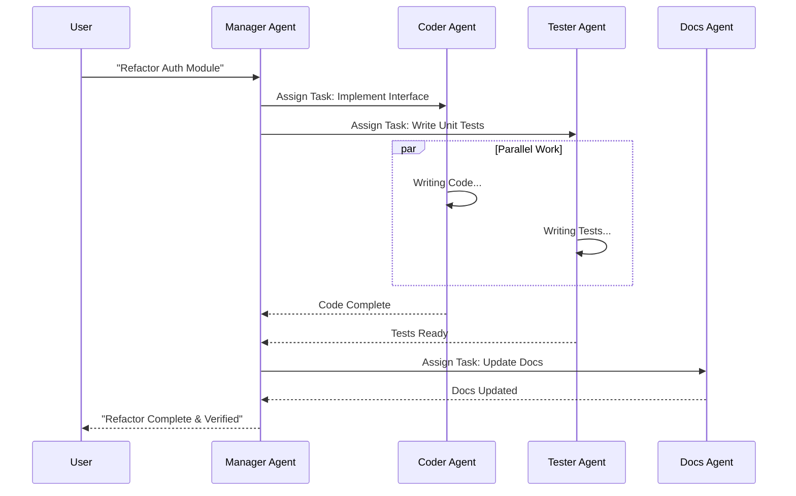

# Multi-Agent AI: Parallel Execution with Copilot Agents

We've spent the last few years teaching AI to write code. Now, we're teaching it to work in a team.

The concept of **Multi-Agent Systems** isn't new—academic papers have been discussing it for decades. But with the rise of powerful LLMs and frameworks like Microsoft's Semantic Kernel and LangChain, it's finally becoming practical for everyday engineering.

Imagine you have a complex task: "Refactor this legacy module, update the tests, and write the documentation."

A single agent tries to do it all at once and usually hallucinates halfway through.
A **multi-agent system** breaks it down.

---

## 🐝 The Hive Mind Approach

Instead of one "God Mode" AI, you have specialized agents:

1.  **The Architect:** Analyzes the code and plans the refactor.
2.  **The Coder:** Writes the implementation.
3.  **The Tester:** Writes and runs the tests.
4.  **The Tech Writer:** Updates the docs.

And here's the kicker: **They can work in parallel.**

---

## ⚡ Why Parallelism Matters

It's about **speed** and **focus**.

If you ask a human to write code, test it, and document it all at the same time, they'll do a mediocre job at all three. If you let them focus on one thing, they do it better.

The same applies to LLMs. By narrowing the context for each agent ("You are a QA engineer, your only job is to break this code"), you get higher quality outputs.

And by running them in parallel, you slash the wall-clock time for complex tasks.

---

## 🛠️ Building It: The "Orchestrator" Pattern

The key to making this work is the **Orchestrator**. This is the "Manager" agent that:

*   Decomposes the user's request.
*   Assigns tasks to the right sub-agents.
*   Aggregates the results.
*   Handles errors (e.g., "The Tester found a bug, send it back to the Coder").

It's a classic **Map-Reduce** pattern, applied to AI.

---

## 🚧 The Challenges

It's not all sunshine and rainbows.

*   **Coordination Overhead:** Managing the state between agents is hard.
*   **Cost:** Running 5 agents is 5x the token cost (roughly).
*   **Loops:** Agents can get into arguments. "Fix this." "I fixed it." "No you didn't." You need loop detection.

---

## 🔮 The Future

We're moving away from "Chat with AI" to "Manage a Team of AI."

As an engineering leader, your job is shifting. You're not just managing humans anymore; you're managing a hybrid workforce of silicon and carbon. And honestly? It's going to be a wild ride.

Time to update those playbooks.
