# From Engineer to AI Leader: Orchestrating Multi-Agent Copilot Teams

The future of software engineering isn't about managing people—it's about **leading AI agents**.

With GitHub Copilot Agents and multi-agent AI systems, engineers are evolving from individual contributors or people managers into **technical conductors** who orchestrate parallel workstreams across autonomous AI teams.

This isn't science fiction. It's happening today.

---

## 🎭 The Multi-Agent Paradigm

Traditional development follows a linear path: one engineer, one task, sequential execution. Even with team collaboration, work is often serialized due to dependencies, communication overhead, and context switching.

Multi-agent AI systems flip this model on its head:

- **Multiple specialized agents** work simultaneously on different parts of the same problem
- Each agent has its own **domain expertise** (testing, documentation, refactoring, security)
- Agents execute in **parallel**, dramatically reducing cycle time
- A **lead engineer** orchestrates the agents, defines goals, and ensures coherence

Think of it like conducting an orchestra: each musician (agent) plays their part independently, but the conductor ensures harmony and timing.

---

## 🚀 GitHub Copilot Agents in Practice

GitHub Copilot Agents represent a breakthrough in multi-agent orchestration for software development. Instead of a single AI assistant, you can deploy **multiple specialized agents** within a single workflow:

### Agent Specialization Examples

| Agent Type              | Responsibility                                     |
| ----------------------- | -------------------------------------------------- |
| **Code Generator**      | Implements features, writes initial code drafts    |
| **Test Writer**         | Creates unit, integration, and E2E tests           |
| **Documentation Agent** | Generates READMEs, API docs, inline comments       |
| **Security Auditor**    | Scans for vulnerabilities, enforces best practices |
| **Refactoring Agent**   | Improves code quality, removes duplication         |
| **Reviewer**            | Validates changes, ensures standards compliance    |

Each agent operates **independently** but within a **shared context**: the same repository, PR, or task specification.

---

## ⚡ Parallel Execution: The Engineering Team Analogy

In a traditional engineering team, you might assign:

- **Engineer A** → Feature implementation
- **Engineer B** → Test coverage
- **Engineer C** → Documentation
- **Engineer D** → Performance optimization

With multi-agent AI, the same structure applies, but execution happens **simultaneously** and at machine speed:

```mermaid
graph LR
  Lead["🧑‍💻 Lead Engineer"] --> A["🤖 Agent A: Feature"]
  Lead --> B["🤖 Agent B: Tests"]
  Lead --> C["🤖 Agent C: Docs"]
  Lead --> D["🤖 Agent D: Security"]

  A --> Integration["🔗 Integration & Review"]
  B --> Integration
  C --> Integration
  D --> Integration
```

The **lead engineer**:

1. Defines the problem and success criteria
2. Delegates tasks to specialized agents
3. Monitors progress and handles conflicts
4. Integrates outputs into a coherent solution

This is **leadership, not management**. You're not assigning PTO or conducting 1:1s—you're guiding technical execution.

---

## 🧠 Why This Changes Everything

### 1. **Speed Without Sacrifice**

Parallel agent execution collapses what used to take days into hours or minutes. You're no longer bottlenecked by sequential work.

### 2. **Depth Without Dilution**

Each agent specializes deeply in its domain. A security agent doesn't get distracted by feature logic—it focuses solely on vulnerabilities.

### 3. **Scale Without Sprawl**

You can "hire" 10 agents for a project without onboarding delays, team dynamics, or communication overhead. Agents don't need coffee breaks.

### 4. **Quality by Design**

With agents handling tests, docs, and reviews automatically, quality assurance becomes **built-in**, not bolted-on.

---

## 🎯 From Manager to Conductor

This shift fundamentally changes what it means to be an engineer:

| Old Model                    | New Model                                 |
| ---------------------------- | ----------------------------------------- |
| Write code line-by-line      | Define specs and review agent output      |
| Manual testing and debugging | Delegate to specialized test/debug agents |
| Sequential task completion   | Orchestrate parallel workstreams          |
| Context switching overhead   | Agents maintain independent focus         |
| Knowledge silos              | Shared repo context across all agents     |

You're no longer a **code monkey** or a **people manager**.  
You're a **technical conductor**—setting direction, maintaining vision, and ensuring harmonious integration.

---

## 🛠️ Practical Implementation: A Real Example

Let's say you're building a new authentication feature. Here's how multi-agent orchestration works:

### Traditional Approach (Sequential)

1. Engineer writes feature code → **2 hours**
2. Engineer writes tests → **1 hour**
3. Engineer updates docs → **30 minutes**
4. Engineer runs security scan → **15 minutes**
5. Engineer addresses review feedback → **1 hour**

**Total: ~5 hours**

### Multi-Agent Approach (Parallel)

1. **Lead defines spec** → **15 minutes**
2. Deploy agents simultaneously:
   - Code Generator → Implements auth logic
   - Test Writer → Creates test suite
   - Docs Agent → Updates API documentation
   - Security Auditor → Scans for vulnerabilities
   - Reviewer → Validates against standards
3. **Lead integrates outputs** → **30 minutes**

**Total: ~1 hour**

That's a **5x speedup**, and the lead engineer spent most of their time on high-value activities: defining requirements and integrating results.

---

## 🧩 Challenges and Guardrails

Multi-agent systems aren't without complexity:

### 1. **Agent Coordination**

Agents must share context but avoid conflicts. This requires:

- Clear task boundaries
- Version control and merge strategies
- Conflict resolution protocols

### 2. **Quality Assurance**

Agents produce output quickly, but not always correctly. Human oversight remains critical:

- Review agent PRs carefully
- Use agents for **first drafts**, not final products
- Establish validation gates

### 3. **Cognitive Load**

Orchestrating multiple agents can feel overwhelming at first. Start small:

- Begin with 2–3 agents
- Gradually add more as you build confidence
- Automate common orchestration patterns

---

## 🔮 The Future: AI-Native Engineering

As multi-agent AI matures, we'll see:

- **Autonomous coordination**: Agents that negotiate tasks among themselves
- **Self-healing workflows**: Agents that detect and fix integration issues automatically
- **Context-aware delegation**: AI that recommends which agents to deploy based on the task
- **Persistent agent teams**: Long-lived agent "squads" that understand your codebase deeply

The role of the engineer will continue to shift **up the abstraction ladder**:

- From writing code → **Defining systems**
- From fixing bugs → **Designing resilience**
- From managing teams → **Conducting AI orchestras**

---

## 💡 Getting Started Today

Want to experiment with multi-agent AI?

1. **Start with GitHub Copilot Agents** or similar tools (Cline, Aider, or tools that support agent delegation)
2. **Define a small task** with clear boundaries (e.g., "Add input validation to this API endpoint")
3. **Deploy 2–3 agents**:
   - One for implementation
   - One for testing
   - One for documentation
4. **Review and integrate** their outputs
5. **Iterate and scale** as you gain confidence

The key is **starting simple**. Multi-agent orchestration is a skill—like conducting an orchestra, it takes practice.

---

## 🧭 Final Thoughts

The transition from engineer to AI leader isn't about abdicating responsibility—it's about **elevating focus**.

Instead of drowning in implementation details, you're:

- Defining **vision and architecture**
- Ensuring **quality and coherence**
- Orchestrating **parallel execution at scale**

This is the future of software engineering: **not managing people, but leading intelligent systems**.

And just like the best engineering leaders today, the best AI conductors won't be the ones who try to do everything themselves—they'll be the ones who know how to **delegate effectively, integrate thoughtfully, and maintain the technical vision** that holds it all together.

---

✍️ _Written by Ian Lintner_  
_Exploring the intersection of AI, engineering leadership, and developer productivity._
