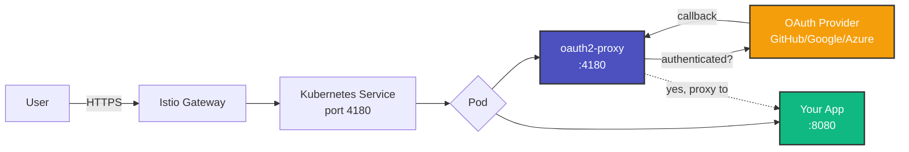
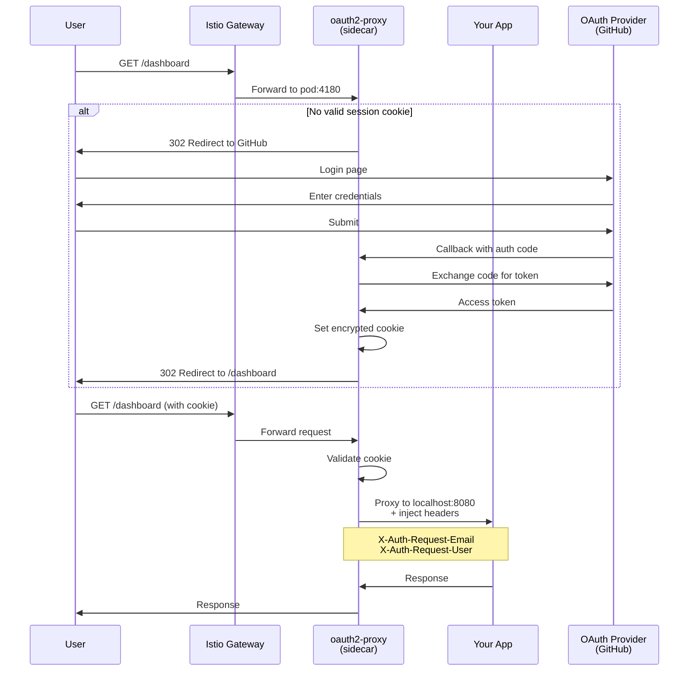
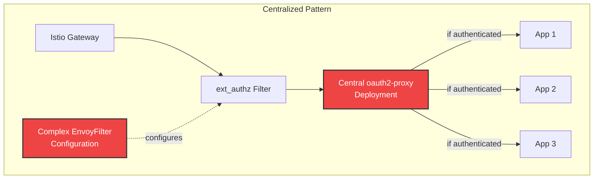
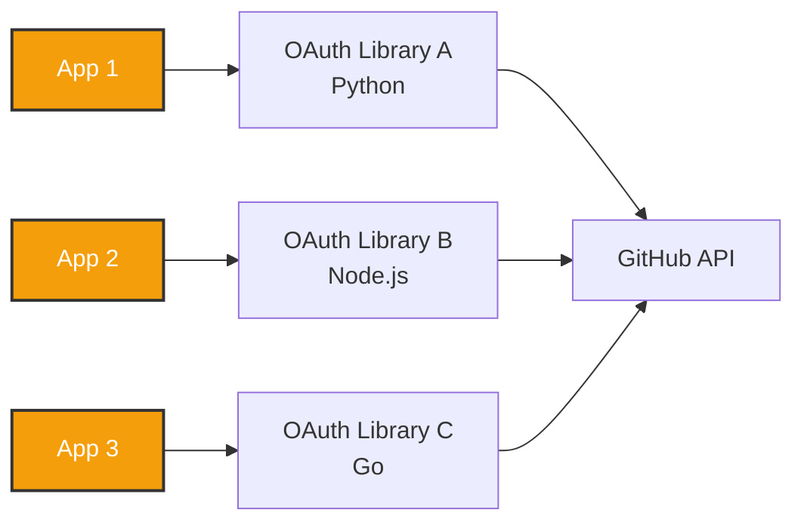
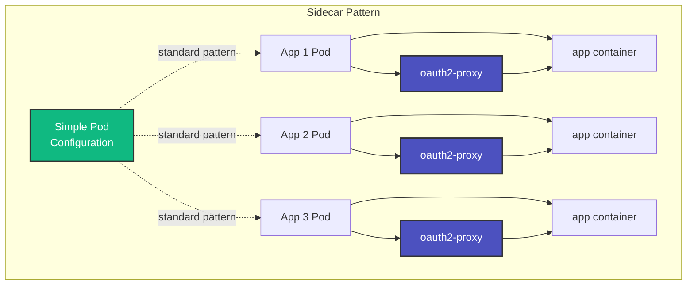

# OAuth2 Proxy Sidecar: Decentralized Authentication as a Paved Path

Remember that [centralized vs. distributed K8s manifest management](/blog/kubernetes-manifest-management-centralized-vs-distributed) discussion we had? Well, let me tell you about authentication—because if you thought manifest management was spicy, just wait until you see what teams do with auth.

I've seen some **wild** approaches:

- A centralized auth service that became a single point of failure _and_ a bottleneck (double whammy).
- Teams reimplementing OAuth2 in every. Single. Service. (What could go wrong?)
- Complex Istio `ext_authz` configurations that nobody understood after the person who wrote them left.

Then I found the **OAuth2 Proxy sidecar pattern**, and it was like finding a $20 bill in your winter coat. It just _works_.

---

## 🎯 TL;DR for the Busy Folks


| Factor                      | Centralized Auth Service             | OAuth2 Proxy Sidecar                 |
| --------------------------- | ------------------------------------ | ------------------------------------ |
| **Complexity**              | Istio ext_authz filters, EnvoyConfig | Simple container in pod              |
| **Single Point of Failure** | ❌ Yes                               | ✅ No—scales with app                |
| **Debugging**               | Distributed logs, hard to trace      | Logs in same pod as app              |
| **Per-App Customization**   | Limited                              | ✅ Each app configures independently |
| **Developer Experience**    | "Wait for platform team"             | "Add sidecar, deploy"                |
| **Resource Overhead**       | Low (single deployment)              | ~50-100MB per app                    |
| **Migration Risk**          | High (all apps at once)              | Low (one app at a time)              |

**The punchline:** Sidecar pattern is the "paved path"—standardized but decentralized. Teams get autonomy without chaos.

---

## 🏗️ What Is the Sidecar Pattern?

The sidecar pattern is like riding a motorcycle with a buddy in the sidecar. Your app is the driver, and the OAuth2 proxy is your buddy handling all the "are we there yet?" questions from users trying to authenticate.



**Key characteristics:**

1. **Co-located**: Lives in the same pod as your app
2. **Localhost communication**: App talks to sidecar on `127.0.0.1`
3. **Isolated**: Each app has its own auth instance
4. **Transparent**: App just reads headers, doesn't implement OAuth2

---

## 🔄 The Flow: How It Actually Works

Let's walk through what happens when someone tries to access your app:



**The magic:**

- **Cookie-based sessions** means no database lookup on every request
- **Localhost proxy** adds ~1-5ms latency (negligible)
- **Zero code changes** in your app—just read the headers

---

## 💡 Why This Is a "Paved Path"

A **paved path** in platform engineering is a pattern that:

1. ✅ **Standardized** - Everyone uses the same approach
2. ✅ **Self-service** - Teams can adopt it without platform team help
3. ✅ **Opinionated** - Makes the right thing easy, wrong thing hard
4. ✅ **Flexible** - Allows customization where it matters

The OAuth2 proxy sidecar hits all four:

### 1. Standardized Configuration

Platform team provides a **Helm chart** or **Kustomize base**:

```yaml
# Base ConfigMap - shared by all apps
apiVersion: v1
kind: ConfigMap
metadata:
  name: oauth2-proxy-config
data:
  oauth2_proxy.cfg: |
    provider = "github"
    cookie_domains = [".example.com"]
    cookie_secure = true
    cookie_httponly = true
    pass_user_headers = true
    set_xauthrequest = true
```

### 2. Self-Service Adoption

Product teams just add the sidecar to their deployment:

```yaml
apiVersion: apps/v1
kind: Deployment
metadata:
  name: my-awesome-app
spec:
  template:
    spec:
      containers:
        # Your app - no changes needed
        - name: app
          image: my-app:latest
          ports:
            - containerPort: 8080

        # OAuth2 Proxy sidecar
        - name: oauth2-proxy
          image: quay.io/oauth2-proxy/oauth2-proxy:v7.6.0
          args:
            - --config=/etc/oauth2-proxy/oauth2_proxy.cfg
          env:
            - name: OAUTH2_PROXY_REDIRECT_URL
              value: "https://my-app.example.com/oauth2/callback"
            - name: OAUTH2_PROXY_UPSTREAMS
              value: "http://127.0.0.1:8080"
          ports:
            - containerPort: 4180
          volumeMounts:
            - name: config
              mountPath: /etc/oauth2-proxy
      volumes:
        - name: config
          configMap:
            name: oauth2-proxy-config
```

**That's it.** No Slack message to the platform team. No ticket. No waiting.

### 3. Opinionated Defaults

The platform team encodes security best practices:

- ✅ Cookie encryption enforced
- ✅ Secure & HTTPOnly cookies by default
- ✅ User headers injected automatically
- ✅ Email domain restrictions (if needed)

```bash
# Example: Restrict to company domains
email_domains = ["example.com", "contractor.com"]
```

### 4. Flexibility Where It Matters

Teams can customize per-app:

- **Different OAuth providers** (GitHub for external, Azure AD for internal)
- **Email restrictions** (limit to specific teams/orgs)
- **Custom templates** (branded sign-in pages)
- **Session duration** (shorter for sensitive apps)

```yaml
env:
  # Override: Use Google for this app instead of GitHub
  - name: OAUTH2_PROXY_PROVIDER
    value: "google"
  - name: OAUTH2_PROXY_EMAIL_DOMAINS
    value: "example.com"
  # Custom session duration
  - name: OAUTH2_PROXY_COOKIE_EXPIRE
    value: "4h" # Shorter for sensitive apps
```

---

## 🆚 Comparison: Sidecar vs. Alternatives

### Pattern 1: Centralized Auth Service (ext_authz)

This is the "one ring to rule them all" approach:



**Pros:**

- ✅ Single deployment = lower resource usage
- ✅ Centralized management

**Cons:**

- ❌ **Single point of failure** (if auth is down, everything is down)
- ❌ **Complex Istio configuration** (EnvoyFilter + ext_authz)
- ❌ **Hard to debug** (auth logs separate from app logs)
- ❌ **Platform team bottleneck** (all changes go through them)
- ❌ **Difficult migration** (all or nothing)

I've been paged at 2 AM because the centralized auth service crashed. _Never again._

### Pattern 2: Per-App OAuth Implementation

This is the "everyone for themselves" approach:



**Pros:**

- ✅ Maximum flexibility
- ✅ No shared infrastructure

**Cons:**

- ❌ **Every team reimplements OAuth2** (reinventing the wheel)
- ❌ **Language-specific libraries** (Java, Python, Node, Go—all different)
- ❌ **Security vulnerabilities** vary by implementation
- ❌ **Token refresh logic** duplicated everywhere
- ❌ **Hard to enforce standards** (good luck with that security audit)

This is how you end up with **nine different OAuth implementations**, three of which have vulnerabilities.

### Pattern 3: OAuth2 Proxy Sidecar (The Sweet Spot)



**Pros:**

- ✅ **No single point of failure** (scales with app)
- ✅ **Simple configuration** (just add container)
- ✅ **Easy to debug** (logs in same pod)
- ✅ **Per-app customization** (different OAuth providers, policies)
- ✅ **Language-agnostic** (works with any app)
- ✅ **Gradual migration** (adopt one app at a time)
- ✅ **Self-service** (teams don't need platform approval)

**Cons:**

- ⚠️ **Slightly higher resource usage** (~50MB per app)
- ⚠️ **More pods to manage** (but Kubernetes is good at this)

---

## 🛠️ Real-World Example: The `authproxy` Project

I built [`authproxy`](https://github.com/ianlintner/authproxy) to demonstrate this pattern in production. It includes:

### 1. Helm Chart for Easy Adoption

```bash
helm repo add oauth2-sidecar https://ianlintner.github.io/authproxy
helm install oauth2-sidecar oauth2-sidecar/oauth2-sidecar \
  --set oauth.provider=github \
  --set oauth.clientID=YOUR_GITHUB_CLIENT_ID \
  --set domain=example.com
```

### 2. Pre-Built ConfigMaps and Secrets

```yaml
# Platform team creates once
apiVersion: v1
kind: Secret
metadata:
  name: oauth2-proxy-secret
type: Opaque
data:
  client-id: <base64-encoded>
  client-secret: <base64-encoded>
  cookie-secret: <base64-encoded>
```

### 3. Example App Deployment

The [`k8s/apps/example-app/`](https://github.com/ianlintner/authproxy/tree/main/k8s/apps/example-app) directory shows a complete working example:

- Deployment with sidecar
- Service exposing port 4180
- VirtualService routing traffic
- Complete documentation

### 4. Helper Scripts

```bash
# Add auth to existing app in one command
./scripts/add-sidecar.sh my-app default 8080 my-app.example.com
```

This script:

1. Patches the deployment with the sidecar container
2. Updates the Service to route to port 4180
3. Creates/updates the VirtualService
4. Validates the configuration

**Result:** Authentication in ~30 seconds, no manual YAML editing.

---

## 📊 Decision Matrix: When to Use Sidecar Pattern

Here's when the sidecar pattern makes sense:

| Scenario                                | Use Sidecar? | Why                                       |
| --------------------------------------- | ------------ | ----------------------------------------- |
| **10-200 microservices**                | ✅ Yes       | Sweet spot for standardization + autonomy |
| **Multiple teams/products**             | ✅ Yes       | Self-service = less platform bottleneck   |
| **Different OAuth providers needed**    | ✅ Yes       | Each app can use different provider       |
| **High security requirements**          | ✅ Yes       | Isolated credentials per app              |
| **Single monolith**                     | ❌ No        | Centralized auth is simpler               |
| **Very cost-sensitive (<20MB matters)** | ⚠️ Maybe     | Consider centralized if budget is tight   |
| **<5 services**                         | ⚠️ Maybe     | Centralized is fine for small scale       |

**My rule of thumb:**

- **<10 services:** Centralized is fine
- **10-200 services:** Sidecar pattern is the sweet spot
- **>200 services:** You probably have a platform team building a service mesh anyway

---

## 🎯 Real-World Patterns I've Seen Work

### Pattern 1: "Golden Path" with Escape Hatches

**Platform team provides:**

- Standard Helm chart with secure defaults
- Pre-configured GitHub/Azure AD OAuth
- Custom branded sign-in page templates
- Documentation and examples

**Product teams can:**

- Use the Helm chart as-is (80% case)
- Override specific settings (15% case)
- Roll their own if needed (5% case—but discouraged)

### Pattern 2: Progressive Rollout

**Migration strategy:**

1. **Week 1:** Deploy sidecar to dev environment
2. **Week 2:** Deploy to staging, validate SSO works
3. **Week 3:** Deploy to one prod app (low risk)
4. **Weeks 4-8:** Roll out to remaining apps, one per week

**Rollback plan:**

- Sidecar and centralized auth can coexist temporarily
- Remove sidecar = instant rollback to centralized
- Low risk, high confidence

### Pattern 3: Per-Environment Customization

```yaml
# dev: Permissive, fast iteration
dev:
  oauth:
    provider: github
    allowedEmails: ["*@example.com"]
  session:
    cookieExpire: 24h

# staging: Closer to prod
staging:
  oauth:
    provider: azure
    allowedGroups: ["engineering"]
  session:
    cookieExpire: 8h

# prod: Strict, audited
prod:
  oauth:
    provider: azure
    allowedGroups: ["engineering", "sre"]
    requireMFA: true
  session:
    cookieExpire: 4h
```

---

## 🐛 Common Pitfalls (And How to Avoid Them)

### Pitfall 1: Redirect Loop Hell

**Symptom:** Browser keeps redirecting between app and OAuth provider.

**Cause:** `OAUTH2_PROXY_REDIRECT_URL` doesn't match your domain.

**Fix:**

```yaml
env:
  - name: OAUTH2_PROXY_REDIRECT_URL
    # MUST match your actual domain
    value: "https://my-app.example.com/oauth2/callback"
```

**Pro tip:** Use `$(HOSTNAME)` in Helm for dynamic hostnames.

### Pitfall 2: Service Routes to Wrong Port

**Symptom:** 404 or connection refused errors.

**Cause:** Service routes to app port (8080) instead of sidecar (4180).

**Fix:**

```yaml
apiVersion: v1
kind: Service
metadata:
  name: my-app
spec:
  selector:
    app: my-app
  ports:
    - name: http
      port: 4180 # ← Route to sidecar, not app
      targetPort: 4180 # ← Matches sidecar port
```

### Pitfall 3: Cookie Domain Mismatch (No SSO)

**Symptom:** Have to log in separately for each app.

**Cause:** Cookie domain not set to `.example.com` (note the leading dot).

**Fix:**

```
# ConfigMap
cookie_domains = [".example.com"]  # Leading dot = wildcard
```

**Result:** Single sign-on across all `*.example.com` apps. Beautiful.

---

## 🔐 Security Considerations

### 1. Cookie Encryption

The `cookie_secret` must be cryptographically secure:

```bash
# Generate a secure secret
python -c 'import os,base64; print(base64.urlsafe_b64encode(os.urandom(32)).decode())'
```

**Store in Kubernetes Secret**, never commit to Git.

### 2. OAuth Credentials Management

**Best practice:** Use **Azure Key Vault**, **AWS Secrets Manager**, or **HashiCorp Vault** with CSI driver:

```yaml
apiVersion: v1
kind: Pod
spec:
  volumes:
    - name: secrets-store
      csi:
        driver: secrets-store.csi.k8s.io
        volumeAttributes:
          secretProviderClass: "azure-keyvault-oauth"
```

### 3. Email Domain Restrictions

Limit access to your organization:

```
email_domains = ["example.com"]
```

**Or** use GitHub org/team restrictions:

```
github_org = "my-company"
github_team = "engineering,sre"
```

### 4. Session Duration

**Shorter is more secure**, but balance with UX:

```
cookie_expire = "4h"   # Session lifetime
cookie_refresh = "1h"  # Refresh interval
```

For **highly sensitive apps** (admin panels, billing):

```
cookie_expire = "30m"  # Force re-auth every 30 min
```

---

## 📈 Observability and Monitoring

### 1. Prometheus Metrics

The oauth2-proxy exposes metrics on `/metrics`:

```yaml
apiVersion: v1
kind: ServiceMonitor
metadata:
  name: oauth2-proxy-metrics
spec:
  selector:
    matchLabels:
      app: oauth2-proxy
  endpoints:
    - port: http
      path: /metrics
```

**Key metrics to alert on:**

- `oauth2_proxy_requests_total{status="401"}` — Authentication failures
- `oauth2_proxy_upstream_latency_seconds` — Latency to your app
- `oauth2_proxy_errors_total` — OAuth provider errors

### 2. Structured Logging

Configure JSON logging for easy parsing:

```
# ConfigMap
standard_logging = false  # Disable Apache-style logs
auth_logging = true
request_logging = true
```

**Example log entry:**

```json
{
  "level": "info",
  "timestamp": "2025-12-01T10:30:00Z",
  "message": "authenticated",
  "email": "user@example.com",
  "path": "/dashboard",
  "upstream": "http://127.0.0.1:8080"
}
```

### 3. Distributed Tracing

If using **Jaeger** or **Zipkin**, oauth2-proxy propagates trace IDs:

```
pass_authorization_header = true
pass_user_headers = true
```

---

## 🚀 Migration Strategy: From Centralized to Sidecar

If you're currently using centralized auth, here's how to migrate safely:

### Phase 1: Dual-Run (Week 1-2)

1. Deploy sidecar to **one non-critical app**
2. Run both centralized auth _and_ sidecar
3. Monitor for issues (redirect loops, cookie problems)

### Phase 2: Gradual Migration (Week 3-8)

1. Migrate one app per week
2. Prioritize low-traffic apps first
3. Keep centralized auth running for unmigrated apps

### Phase 3: Deprecation (Week 9-10)

1. Once all apps migrated, announce deprecation
2. Remove centralized auth deployment
3. Delete ext_authz EnvoyFilter configs

**Rollback plan:**

- Keep centralized auth deployment for 2 weeks after last app migration
- If issues, just delete sidecar from deployment

---

## 🎓 Lessons from the Field

### Lesson 1: Don't Over-Engineer

I've seen teams try to build "the perfect auth system" with:

- Multiple OAuth providers per app
- Complex RBAC integrated with auth
- Custom UI for every single app

**Reality check:** Start simple. GitHub OAuth + email domain restriction covers 90% of use cases.

### Lesson 2: Documentation > Perfection

The best auth system is the one **teams actually use**.

**Write docs like this:**

```markdown
# Adding Auth to Your App

1. Copy this YAML
2. Change `my-app` to your app name
3. Deploy
4. Done

Questions? Slack us in #platform-help
```

**Not like this:**

```markdown
# OAuth2 Proxy Architecture

This document describes the theoretical foundations of OAuth2
authentication using the sidecar pattern in distributed systems...
```

(Save the architecture deep-dive for a separate doc.)

### Lesson 3: Make the Right Thing Easy

**Bad:** "Read these 10 pages of docs, then open a Jira ticket for OAuth credentials."

**Good:** "Run this script: `./add-auth.sh my-app`"

Self-service wins every time.

---

## 🎯 Conclusion: Why This Matters

The OAuth2 proxy sidecar pattern represents a **fundamental shift** in how we think about platform capabilities:

**Old way (Centralized):**

- Platform team owns everything
- Product teams file tickets
- Changes are slow and risky

**New way (Paved Path):**

- Platform team provides the path
- Product teams walk it themselves
- Changes are fast and safe

**The result:**

- ✅ **Faster time-to-production** (no waiting for platform team)
- ✅ **Better security** (standardized, auditable)
- ✅ **Happier developers** (self-service + autonomy)
- ✅ **Less platform toil** (fewer tickets, more automation)

This isn't just about authentication. It's about **building platforms that scale**—not just technically, but _organizationally_.

The sidecar pattern for auth is proof that **decentralization done right** beats centralization every time.

---

## 📚 Resources

- **[authproxy GitHub repo](https://github.com/ianlintner/authproxy)** — Complete working example with Helm chart, docs, and scripts
- **[OAuth2 Proxy Documentation](https://oauth2-proxy.github.io/oauth2-proxy/)** — Official docs for oauth2-proxy
- **[Istio Sidecar Pattern](https://istio.io/latest/docs/concepts/sidecar/)** — Understanding the sidecar pattern in Istio
- **[Platform Engineering Principles](https://platformengineering.org/)** — Building paved paths for teams

---

## What's Next?

In my next post, I'll dive into **multi-tenancy patterns** in Kubernetes and how to build **tenant isolation** without losing your mind. Because if you thought auth was complex, wait until you try to isolate 50 customers in the same cluster.

Stay tuned. And as always, you betcha. 🎣
