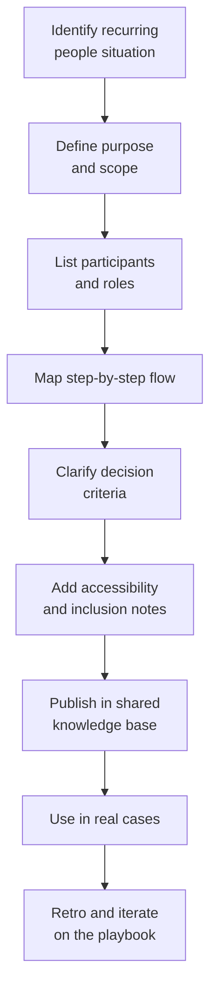
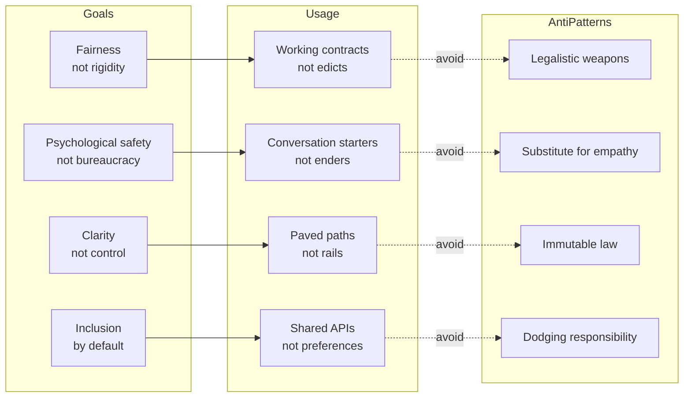
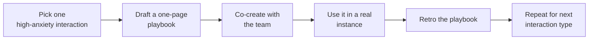

# Operational Playbooks for People Stuff

_How Written Norms Build Trust, Performance, and Neuro-Inclusive Engineering Teams_

Most engineering orgs have beautifully documented _technical_ procedures—incident runbooks, deployment checklists, coding standards.

But when it comes to _people_ work—planning, promotions, pay reviews, scope changes, conflict, performance issues—things are often fuzzy, tribal, and opaque. The result: surprises, anxiety, and a lot of “it depends on the manager.”

We can do better.

This article makes the case for **non-technical playbooks**—concise, shared documents that describe _how_ key human processes work on your team—and shows how they:

- Increase trust and performance
- Make expectations legible, especially for neurodivergent engineers
- Provide a “paved path, not railroad rails” for how we work together

You’ll also get a **“playbook for playbooks”**: how to create, use, and _not_ misuse them.

---

## What Is a “People Playbook”?

When I say “playbook,” I don’t mean a rigid script that removes manager judgment.

A **people playbook** is:

> A concise, written, shared description of _how_ the team handles a recurring non-technical situation—who’s involved, what steps we follow, what good looks like, and what timelines to expect.

They’re essentially team-level **working agreements** for the moments that matter most to engineers:

- “How do promotions work here?”
- “If scope changes late in the sprint, what happens?”
- “If I’m struggling, what does ‘performance improvement’ actually look like?”
- “What happens in a compensation review cycle?”
- “How do we handle conflict between teammates?”

Playbooks don’t guarantee perfect outcomes, but they remove a ton of **ambiguity about the process**.

---

## Why Written Expectations Matter

Organizational psych and software engineering research point in the same direction:

- **Role ambiguity** is reliably linked with lower job satisfaction and modestly worse performance.
- In software teams specifically, **norm clarity and psychological safety** both predict self-assessed performance and job satisfaction—**norm clarity is the stronger predictor**.
- Google’s Project Aristotle found that, alongside psychological safety, **structure & clarity** (clear roles, plans, expectations) is a core factor in effective teams.

For neurodivergent folks (autistic, ADHD, dyslexic, etc.), hidden rules and unwritten expectations aren’t just annoying—they can be **true barriers to success**. Many neurodiversity resources highlight the same accommodations again and again:

- Written, concise instructions and checklists
- Predictable routines and clear agendas
- Concrete deadlines ("by 3 pm" vs. "ASAP")
- Advance notice of changes

Some estimates suggest roughly **15–20% of people are neurodivergent**.

So:

> Playbooks aren’t “special treatment.” They’re **universal design**—they help everyone, and disproportionately benefit people whose brains really suffer from ambiguity and hidden rules.

For engineers who are literal thinkers or process verbal info differently, being able to read, revisit, and slowly digest the team’s “social API” (how conflict is handled, how promotions work) can be the difference between thriving and quietly burning out.

---

## High-Impact People Playbooks for Engineering Teams

You don’t need dozens of playbooks. Start with a small set covering the **highest-stress, highest-ambiguity** interactions.

Here are patterns you can adapt.

### Planning (quarterly, release, or big bets)

**Goal:** Make planning predictable and less political.

Your planning playbook should answer:

- **Triggers:** When do we run planning? (Quarterly? Before large epics?)
- **Inputs:** Roadmap candidates, metrics, tech-debt list, capacity, constraints.
- **Participants:** PM, EM, tech leads, representative ICs, stakeholders.
- **Steps:**
  - How proposals are collected (template, deadline).
  - How you estimate and evaluate work (impact, effort, risk).
  - How decisions are made and documented.
- **Outputs:** The plan, plus what you explicitly _didn’t_ do and why.
- **Timelines:** Key dates (drafts, reviews, finalization).

Result: fewer “surprise decisions,” more trust in the process.

### Retrospectives

**Goal:** Make retros safe, focused, and action-oriented—not just venting.

Define:

- Standard formats (Start/Stop/Continue, 4Ls, etc.).
- How topics get on the agenda (anonymous form, board, doc).
- Safety norms (no naming and shaming; focus on systems, not individuals).
- Action tracking (limit to a few items, assign owners, due dates, and revisit next retro).

### 1:1s

**Goal:** Ensure 1:1s are consistent, safe, and valuable—not just status updates.

Include:

- Default cadence and duration.
- A shared agenda doc template (updates, feedback, career, well-being).
- Expectations on both sides:
  - Managers show up prepared with feedback and context.
  - Reports can add agenda items asynchronously; managers read them beforehand.
- Topics that are always welcome (career, workload, team dynamics, accommodations, etc.).

Documenting this makes it much clearer—especially for neurodivergent engineers—what’s “allowed” in a 1:1 and how to raise difficult topics.

### Pay Reviews

**Goal:** Reduce opacity and rumor around compensation.

Describe:

- How often comp is reviewed (e.g., annually plus promotion-driven changes).
- Inputs: market data, internal bands, performance, scope of responsibility.
- Who participates at each stage (manager, calibration committee, HR/People).
- How to raise compensation concerns outside standard cycles, and when that’s appropriate.
- What is _not_ part of the process (e.g., pure negotiation, jumping bands ad hoc).

You don’t have to publish specific bands, but **explaining the process** is already a massive trust gain.

### Promotions

**Goal:** Make promotions transparent and achievable, not mystical.

Cover:

- Levels and expectations (ideally linked to a public career ladder).
- Criteria: demonstrated impact, scope, behaviors—not just tenure.
- How candidates are identified (self-nomination? manager nomination? both?).
- The review process: packet structure, promotion committee, timelines.
- What happens if a promotion is not approved: how feedback is delivered, and when the case can be revisited.

A good promotion playbook lets an engineer reasonably answer: _“If I repeatedly do X, Y, Z, I am operating at L+1.”_

### Conflict Resolution

**Goal:** Prevent interpersonal issues from festering or exploding.

Define:

- What counts as “we should address this” (patterns of miscommunication, repeated friction, perceived disrespect, etc.).
- A stepwise path:
  1. Direct conversation between parties (with a suggested structure or script).
  2. Manager-facilitated conversation.
  3. Escalation to skip-level or People/HR if needed.
- Behavioral norms (listen, restate, focus on behaviors and impact, not character).
- Non-retaliation and confidentiality principles.

For people who struggle with reading social cues or unstructured conflict, this is huge: it tells them _exactly how_ to raise issues and what support will be available.

### Scope Changes

**Goal:** Avoid the “drive-by feature” that derails a sprint or project.

Include:

- When scope changes are allowed and when they’re not (e.g., rules during a sprint).
- Who can request changes and how (ticket template, required impact section).
- How trade-offs are evaluated and who decides.
- What happens if a change is accepted (re-plan, communicate to the team, adjust metrics or timelines).

### Performance Issues & Improvement

**Goal:** Turn performance problems into structured, humane improvement instead of surprise decisions.

Spell out:

- How early concerns are raised (ideally in regular 1:1s, with concrete examples).
- Distinctions between “informal coaching,” “heightened expectations,” and formal improvement plans.
- What a performance plan includes:
  - Specific goals and behaviors
  - Timeframe
  - Support/resources (mentoring, pairing, training)
  - Check-in cadence
- Possible outcomes at the end of the plan and how they’re communicated.

For many neurodivergent engineers, surprise negative feedback is especially destabilizing. A written, staged process is both fairer and more effective.

---

## How to Design a Good People Playbook

You can reuse the same structure for any people playbook:

1. **Purpose**

   > “This playbook explains how we handle X on this team.”

2. **Scope & triggers**
   - When does this apply? (Annual performance cycle, any time a teammate feels there’s a conflict they can’t resolve directly, etc.)

3. **Participants & roles**
   - Who is involved and what they’re responsible for (ICs, EMs, PMs, HR, leadership).

4. **Timeline**
   - Typical durations and key deadlines.
   - For neuro-inclusion, avoid “ASAP”; prefer explicit timeboxes ("within two business days").

5. **Step-by-step flow**
   1. Initiation (who starts the process; what info they provide)
   2. Data gathering (feedback, metrics, docs)
   3. Discussion / decision
   4. Communication of outcome
   5. Follow-up and review

6. **Decision criteria**
   - The factors that are weighed (impact, scope, pattern vs. one-off, etc.).

7. **What good looks like**
   - Examples of healthy behaviors from both leaders and ICs in this process.

8. **Accessibility & inclusion notes**
   - Written agendas and notes.
   - Options for async participation or written follow-ups.
   - How to request accommodations (more written communication, extra processing time, etc.).

9. **Where this lives & how it evolves**
   - Links in your internal knowledge base.
   - A named owner and "last updated" date.
   - A review cadence (every 6–12 months, or after major incidents).

Each playbook should be **1–3 pages**: long enough to be clear, short enough to be read.

---

## The Playbook for Playbooks (Going Meta)

At some point, you’ll realize: **even the playbook process needs a playbook.**

This “playbook for playbooks” captures the philosophy behind all the others.

### The goal of playbooks

- **Clarity, not control** – Make expectations legible so people can succeed without guesswork.
- **Fairness, not rigid uniformity** – Handle similar situations with similar principles, while leaving room for context.
- **Psychological safety, not bureaucracy** – Turn high-anxiety processes (promotions, performance, conflict) into predictable journeys.
- **Inclusion by default** – Treat written norms as a built-in accommodation that helps neurodivergent and neurotypical folks alike.

### How to use playbooks

- **As paved paths, not railroad rails** – A playbook is the default, low-friction way through a situation, not the only legal way. Stepping off the path is fine—just communicate why.
- **As working contracts, not edicts** – Treat playbooks as **negotiated agreements** between managers and ICs, or between teams and leadership.
- **As conversation starters, not conversation enders** – "Our conflict playbook says we usually start with a direct conversation—does that feel okay to you?"
- **As shared APIs, not personal preferences** – They document the team's _social API_ so behavioral expectations don't depend on one manager's quirks.

### How _not_ to use playbooks

- **Not as legalistic weapons** – If the first time someone hears about a playbook is when it’s used against them, you’ve damaged trust.
- **Not as a substitute for empathy** – A good playbook creates space for hard conversations; it doesn’t replace them.
- **Not as immutable law** – When people feel strapped to process “rails” with no room for judgment, you’ve gone too far.
- **Not as a way to dodge responsibility** – “The playbook made me do it” is just hiding behind process. Leaders still own decisions.

You can literally write a one-pager titled **“How We Use Playbooks”** that encodes these principles and sits alongside the others.

---

## Getting Started: A Lightweight Rollout Plan

If this all sounds good but large, keep it small and iterative:

1. **Pick one high-anxiety interaction** – Promotions, performance, or conflict are common starting points.
2. **Draft a one-page playbook** – Use the template above. Aim for clarity over completeness.
3. **Co-create with your team** – Share the draft, gather feedback in a meeting or async doc, and adjust.
4. **Use it in the next real instance** – When the next promotion cycle or conflict arises, walk through the playbook step by step.
5. **Retro the playbook itself** – After a few uses, ask: What reduced stress or confusion? What was still ambiguous? Where did we need more flexibility?
6. **Repeat for the next interaction type** – Over time you'll build a small, coherent library of people playbooks that your org actually believes in.

---

## Conclusion

Pulling the threads together:

- **Role ambiguity** is consistently associated with lower job satisfaction and modestly lower performance.
- In software teams, **norm clarity and psychological safety** both predict performance and satisfaction, with norm clarity especially powerful.
- Google’s work on team effectiveness highlights **structure and clarity** as a core factor, alongside psychological safety.
- Neurodiversity research and practice consistently emphasize **clear written expectations, predictable processes, and concrete instructions** as core accommodations that help neurodivergent and neurotypical employees alike.

**People playbooks** are a simple, high-leverage way to operationalize all of that in an engineering context.

They turn:

> “It depends on the manager”

into:

> “Here’s how it works on this team.”

Used well, they’re **paved paths rather than railroad rails**—negotiated, living working contracts that make your team’s social infrastructure explicit, debuggable, and more humane.

If you’re an engineering leader, staff+ IC, or anyone who cares about making your environment safer for neurodivergent colleagues (including yourself), start with a single playbook. Iterate. Then write the playbook for your playbooks.
