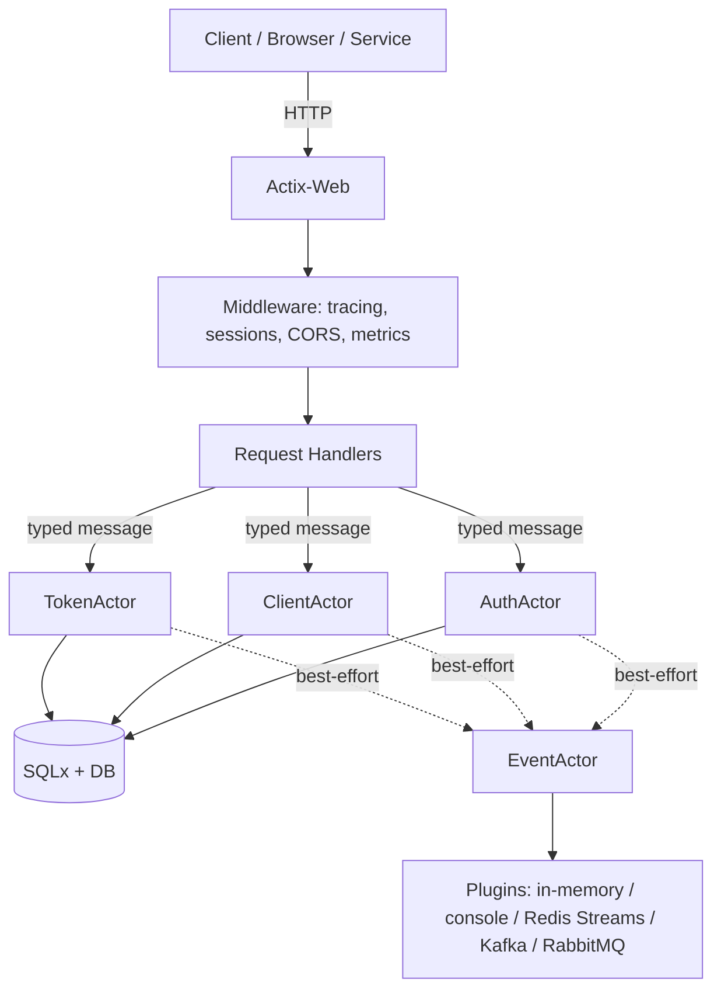

Most teams start with a hosted identity provider (Auth0/Okta/Cognito/Entra ID) and never look back.
And that’s usually correct.

But sometimes you _do_ want to run your own OAuth2/OIDC control plane:

- You need **data sovereignty** or bespoke compliance controls.
- You’re running a platform and want an internal “paved path” for auth.
- Your cost curve is dominated by MAU pricing.
- You want deeper customization than most SaaS providers allow.

This post is a deep dive into my **Rust OAuth2 Server** project:

- Repo: https://github.com/ianlintner/rust-oauth2-server
- Docs site: https://ianlintner.github.io/rust-oauth2-server/

It’s an OAuth2 authorization server built on **Actix-Web**, using **Actix’s actor model** for concurrency and **SQLx** for persistence with compile-time query verification.
It’s also deliberately “cloud-native”: metrics, tracing, health checks, Kustomize-based Kubernetes deploys, and an eventing system that’s designed to never break the core auth path.

## What it is (and what it isn’t)

An OAuth2 authorization server is not automatically a full-featured enterprise IdP.
Some projects do both (authentication + authorization + user lifecycle + admin UI + federation), and some keep the core smaller.

This project targets a pragmatic center:

- **OAuth2/OIDC endpoints** that apps and gateways actually need.
- Enough UI to support login and social login.
- Strong ops/observability primitives.
- A concurrency model that keeps the “blast radius” small when something goes sideways.

If you want a turnkey admin console with every enterprise integration under the sun, you might still prefer Keycloak.
If you want an OAuth2 _engine_ that you embed into your own product, this server is aiming to be a solid foundation.

## Feature snapshot (from the docs)

From the README and API docs:

- Authorization Code + PKCE (RFC 7636)[^pkce]
- Client Credentials
- Password grant (legacy; supported because reality exists)
- Refresh tokens (with rotation)
- Token introspection (RFC 7662)[^rfc7662]
- Token revocation (RFC 7009)[^rfc7009]
- Discovery (RFC 8414)[^rfc8414]
- OpenAPI + Swagger UI
- Prometheus metrics, OpenTelemetry tracing
- Kubernetes-ready health/readiness endpoints
- Authentication eventing (pluggable backends)

Core endpoints include:

- `GET /oauth/authorize`
- `POST /oauth/token`
- `POST /oauth/introspect`
- `POST /oauth/revoke`
- `GET /.well-known/openid-configuration`
- `GET /.well-known/jwks.json`
- `GET /health`, `GET /ready`, `GET /metrics`, `GET /swagger-ui`

…and optional event ingestion endpoints (`/events/*`) when eventing is enabled.[^endpoints]

## Architecture: HTTP handlers + actors + storage

The architecture is intentionally boring at the edges and opinionated in the middle:

1. Actix-Web handles HTTP, routing, and middleware.
2. Handlers validate requests and translate them into **typed messages**.
3. Messages are sent to actors that own the stateful parts (tokens, clients, auth flows).
4. Actors talk to storage via SQLx.
5. Events are published best-effort to an **EventActor** that fans out to configured backends.

The important design idea is: **handlers don’t directly mutate shared state**.
They ask the right actor to do the work.

## Why the actor model matters for security and reliability

Security failures are often “just bugs”, but the bug category matters.
Concurrency bugs, partial failures, and backpressure failures often show up as:

- “We issued tokens twice.”
- “We reused a refresh token.”
- “We corrupted an authorization code record under load.”
- “We timed out and then retried and now the state is weird.”

Actors help here because:

- **Isolation**: each actor owns its internal state; you reduce accidental shared mutable state.
- **Message boundaries**: the inputs to a sensitive operation are explicit (typed message payloads).
- **Backpressure**: mailboxes give you a natural place to apply rate-limits and shed load.
- **Fault isolation**: if an actor crashes, you can restart it without tearing down the entire process.

This doesn’t magically make a system “secure”, but it reduces the likelihood of certain classes of failure—especially the kind that show up under load, during deploys, or during partial infrastructure outages.

## Rust’s security story (without the hype)

Rust brings two huge benefits to security-sensitive services:

1. **Memory safety without a GC**: the language prevents entire families of vulnerabilities (use-after-free, buffer overflows) _by construction_.
2. **Data race freedom**: safe Rust makes it dramatically harder to create concurrency bugs.

But: Rust won’t save you from logic bugs.
OAuth2 is specification-heavy, and the most common failures are still:

- Bad redirect URI validation
- Incorrect scope checks
- Weak secret management
- Insecure browser token storage

So the real security story is _layered_:

- Rust reduces certain exploit classes.
- The actor model reduces certain concurrency hazard classes.
- SQLx reduces “SQL stringly-typed footguns.”
- And you still need a security checklist and operational discipline.

The project’s `SECURITY.md` leans into that reality: it calls out minimum secret lengths, session key requirements for multi-instance deployments, and a production checklist (HTTPS, CORS, redirect URI review, monitoring, secret rotation, etc.).[^security]

## SQLx and “compile-time SQL” as a safety rail

SQL injection is usually a _data boundary_ problem, not a “language problem.”
But ergonomics matter.

This project uses SQLx, which can verify SQL queries at compile time (against your schema) and encourages parameterized queries.
That tends to:

- Reduce runtime failures caused by mismatched columns/types.
- Make it harder to “accidentally” build string-concatenated SQL.

It doesn’t replace DB hardening (least-privilege users, TLS, backups), but it’s an excellent safety rail.

## Eventing: security signals without slowing the auth path

OAuth2 systems live or die on observability.
If you can’t answer “what changed?”, you will eventually have a Very Bad Week.

The authentication eventing system is designed with **best-effort semantics**:

- Core OAuth2 flows should keep working even if your event sink is unhealthy.
- Events are wrapped in an `EventEnvelope` that can include correlation IDs and W3C trace context.
- Backends are pluggable (in-memory, console, Redis Streams, Kafka, RabbitMQ).

This is a big deal operationally:

- You can feed token issuance / revocation events into a SIEM.
- You can alert on spikes in failed auth attempts.
- You can build downstream workflows without coupling them to the request path.

See the eventing documentation for details and configuration options.[^eventing]

## Cloud-native ops: K8s manifests and sensible endpoints

The project includes Kustomize-based Kubernetes deployment manifests and standard operational endpoints:

- `/health` and `/ready` for probes
- `/metrics` for Prometheus scraping
- `/swagger-ui` for API exploration

The `k8s/` directory includes base + overlays (dev/staging/production), a Flyway migration job, and optional HPA configuration.[^k8s]

## Detailed comparison: where this fits among OSS options

OAuth2 servers come in different shapes.
Some are full identity platforms; others are “authorization engines”; others are gateways/sidecars.

Here’s a comparison that focuses on architecture and operational tradeoffs (not a “feature checklist war”).

| Project                         | Primary role                               | Typical stack                    | Strengths                                                                                                                                    | Tradeoffs / watch-outs                                                                   |
| ------------------------------- | ------------------------------------------ | -------------------------------- | -------------------------------------------------------------------------------------------------------------------------------------------- | ---------------------------------------------------------------------------------------- |
| **Rust OAuth2 Server**          | OAuth2/OIDC authorization server           | Rust + Actix-Web + actors + SQLx | Actor isolation + typed messages; strong observability primitives; eventing designed not to break auth flows; K8s manifests; OpenAPI/Swagger | Newer ecosystem compared to Keycloak; you own product decisions (admin UX, integrations) |
| **Keycloak**                    | Full IdP + OAuth2/OIDC                     | Java (Quarkus)                   | Mature ecosystem; admin UI; lots of integrations; widely deployed                                                                            | Can be heavier operationally; customization can drift into “ClickOps” without discipline |
| **Spring Authorization Server** | OAuth2/OIDC engine you embed               | Java + Spring                    | Code-first; great fit for JVM shops; integrates nicely with Spring Security                                                                  | You build the app around it (UI, user model, ops); still JVM footprint                   |
| **Ory Hydra**                   | OAuth2/OIDC authorization server           | Go + SQL                         | Strong protocol focus; separation of concerns; designed for composability                                                                    | Often paired with other Ory components; more moving parts                                |
| **Dex**                         | OIDC identity connector                    | Go                               | Great for Kubernetes SSO and bridging external IdPs into OIDC                                                                                | Not a general “OAuth2 server for everything”; narrower scope                             |
| **oauth2-proxy**                | Authn gateway/sidecar (not an auth server) | Go                               | Fantastic for protecting apps without modifying them; works great in K8s/Ingress                                                             | Delegates identity to an upstream IdP; not a token minting control plane                 |
| **Authelia**                    | Authentication portal / SSO front door     | Go                               | Nice for homelab / internal SSO; simple deployment                                                                                           | Not a general OAuth2 server replacement; feature set differs                             |

### How Rust + actors changes the trade space

If you’re comparing “Rust OAuth2 Server vs other OAuth2 servers”, the differentiator isn’t that Rust is inherently _more secure than everything else_.
The differentiator is that Rust + actor isolation shifts the failure modes:

- Memory corruption style exploits are substantially harder.
- Many data race / shared-state hazards are structurally avoided.
- You get clear boundaries for backpressure, retries, and fault isolation.

That can translate to a system that is “on par” with mature platforms security-wise _if_ the rest of your operational practices are solid (TLS, secrets, redirect URI policies, monitoring, incident response).

## When I’d choose this server

I’d reach for this project when:

- You want an OSS auth control plane that’s **code-first** and cloud-native.
- You care deeply about observability and want a first-class event stream.
- You want a concurrency model that makes correctness under load easier.
- You’re comfortable owning and evolving your auth product surface.

If you want a ready-to-go enterprise IdP UI and a decade of ecosystem depth, Keycloak is still hard to beat.

## References

[^pkce]: RFC 7636 — Proof Key for Code Exchange (PKCE): https://datatracker.ietf.org/doc/html/rfc7636

[^rfc7662]: RFC 7662 — OAuth 2.0 Token Introspection: https://datatracker.ietf.org/doc/html/rfc7662

[^rfc7009]: RFC 7009 — OAuth 2.0 Token Revocation: https://datatracker.ietf.org/doc/html/rfc7009

[^rfc8414]: RFC 8414 — OAuth 2.0 Authorization Server Metadata: https://datatracker.ietf.org/doc/html/rfc8414

[^endpoints]: Rust OAuth2 Server endpoints reference: https://github.com/ianlintner/rust-oauth2-server/blob/main/docs/api/endpoints.md

[^eventing]: Rust OAuth2 Server eventing docs: https://github.com/ianlintner/rust-oauth2-server/blob/main/docs/eventing.md

[^security]: Rust OAuth2 Server security configuration guide: https://github.com/ianlintner/rust-oauth2-server/blob/main/SECURITY.md

[^k8s]: Rust OAuth2 Server Kubernetes deployment guide: https://github.com/ianlintner/rust-oauth2-server/blob/main/k8s/README.md
