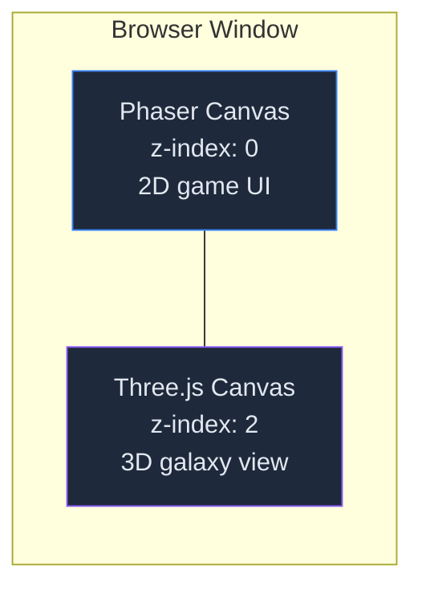
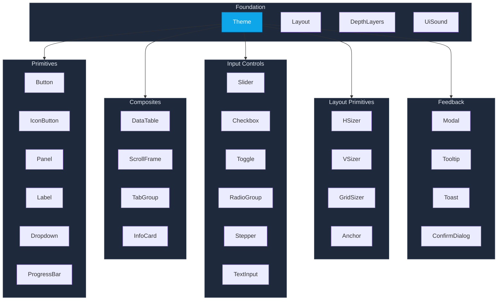
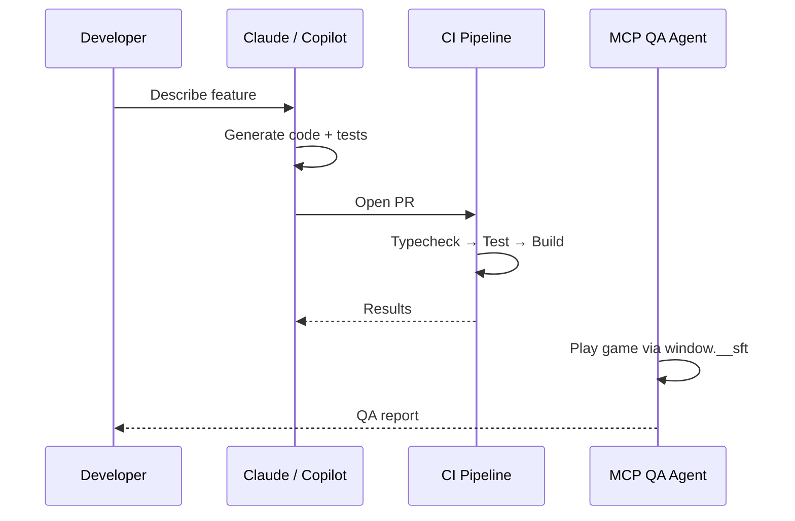

# Star Freight Tycoon: Phaser 4 Upgrade, 3D Galaxies & a Canvas UI Library

[Star Freight Tycoon](https://github.com/ianlintner/space-tycoon) is a browser-based, turn-driven space-trade simulation I've been building in TypeScript. Think _Aerobiz Supersonic_ meets _Master of Orion 2_ meets _Transport Tycoon_ — buy low, sell high, expand your fleet, optimize routes, weather market swings, and climb the high-score table across procedurally generated galaxies.

Over the past few weeks the project has gone through three major evolutions: a **Phaser 3 → Phaser 4 engine upgrade**, a **Three.js-powered 3D galaxy renderer**, and the extraction of a **standalone, theme-driven canvas UI component library**. This post walks through each of those changes, the architectural decisions behind them, and what I learned along the way.

---

## TL;DR

| Change                     | What happened                                                                                                                |
| -------------------------- | ---------------------------------------------------------------------------------------------------------------------------- |
| **Phaser 4 upgrade**       | Migrated the entire game from Phaser 3 to Phaser 4 — new import style, RenderNode architecture, unified Filter API for masks |
| **3D galaxy views**        | Added Three.js as a sibling canvas overlay for 3D star systems, hyperlane networks, and trade route visualization            |
| **`@spacebiz/ui` library** | Extracted 40+ canvas-only UI components into a reusable, MIT-licensed Phaser 4 component library with a visual styleguide    |
| **Diplomacy system**       | Built a multi-wave diplomatic relations system with gifts, surveillance, sabotage, and non-compete proposals                 |
| **AI-pair development**    | 285+ PRs, most co-authored with Claude and GitHub Copilot, plus a caretaker bot for automated maintenance                    |

---

## 🏗️ Phaser 3 → Phaser 4: The Engine Upgrade

Phaser 4 landed with some significant breaking changes. We were one of the first production games to make the jump, and the migration touched virtually every file in the codebase.

### What changed

**Import style.** Phaser 4 dropped the default export. Every import had to change:

```typescript
// Phaser 3
import Phaser from "phaser";

// Phaser 4
import * as Phaser from "phaser";
```

**Mask API.** The old `setMask()` method is gone. Phaser 4 uses a unified Filter API:

```typescript
// Phaser 3
gameObject.setMask(new Phaser.Display.Masks.GeometryMask(scene, shape));

// Phaser 4
gameObject.filters?.internal.addMask(maskShape);
```

**RenderNode architecture.** Phaser 4 introduced a new rendering pipeline based on RenderNodes. This is a more composable, extensible system — but it meant that any code touching the renderer directly needed to be updated.

### Lessons learned

The biggest surprise was how many _indirect_ breakages the mask API change caused. We had clipping masks throughout the UI — scroll frames, panels with rounded corners, data tables with pinned headers — and every one of them broke silently. The game would render, but content would bleed outside its containers. [PR #88](https://github.com/ianlintner/space-tycoon/pull/88) was a follow-up specifically to restore clipping masks broken by the API mismatch.

**Takeaway:** When upgrading a game engine, visual regressions are harder to catch than compile errors. Invest in visual regression tests _before_ the upgrade.

---

## 🌌 3D Galaxy Views with Three.js

The 2D galaxy map worked, but it didn't convey the _scale_ of a procedurally generated galaxy. I wanted players to see their trade empire from orbit — star systems glowing, hyperlanes threading between them, trade routes arcing through space.


### The sibling canvas architecture

Rather than trying to embed Three.js inside Phaser's WebGL context (a recipe for pain), I went with a **sibling canvas** approach:



Three.js renders on a separate `<canvas>` element positioned absolutely over the Phaser canvas. The 3D canvas has `pointer-events: none`, so all input still flows through Phaser. A `ResizeObserver` keeps the two canvases in sync.

### What gets rendered in 3D

- **Star systems** — `THREE.SphereGeometry` meshes with emissive `MeshStandardMaterial` and additive-blended sprite halos for glow
- **Empire territories** — Large additive bubble sprites sized to encompass all member systems
- **Hyperlane network** — `THREE.LineSegments` with vertex colors: open lanes in blue (`#6dc8ff`), restricted in orange (`#ffaa00`), closed in red (`#ff4444`)
- **Trade routes** — `THREE.CatmullRomCurve3` splines with player routes in gold (`#ffd178`) and AI routes in slate (`#9aa6c8`), filterable by company
- **Background starfield** — 1,200 random points on a sphere using `THREE.Points`

### Camera and performance

The camera is a `PerspectiveCamera` with orbital controls (yaw, pitch, zoom) focused on the galaxy centroid. Lighting is ambient-only — every star is its own light source via emissive materials, which keeps the scene performant without shadow calculations.

```typescript
// Performance settings
renderer = new THREE.WebGLRenderer({
  canvas,
  alpha: true,
  antialias: true,
  powerPreference: "high-performance",
});
renderer.setPixelRatio(Math.min(window.devicePixelRatio, 2));
```

The pixel ratio is capped at 2 to prevent GPU thrashing on high-DPI displays. Scissor-test viewport rendering keeps the 3D view confined to its designated area.

### Cleanup matters

One thing I learned the hard way: Three.js doesn't garbage-collect GPU resources. Every geometry, material, texture, and DOM element needs explicit disposal on scene shutdown. The `destroy()` method in `GalaxyView3D` is almost as long as the setup code.

---

## 🎨 The `@spacebiz/ui` Component Library

As the game grew to 23 scenes, I kept writing the same UI patterns over and over — panels, buttons, scroll frames, data tables, dropdowns. Eventually I extracted everything into a standalone package: **`@spacebiz/ui`**.

### Design principles

1. **Canvas-only.** No HTML overlays, no DOM dependencies. Every component is a `Phaser.GameObjects.Container`. This means the UI works identically on every platform Phaser supports.
2. **Theme-driven.** A single `Theme` object provides semantic tokens (colors, spacing, typography) with dark, light, and high-contrast variants. Swap the theme, and every component updates.
3. **Consistent API.** Every component follows the same constructor pattern: `new Component(scene, config)`. No factories, no builders, no magic.
4. **Fluid layout.** All components support `setSize()` for responsive reflow. A `ResizeHost` at the scene level triggers cascading resize events.

### Component inventory

The library ships 40+ components organized by category:



### The two-tier split

Not everything belongs in an open-source library. Game-specific components — portrait panels, mini-maps, the galactic news ticker — carry the game's IP. So I split the UI into two tiers:

| Tier       | Package                  | License     | Contents                                                                    |
| ---------- | ------------------------ | ----------- | --------------------------------------------------------------------------- |
| **Tier 1** | `@spacebiz/ui`           | MIT         | Generic Phaser 4 UI components — buttons, panels, tables, layout primitives |
| **Tier 2** | `@rogue-universe/shared` | Proprietary | IP-bearing game-specific components — portraits, star maps, news tickers    |

This lets the generic library be useful to anyone building a Phaser 4 game, while keeping the game's unique visual identity protected.

### Visual styleguide

The library ships with a **visual styleguide** — a separate Vite entry point that renders every component with interactive knobs, a theme switcher, and registry-driven sections. It doubles as a visual regression test target.

### From library primitives to real game screens

The screenshots below are where the component library work becomes visible. The route finder, research tree, diplomacy table, and quarter summary all share the same primitives: panels, tab groups, data tables, badges, buttons, progress bars, and scroll frames. The goal is that every screen feels like it belongs on the same starship bridge, even though each one is a different workflow.


What I like about these screens is that they are dense without being generic. The tables behave like application UI, but the neon borders, CRT-inspired typography, compact icon rail, and constantly visible company/quarter/cash chrome keep it grounded in the game's fiction.

---

## 🤝 The Diplomacy System

One of the biggest gameplay additions is a multi-wave **Diplomatic Relations** system. Players can now interact with rival AI empires through a Foreign Relations hub:


- **Wave 1:** Gift and Surveil operations with a Lobby view
- **Wave 2:** Non-Compete proposals with multi-target pickers
- **Wave 3:** Sabotage operations

The hub features ambassador portraits with names and ambient greeting lines, tier-shift indicators (↑/↓ arrows showing relationship trends), per-tag detail rows with intent-colored badges, and confirm dialogs for consequential actions.

The standing system uses dampeners and diminishing returns — you can't just spam gifts to max out a relationship. Every action has trade-offs, and the AI remembers.

Diplomacy also feeds into the **dilemma system**. Mid-quarter events can interrupt your plan with narrative choices, success-rate previews, and resource/reputation trade-offs.


---

## 🤖 AI-Pair Development at Scale

This project has been a proving ground for AI-assisted game development. The contributor list tells the story:

- **285+ pull requests** in a few weeks
- **Claude** (Anthropic) as a co-author on most commits
- **GitHub Copilot** SWE agent as a contributor
- A **caretaker bot** for automated issue creation and PR management
- An **MCP server** (`@spacebiz/qa-mcp`) that lets LLM agents drive the running game for QA

The `window.__sft` console API exposes the entire game state to scripting — from devtools, Playwright E2E tests, or MCP-connected agents. This means an AI can literally _play the game_ to test it.



### What works and what doesn't

AI agents are excellent at:

- **Pure logic** — simulation functions, market calculations, scoring algorithms
- **Boilerplate** — wiring up new scenes, creating component configs, writing test harnesses
- **Refactoring** — extracting components, renaming symbols, updating imports across 50+ files

AI agents still struggle with:

- **Visual polish** — spacing, alignment, "does this look right?"
- **Game feel** — is the animation timing satisfying? Does the feedback loop feel rewarding?
- **Architecture decisions** — when to split a component vs. keep it monolithic

The sweet spot is using AI for the 80% of code that's structural, then spending human attention on the 20% that's experiential.

---

## 📊 By the Numbers

| Metric               | Value                 |
| -------------------- | --------------------- |
| **Phaser version**   | 4.0.0                 |
| **Three.js version** | 0.184.0               |
| **TypeScript**       | 5.9.3 (strict mode)   |
| **Scenes**           | 23                    |
| **UI components**    | 40+                   |
| **Unit tests**       | 723 across 50 files   |
| **PRs merged**       | 285+                  |
| **Contributors**     | 6 (2 human, 4 AI/bot) |

---

## 🔮 What's Next

The game is playable now at [space-tycoon.cat-herding.net](https://space-tycoon.cat-herding.net/). The immediate roadmap includes:

- **Tech tree** — research upgrades that unlock new ship classes and route capabilities
- **Station builder** — construct orbital stations that generate passive income
- **Expanded diplomacy** — trade agreements, embargoes, and alliance mechanics
- **More 3D views** — system-level orbital views with planet detail rendering

The `@spacebiz/ui` library is MIT-licensed and available in the [repository](https://github.com/ianlintner/space-tycoon/tree/main/packages/spacebiz-ui). If you're building a Phaser 4 game and need canvas-native UI components, take a look.

---

## References

- [Star Freight Tycoon on GitHub](https://github.com/ianlintner/space-tycoon)
- [Live game](https://space-tycoon.cat-herding.net/)
- [Phaser 4 documentation](https://phaser.io/)
- [Three.js documentation](https://threejs.org/)
