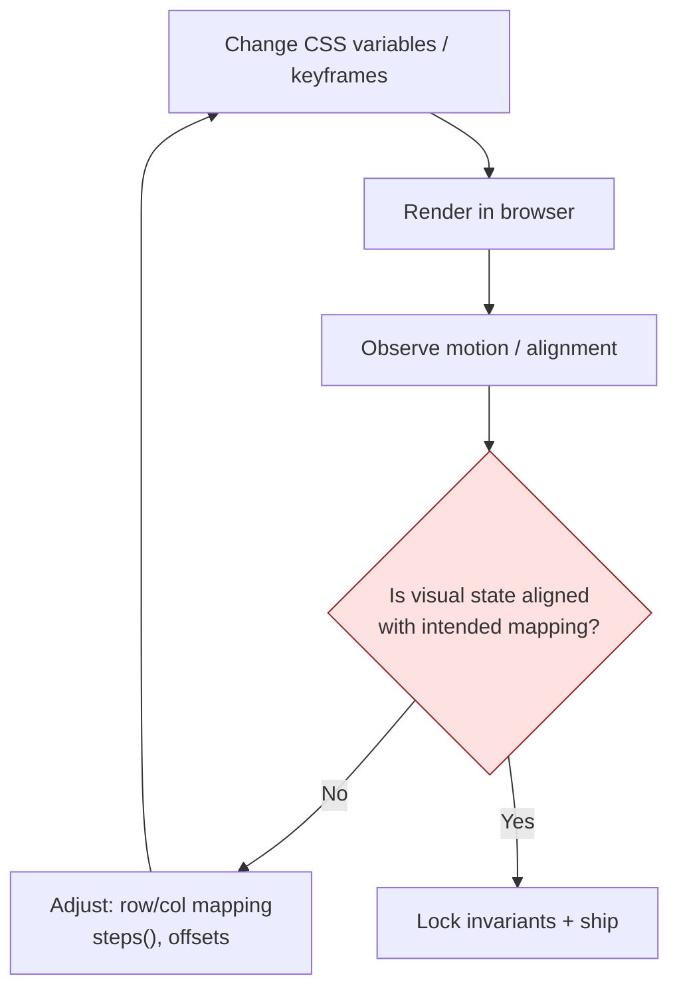

# Sprite Sheets, Cat Walk Cycles, and the Bugs Copilot Can’t See

I recently did a “simple” thing: add two tiny cats walking back and forth in my site footer.

It should have been a 20-minute job:

- pick a sprite sheet
- render a fixed-size tile
- use `steps()` to advance frames
- pan the wrapper across the screen

Instead, it turned into a week-long mini-drama featuring:

- **zoetrope drift** (the sprite slowly “precessing” out of its tile)
- **moonwalking cats** (moving right while facing left)
- **the hardest bug to describe in Slack**: “it _almost_ looks right, but feels… off”

The fun part: most of the “bugs” weren’t logic bugs. They were _perception bugs_.

And perception bugs are exactly where today’s agentic coding tools fall short.

---

## 🧩 The setup: a classic sprite-sheet footer

The implementation is straightforward on paper:

- A wrapper that translates across the footer (left-to-right, then right-to-left)
- A sprite tile whose `background-position-x` advances frame-by-frame

In this repo it lives in:

- `src/components/FooterSpriteCats.tsx` (renders the cats)
- `src/app/globals.css` (sprite-sheet math + animations)

At a high level, each sprite is a fixed “viewport”:

- frame size: `64px × 64px`
- sprite sheet: `14` columns × many rows

Then we animate `background-position-x` using `steps(N)`.

---

## 🌀 Bug #1: “Zoetrope drift” (aka background-position precession)

The visual symptom:

- the animation looks correct at first
- but over a few seconds the cat drifts off-center inside its 64×64 tile
- the gait becomes jittery, like frames are being sampled from slightly different horizontal offsets

This is the classic sprite-sheet failure mode:

> The math is “almost” aligned to frame boundaries, but not _exactly_.

Even if each step jump is meant to be 64px, the browser is free to interpolate the underlying `background-position` between your `from` and `to` values. If the start/end values don’t line up with frame widths, it can look like the sprite is subtly sliding.

The fix ended up being boring, and that’s the point:

- choose a start offset (`--x-start`)
- animate exactly **$N$ frames × frame width**
- use `steps(N)` so every jump lands on a frame boundary

```css
.footer-sprite-cats__sprite {
  --frame: 64px;
  --scale: 1;
  --anim-frames: 6;
  --x-offset: -8px;
  --x-start: calc(var(--x-offset));
}

@keyframes footer-sprite-cats-walk {
  from {
    background-position-x: var(--x-start);
  }
  to {
    background-position-x: calc(
      var(--x-start) + var(--anim-frames) * var(--frame) * var(--scale) * -1
    );
  }
}

.footer-sprite-cats__sprite[data-animated="true"] {
  animation: footer-sprite-cats-walk var(--anim-ms) steps(var(--anim-frames))
    infinite;
}
```

The key idea is a tiny invariant:

$$\Delta x = -N \cdot w$$

Where:

- $N$ = number of frames
- $w$ = frame width

If that invariant is violated (even by a little), the “drift” returns.

---

## 🧭 Bug #2: The cats were walking the _wrong direction_

Once the drift was fixed, the next issue popped:

- the left-to-right cat was facing left
- the right-to-left cat was facing right

This is the sprite-sheet equivalent of “backend says status=SUCCESS but the UI shows FAILED.”

The bug wasn’t in the animation math; it was in the mapping:

- Which row corresponds to “walk left” vs “walk right”?
- Is the sprite sheet documented correctly?
- Did I transpose rows while converting a 1-based human description into 0-based CSS?

We fixed it by swapping the row mapping.

Here’s the lesson: **visual state and backing data can diverge**.

In UI work, the “data” includes:

- row/column mapping tables
- offsets like `--x-offset`
- CSS custom properties that compose into positions

When that mapping is wrong, the system _still works_ (no syntax errors, no exceptions)… it just looks wrong.

---

## 🌗 Bug #3: “Why is the site suddenly white?”

Another class of confusion hit during iteration:

- sometimes the page looked like it loaded with incorrect styles
- dark theme wasn’t applied instantly

This is a different kind of out-of-sync problem:

- initial HTML renders
- then client-side theme variables hydrate
- if the defaults aren’t correct (or CSS loads late), you get a flash of the wrong theme

This is the sort of issue that feels like “CSS didn’t load” even when it technically did—just not in the order you expected.

---

## 🧠 The real problem: communicating visual bugs using text

The hardest part of the whole experience wasn’t writing CSS.

It was describing what I saw.

If you’ve ever tried to QA animation over text chat, you know the pain:

- “it jitters” → jitter where? in translation? in sprite stepping?
- “it drifts” → drift relative to what reference frame?
- “it moonwalks” → is the pan direction wrong or the sprite direction wrong?

With code bugs, we have crisp primitives:

- stack traces
- line numbers
- reproducible failing tests
- lint rules

With visual bugs, we often have vibes.

And “vibes” are not a great interface for automation.

---

## 🔁 QA as a loop: visual state vs backing data

This is the loop we actually lived in:



Two takeaways:

1. **The reference frame matters** (is the cat drifting within its tile, or is the whole cat moving across the footer?).
2. **We need invariants for visuals**, not just for logic.

For sprite sheets, some invariants are measurable:

- frame size = constant
- row/col mapping = deterministic
- frame step = integer multiple of frame width

When you can express the invariant, you can debug.

---

## 🤖 Where agentic Copilot-style tools helped

To be fair: the agent was still useful.

It helped with:

- refactoring repetitive CSS into custom properties
- keeping math consistent across rows
- quickly iterating on hypotheses (“try steps(N) vs steps(N, end)”)
- catching non-visual mistakes (like React props leaking to DOM)

This is the sweet spot:

> **Anything that reduces to text + rules + invariants is friendly territory for AI.**

---

## 🫥 Where agentic tools fell short (and why)

The failure mode wasn’t “the model is dumb.”

It was that the toolchain is missing the sense organs interaction work requires.

### 1) Limited access to motion

A single screenshot can’t prove “drift.”

You need:

- a short clip
- or a burst of frames
- or a numeric measure

When the assistant can’t _watch_ the animation, you end up in an inefficient game:

- you describe the motion
- it proposes a fix
- you try it
- you report what changed

That’s workable… but slow.

### 2) Weak “perceptual assertions”

We can write unit tests like:

- “this function returns 42”

But for animation, what we want is:

- “the cat stays centered in the tile for 10 seconds”

Unless we build a harness (screenshots + diffing, or computed layout probes), this remains subjective.

### 3) Mapping tables are brittle

Sprite sheets are basically a manual database:

- row index → motion
- column index → direction

If your “schema” is wrong, you get moonwalking.

This is exactly the kind of bug that slips past code review because there’s no type system for “the cat is facing the correct direction.”

---

## ✅ What I’d do next time (a practical playbook)

If you’re using agentic tooling for UI animation work, assume you’ll need extra scaffolding.

### 1) Build a tiny “animation debug harness”

Make a debug page that renders:

- a single sprite, centered
- with controls for row/col/frame count
- and a toggle to show a grid overlay

### 2) Add a screenshot diff loop

Even without full video, a sequence of screenshots can get you 80% there:

- capture frame 0
- capture frame N/2
- capture frame N
- compare alignment within a bounding box

### 3) Encode invariants in comments

The line that saved us was basically:

> “Move exactly N frames \* width; steps(N) keeps jumps aligned to frame width.”

If you have an invariant, write it down.

### 4) Separate “motion” from “pose”

Treat these as separate layers:

- motion = translateX across screen
- pose = sprite sheet row/col selection

If the cat moves right but faces left, that’s a pose bug—not a motion bug.

---

## 🧭 The broader point: agentic tooling is still backend-native

Agentic coding tools are incredible at:

- syntax
- logic
- data shape
- compilation
- refactoring

But interaction design adds dimensions that are harder to express in pure text:

- timing
- perception
- visual continuity
- “feel”

Today, we can get AI to help build the machine.

But you still need a human to watch the machine move.

And if you’re trying to ship delightful UI/animation work with an agent as your teammate, plan for it:

- instrument your visuals
- make the invisible measurable
- and treat “looks right” as a real acceptance criterion, not an afterthought

Because sometimes the bug isn’t in the code.

It’s cats.
