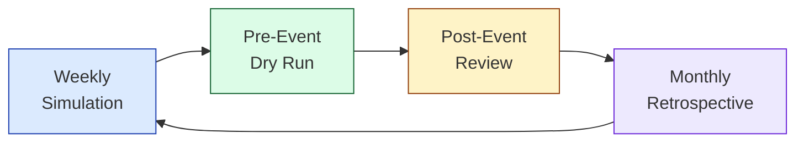

# 🎯 Stop Practicing Alone: Using Claude to Sharpen Your Engineering Interview Skills

_How to use Claude as a sparring partner on both sides of the table — as interviewee, interviewer, and technical communicator — with practical prompts and a routine that actually works._

---

## The Skill Nobody Practices

Software engineers spend years getting better at writing code. We grind LeetCode, read system design books, build side projects. But the skill that actually differentiates senior and staff-level engineers — the ability to navigate ambiguity, communicate technical decisions clearly, and lead a room through a complex problem — gets almost zero deliberate practice.

Think about it. When's the last time you practiced:

- Scoping a vague prompt into a concrete technical plan while thinking out loud?
- Explaining your architecture decisions under time pressure?
- Running a system design interview where you _don't know the answer_ and have to reason through it live?
- Pushing back on requirements without sounding like you're sandbagging?
- Recovering from a wrong turn mid-answer without losing your interviewer's confidence?

Most of us learn these skills by getting thrown into the situation and hoping we don't embarrass ourselves. That's not practice — that's survival.

Claude changes this. You now have access to an endlessly patient sparring partner that can simulate realistic scenarios, adapt to your responses in real-time, and give you honest feedback — at 11pm on a Tuesday, no scheduling required.

---

## 🏗️ System Design Interview Practice

This is the most obvious use case and also the most underutilized. Most engineers who use Claude for interview prep ask it to _explain_ system design concepts. That's studying, not practicing. The difference matters enormously.

### The Right Way to Prompt

Ask Claude to _play the interviewer_ and give you a deliberately vague, ambiguous prompt — just like the real thing. Then work through it live.

Here's a prompt that actually works:

> "You are a senior staff engineer interviewing me for a Staff SWE position. Give me an ambiguous system design prompt — something like 'design a notification system' or 'design a rate limiter for a multi-tenant API.' Don't give me the answer. Let me drive the conversation. Push back on my ideas, ask 'why not X instead,' probe my weak spots, and ask me to go deeper on trade-offs. When I hand-wave, call it out. After 30 minutes, break character and give me a detailed debrief: what I did well, where I was vague, where I lost the thread, and what a stronger answer would have looked like."

That's a live simulation. You're practicing the _actual skill_ — navigating ambiguity, asking the right clarifying questions, proposing architecture under pressure, and handling follow-ups you didn't anticipate.

### Making It Effective

**Tell Claude to be a tough interviewer.** If you don't, it'll be too agreeable. Explicitly say things like "don't let me off easy" and "if my answer is vague, press me for specifics." The default behavior of LLMs is to be helpful and validating — you need to override that for realistic practice.

**Set a timer.** Real interviews are time-boxed. Practice under the same constraint. 30 minutes for a system design round, 45 for a solutions architecture deep-dive. When the timer goes off, stop — even if you're mid-sentence. Learning to manage your time within the answer is part of the skill.

**Don't restart when you stumble.** In a real interview you can't ctrl-Z. Practice recovering from a bad answer, not avoiding one. If you go down the wrong path, practice saying "actually, let me reconsider that approach" — that's a skill you'll need.

**Ask for the debrief.** After the exercise, ask Claude to break character and give you specific, structured feedback. A prompt like this works well:

> "Break character. Rate my performance on: (1) problem scoping and clarifying questions, (2) architecture quality and trade-off analysis, (3) communication clarity and structure, (4) time management and depth vs. breadth balance, (5) handling your pushback. For each, give me a score out of 5 and specific examples from our conversation."

### Example System Design Topics to Rotate

Don't just practice the same problem. Build a rotation:

| Category                | Example Prompts                                                                 |
| ----------------------- | ------------------------------------------------------------------------------- |
| **Distributed systems** | Design a distributed cache, message queue, or consensus protocol                |
| **Data-intensive**      | Design a real-time analytics pipeline, search engine, or recommendation system  |
| **API design**          | Design a rate limiter, API gateway, or webhook delivery system                  |
| **Storage**             | Design a distributed file system, time-series database, or blob storage service |
| **Real-world products** | Design Twitter's feed, Uber's dispatch, or Slack's real-time messaging          |
| **AI/ML systems**       | Design a document summarization pipeline, RAG system, or feature store          |

---

## 💻 Coding Interview Practice

Claude is surprisingly effective for practicing coding interviews — not just solving problems, but practicing the _communication around_ solving them.

### Live Coding Simulation

> "Give me a medium-difficulty coding problem appropriate for a senior SWE interview. Don't give hints unless I explicitly ask. I'm going to think out loud as I work through it. After I give you my solution, evaluate it on correctness, time/space complexity, code quality, and how well I communicated my thinking. If I go silent for too long or jump to code without explaining my approach, call it out."

The key insight: in a real coding interview, the algorithm is maybe 40% of what you're being evaluated on. The other 60% is how you think out loud, how you handle edge cases, how you respond when your first approach doesn't work, and whether you can clearly explain your solution's complexity.

### Practicing the Think-Aloud

Most engineers are terrible at thinking out loud while coding. We're trained to think quietly and present finished work. Coding interviews require the opposite — a running narration of your reasoning. Claude can help you build this habit:

> "I'm going to solve this problem while narrating my thought process. After each step, tell me if my narration was clear enough for an interviewer to follow. Specifically flag: (1) times I coded without explaining why, (2) assumptions I made but didn't state, (3) places where I should have discussed trade-offs before choosing an approach."

### Language-Specific Deep Dives

If you're interviewing for a role that requires deep knowledge of a specific language or framework, use Claude to simulate those targeted questions:

> "You're interviewing me on advanced TypeScript. Ask me progressively harder questions about the type system — generics, conditional types, mapped types, template literal types. For each answer, tell me if I'd pass at a senior level. Don't accept hand-wavy answers."

> "Quiz me on Go concurrency patterns. Give me scenarios and ask me to explain which pattern I'd use and why. Push back when my answer is incomplete."

---

## 🧠 Behavioral Interview Practice

For the "tell me about a time when..." round, Claude is an excellent practice partner. This is the round engineers tend to blow off, and it's the round where structured practice makes the biggest difference.

### The Setup

> "You're interviewing me for a Staff Engineer position at a mid-size tech company. Ask me behavioral questions focused on: technical leadership, conflict resolution, cross-team collaboration, and mentorship. After each answer, evaluate whether I: (1) was specific enough vs. generic, (2) quantified impact, (3) actually answered the question that was asked, (4) used a clear structure (situation, task, action, result), and (5) demonstrated the leadership level expected for Staff."

### Common Failure Modes Claude Catches

Through repeated practice, you'll notice patterns that Claude will flag:

- **Being too vague:** "I improved the system" → Claude will push you to quantify
- **Answering a different question:** You were asked about conflict resolution but told a story about a technical win
- **Missing the "so what":** Great story, but you didn't explain the impact or what you learned
- **Not demonstrating the right level:** A Staff engineer answer should show cross-team influence, not just individual contribution
- **Rambling:** Your answer was 5 minutes when it should have been 2

### Building Your Story Bank

Use Claude to help structure and refine the 8-10 stories you'll rotate through in behavioral interviews:

> "Here's a situation from my work: [brief summary]. Help me structure this into a compelling STAR-format answer for a behavioral interview. The question it should answer is 'Tell me about a time you had to make a difficult technical decision with incomplete information.' Make it concise — under 2 minutes when spoken aloud."

---

## 🔄 The Other Side: Practicing as the Interviewer

Here's what almost nobody does — and it might be the highest-leverage use of Claude for your career. If you're a senior or staff engineer, you're almost certainly conducting interviews. You owe it to your candidates and your team to be good at it.

### Why This Matters

Most companies give interviewers a rubric and a 30-minute calibration session. That's it. Then you're in a room making hiring decisions that affect someone's career. Nobody practices:

- Giving a deliberately ambiguous prompt and then knowing how to _guide_ a struggling candidate without giving away the answer
- Calibrating how much silence is productive versus uncomfortable
- Recognizing when a candidate is on the right track but articulating it poorly
- Distinguishing between "doesn't know" and "knows but can't communicate it under pressure"
- Avoiding leading questions that funnel every candidate toward _your_ preferred solution

### How to Simulate It

Flip the prompt. Ask Claude to _be the candidate_ and you run the interview:

> "You're a senior software engineer interviewing for a Staff role. I'm going to give you a system design prompt. Respond realistically — ask clarifying questions, make some strong moves and some weak ones, occasionally go down the wrong path. Don't be perfect. After 25 minutes, break character and evaluate my performance as an interviewer: Did I guide without giving away the answer? Did I create space for you to show your thinking? Was my prompt calibrated well? Did I ask good follow-up questions?"

### Calibrating Across Candidate Levels

Ask Claude to play candidates at different experience levels. This builds the pattern recognition that makes you a reliable interviewer:

> "Play a mid-level engineer who knows the right concepts but struggles to structure their thoughts. They'll give correct answers buried in rambling explanations. I need to practice extracting signal from noise without doing the work for them."

> "Play a strong junior engineer who's clearly smart but doesn't have the vocabulary yet. They'll describe the right approach using imprecise language. I need to practice recognizing potential."

> "Play a senior engineer who's technically solid but overconfident. They'll dismiss my follow-up questions and not consider alternative approaches. I need to practice redirecting without creating conflict."

After each simulation, ask Claude to rate you on: **signal extraction, candidate comfort, question quality, time management, and evaluation fairness.**

---

## 📋 Practicing Technical Communication

Beyond interviews, Claude is excellent for practicing the communication skills that define senior engineers in their day-to-day work.

### Architecture Decision Records

> "I'm going to present a technical decision to you. You're a skeptical senior engineer on my team. I chose [technology X] over [technology Y] for [reason]. Challenge my reasoning. Ask about the alternatives I considered, the trade-offs I'm accepting, and the risks I might be ignoring. After we're done, tell me if my argument was structured and convincing."

### Explaining Complex Systems Simply

> "I need to explain [complex technical concept] to a product manager who's technical but not an engineer. Let me try, and then tell me where I lost you, where I used jargon unnecessarily, and where I could have used a better analogy."

### Incident Postmortem Practice

> "You're a VP of Engineering. I'm presenting a postmortem for a production outage that affected 10% of our users for 2 hours. The root cause was [X]. Ask me tough questions about how it happened, what we're doing to prevent it, and why our monitoring didn't catch it sooner. Push back if my answers are defensive or blame-shifting."

---

## 🔁 Building a Practice Routine

The engineers who get the most out of this treat it like any other skill development — with intentional, repeated practice.

**Weekly:** Run one simulated scenario. Rotate between system design, coding, behavioral, and technical communication. Save the debrief. Review it before your next session.

**Before any real high-stakes interaction:** Do a dry run. If you have a system design interview on Thursday, simulate it on Tuesday. Use Claude's pushback to find the holes in your thinking while you still have time to fill them.

**After real interactions:** Reflect on what happened. Feed your notes into Claude and ask: "Here's how my system design interview went. Based on this, what should I practice next?" Look for patterns over time.

**Monthly:** Review your debriefs from the past month. Pick one communication skill to focus on next. Maybe it's "get to the architecture faster" or "quantify trade-offs in every answer" or "ask more clarifying questions before jumping to solutions."

---

## 🔑 Prompt Engineering Tips for Better Practice Sessions

Not all practice sessions are equal. Here's what I've learned about getting the most out of Claude as a sparring partner:

### Be Specific About the Role and Stakes

| Weak Prompt                             | Strong Prompt                                                                                                                      |
| --------------------------------------- | ---------------------------------------------------------------------------------------------------------------------------------- |
| "Ask me system design questions"        | "You're a principal engineer at a FAANG company interviewing me for L6. Give me a system design prompt at that calibration level." |
| "Practice behavioral questions with me" | "Interview me for a Staff role where cross-team influence is the key leveling signal. Focus your behavioral questions there."      |
| "Help me practice coding"               | "Give me a graph problem that requires BFS. I need to practice narrating my thought process while coding."                         |

### Control the Difficulty Curve

Start easier and ramp up within a session:

> "Start with a system design prompt at a senior level. If I handle it well, give me a follow-up that pushes it to staff level — add scale constraints, multi-region requirements, or cost optimization goals."

### Use Follow-Up Rounds

After the debrief, don't just move on. Do a targeted follow-up:

> "You said my trade-off analysis was weak when you asked about consistency vs. availability. Give me three more scenarios where I need to make that trade-off, and let me practice articulating my reasoning."

### Save and Compare Debriefs

Copy Claude's debriefs into a running document. After 5-10 sessions, ask Claude to analyze the collection:

> "Here are my debriefs from the past month of practice interviews. What patterns do you see? Where am I consistently strong? Where do I keep making the same mistakes? What should my focus be for the next month?"

---

## A Note on Authenticity

There's a reasonable concern that this turns communication into a performance — that by optimizing how you present, you lose something genuine.

I'd push back on that. Athletes watch game tape. Musicians record practice sessions. Comedians test material at open mics. Reviewing and refining how you communicate doesn't make you less authentic — it makes you more effective at saying what you actually mean.

The goal isn't to sound polished. It's to close the gap between what you're _thinking_ and what the other person _hears_. That gap is where interviews go sideways, where good ideas die in meetings, and where strong engineers get passed over for roles they'd be great at.

---

## The Bottom Line

The engineers who advance fastest aren't always the best coders. They're the ones who can take a vague problem, ask the right questions, propose a clear solution, and bring the room along with them. That's a practicable skill, and Claude just made it dramatically easier to practice.

And it works from every angle. Practice being the candidate _and_ the interviewer. Practice presenting _and_ evaluating. Practice explaining _and_ questioning. The dual perspective compounds — every rep on one side makes you better at the other.

Stop grinding LeetCode exclusively. Start simulating the conversations that actually determine your trajectory.

Claude is available at 11pm on a Tuesday. Your next interview won't wait until you feel ready.
