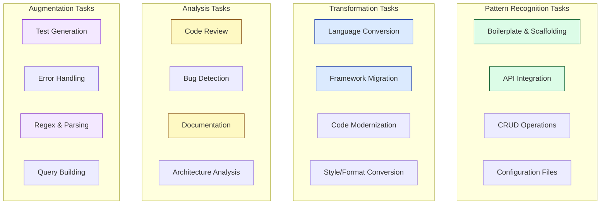
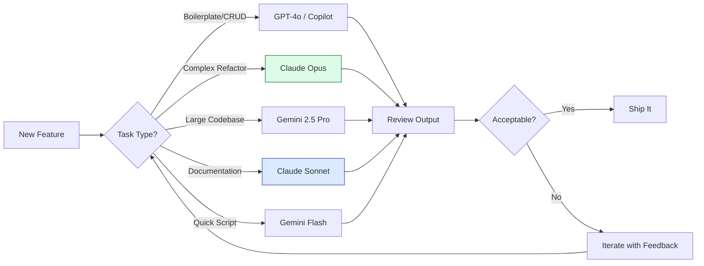

# What LLM-Based Coding Agents Actually Excel At

Everyone knows AI coding agents can generate code and convert between languages. That's table stakes at this point.

But after two decades of writing software and the last few years watching these tools evolve, I've noticed something: most developers are only scratching the surface of what these things can actually do well.

So let's dig in. What are LLM-based coding agents _really_ good at? And more importantly, which models excel at which tasks?

---

## 🎯 The Core Strengths (Beyond the Obvious)

Yes, code generation is the headline feature. But here's what I've found actually moves the needle in day-to-day engineering work:

---

## 📋 The Complete Strength Matrix

Here's a detailed breakdown of what LLM coding agents excel at, organized by category:

### 1. Pattern Recognition & Generation

| Task                    | Description                           | Why LLMs Excel                              | Best Models                  |
| ----------------------- | ------------------------------------- | ------------------------------------------- | ---------------------------- |
| **Boilerplate Code**    | Generating repetitive structural code | Trained on millions of similar patterns     | All major models             |
| **CRUD Operations**     | REST endpoints, database operations   | Extremely well-represented in training data | GPT-4o, Claude Sonnet        |
| **API Integration**     | Connecting to third-party services    | Extensive documentation in training corpus  | Claude Opus, Gemini Pro      |
| **Configuration Files** | Docker, K8s, CI/CD configs            | Pattern-heavy, well-documented              | GPT-4o, Claude Sonnet        |
| **Scaffolding**         | Project structure, file templates     | Consistent conventions across ecosystems    | Cursor (multi-file), Copilot |

**The "Old Guy" Take:** These tasks used to take me 20-30 minutes of copy-pasting from Stack Overflow. Now it's 30 seconds. This is where the 10x productivity actually shows up.

---

### 2. Code Transformation & Migration

| Task                     | Description                                     | Why LLMs Excel                                | Best Models                   |
| ------------------------ | ----------------------------------------------- | --------------------------------------------- | ----------------------------- |
| **Language Conversion**  | Python → Go, JS → TypeScript                    | Statistical pattern matching across languages | Claude Opus, GPT-5            |
| **Framework Migration**  | React Class → Hooks, Vue 2 → Vue 3              | Extensive migration guides in training data   | Claude Sonnet, Gemini 2.5 Pro |
| **Legacy Modernization** | Old patterns → current best practices           | Understands both old and new conventions      | Claude Opus (long context)    |
| **Syntax Upgrades**      | ES5 → ES6+, Python 2 → 3                        | Deterministic transformation rules            | GPT-4o, DeepSeek R1           |
| **Style Conversion**     | Callback → async/await, imperative → functional | Clear transformation patterns                 | All major models              |

**Real Example:** I recently fed a 5,000-line Perl script from 2005 into Claude Opus and asked it to rewrite it in Go. It took about 3 minutes. Was it perfect? No. Did it get me 85% of the way there? Absolutely.

---

### 3. Analysis & Review

| Task                    | Description                       | Why LLMs Excel                           | Best Models                 |
| ----------------------- | --------------------------------- | ---------------------------------------- | --------------------------- |
| **Code Review**         | Style, patterns, potential issues | Comparative pattern recognition          | Claude Opus, GPT-5          |
| **Bug Detection**       | Logical errors, edge cases        | Pattern matching against known bug types | Grok-4, Claude Sonnet       |
| **Security Analysis**   | Vulnerability identification      | Trained on security advisories & CVEs    | Claude Opus, GPT-4o         |
| **Performance Hints**   | Algorithmic complexity issues     | Recognizes inefficient patterns          | Gemini 2.5 Pro, o3          |
| **Architecture Review** | Design pattern assessment         | Understands system design literature     | Claude Opus (large context) |

---

### 4. Documentation & Explanation

| Task                   | Description                     | Why LLMs Excel                           | Best Models                |
| ---------------------- | ------------------------------- | ---------------------------------------- | -------------------------- |
| **Code Documentation** | JSDoc, docstrings, comments     | Excels at summarization and description  | Claude Opus, Claude Sonnet |
| **README Generation**  | Project overviews, setup guides | Strong technical writing in training     | Claude models (all)        |
| **API Documentation**  | Endpoint descriptions, examples | Structured, pattern-based output         | GPT-4o, Claude Sonnet      |
| **Code Explanation**   | "What does this do?"            | Natural language generation strength     | All major models           |
| **Architecture Docs**  | System design documentation     | Combines code understanding with writing | Claude Opus, Gemini Pro    |

**Why Claude Dominates Here:** Anthropic's models are head and shoulders above the competition for documentation. It's not even close. If you need clear, well-structured explanations, Claude is your friend.

---

### 5. Test Generation & Quality

| Task                     | Description                        | Why LLMs Excel                         | Best Models           |
| ------------------------ | ---------------------------------- | -------------------------------------- | --------------------- |
| **Unit Tests**           | Function-level test cases          | Well-defined input/output patterns     | GPT-4o, Claude Sonnet |
| **Edge Case Discovery**  | Boundary conditions, null handling | Pattern recognition for failure modes  | Claude Opus, o3       |
| **Test Data Generation** | Mock data, fixtures                | Creative generation within constraints | GPT-4o, Gemini Flash  |
| **Integration Tests**    | Multi-component test scenarios     | Understands service interactions       | Claude Opus, GPT-5    |
| **Test Refactoring**     | Improving existing test suites     | Recognizes test smells                 | Claude Sonnet, GPT-4o |

---

### 6. Data & Query Operations

| Task                    | Description                           | Why LLMs Excel                      | Best Models             |
| ----------------------- | ------------------------------------- | ----------------------------------- | ----------------------- |
| **SQL Generation**      | Complex queries from natural language | Extensive SQL in training data      | GPT-4o, Claude Sonnet   |
| **Query Optimization**  | Index hints, join optimization        | Trained on database documentation   | Claude Opus, Gemini Pro |
| **ORM Code**            | Prisma, Drizzle, SQLAlchemy           | Framework patterns well-represented | GPT-4o, Claude Sonnet   |
| **Data Transformation** | ETL logic, mapping functions          | Pattern matching and generation     | All major models        |
| **Schema Design**       | Database modeling                     | Understands normalization patterns  | Claude Opus, GPT-5      |

---

### 7. Regex, Parsing & Text Processing

| Task                    | Description                  | Why LLMs Excel                       | Best Models           |
| ----------------------- | ---------------------------- | ------------------------------------ | --------------------- |
| **Regex Generation**    | Pattern matching expressions | Regex is well-documented in training | GPT-4o, Claude Sonnet |
| **Regex Explanation**   | "What does this regex do?"   | Translation to natural language      | All major models      |
| **Parser Generation**   | Custom file format parsing   | Understands parsing patterns         | Claude Opus, GPT-5    |
| **String Manipulation** | Complex text transformations | Pattern-heavy operations             | All major models      |
| **Log Parsing**         | Extract data from log files  | Common DevOps pattern                | GPT-4o, Claude Sonnet |

**Pro Tip:** Never write regex by hand again. Seriously. Just describe what you want to match in plain English. The models are shockingly good at this.

---

### 8. DevOps & Infrastructure

| Task                      | Description                    | Why LLMs Excel                      | Best Models           |
| ------------------------- | ------------------------------ | ----------------------------------- | --------------------- |
| **Dockerfile Generation** | Container configurations       | Highly standardized format          | All major models      |
| **K8s Manifests**         | Deployments, services, ingress | Extensive documentation in training | GPT-4o, Claude Sonnet |
| **CI/CD Pipelines**       | GitHub Actions, GitLab CI      | Template-heavy, well-documented     | All major models      |
| **Terraform/Bicep**       | Infrastructure as code         | Pattern-based generation            | Claude Sonnet, GPT-4o |
| **Shell Scripts**         | Automation scripts             | Bash is everywhere in training data | All major models      |

---

## 🏆 Model Comparison: Who's Best at What?

Based on current benchmarks and practical experience, here's how the major models stack up:

### Overall Coding Performance (Dec 2025)

| Model               | SWE-bench | HumanEval | Best For                                       | Context Window |
| ------------------- | --------- | --------- | ---------------------------------------------- | -------------- |
| **Grok-4**          | 75.0%     | ~90%      | Autonomous debugging, complex logic            | 128K           |
| **GPT-5**           | 74.9%     | ~92%      | Multi-file projects, algorithm implementation  | 256K           |
| **Claude Opus 4**   | 72.5%     | ~88%      | Documentation, long-running tasks, code review | 200K           |
| **Claude Sonnet 4** | 72.7%     | ~86%      | Daily coding, balanced performance             | 200K           |
| **OpenAI o3**       | 71.7%     | ~85%      | Competitive programming, reasoning             | 128K           |
| **Gemini 2.5 Pro**  | 67.2%     | ~99%      | Large codebases, multimodal tasks              | 1M+            |
| **DeepSeek R1**     | ~65%      | ~82%      | Budget-conscious, self-hosting                 | 128K           |

### Specialization Matrix

| Task Category                  | 🥇 Best        | 🥈 Second         | 🥉 Third     |
| ------------------------------ | -------------- | ----------------- | ------------ |
| **Code Generation**            | GPT-5          | Claude Opus       | Grok-4       |
| **Documentation**              | Claude Opus    | Claude Sonnet     | GPT-4o       |
| **Debugging**                  | Grok-4         | Claude Opus       | GPT-5        |
| **Refactoring**                | Claude Opus    | GPT-5             | Gemini Pro   |
| **Large Codebase Analysis**    | Gemini 2.5 Pro | Claude Opus       | GPT-5        |
| **Test Generation**            | GPT-5          | Claude Sonnet     | o3           |
| **Language Conversion**        | Claude Opus    | GPT-5             | Gemini Pro   |
| **API Integration**            | GPT-4o         | Claude Sonnet     | Gemini Flash |
| **Long-running Agentic Tasks** | Claude Opus    | Gemini Deep Think | GPT-5        |
| **Cost Efficiency**            | DeepSeek R1    | Gemini Flash      | o3-mini      |

---

## 🎓 Practical Recommendations by Role

### For Individual Contributors

| If You Need...          | Use This                        | Why                          |
| ----------------------- | ------------------------------- | ---------------------------- |
| Fast daily coding       | **Claude Sonnet** or **GPT-4o** | Balance of speed and quality |
| Complex refactoring     | **Claude Opus**                 | Best at multi-file reasoning |
| Quick prototypes        | **Gemini Flash**                | Fast and cheap               |
| Terminal-first workflow | **Aider + Claude**              | CLI integration              |

### For Tech Leads

| If You Need...             | Use This           | Why                            |
| -------------------------- | ------------------ | ------------------------------ |
| Code review augmentation   | **Claude Opus**    | Best explanations and analysis |
| Architecture documentation | **Claude Opus**    | Superior technical writing     |
| Team onboarding docs       | **Claude Sonnet**  | Clear, consistent output       |
| Large codebase analysis    | **Gemini 2.5 Pro** | 1M token context               |

### For Enterprise Teams

| If You Need...          | Use This                      | Why                           |
| ----------------------- | ----------------------------- | ----------------------------- |
| Data privacy            | **DeepSeek R1** (self-hosted) | No data leaves your infra     |
| Compliance workflows    | **Codeium** or self-hosted    | Air-gapped options            |
| Multi-language projects | **GPT-5** or **Gemini Pro**   | Strong cross-language support |
| Integrated tooling      | **GitHub Copilot**            | Seamless IDE integration      |

---

## ⚠️ Where LLMs Still Struggle

Let's be honest about the limitations:

| Task                          | Why It's Hard                           | Workaround                                    |
| ----------------------------- | --------------------------------------- | --------------------------------------------- |
| **Novel algorithms**          | Limited to patterns in training data    | Use for scaffolding, implement logic yourself |
| **Real-time systems**         | Can't reason about timing/feel          | Be extremely specific about constraints       |
| **Game development**          | No sense of "fun" or game feel          | Use for utilities, not core mechanics         |
| **Audio/DSP**                 | Signal processing is poorly represented | Stick to high-level abstractions              |
| **Complex state machines**    | Struggles with continuous state         | Break into discrete components                |
| **Performance-critical code** | Optimizes for readability, not speed    | Profile and optimize manually                 |

---

## 🧭 The Workflow That Works

After experimenting with dozens of configurations, here's what I've landed on:

**The key insight:** Match the model to the task. Using Claude Opus for a quick bash script is overkill. Using Gemini Flash for a complex refactor will frustrate you.

---

## 💡 Maximizing Value: Tips from the Trenches

1. **Context is king.** Dump your entire file (or relevant files) into the context. These models are better with more context, not less.

2. **Be specific about constraints.** Don't say "make it fast." Say "optimize for O(n) time complexity."

3. **Use the right model for the job.** Documentation? Claude. Quick generation? GPT-4o. Massive codebase? Gemini.

4. **Iterate, don't regenerate.** If the output is 80% right, edit and refine. Don't start over.

5. **Trust but verify.** These are brilliant interns, not senior architects. Review everything.

---

## 🔮 What's Next?

The trajectory is clear: longer context windows, better reasoning, more autonomous operation.

By 2026, I expect:

- **True repo-wide understanding** without chunking
- **Continuous context** across sessions
- **Execution capabilities** (running and testing code autonomously)
- **Specialized models** for specific frameworks and languages

But for now? We're in a golden age of augmented development. The engineers who learn to leverage these tools effectively will have a significant edge.

The tool doesn't make the craftsman. But a craftsman who ignores better tools is just being stubborn.

Pick your models wisely. Match them to your tasks. And ship faster than you ever thought possible.

---

✍️ _Written by Ian Lintner_  
_20+ years of software engineering, now augmented by AI. Follow for more deep dives on developer productivity and the evolving engineering landscape._
