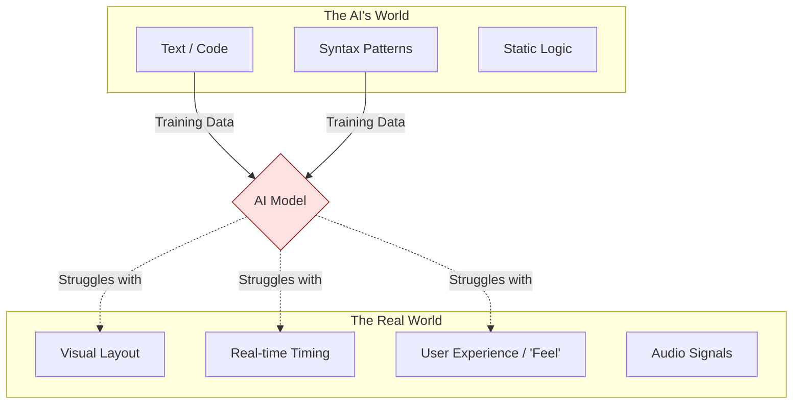

# Why AI Coding Agents Fail at Games, Audio, and UI

I love AI coding agents. I use them every day. But let's be real: ask them to build a CRUD app, and they're geniuses. Ask them to build a game or a synthesizer, and they fall apart.

Why is that?

It comes down to the nature of the data they were trained on.

---

## 📄 Text vs. Experience

LLMs are trained on text. Code is text. HTML is text. SQL is text.

But **gameplay** is an experience. **Audio** is a signal. **UI** is a visual and interactive flow.

When an AI writes a React component for a form, it has seen millions of examples of `<input>` tags. It knows the pattern.

When an AI tries to write a game loop, it knows the *syntax* of `requestAnimationFrame`, but it doesn't understand "fun." It doesn't understand "game feel." It can't "see" that the jump physics feel floaty or that the collision detection is janky.

It's like trying to learn to paint by reading books about chemistry. You might know how to mix the pigments, but you don't know how to make art.

---

## 🎮 The State Management Nightmare

Business apps are usually stateless (or close to it). Request comes in, response goes out.

Games and audio apps are **stateful** and **continuous**. 60 times a second, the state changes. Physics interactions, audio buffers, animation frames—it's a chaotic stream of events.

LLMs struggle to reason about this continuous flow of time. They are good at "A leads to B," but bad at "A interacts with B while C is changing over time."

---

## 🎨 The "Eye" for UI

Ever ask an AI to design a "modern, beautiful landing page"?

It usually gives you something that looks like a Bootstrap template from 2015.

Why? Because it doesn't have eyes. It doesn't understand whitespace, visual hierarchy, or contrast in a perceptual way. It only knows the CSS rules that *usually* go together.

It's mimicking design, not creating it.

---

## 🛠️ How to Fix It (For Now)

If you're using AI for these domains, you have to change your approach:

1.  **Be Specific:** Don't say "make it fun." Say "set gravity to 9.8 and jump velocity to 15."
2.  **Componentize:** Ask for small, isolated logic pieces (e.g., "write a function to calculate collision"), not the whole system.
3.  **You are the Director:** You handle the "feel" and the visuals. Let the AI handle the boilerplate.

The models will get better. Multimodal models (like Gemini and GPT-4o) are starting to "see" and "hear." But for now, the "soul" of the software—the fun, the rhythm, the look—that's still on us.

And honestly? I'm okay with that. It keeps the job interesting.
