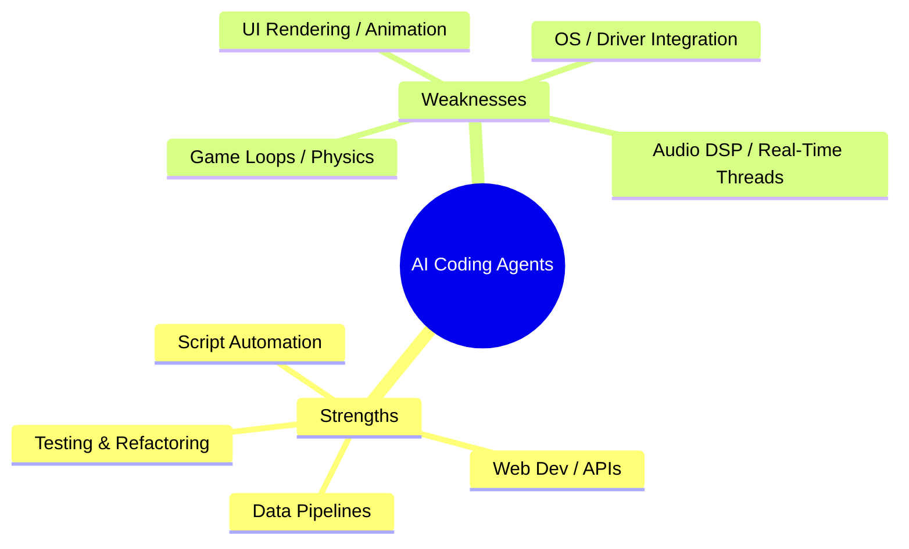
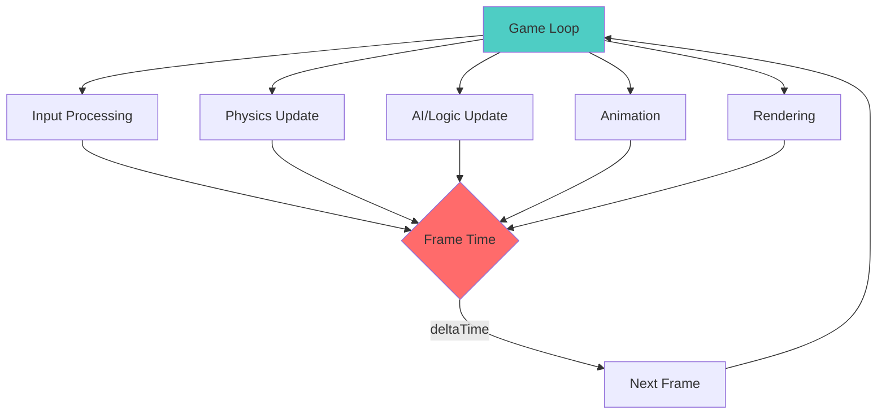
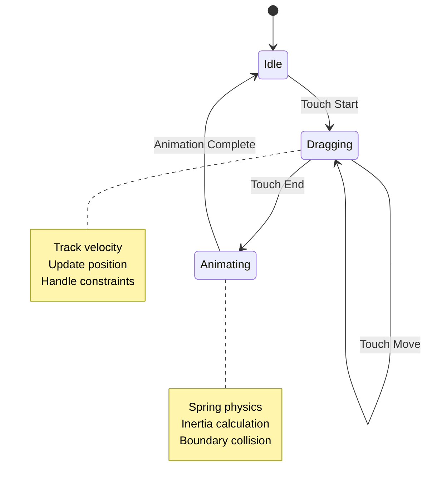
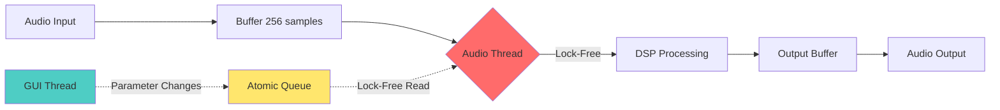
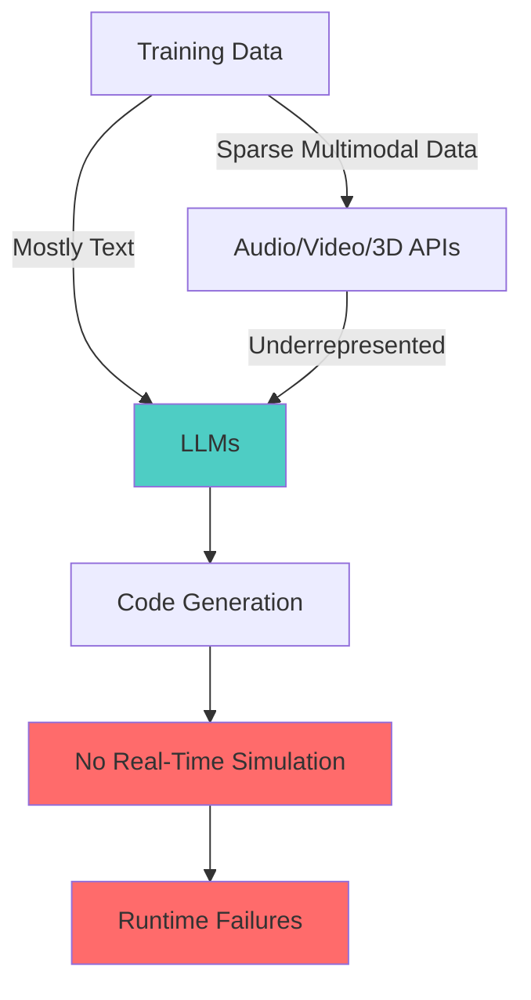
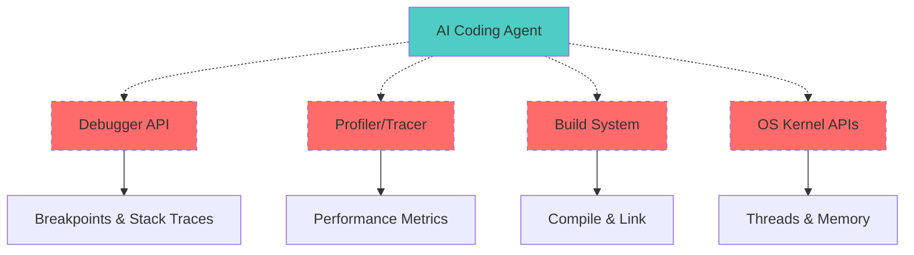
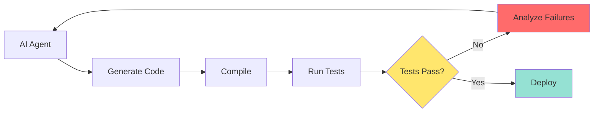
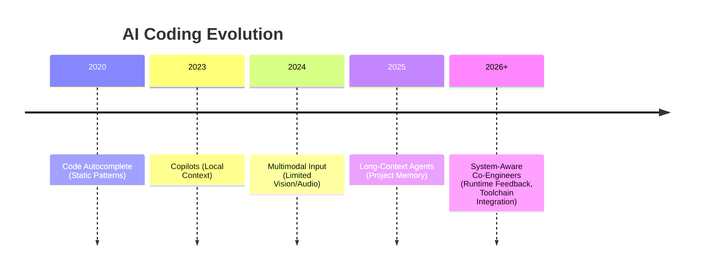
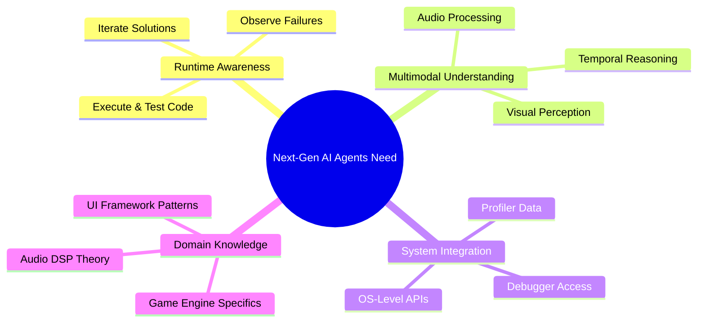

# Beyond Autocomplete: Why AI Coding Agents Still Can't Build Games, UIs, or Audio Engines — Yet

AI coding tools have revolutionized how we write software — but only up to a point.
They excel at generating CRUD apps, REST APIs, and test scaffolds.
But when it comes to **games, UIs, audio, or system-level engineering**, they break down.

These aren't just "harder" problems — they're _different kinds_ of problems.
They demand perception, timing, and embodied reasoning that current AI architectures don't have.

This post breaks down where and why today's AI coding tools fail — and what the **next generation** must learn to bridge the gap.

---

## 🧭 1. The Easy Zone: Structured, Stateless, and Symbolic Tasks

AI models like GPT-4o, Claude, and Copilot thrive in environments where:

- Code is deterministic and text-based.
- APIs are stable and well-documented.
- The entire workflow can be verified via unit tests or static analysis.

Think web backends, CLI tools, and Python scripts.

They do _not_ thrive in environments where code interacts with:

- Continuous signals (audio, video, physics).
- Human perception (UX, motion, timing).
- System-level state (drivers, threads, buffers).

---

### 🧩 Diagram: Current AI Strengths vs. Weaknesses



---

## 🎮 2. Game Development: Real-Time Chaos Meets Static Predictors

Game development pushes AI coding agents into unfamiliar territory: **continuous, time-dependent systems**.

### ⚙️ Known Hard Problems

- **Real-Time Loops:** Agents can't reason about frame pacing, delta time, or scheduler drift.
- **State Explosion:** Non-linear event graphs (Blueprints, ECS) break token-based reasoning.
- **Memory Lifetime:** Unreal's `UObject` and C++ ownership semantics require symbolic tracking.
- **Toolchain Context:** Different targets (Windows, iOS, consoles) have unique build constraints AI doesn't model.

### 💥 Example Failure: Enemy Pathfinding

**Prompt:** _"Generate a Unity enemy pathfinding system with dynamic obstacle avoidance."_

**What AI Generates:**
```csharp
public class EnemyAI : MonoBehaviour
{
    public Transform target;
    public float speed = 5f;
    
    void Update()
    {
        // Move toward target
        transform.position = Vector3.MoveTowards(
            transform.position, 
            target.position, 
            speed * Time.deltaTime
        );
    }
}
```

**The Problem:**
- ✅ Valid C# syntax
- ❌ No collision detection
- ❌ No NavMesh integration
- ❌ Agents walk through walls
- ❌ No dynamic obstacle awareness
- ❌ No path recalculation

**What It Should Be:**
```csharp
public class EnemyAI : MonoBehaviour
{
    private NavMeshAgent agent;
    public Transform target;
    
    void Start()
    {
        agent = GetComponent<NavMeshAgent>();
    }
    
    void Update()
    {
        if (target != null)
        {
            agent.SetDestination(target.position);
        }
    }
    
    void OnCollisionEnter(Collision collision)
    {
        // Recalculate path on obstacle hit
        if (agent.hasPath)
        {
            agent.ResetPath();
        }
    }
}
```

AI misses the **runtime behavior context** — it knows syntax but not simulation.

### 🎯 Game Loop Architecture Complexity



AI agents struggle with this because:
- Each system has **timing dependencies**
- State mutations cascade across frames
- Performance constraints require **careful ordering**
- Different platforms have different frame budgets

---

## 🎨 3. UI Engineering: Perception, Feedback, and Concurrency

UIs look simple — but live in a soup of asynchronous events and visual state.

### ⚙️ Known Hard Problems

- **Reactive Binding:** Confuses `state` vs. `props` (React, SwiftUI).
- **Cross-Platform APIs:** Mismanages focus, touch events, IME composition.
- **Animation Timing:** No visual or temporal understanding of motion smoothness.
- **Accessibility:** Lacks understanding of color contrast, `aria-*` semantics, or layout constraints.

### 💥 Example Failure: Draggable Modal

**Prompt:** _"Create a draggable modal in SwiftUI with inertia."_

**What AI Generates:**
```swift
struct DraggableModal: View {
    @State private var offset = CGSize.zero
    
    var body: some View {
        Rectangle()
            .fill(Color.blue)
            .frame(width: 300, height: 200)
            .offset(offset)
            .gesture(
                DragGesture()
                    .onChanged { gesture in
                        offset = gesture.translation
                    }
            )
    }
}
```

**The Problem:**
- ✅ Compiles and runs
- ❌ No animation easing
- ❌ Modal snaps back on release (no inertia)
- ❌ No boundary constraints
- ❌ No spring physics
- ❌ Poor gesture handling (jittery)

**What It Should Include:**
```swift
struct DraggableModal: View {
    @GestureState private var dragOffset = CGSize.zero
    @State private var position = CGSize.zero
    
    var body: some View {
        Rectangle()
            .fill(Color.blue)
            .frame(width: 300, height: 200)
            .offset(x: position.width + dragOffset.width,
                    y: position.height + dragOffset.height)
            .gesture(
                DragGesture()
                    .updating($dragOffset) { value, state, _ in
                        state = value.translation
                    }
                    .onEnded { value in
                        withAnimation(.spring(
                            response: 0.3,
                            dampingFraction: 0.6
                        )) {
                            position.width += value.translation.width
                            position.height += value.translation.height
                            
                            // Add velocity-based inertia
                            let velocity = CGSize(
                                width: value.predictedEndTranslation.width - value.translation.width,
                                height: value.predictedEndTranslation.height - value.translation.height
                            )
                            
                            position.width += velocity.width * 0.1
                            position.height += velocity.height * 0.1
                        }
                    }
            )
    }
}
```

### 🎭 UI State Management Flow



---

## 🔊 4. Audio and DSP: When Time Is Measured in Samples

Audio processing reveals the largest cognitive gap between text models and real-time computation.

### ⚙️ Known Hard Problems

- **Thread Safety:** AI inserts heap allocations and logs in audio callbacks — catastrophic in real-time.
- **Determinism:** Fails to handle denormals, aliasing, and sample-rate changes.
- **DSP Math:** Misuses filters, buffers, or FFT windows without physical interpretation.
- **Plugin Architectures:** Mismanages cross-thread GUI/audio synchronization in VST/AU/AAX.

### 💥 Example Failure: Simple Lowpass Filter

**Prompt:** _"Implement a simple lowpass filter in C++ for audio."_

**What AI Generates:**
```cpp
class LowpassFilter {
    float cutoff;
    float output;
    
public:
    void setCutoff(float freq) {
        cutoff = freq;
    }
    
    float process(float input) {
        output = output * 0.9 + input * 0.1;
        return output;
    }
};
```

**The Problem:**
- ✅ Compiles
- ❌ Hardcoded coefficient (0.9) ignores sample rate
- ❌ No frequency response control
- ❌ No denormal protection
- ❌ Not thread-safe (missing atomic operations)
- ❌ Cutoff parameter unused
- ❌ Will sound wrong at any sample rate

**What It Should Be:**
```cpp
#include <atomic>
#include <cmath>

class LowpassFilter {
    std::atomic<float> cutoffFreq{1000.0f};
    float output{0.0f};
    float sampleRate{44100.0f};
    float coefficient{0.0f};
    
public:
    void setSampleRate(float sr) {
        sampleRate = sr;
        updateCoefficient();
    }
    
    void setCutoff(float freq) {
        cutoffFreq.store(freq, std::memory_order_relaxed);
        updateCoefficient();
    }
    
    float process(float input) noexcept {
        // One-pole lowpass: y[n] = y[n-1] + α(x[n] - y[n-1])
        output += coefficient * (input - output);
        
        // Denormal protection
        if (std::abs(output) < 1e-8f) {
            output = 0.0f;
        }
        
        return output;
    }
    
private:
    void updateCoefficient() {
        // Calculate alpha from cutoff frequency
        float rc = 1.0f / (2.0f * M_PI * cutoffFreq.load());
        float dt = 1.0f / sampleRate;
        coefficient = dt / (rc + dt);
    }
};
```

### 🎵 Real-Time Audio Processing Pipeline



**Critical Constraints:**
- **No allocations** in audio thread
- **No locks** or blocking operations
- **No system calls** (no `printf`, `malloc`, etc.)
- Processing must complete within **~5ms** (for 256 samples @ 48kHz)

---

## 🧠 5. Why AI Fails Here: Architectural and Data Constraints

### 1. **Text-Only Bias**

Training data is overwhelmingly textual — GitHub, Stack Overflow, docs.
Models never _see_ or _hear_ what they code for. They have **no perceptual grounding**.

### 2. **Lack of Multimodal Embedding**

Even multimodal models treat audio, image, or video as _auxiliary embeddings_ — not first-class inputs.
They can describe an image, but not reason about it in a simulation loop.

### 3. **No Temporal or Causal Understanding**

LLMs process sequences of tokens, not sequences of _events over time_.
They can't simulate "what happens next frame" or "how long a buffer takes to fill."

### 4. **Context Window Limits**

Even with million-token contexts, you can't fit:

- A 10M-line Unreal Engine project
- A 2-minute stereo waveform (≈11.5M samples per channel)
- A full 60-second 4K video buffer

AI can "read" code — but not "remember" systems.

### 5. **Data Scarcity and Proprietary Domains**

The best examples of game, UI, and audio code live in private SDKs and studio pipelines.
These aren't in the training data.
AI can't generalize what it's never seen.

---

### 🧠 Diagram: Why AI Doesn't Understand Audio/Video



---

## ⚙️ 6. System-Level Integration: The Blind Spot

AI agents today operate entirely above the OS. They can't:

- Attach to a debugger.
- Inspect system logs or memory.
- Manage threads, interrupts, or I/O.
- Interact with drivers or hardware safely.

They're brilliant at _describing_ behavior, but blind to _executing_ it.

### 🔧 System Integration Requirements



_Dashed lines indicate missing capabilities in current AI agents._

---

## 🚀 7. What Next-Gen AI Coding Systems Must Learn

### 1. **Runtime Feedback and Simulation**

Agents must run code, observe errors, and iteratively refine it.
Real understanding requires feedback loops — not token completion.

**Example Architecture:**


### 2. **Multimodal World Models**

Next-gen systems need unified embeddings for **code + sound + image + video**, enabling causal reasoning across modalities.

### 3. **Persistent, Hierarchical Memory**

Engineering requires both micro (function) and macro (system) reasoning.
Agents must remember architectures, past builds, and design intent.

### 4. **Toolchain and OS Integration**

Direct connections to:

- Compilers (Clang, CMake, Unreal Build Tool)
- Profilers (Instruments, Perf, RenderDoc)
- OS APIs (threads, IPC, GPU queues)

### 5. **Causal and Temporal Reasoning**

Instead of predicting text, AI must predict _state transitions over time_ — understanding scheduling, latency, and synchronization.

---

### 🪞 Diagram: From Autocomplete to Co-Engineer



---

## 🔮 8. From Coders to Collaborators

Today's AI coding agents are powerful but blind — fluent in syntax, deaf to sound, and unaware of time.
They can write a DSP plugin but not hear distortion.
They can build a UI but not _see_ motion stutter.
They can code a game loop but not _feel_ latency.

The next generation won't just autocomplete code — it will **simulate, perceive, and reason** about systems as they run.
That's the bridge between language models and real engineers.

When AI can _see_, _hear_, and _debug_, it won't just assist —
it'll **collaborate**.

---

### 💡 Key Takeaways



---

✍️ _Written by Ian Lintner_  
_Follow for more deep dives on AI, engineering productivity, and the future of developer tools._
