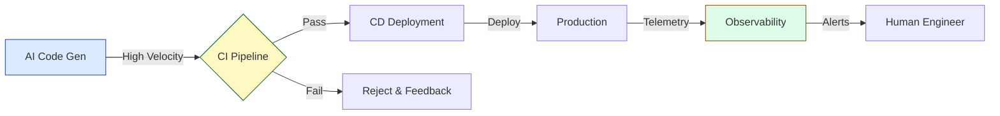

# Why Fully Supported CI, Deployment, and Observability Matter in the Age of AI

There's a dangerous idea floating around that AI will make DevOps obsolete. "Just let the agent deploy it!"

As someone who has spent 20 years cleaning up production outages, let me tell you: **that is a terrifying thought.**

If anything, AI makes robust CI/CD and observability **more** critical, not less.

---

## 🚀 The Velocity Trap

AI allows us to generate code at a speed we've never seen before. A junior engineer with Copilot can produce as much code as a senior engineer could five years ago.

But **code volume != value**.

If you increase the flow of code without upgrading your pipes (CI/CD), you just burst the pipes.

*   **More code** means more bugs.
*   **Faster changes** mean less time for manual review.
*   **AI-generated code** can be subtle in its failure modes (it looks correct, but isn't).

You need a safety net that is automated, ruthless, and fast.

---

## 🛡️ CI as the Gatekeeper

In an AI-driven world, your CI pipeline is your first line of defense. It's the only thing standing between a hallucinated dependency and your production environment.

Your CI needs to evolve:
1.  **Security Scanning:** AI loves to import packages that don't exist (dependency confusion attacks). Scan for that.
2.  **Contract Testing:** Ensure the AI didn't subtly change an API signature.
3.  **Performance Testing:** AI writes inefficient code. Catch the N+1 queries before they hit prod.

---

## 👁️ Observability: The "Truth"

When an AI agent deploys a change, how do you know it worked?

"It didn't crash" is not a high enough bar.

You need **observability** to verify business intent.
*   Did conversion rates drop?
*   Did latency spike?
*   Did the user journey break in a way that doesn't throw a 500 error?

We need to move from "monitoring servers" to "monitoring outcomes."

---

## 🏗️ The "Paved Road"

The best way to handle this is to build a **Golden Path** (or Paved Road).

Don't let the AI (or the humans) invent their own deployment scripts. Provide a standardized, hardened platform. The AI's job is to write the application code; the platform's job is to ship it safely.

**The Platform Contract:**
> "You give me a container and a health check. I give you a URL, SSL, auto-scaling, and logs."

This separation of concerns is the only way to scale AI development without scaling chaos.

---

## 🏁 Conclusion

AI is an engine. CI/CD/Observability is the steering and the brakes.

You can put a Ferrari engine in a go-kart, but don't be surprised when it flies off the track at the first turn.

Build the chassis first. Then step on the gas.
