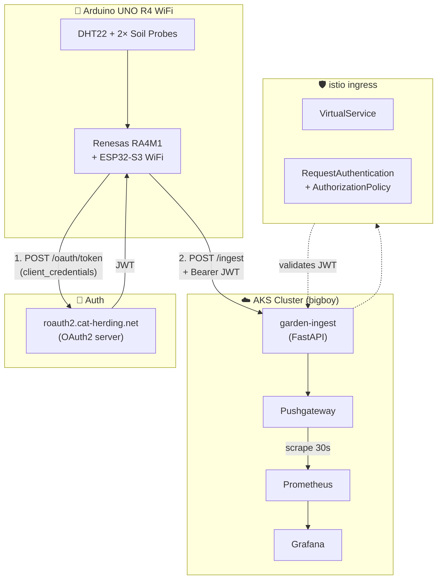
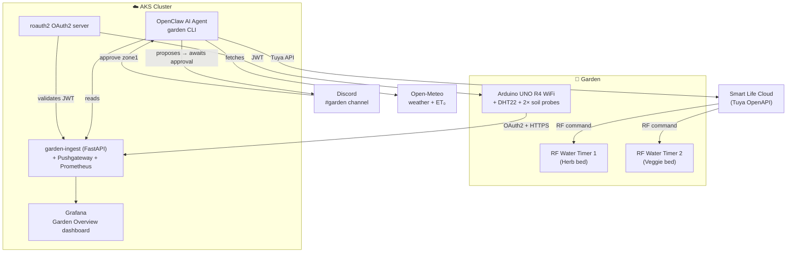

# 🌱 I Let an AI Agent Water My Garden

I've built distributed systems at scale. Kubernetes clusters that process millions of events per day. OAuth2 servers that handle production traffic across regions. Observability stacks that catch bugs before users do.

And then I looked at my herb garden and thought: **the basil is dying and I have no data about why.**

So I did what any reasonable platform engineer would do. I spent two days building a full IoT telemetry pipeline, deployed it to my production AKS cluster, and gave an AI agent control over my Smart Life water timers.

The basil is fine now. The project is also actually interesting — so let me walk you through it.

---

## 🎯 What I Built

Two gardens, one Arduino, three sensor types, a full cloud observability stack, and an AI irrigation brain:

- **Zone 1 — Herb garden**: basil, rosemary, thyme. Dries fast, wants consistent moisture.
- **Zone 2 — Vegetable bed**: tomatoes, peppers. Bigger soil volume, different watering cadence.

Each zone has a **capacitive soil moisture probe** on the Arduino. An RF water timer (Smart Life / Tuya) controls the valve for each zone. The system:

1. Reads sensors every 60 seconds and ships telemetry to Prometheus via a FastAPI ingest service on AKS
2. An **OpenClaw AI agent** runs 3× per day, reads those metrics, fetches a weather forecast, and proposes a watering duration for each zone in Discord
3. I approve it (or don't). The agent only opens a valve after my ✅
4. The valve opens, waters for the computed duration, and auto-closes via the timer's hardware countdown

No open ports on the Arduino. No polling. A full OAuth2/JWT-protected cloud path. And a safety-gated approval flow so a hallucinating LLM can't flood my yard.

---

## 🛠️ The Hardware Stack

**Arduino UNO R4 WiFi** is the right board for this. It has:
- Built-in WiFi (ESP32-S3 radio, 2.4 GHz only — important if your IoT network is 5 GHz)
- A 12×8 monochrome LED matrix for at-a-glance status
- 14-bit ADC for smooth analog reads
- Enough flash (256 KB) to hold OAuth2 client credentials, HTTPS request logic, and sensor firmware

Sensors wired to the board:

| Sensor | Pin | Notes |
|---|---|---|
| DHT22 (air temp + humidity) | D7 (digital) | Proprietary 1-wire protocol |
| Soil probe — herb bed (bed1) | A0 (analog) | Capacitive, 5V. Dry ≈ 16374, wet ≈ 10700 |
| Soil probe — veggie bed (bed2) | A1 (analog) | Same type, same calibration |

One important lesson from calibration: **capacitive probes aren't plug-and-play.** You need to measure the raw ADC values at dry (in air) and wet (in freshly watered soil), then set those endpoints. They also need 5V power and the sensor needs to be energized only during reads — otherwise it corrodes. We gate power through a GPIO pin.

---

## 📡 The Telemetry Path

Shipping sensor data from an Arduino behind home WiFi to a cloud-hosted Prometheus requires solving a few real problems: no public IP, intermittent connections, no persistent storage on the device. The solution is a **push model with a Pushgateway intermediary**.



The board authenticates with **OAuth2 client credentials** (HTTP Basic auth, as required by the server). It gets a JWT, caches it, and POSTs JSON readings to `garden.cat-herding.net/ingest`. Istio validates the JWT at the gateway edge before the request reaches the service — the ingest service itself trusts the edge.

The ingest service is a ~200-line FastAPI app. It validates and normalizes the JSON, converts it to Prometheus exposition format, and PUTs it to Pushgateway — grouped by `device_id` so future boards don't overwrite each other.

There was a fun bug: the roauth2 server returns tokens with **Transfer-Encoding: chunked**, and ArduinoHttpClient doesn't strip the chunk-size line. So the JSON body looks like `387\r\n{...}` and ArduinoJson chokes. Fix: skip to the first `{` before parsing.

---

## 📊 Metrics in Prometheus and Grafana

Once the path was working, every sensor reading showed up as a labeled Prometheus metric:

```
garden_air_temperature_celsius{device_id="garden-node-1", location="raised-bed"} 24.0
garden_air_humidity_percent{device_id="garden-node-1", location="raised-bed"} 47.2
garden_soil_moisture_percent{device_id="garden-node-1", probe="bed1"} 100.0
garden_soil_moisture_percent{device_id="garden-node-1", probe="bed2"} 42.0
garden_push_timestamp_seconds{device_id="garden-node-1"} 1780491602.0
```

The `push_timestamp_seconds` is the key for staleness alerting. If a board stops publishing, `time() - garden_push_timestamp_seconds > 300` fires a Prometheus alert before you ever look at a dashboard and wonder why the soil graph is flat.

The Grafana dashboard provisions from a JSON file in the GitOps repo. It uses a `device_id` template variable so it scales to N boards automatically — the same dashboard covers zone 1, zone 2, and any future node.

One infrastructure note: Prometheus was in `CrashLoopBackOff` for three days (OOMKilled, 1536 MiB limit too small for WAL replay). No dashboards were alerting because the alerting system was the thing that was down. Raised the limit to 4 GiB, pod recovered in ~66 seconds. A useful reminder: **you need an external watchdog for your monitoring stack, not just internal alerting.**

---

## 🧠 The OpenClaw Irrigation Brain

This is where it gets interesting.

OpenClaw is the AI agent platform running in my cluster. It has native Discord integration, a built-in scheduler, and a tool execution engine. Instead of building a new service, I wrote a **self-contained Python CLI** (`garden`) that OpenClaw shells out to.

The CLI has five subcommands:

```bash
garden sensors --zone zone1      # reads Prometheus → JSON
garden weather                   # Open-Meteo forecast (ET₀, precip) → JSON
garden plan --phase morning      # deterministic formula → proposed minutes
garden water --zone zone1 --minutes 8   # Tuya API → valve open + confirm
garden status --zone zone1       # live Tuya device state → JSON
```

The **decision formula** in `garden plan` is deterministic, not LLM-generated:

1. **Rain skip** — if Open-Meteo forecasts ≥ 2mm or ≥ 60% probability in the next 12 hours → skip
2. **Soil gate** — if soil % ≥ 40% target → skip
3. **Deficit-based duration** — `(target% - soil%) × min_per_pct`
4. **ET₀ scaling** — multiply by `ET₀_today / ET₀_baseline` so hot dry days water more
5. **Hard caps** — max 15 min/run, 30 min/day per zone

The LLM's role is **orchestration and communication**, not valve control. It reads `garden plan` output and writes the Discord proposal in plain English:

> 🌱 Zone 1 (herb bed): water 8 min — soil at 22%, no rain forecast, ET₀ 6.9mm (hot day). To approve: reply `approve zone1`

I reply ✅ or `approve zone1`. The agent then runs `garden water`, which:
- Re-clamps to the caps (so even if the proposal gets modified, the valve can't run wild)
- Sends the Tuya RF command via the Smart Life cloud API
- Confirms the countdown DP was accepted (the auto-off mechanism)
- Reports back to Discord

The approval gate is enforced **in code**, not just by prompt: `garden water` won't run without a matching un-expired pending plan saved to disk. Even if someone spoofed an approval, the CLI would reject it.

---

## 💧 Smart Life (Tuya) Integration

The two RF water timers are standard Smart Life / Tuya devices. From the cloud API side they look like this:

```json
{"switch_1": false, "countdown_1": 600, "smart_weather": "sunny"}
```

`switch_1` is the on/off state. `countdown_1` is the hardware auto-off timer in seconds. Critically: **we verify the countdown DP was accepted** after sending the open command. If the device ignores the countdown code (wrong DP name for that model), the valve opens and never auto-closes. That's the worst failure mode — so we check it, and if it fails, we immediately send an explicit off command as a failsafe.

The Tuya API uses HMAC-SHA256 request signing. The implementation lives in the `garden.py` CLI as pure Python stdlib — no external dependencies, no sidecar. The signing tests verify the exact byte concatenation order (`client_id + access_token + t + nonce + string_to_sign`) because that's where these things silently break.

Authentication goes through Azure Key Vault → Kubernetes CSI secret store → environment variables in the OpenClaw pod. The Arduino board uses a separate OAuth2 client credential registered in the same auth server, stored in a gitignored `.env` file and generated into the board's `arduino_secrets.h` at flash time.

---

## 💡 The LED Matrix as a Status Display

The UNO R4 WiFi has a built-in 12×8 monochrome LED matrix. It's red, not green — so I couldn't do "green = healthy" — but I could do **shape-based status**:

- **Connecting**: a static seed (single dot at the base of the matrix)
- **Error** (WiFi down, auth failure, publish failure): a bold X
- **Healthy**: a **growing plant animation** that loops seed → sprout → leaves → bloom every ~6 seconds, cycling continuously between the 60-second sensor pushes

Then, once readings are available, the matrix runs a **5-slide rotating sensor display** (5 seconds each):

1. Plant animation (healthy indicator)
2. Soil bed1 — icon + bottom-up bar proportional to %
3. Soil bed2 — same
4. Temperature — thermometer icon + bar (0–40°C range)
5. Humidity — droplet icon + bar

The rendering logic is pure C++ (no Arduino deps) so it runs on the host and can be unit-tested and eyeballed with an ASCII preview:

```
== bed1 42% ==          == temp 24C ==
.#..........            .#..........
##..........            .#..........
.#..........            .#..........
.#..........            .#...#######
.#...#######            .#...#######
.#...#######            ###..#######
###..#######            ###..#######
.....#######            .#...#######
```

---

## 🔄 OTA Firmware Updates

Since the board lives outside and reflashing requires a USB cable, I added OTA update support using the board's built-in `OTAUpdate` library.

The update flow:

1. On boot (after WiFi connects), the board fetches `version.txt` from the latest GitHub Release
2. Compares it to `FIRMWARE_VERSION` baked into the binary
3. If different: downloads `garden-node.ota`, verifies the checksum, applies, reboots
4. If anything fails: an EEPROM byte increments. After 3 consecutive failures, OTA is disabled until USB reflash

A GitHub Actions workflow builds the firmware on every `v*` tag push, compresses the `.bin` to `.ota` (the R4 requires LZSS compression — a raw `.bin` fails verification), and publishes a release with both `version.txt` and `garden-node.ota`.

Releasing a new firmware version is now:
```bash
./scripts/release-firmware.sh 1.0.1
# CI handles compile → compress → publish → board self-updates on next reboot
```

One thing the code review caught: `OTAUpdate::download()` returns a **byte count** on success, not `OTA_ERROR_NONE` (zero). The initial implementation checked `!= 0` and treated every successful download as a failure. That's the kind of subtle API mismatch that only surfaces on hardware — and exactly why holistic code review of firmware matters.

---

## 🏗️ Architecture Summary

The full stack, from garden to dashboard:



---

## 🤔 What I'd Do Differently

**Probe at 3.3V, not 5V.** Powering the capacitive probes from 5V means the "dry" endpoint rails at the ADC max (16383). You lose resolution at the dry end. 3.3V gives you a cleaner range and the probes still work fine.

**Dedicate the wet calibration.** I measured the wet endpoint against a wet towel, not saturated garden soil. Real soil sits differently — denser, more conductive. The WET constant needed adjustment once the probes were in-ground.

**Build the monitoring of your monitoring first.** Three days of OOMKilled Prometheus, invisible. Next project I do gets a simple external uptime check before anything else.

---

## What's Next

The system is running. The next things on the list:

- **Multi-board scaling**: the architecture already supports it. Each board gets its own OAuth2 client, its own `device_id` labels, and shares the same ingest/dashboard stack. The dashboard templates by `device_id` automatically.
- **Actuation triggers from alerting**: instead of the AI agent proposing from a schedule, Prometheus alerts on soil < 15% could trigger an agent run directly. The seam is already there.
- **Rain sensor**: the kit includes one, but it's not yet calibrated and wired. Open-Meteo handles the forecast; the physical sensor adds a "is it raining RIGHT NOW" confirmation.

---

The whole project — firmware, ingest service, Kubernetes manifests, irrigation CLI, CI pipelines — lives at [github.com/ianlintner/gardencontroller](https://github.com/ianlintner/gardencontroller).

The herb garden is doing well. The vegetables are about to start getting data-driven attention.

The WiFi password incident, we don't talk about.
