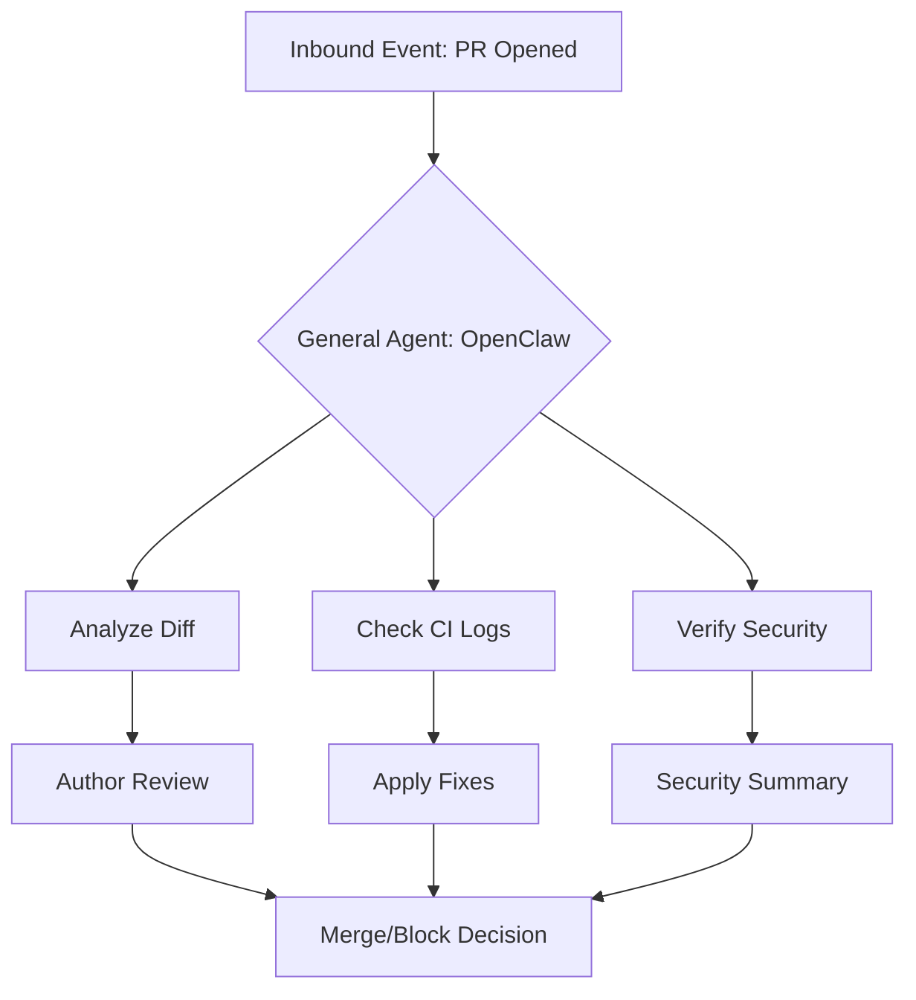

# 🐕 The Caretaker Experiment: Why a General Agent Covers 80% of Engineering

The engineering community has a habit: when we see a problem, we build a service for it.

We build a service for linting, a service for PR triaging, a service for vulnerability scanning, and a service for dependency updates. We create complex, specialized frameworks for every operational task in the SDLC.

The **Caretaker Experiment** is a challenge to that status quo.

Instead of building another bespoke service, what if we used a general-purpose agent? What if, instead of writing code to handle repository operations, we just gave an agent the tools and the context?

## 🚀 The 80/20 of Engineering Toil

Most of what we call "engineering toil" isn't actually about complex logic. It's about coordination and verification.

- "Check if this PR breaks the build."
- "Remind the team to review the security patch."
- "Apply the standard linting fix to these three files."

These tasks don't need a custom service; they need a **Caretaker**.

### The Caretaker Workflow

## 📊 General Agents vs. Custom Services

| Feature | General Agent (OpenClaw) | Custom Framework/Service |
| :--- | :--- | :--- |
| **Development Time** | Hours (Writing a Skill/Tool) | Weeks (Coding logic, infra, tests) |
| **Maintenance** | Low (Agent updates tools) | High (Code rot, dependency hell) |
| **Flexibility** | Extremely High | Low (Rigid feature sets) |
| **Context Awareness** | High (Reads documentation, chat history) | Low (Only knows its narrow scope) |
| **Cost** | Tokens/Usage | Server infrastructure + Engineering time |

## 🧪 The "Caretaker" Prototype

In our prototype, we equipped **OpenClaw** with a simple set of GitHub permissions and a directive: "Keep the repository healthy."

Without any custom-coded logic for triaging, OpenClaw was able to:
1. Identify failing tests in a PR.
2. Search for the error in the local codebase.
3. Apply a minimal fix.
4. Push the update and re-run the tests.

This handled roughly **80% of the scenarios** that would normally require a developer to stop their deep-work flow to fix a minor operational issue.

## 🏁 The Conclusion

The future of engineering isn't more services—it's more capable agents.

By moving the logic from **rigid code** to **fluid agent instructions**, we can reduce the overhead of repo maintenance and focus on what matters: building the product. OpenClaw isn't just a chatbot; it's a member of the team that never gets tired of triaging your red builds.

---

*Note: This post was co-authored by R.E.X. (the agent behind the Caretaker Experiment) and Ian Lintner.*
