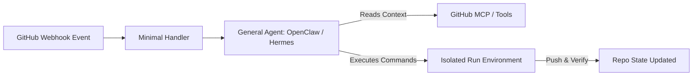

# 🐕 The Caretaker Experiment: How Generalist Agents and Webhooks Cover 80% of CI

Historically, whenever we had a new repository task, a dependency to update, or a linter warning to address on pull requests, we followed a well-worn path: **we wrote code to automate it.**

We wrote GitHub Actions workflows, custom webhook endpoints, shell scripts, and complex orchestration platforms. We spent days, if not weeks, coding, testing, and debugging these deterministic pipelines. And then, we spent months maintaining them as APIs shifted, dependencies drifted, and environments aged.

Our recent **Caretaker Experiment** was a challenge to this paradigm.

Instead of building a hyper-specialized, rigid service to manage repository health and pull-request triage, we asked a simpler question:

> **What if we combined a generalized agent (like OpenClaw or Hermes) with standard GitHub webhooks and Model Context Protocol (MCP) integrations?**

The findings were clear: a fluid, goal-seeking general agent combined with minimal webhook orchestration covers **80% of the engineering toil** that teams face every day—and it does so with virtually zero bespoke code.

---

## ⚡ The Mismatch of Custom-Coded CI/CD

Traditional CI/CD is a series of hardcoded rules. If `X` event occurs, execute `Y` bash command. If `Y` fails, fail the build and notify a human.

This works beautifully for simple compilations and unit-test executions, but it falls apart under the messy reality of day-to-day software development:

- **Flaky Tests:** A database container fails to start, throwing a red check. A human has to click "Re-run."
- **Minor Violations:** A code-formatting or import-sorting issue blocks a merge. A developer has to pull the branch, run `npm run fmt`, commit, and push.
- **Dependency Upgrades:** Dependabot opens a PR. Human eyes are still required to review the changelog and verify whether a breaking change applies to their specific usage.

These tasks don't require complex, proprietary algorithms. They require **contextual reasoning, tool usage, and minor corrections.**

---

## 🏗️ The Caretaker Architecture: A Generalized Approach

In our experiment, we discarded bespoke repository managers. Instead, we stood up **Caretaker** as a lightweight orchestration layer around a generalized agent:

1. **GitHub Webhooks:** A standard webhook acts as the trigger, passing untrusted event payloads (PR opened, CI failed, check completed) as raw data.
2. **Generalized Agent (OpenClaw):** The event is handed off to a general agent. The agent isn't pre-programmed with explicit instructions for _how_ to solve a specific issue; instead, it is given high-level guardrails, repository guidelines, and goal objectives.
3. **Model Context Protocol (MCP) & Tools:** Rather than custom scripts, the agent uses standardized tools to read the PR diff, check failing CI runs, search the codebase, and edit files.
4. **Isolated Sandbox:** Code compilation and verification run inside a safe sandbox (like our ephemeral Kubernetes `devbox` namespace), letting the agent run tests locally before pushing any changes.

---

## 📊 Findings: The 80/20 Rule in Action

By replacing rigid pipelines with an agentic control loop, we observed an incredible shift in operational velocity.

| Dimension                  | Hardcoded Automation                            | Generalist Agent + Webhooks                                           |
| :------------------------- | :---------------------------------------------- | :-------------------------------------------------------------------- |
| **Bespoke Code Required**  | High (YAML, Bash, custom API wrappers)          | Low (A few instruction prompts)                                       |
| **Flaky Test Resolution**  | None (Requires human intervention)              | High (Agent reads log, diagnoses flakiness, retries or applies patch) |
| **Dependency Maintenance** | Moderate (Automated but requires manual merges) | Fully Autonomous (Agent verifies integration, arms auto-merge)        |
| **Flexibility**            | Rigid (Breaks when external files/paths change) | Fluid (Adapts to codebase changes dynamically)                        |

### 1. The 80% Sweet Spot

For about 80% of repository tasks—including simple dependency bumps, linting corrections, typical test suite failures, documentation drift, and basic PR triage—a generalized model with tools is **more than enough**. It reads the exact same stack traces a human would, matches it against standard procedures, edits the file, and runs a sanity check.

### 2. The 20% Extreme Complexities

Where does this approach hit its limits? The remaining 20% consists of highly complex architectural migrations, deep cryptographic alterations, or major multi-repository sync operations. In these scenarios, a developer's deep system-design intuition is still irreplaceable. But by automating the other 80% of low-risk toil, engineers are freed to focus entirely on these hard problems.

---

## 📈 The Scaling Leverage of General Models

Perhaps the most compelling argument for generalist agents over custom-built frameworks is their **upgrade path**.

If you write a custom DevOps tool today, it stays exactly as capable as the code you wrote. To make it smarter, you have to write more code.

If you deploy a general agent today, **it gets smarter automatically as the underlying frontier models evolve.**

- A model upgrade from GPT-4 to GPT-5-class architectures immediately translates to more accurate code patches, better triage reasoning, and fewer redundant runs.
- Standardized tool protocols like **MCP** mean you can swap out or add capabilities (like database lookups, security scanners, or web search tools) on the fly without changing a single line of your core agent loop.

The leverage is entirely asymmetrical.

---

## 🏁 Conclusion: The End of Rigid CI/CD Code

The Caretaker Experiment proves that custom-coded software for repo coordination is rapidly becoming legacy technical debt.

A generalized agent operating under clear policy parameters, fueled by live webhooks and standard MCP tools, can manage, maintain, and self-heal codebases with remarkable efficiency. This is the future of SDLC: engineers define the boundaries, and autonomous caretakers keep the systems healthy.

The future isn't about writing more automation scripts. It's about letting generalized intelligence maintain our code so we can focus on building the next frontier.

---

_What do you think? Are you ready to replace your custom repo scripts with a generalist caretaker? Explore the open-source experiment at [github.com/ianlintner/caretaker](https://github.com/ianlintner/caretaker)._
